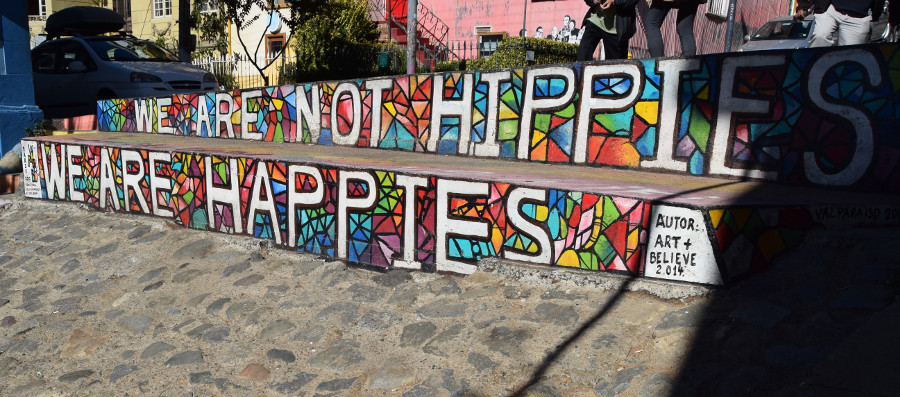
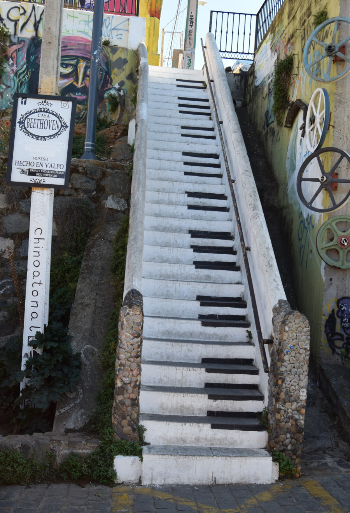
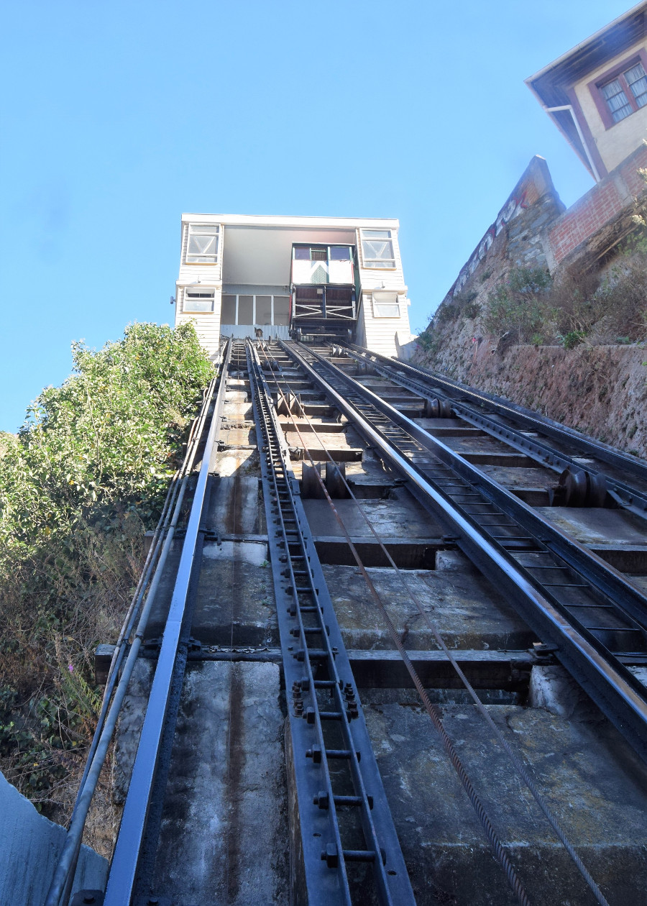
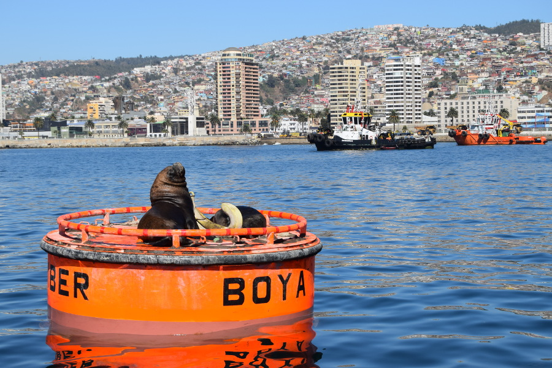
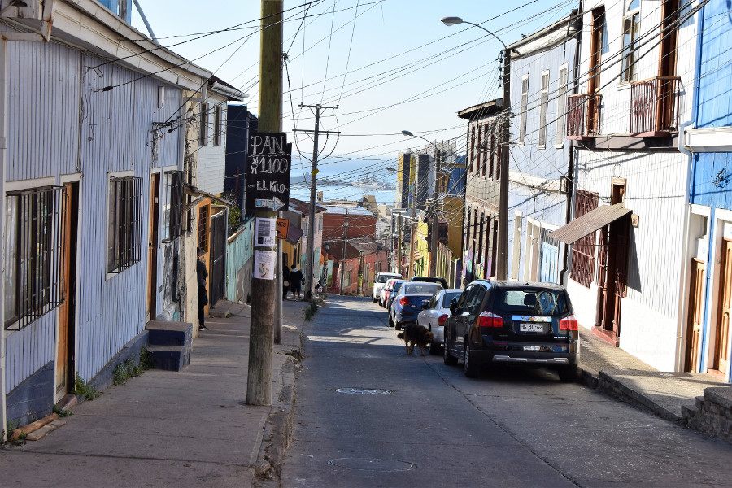

>“We are not hippies, we are happies."

Art+Believe.

##Street Art
We travelled to Valparaiso by bus from Santiago which only took a couple of hours. Considering how close the two cities are, they're very different. Valparaiso is a port city which looks very run down; rubbish on the streets, cracked pavements and crumbling houses. It's built on the hills so all the streets are disorganised and muddled and every building is a different shape and colour, and most have a mural or graffiti on them. There was so much surrounding us we didn't know where to look! It took around five minutes for us to fall in love with Valparaiso and to understand why it has the status of a UNESCO World Heritage Site.

We saw absolutely loads of street art by artists such as [Anis](http://anis88.cl/), Un Kolor Distinto, [Daniel Marceli](https://www.instagram.com/daniel.marceli/?hl=en) and [Pablo Cuellimangui](https://www.facebook.com/cuelli.mangui/). During the [free walking tour](http://www.freetourvalparaiso.cl/portada.html) our guide stopped and spoke to someone who he later told us was his friend, Pablo Cuellimangui. He was carrying his gear to make more art in the city. The guide told us that street art in Valparaiso is a vicious circle, as some of the artists protest against tourism in their art, yet tourists come to see their work.

Valparaiso was really overwhelming. Sometimes we walked down the same street in opposite directions and it looked completely different, because of the art or the buildings that we noticed. The guide said Valparaiso was full of secrets, that buildings would be shaped like boats, or the underside of steps painted, and that we had to be really paying attention to see all of its charm. It's a wonder that I only trod in dog poo once with so much to see.

##Cerro Alegre & Cerro Concepcion
We explored these two touristic hills on the walking tour. Valparaiso is known for its 'elevators' up it's hills and we rode the Queen Victoria elevator to the top. During the walking tour we met the 97 year old man who helped make the city a world heritage site and visited the oldest brewery in Valparaiso [Altamira](http://www.cerveceraaltamira.cl/), where beer was first introduced to the city. The guide also explained to us why Valparaiso is so poor and so different to its neighbouring city Santiago. He explained that Valparaiso was an important port city for the world when ships had to pass around the bottom of South America. But that it became a forgotten city after the Panama Canal was built, as this was a quicker and cheaper route between Europe and Australasia/Asia.

After the walking tour, we went with the guides recommendation to see the city from the sea and took a 30 minute boat ride for $3000CLP (£3.50). For the money it was worth it, the boat took us around the port area where we saw a couple of sealions on a buoy and one swimming. We also saw some of the navy ships, got a wave from the captain, saw a submarine and all of the shipping containers being moved in the port.

##Crime
Having researched Valparaiso before we got there, we had read numerous blogs about people being robbed in broad daylight in various parts of the city and that the hills were dangerous for a gringo backpacker to wander around alone. So we decided to splash out a little more for a hostel in the touristic area of Cerro Alegre, [Hostal Casa Verde Limon](http://www.casaverdelimon.com/hostal_en.html). It had really high ceilings and its staircases and hallways were muddled, like the rest of Valparaiso. And, just like Rio, our visit to Valparaiso was trouble free. We did end up wandering some of the hills on our own and we never felt threatened at all.

##Doggy Updates
On our walking tour we learned that Chile has one million street dogs and 12,000 of them live in Valparaiso. At the beginning of the tour a chubby golden labrador joined us. The guide told us her name is 'Pork Chop' or in the hills they call her 'Shakira' because of the way her bum moves as she walks up the hills. She followed us for most of the tour. We'd noticed that some of the dogs barked at people as they walked past but we had remained unscatched, and dogs would just happily follow us around before they found someone more interesting. The guide told us that the dogs in Valparaiso are racist; he explained that they love tourists and only bark at the local people.

##Empanadas & Chorrillana
The empanadas in Argentina had been good but they had absolutely nothing on the empanadas we ate in Chile. We'd read about a place called Le Pato, who do really great baked empanadas. On our first evening in Valpraiso whilst we were exploring the hills, we went on a mission to find Le Pato. It was worth it; Dan had a blood sausage one and I had a veggie and lentil one. They were big and absolutely stuffed full.

We also went to Delicious Express, the best place for fried empanadas with 80 different types of fillings. We went twice, they were that good! We tried chicken, cheese and pepper and bacon, meat, cheese and onion. The great thing about Delicious Express was that the empanada's were cooked fresh and were piping hot.

Chorrillana; a traditional Chilean dish. We had been told about this dish on the walking tours in both Santiago and Valparaiso. The one we had at El Pimenton was a layer of apple sauce, a huge layer of fries, covered in beef and onions with three fried eggs on top. Heart attack on a plate. It cost $13500CLP for a double dish for two, which is around £15, possibly the most expensive chips we've ever eaten!

##Our Verdict on Valparaiso
We had to cut our time short in Santiago to make some room to visit Valparaiso and we're so glad we did. It was just our kind of place; chaotic, muddled, gritty and covered in graffiti!