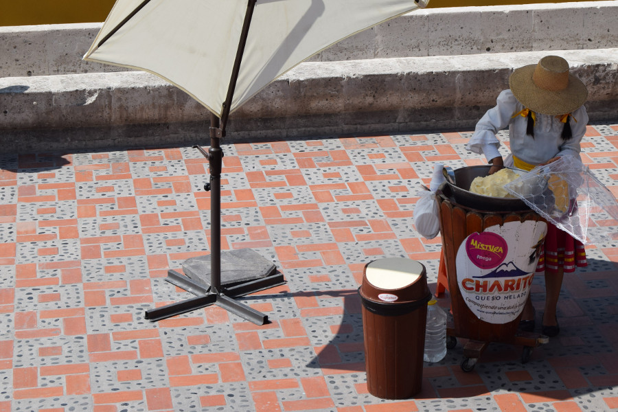
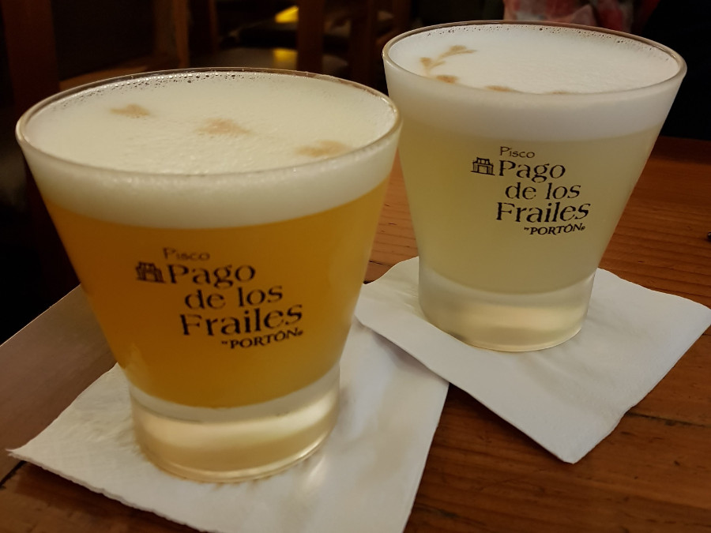
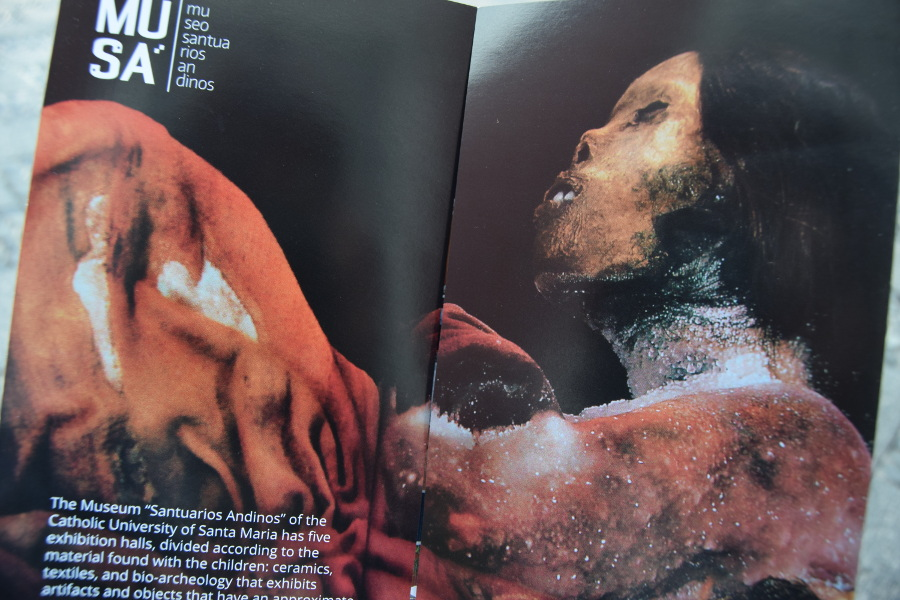
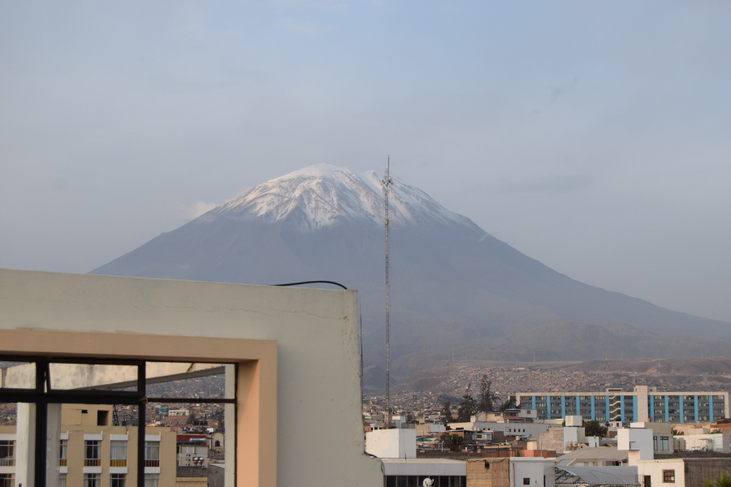
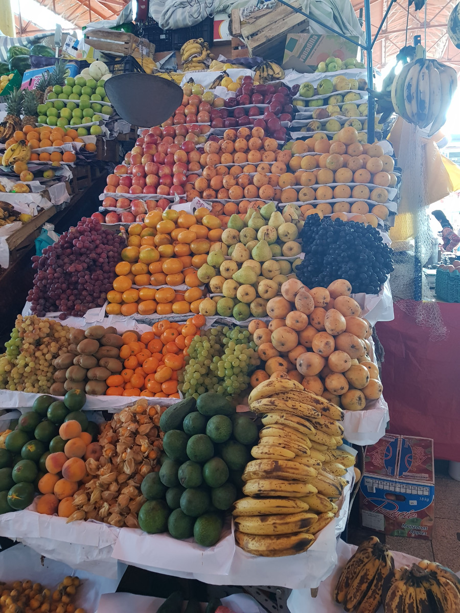
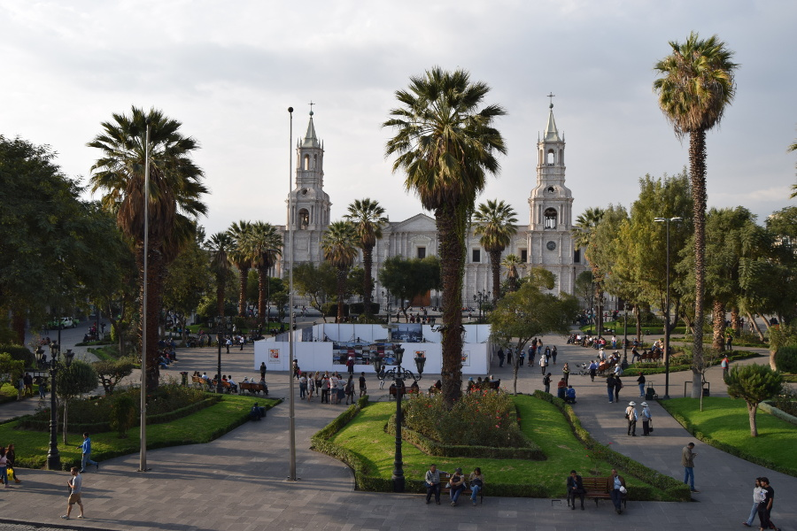
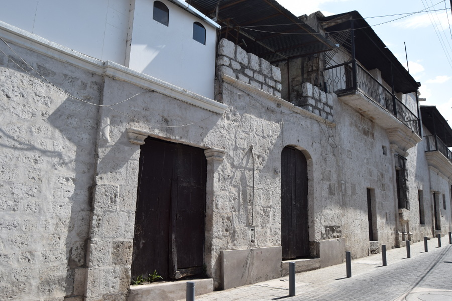
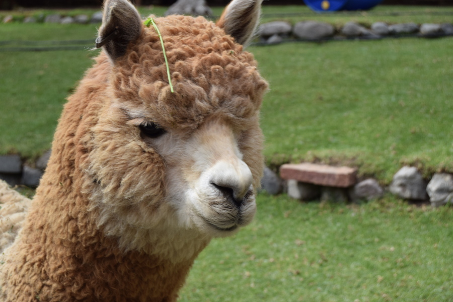

>“Being Peruvian means to come from the farthest place possible to get to Europe. Peru is the land of the Incas. It was the capital of South America; it was where the Spanish founded their empire and took over the Inca Empire and made it into a colony of Spain.”

Mario Testino.

##Food, drink and Salsa
It didn’t take us long to discover the food in Peru is insanely good. With its Asian and European influences, plus recipes from the coast, jungle and mountains the wide range of food is delicious. In Arequipa we managed to find [India Indian Cuisine](https://www.tripadvisor.com/Restaurant_Review-g294313-d2411118-Reviews-India_Indian_Cuisine-Arequipa_Arequipa_Region.html) for a curry. We had naan, rice, curry and beer for £9 and it was better than some of the curries we've had home! Not only was the food good but it was also cheap so we managed to eat out everyday and keep within our budget. We also ate at [Hatunpa](https://www.tripadvisor.com/Restaurant_Review-g294313-d2213103-Reviews-Hatunpa-Arequipa_Arequipa_Region.html), a restuarant that bases their dishes on potatoes. They use seven different types of Andean potatoes and the dishes have toppings. Dan went for Lomo Saltado, beef in a wine sauce and I had beef and sausage, basically a bolognese with cheese.

We tried 'queso helado' on the walking tour, translated cheese ice cream. Thankfully, it's not cheese flavoured, it's vanilla but the texture was like cheese, which is where its name comes from. Of course we had our fair share of Pisco Sours, THE Peruvian drink. We went to [Museo del Pisco](https://museodelpisco.org/) and tried the classic and passionfruit ones. This was followed by more in a bar called [Deja Vu](http://www.dejavuaqp.com/). We'd been told on the tour that they offer free salsa lessons, intregued we went to catch the end but it was basically two local men dancing with a European and American girl, whilst their boyfriends sat drinking beer. Not really a salsa lesson.

##Mummy Juanita
Mummy Juanita is a must do if in Arequipa. Juanita isn’t technically a mummy but she’s the best preserved frozen human in the world. We visited [Museo Santuarios Andinosto](http://www.ucsm.edu.pe/museo-santuarios-andinos/) see her for S/20 (£4.50) and spent an hour in the museum.

Juanita was discovered in 1996 and is named the 'Ice Maiden'. She was discovered at the top of  Mount Ampato and is so well preserved as she had been frozen since her death. She is 550 years old as she died between 1450 and 1480; she is a child offering made by the Incas to their Gods. The Incas believed that the mountains were alive and when earthquakes and volcanic eruptions occurred, the Gods were punishing them. They believed in reciprocation, therefore they thought if they made offerings to the Gods, the Gods in turn would take care of them. The Inca King in Cusco, made the decision about giving an offering and selected the purest and most beautiful children to sacrifice to the Gods.

Juanita was from the Lake Titicaca area of the Inca Empire and she was around 13 years old when she was offered. The Incas walked to the top of the mountain the king had chosen to make the sacrifice to. They gave Juanita coco leaves and corn beer with some hallucagenic drugs so she became intoxicated, she was then killed by the priest with a blow to the head from a mace. We could still see the holes in her head from the blow. The guide in the museum told us that her internal organs are perfectly preserved due to being frozen for 550 years. We also got lucky as Juanita is moved to the dark for 4 months of the year for preservation reasons but she had been brought back out the day before.

##El Misti & Colca Canyon
Just like Christ the Redeemer, the iconic El Misti remained hidden behind clouds for most of our time in Arequipa. On our last afternoon we went up to [Tereazas Arequipa](https://www.facebook.com/Las-Terrazas-Hotel-Arequipa-332723616780517/) for a beer and a good view of the plaza. We were going to leave but the waiter told us the sun would be setting and that it is beautiful when it happens. We were easily convinced to stay for a second beer and not only was the sunset stunning over the Plaza de Armas but the clouds also cleared and we finally managed to get a good view of El Misti.

Arequipa is surrounded by active volcanos, El Misti is only 15km away and is 5,822 metres high. It lies between mount Chachani and Pichu Pichu volcano. Its last eruption was in 1985. Both El Misti and Chachani can be climbed in a day but as the weather was cloudy and we were saving our energy for Machu Picchu we decided to give the climb a miss.

Colca Canyon had always been on our itinerary until we arrived in Arequipa. We only had time for a day tour due to our trip which was already booked to Machu Picchu. However it was a 3AM pick up followed up a 4-5 hour drive to the Colca Canyon. The weather was also bad which reduces visibility of the canyon and the chances of seeing the Andean Condor. People who had gone said it was better to do the trip ourselves, to stay 2-3 nights and trek around the canyon. In the end we decided against it and slept in and drank pisco instead!

##San Camilo Market
We’d heard people rave about Arequipa's huge San Camilo Market, however we were pretty disappointed. We're not sure what we were expecting but apart from one row of fresh brightly coloured fruit the market was pretty average; it actually reminded us of the one at the Bullring in Birmingham. It didn't seem that big and apart from some smoothie stalls the rest was unrefridgerated meat, which is enough to make anyone contemplate being vegetarian.

##White City
We did a walking tour in Arequipa but it was awful. The guide spoke really fast and seemed pretty disinterested in what he was talking out. One of the only things we learned was why Arequipa is called the 'White City', initially it was because so many white Europeans settled there and the European influence in the city is really evident. At times we felt like we were walking round a city in the Mediterranean. Today it’s known as the 'White City' due to the white bricks they use to build with that come from the nearby volcanoes.

The Plaza de Armas was definitely the best part of the city. It was huge and had a colourful garden in the middle, although sadly the fountain was under restoration. The streets surrounding the Plaza were cobbled and made of the same white stone.

##Yanahuara
There was supposed to be a good viewpoint of the city in Yanahuara. We had a wander and there were some arches with a plaza and a white church. The view was alright but we weren't so high up and the volcanoes were hidden by clouds. In the end we actually had better views watching the sunset over Plaza de Armas. However, walking round the Yanahuara neighbourhood was a good way to pass the morning, we saw loads of classic VW Beetles and Dan managed to catch part of a local football game!

##Llamas and Alpacas
Llama's are really important to Peruvians and are part of people’s history; before the mule LLamas were used for transportation and helped the Inca's conquer the area. The wool of Llamas, Alpacas, Vicuñas and Guanacos are used for clothes and Llama leather is used to make shoes and bags. We saw loads of these animals all over Arequipa city. We also visited [Mundo Alpaca](http://www.mundoalpaca.com.pe/), where we were able to pet them and get up close, the fluffy alpacas are still our favourites!

##Our verdict on Arequipa
We used our four days in Arequipa mainly to chill out and mill around the city, something we hadn’t done for what felt like weeks! We loved the beautiful architecture in the city and at times it felt like we were in the Mediterranean.