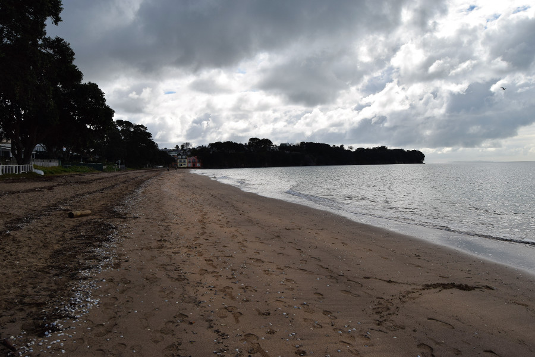
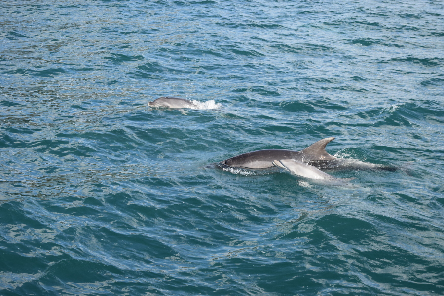
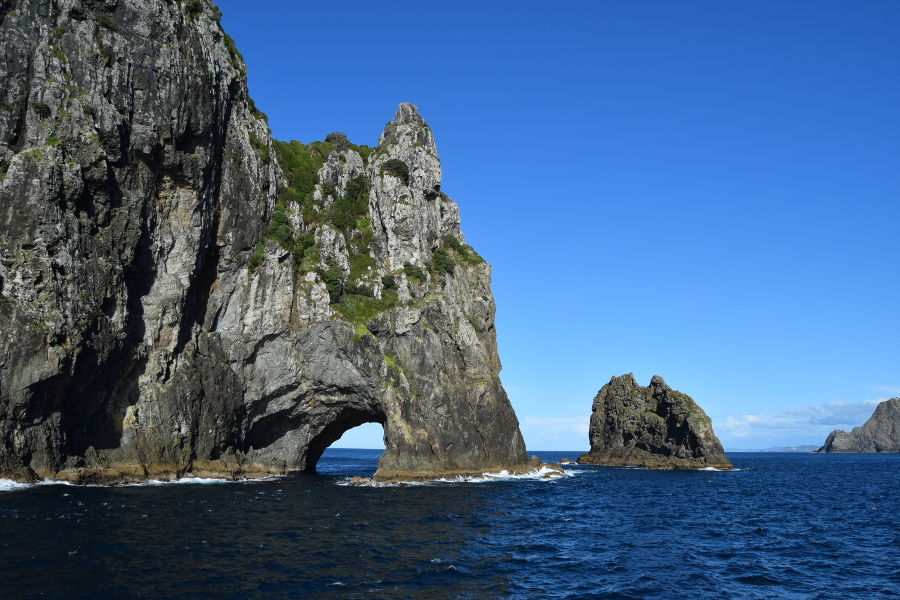
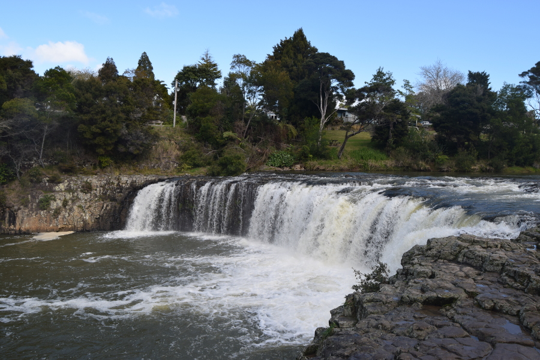

##Crossing the Pacific
We flew from LAX to Auckland with [Air Tahiti Nui](https://www.airtahitinui.com/nz-en) and we were in Moana Economy. I was very excited about the Disney reference but it was short lived. We flew from LA to Tahiti which took almost 8 hours, the seats were upright with barely any legroom and to top it off my TV didn’t work. It was like being on a Ryanair flight for 8 hours. We then had a 4 hour stop in Tahiti airport, which you can imagine was tiny and we had none of their currency. We then had to get back on the same plane for another 5 hours to get to Auckland and because of the time difference we totally lost the 16th July (Dan's dad's birthday!).

##Auckland
As we drove from the airport to Auckland Central we were instantly reminded of home. We were driving on the right (left) side of the road again, people were friendly but not eccentrically so and there were fish and chip shops everywhere. We stayed in [Queen Street Backpackers](http://www.qsb.co.nz/) in a private room so we could sleep through the jet lag. As we were so tired the first day we got there we just went to sleep.

This left us with 24 hours in Auckland, a lot of the things to do in the city such as museums were pricey. We were going to walk up Mount Eden but the weather forecast was rain and it was really cloudy so we decided to catch a ferry to Devonport, a town on the other side of the water to get some good views of the city that way. It was $12 return (£6.50).

Devonport was a little seaside town with a row of independent shops. We walked the streets, straight up the Mount Victoria for views over the water. We then walked to a couple of different beaches, one had houses backing onto it which were lush. All the houses had American style porches and no two were the same, they reminded us of dolls houses.

In the evening we went out for a drink by the viaduct but at $20 (£11) for a beer and small glass of wine we had the one in the [Swing and Parasol](https://www.parasolandswing.co.nz/) before calling it a night.

##Travel around NZ
We had deliberated over how we were going to get around New Zealand for a really long time. The most cliche way was by motorhome and there were either self sufficient ones (that have a toilet that has to be emptied) or ones that weren't, where we would have had to pay to camp in the camp sites for toilets and other amenities. Even though it was winter, these weren’t working out cheap and neither of us have driven anything bigger than a small car so this was the first option out of the window.

The second option we considered was the [KiwiE bus](https://www.kiwiexperience.com/). A pass to get us around both islands was working out around £400 each and we’d been told that it was easy travel. The company reserve hostel rooms, take you to the supermarket on the way and help book activities. However during our travels in South America many people referred to the KiwiE bus as ‘the big green f**k bus’; due to young backpacker's partying, losing all sense of dignity and having sex in a shared dormitory. Again this option went out the window.

The one we nearly picked was to drive. It worked out at £350 each with insurance, we just needed to pay for fuel and parking. Driving would mean we could be flexible and probably do more as we wouldn’t be relying on public transport and we could stay in cheaper motels outside the cities. However, as it’s winter we would have been potentially driving in snow and ice and would have had to use snow chains. Also, in England, in our own cars when we are trying to navigate to a new place it mostly ends up in an argument. So for the sake of our relationship we threw out the option of driving too.

This left some of the other bus companies as our only options. We looked at [Stray](https://www.straytravel.com/) which was really expensive and then [Intercity](https://www.intercity.co.nz/) and [Naked bus](https://nakedbus.com/). Naked bus mainly uses Intercity buses anyway and intercity worked out to be the cheapest option. We brought 70 hours worth of travel for £267 each and booked each of the journeys. This gave us more flexibility than booking a fixed pass of travel and we wouldn’t have the stress of driving. So we took our first bus out of Auckland and into Paihia.

##Paihia
The main reason we’d come further north was to see Paihia’s resident pod of dolphins. We booked the Hole in the Rock cruise through our hostel, [Peppertree Lodge](http://peppertree.co.nz/) with [Great Sights](https://www.greatsights.co.nz/new-zealand-tour-destinations/bay-of-islands/). It cost £57. We also got discount on the room and some free WiFi; annoyingly a lot of hostels in New Zealand either charge for WiFi or give you a limited amount.

We were lucky with the weather as it was a really sunny afternoon as we got on the boat and sailed around the bay. It wasn’t long before we were charging through the water back to where the dolphins had been spotted and we stayed and watched for around 15 minutes. The guide on the boat told us that people aren’t allowed to swim with them at the moment as there are two baby dolphins, but when they are all mature people are able to get in the water with them. The dolphins splashed around the boat, one of them kept rolling around. As the boat sped off we were lucky enough to be at the back of the boat and some of the dolphins chased the boat jumping in and out of the water.

We then headed to the hole in the rock in the Bay of Islands. On the way we saw a fur seal sunbathing on a rock and, luckily, as the weather was good we were able to sail through the hole in the rock. On the way back we stopped off at Russell, a small town opposite Paihia, we had a quick walk along the waterfront before heading back to Paihia on a skipper.

On our second day in Paihia we hiked to Haruru Falls which was around 13km and took us around 5 hours with plenty of stops on the beach and along the way. Unlike the hikes we’d done in South America this one was easy as we didn’t have the added difficulty of being at high altitude. The walk was through forest including some mangrove forest and then along the river. The falls weren’t that impressive after Iguazú but it was a nice way to spend a sunny winters afternoon.

##Our verdict on Auckland & Paihia
Sadly we didn’t spend long in Auckland at all as we really had just one day but as our first destination in New Zealand there was plenty there to remind us of home. Paihia was definitely a holiday destination, for kiwis and tourists, full of lodges, beaches and plenty of islands to explore. Plus, seeing the dolphins in their natural habitat was absolutely priceless!