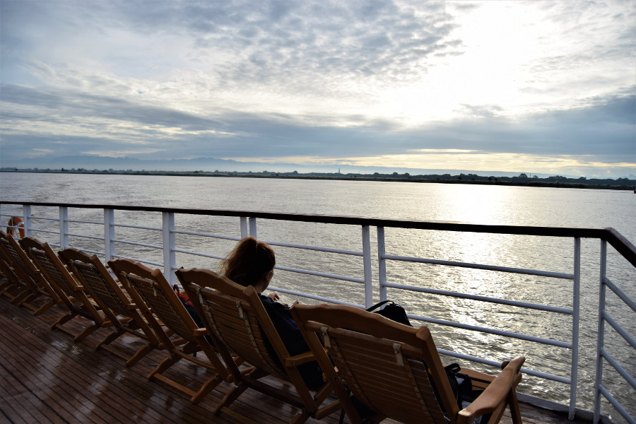
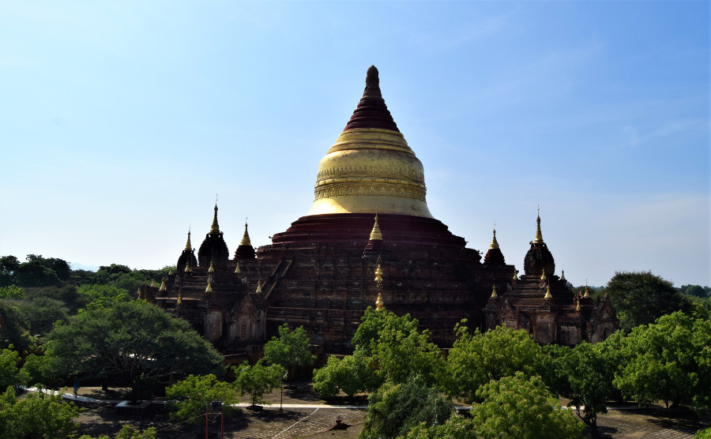
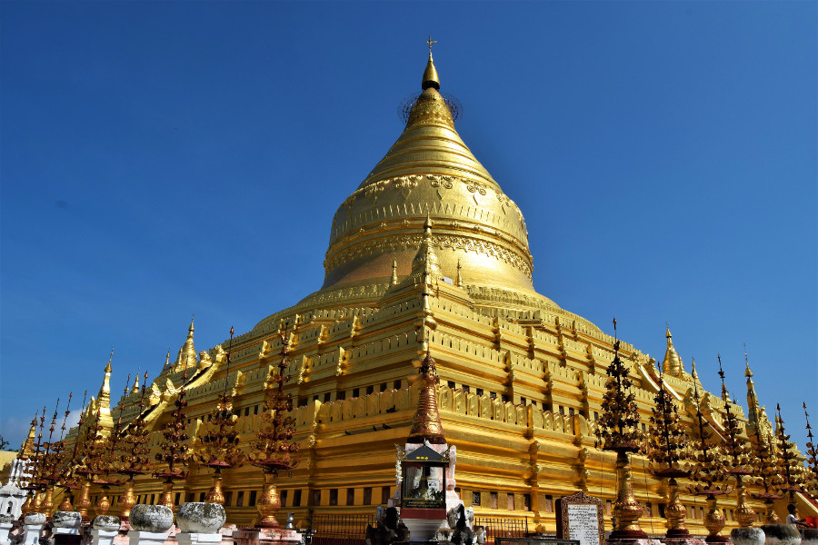
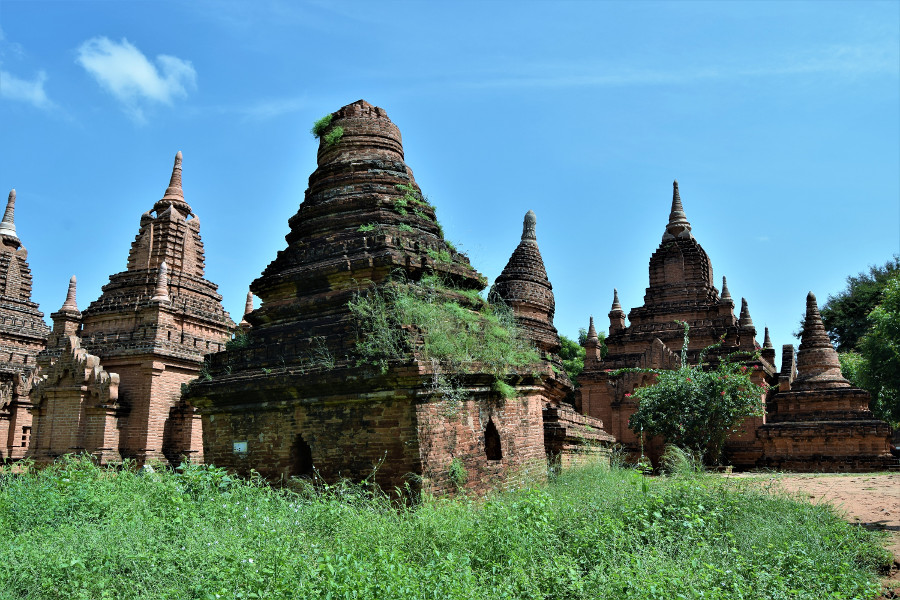
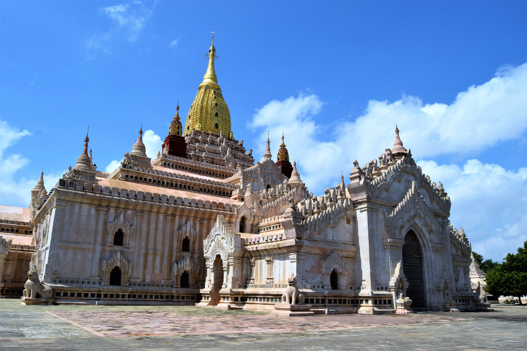
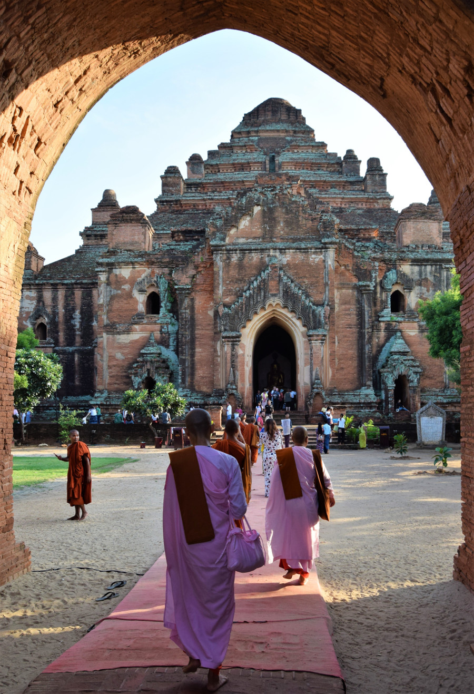
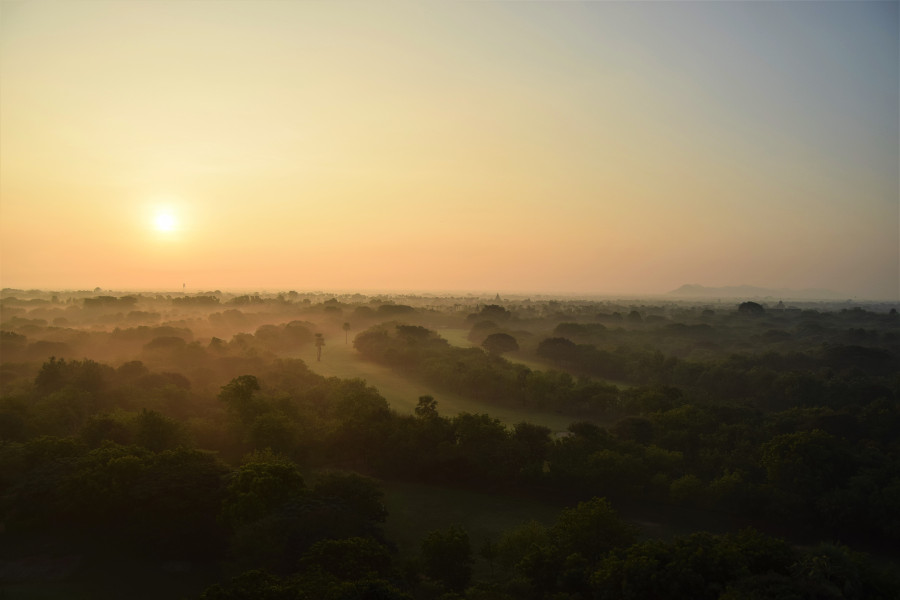
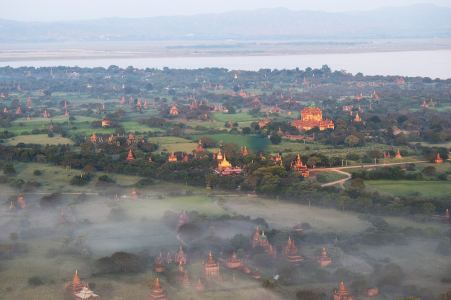
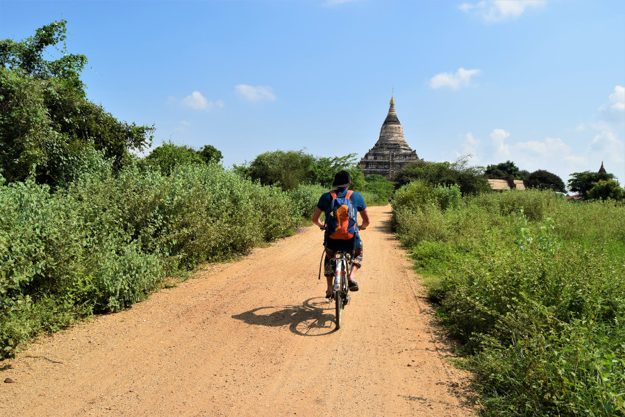
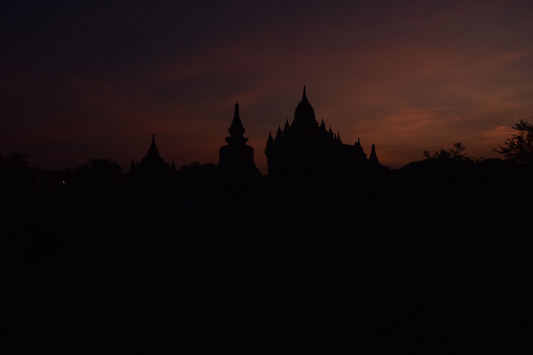

##Road to (from) Mandalay
There were three ways to get to Bagan from Mandalay; minibus, boat and private taxi. We opted to take the 11 hour boat instead of the 4 hour drive for a more scenic route. We could only find the one company offering the boat on the day that we wanted, [Alliance Myanmar River Cruise](http://www.alliancemyanmarrivercruise.com/). At $52 (£40) each, this was way more than getting the bus but after singing Robbie Williams' 'On the Road to Mandalay' for the last few days we felt we needed to do the infamous river cruise along the Irrawaddy River. It turned out to be a great decision, we were lucky as we had great weather, which would definitely make or break the experience. The cruise also stopped off at Lekkapin, a typical Myanmar countryside village where we learned how the people make traditional hats and use tools to assist in agriculture. Towards the end of the journey the excellent staff did a demonstration showing how to wear longhi, we had no idea of the number of different uses it has; football shorts, backpacks and cushion for the head were just a few examples. They also showed us how they grind and wear thanaka as suncream and make up.

##Day with a guide
Our guide, Aung Pyae Phyoe, who had collected us at the port and taken us to our hotel, [Amata Garden Resort](https://www.amatainleresort.com/) told us along the way about how people can no longer climb the pagoda. Although we were disappointed we were quite pleased that Myanmar were taking steps to protect the ancient buildings. He also told us that tourists often fall off the e-bikes and we weren't that excited about riding them anyway, knowing it would be stressful in the dark, so he convinced us to take a tour for the day to hit all of the good spots for $30 (£23). The e-bike's would have cost us 16,000ks (£8) per day and we wouldn't have been able to go far and wide as the batteries only last around 6-8 hours.

Aung Pyae Phyoe told us he had studied the history of Bagan at university and we enjoyed being told facts and stories about the buildings, rather than just wandering around more pagoda. He firstly took us to Dhammayazika Monastery for a view of Dhammayazika Pagoda. We were able to climb the crumbling monastery and never actually went inside the pagoda. We were told it has five entrances, one for each of the four buddha and one for a future buddha. We got a great view of this temple in the hot air balloon and the pilot of the balloon told us that there is also a theory that there are 5 entrances for the king's 5 wives, so that they had an entrance each.

We then drove across to Shwezigon Pagoda, which was closer to Nyuang-U. It was very similar to Shwedagon Pagoda in Yangon. Now all gold, it was originally completed in 1102AD and is said to contain a bone and tooth of Gautama Buddha. Aung Pyae Phyoe also told us about the statues of the sick man, old man, dead man and monk. He explained that it relates to Gautama Buddha's enlightenment, known as the four sights. Accoring to legend he had been confined to the palace by his father who feared a prediction that his son would become ascetic (abstinent of sensual pleasures) if he came into contact with the sufferings of life. At the age of 29 Gautama Buddha was allowed to venture out, seeing the suffering of humans in the form of a sick man, dead man and old man, he became a monk and the first buddha.

Our next stop was Gubyaukgyi Temple, a pagoda with the oldest original frescos in Bagan. We weren't allowed to take photo's but managed to take some of similar paintings in an unnamed pagoda later in the day. Aung Pyae Phyoe explained that the people of Myanmar do not know the value of paintings and so many have been destroyed by light, termites and people had actually graffitied on them too. He explained that there are 547 paintings depicting Jatakas, originating in Sri Lanka, of Buddha's previous lives. Nearby were a cluster of pagoda referred to as Khayminha, one was leaning over and it was a great stop to take some photo's as there were no other tourists around.

Our favourite temple in Bagan was Ananda Temple, built in an Indian style in 1105AD. It has recently been restored and cleaned by India and it was beautiful! Ananda Temple had four huge buddha statues inside, the north and south ones were original and we were told that this is because they had necks and their ears did not touch their shoulders. Depending on how close we got to them made them appear happy or serious, which we thought was really clever. We asked why there are coloured lights either in the temples, or behind the buddha's heads and Aung Pyae Phyoe explained that poorer people donate these and that when the lights are behind the buddha's heads it means they have supernatural powers. He also explained the different hand gestures of the buddha mean different things;
protection, teaching, the law, mediation and enlightenment.

After lunch we made a stop at Dhammayangyi Temple, the biggest one in Bagan. It was really busy and a number of monks and nun's were visiting. It was really odd to see them taking selfies and photographs with their DSLR cameras! Again we were able to climb a nearby crumbling monastery for a good photo and had a quick look inside. There were two buddha side by side, which we hadn't seen before and Aung Pyae Phyoe explained that it is believed the donor donated two buddha, one for the father and the other for the brother of the king. Both were assassinated by King Narathu in 1167AD and Dhammayangyi Temple was built to atone for his sins; buddhists build the pagodas to make up for the bad things they have done in their lives, in order to ensure that their reincarnation will be to another human life, or a respectable animal and not a lowly animal such as a rat or a snake. Aung Pyae Phyoe also explained that there are two types of pagoda; a stupa and a temple, the difference is that you cannot go inside a stupa. They tend to be smaller and built by a person from a lower class.

Before heading to a 'secret spot' for sunset, we went to a lacquer workshop. Bowls, cups, furniture are made with wood and bamboo and covered with a lacquer, a tree sap mixture similar to shellac, to decorate and make it flexible and durable. Some of the items are covered 18 times and take months to make. They were really pretty but very expensive! Aung Pyae Phyoe took us to a newer pagoda for sunset, that we were able to climb. We got lucky and although it wasn't the postcard sunset, it was the best one we saw. Aung Pyae Phyoe was the best guide we had in Myanmar and can be found via his facebook page, [Pagoda City](https://www.facebook.com/pages/category/Local-Business/Pagoda-City-226284161421878/).

##Hot Air Balloon
We'd initally decided against taking a hot air balloon over the temples of Bagan due to the fact that it was $399 each. However, when we arrived and found out that climbing the pagoda's was no longer an option for a view of the sunrise and sunset, we decided to go for it. We went with [Golden Eagle](http://www.goldeneagleballooning.com/), mainly because all of the other balloon companies were sold out but it worked out cheaper at $330 (£255) each. The day of our hot air balloon was only the second day of balloon season, as they only run from mid-October until April, when the weather is more reliable. We were collected at 04:50 and driven to a field for breakfast in the dark. Once the wind had been tested and the mist cleared a little the balloon was blown up and ready for take off. There were 8 balloons the day we went, 2 Golden Eagle, 2 Balloons over Bagan and 4 Oriental Ballooning, but our pilot told us in a week or so's time there will be around 24 balloon's each morning. There were 6 people in each of the two compartments of the basket, so it was a little squishy when we were taking off and landing but otherwise there was plenty of space and the pilot rotated the basket so everyone got a good view.

The sunrise was great, really pink and the mist over the land added an eerie feel to our experience. We were lucky that after around 20 minutes the mist started to lift and we were able to see thousands of pagoda poking out of the tree's. Bill, one of our pilots, explained that Bagan used to be a massive city that was abandoned which is why there are now just thousands of pagoda left. He explained that it is believed that people fled the area in fear that Ghengis Khan was on his way. As Mongolians are buddhist, Myanmar's pagoda were preserved and not destroyed.

Bill explained that Myanmar are trying to get UNESCO status for the ancient city of Bagan but are unable to do so as they keep constructing new buildings, such as the watchtower, which means that the site does not meet the critera. After an hour in the balloon and hundreds of pictures later, we landed and drank some champagne before heading back to the hotel for our second breakfast.

##Day on a bicycle
After seeing the pagoda's by car with a guide and from above in a hot air balloon, we decided to rent a bicycle for 2500ks (£1.20) for the day. We figured it didn't matter if we didn't get so far and this would be less stressful than by e-bike. If the bikes we'd rented had been in England, they'd have been scrap metal. We headed towards Bu Paya Pagoda, a white and gold pagoda on the edge of the river, stopping at a number on the way. The first was Soemingyi Monastery, which we were able to climb. We also stopped at Manuha Temple, which had absolutely huge buddha statues, taking up all of the space inside the temple, Shewsandaw Pagoda, one which used to be a famous climb for sunrise, Thatbyinnyi Temple in Old Bagan and Mahabodhi Temple, a replica of a temple in India.

After a short stop in Old Bagan for lunch and a strange conversation with a Burmese man about piercings and tattoo's in western culture we headed to Sulamani Temple, around a 30 minute bike ride from our hotel. It was a larger temple, which was sadly being restored, but it had a nice marble path going around that was cooler on our bare feet in the midday sun. We loved biking around the pagoda because we could go whereever we wanted, on the little paths. We saw a couple of farmers herding their goats around the grasslands of the temples. However, it was less harder to avoid being hassled by the locals. Many people wanted us to buy their souvenirs and the hardest was being approached by children asking if we'd buy their postcards. Things cost so little, we ended up buying lots of things we didn't need in Myanmar, including a girls hand drawn (photocopied) postcards of Bagan.

##Sunset on the watchtower
We decided to spend a couple of hours at the controversial 'blot on the skyline' watchtower to watch the sunset over Bagan's pagoda's. Our theory that the skyline would look a lot better if we were in the ugly blot! It cost $5 each and did provide a good view over Bagan, but there was too much cloud covering the sun for a decent sunset. In my opinion, it does offer a good alternative option to those not lucky enough to go in the hot air balloons, it's just unfortunate that it is rather ugly. We had heard and read that the watchtower was part of the reason that UNESCO won't touch Bagan, but with the absence of a watchtower perhaps more people would illegally climb the pagoda's.

##Sunrise
After the success of the hot air balloon, we decided the next morning we would take our bikes back to the 'secret spot' for sunrise, so we could see the hot air balloons coming over. We got up around 04:00AM and biked in the dark to the temple. Sadly, there was so much fog and cloud that the balloons were cancelled and we didn't get a sunrise, so we headed back to bed. As we'd visited Myanmar at the very end of rainy season, it meant that we had caught the tail end of the rains which made the weather a little unpredictable but it also meant that Bagan was green and flowery rather than being brown and dusty!

##Our verdict on Bagan
Bagan turned out to be the highlight of our time in Myanmar. It was sunny, we enjoyed biking around the crumbled, abandoned pagoda and the views from the hot air balloon were absolutely incredible; something we'll never forget!