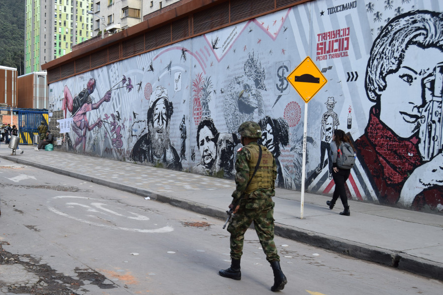
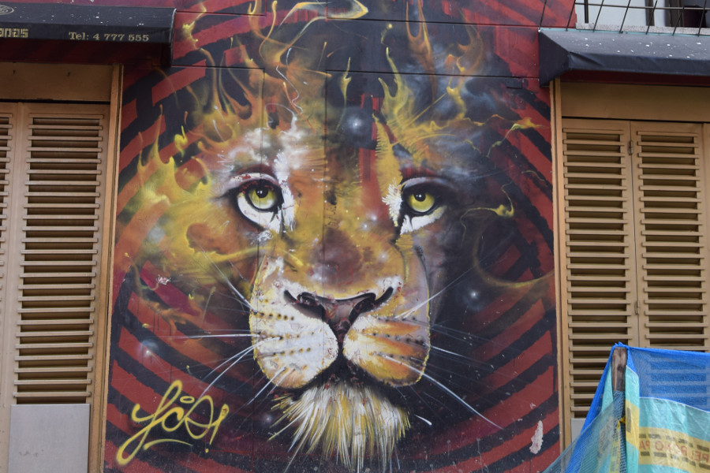
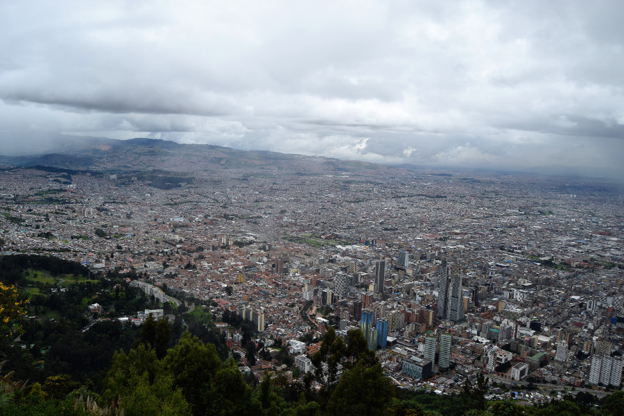
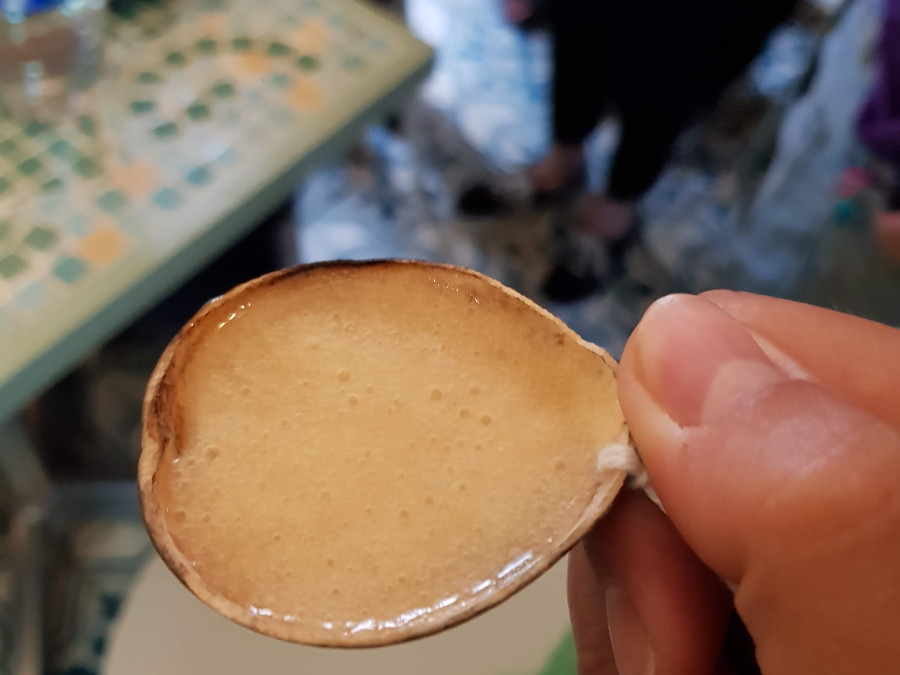
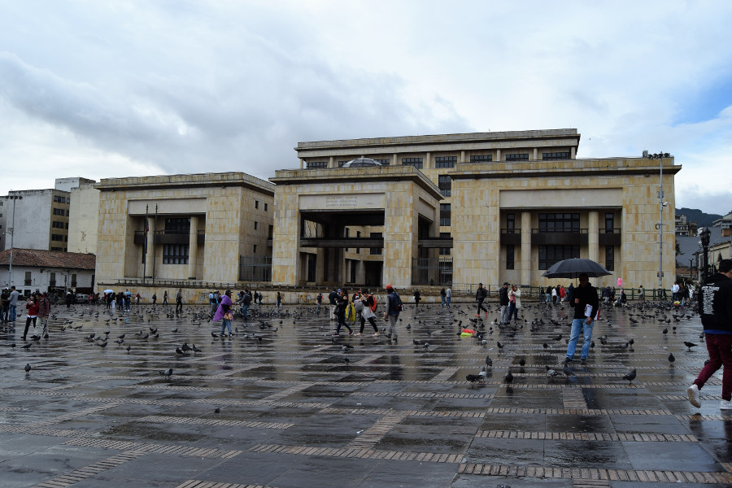
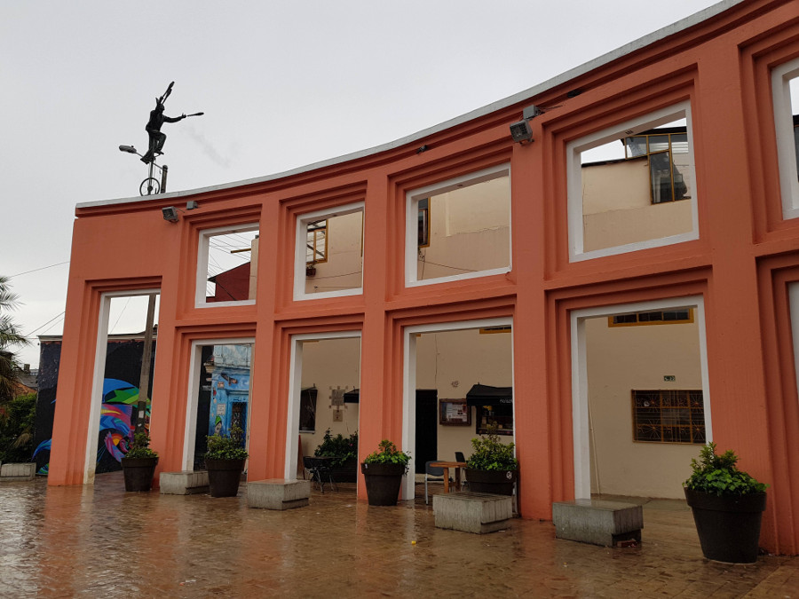

>"When grey streets are flooded with colour, the hearts of passers by are lifted by the brushstrokes, tones and creativity and they let their imaginations fly."

Vivianne Pantojoa

##Graffiti Walking Tour
The first thing we decided to do in Bogotá was a [graffiti walking tour](http://bogotagraffiti.com/). We thought it would help us to get our bearings around the city, it had come recommended by many and because there was street art everywhere! Our first day in Colombia was a Sunday and there were soldiers all over the city, lots of things were closed so it was hard to work out if the areas we were walking around were dodgy or just closed because it was Sunday. It turned out to be election day which meant two things - soldiers all over the city at the polling stations and dry law. No alcohol is sold or to be consumed by law on Election Day in Colombia. We were not happy tourists.

Feeling safer with our graffiti guide to tour the city we wandered around La Candeleria and Downtown looking at the street art. The guide told us that street art is illegal in Bogotá but it is now recognised as a cultural expression and has been decriminalised. The guide explained this was because of two things that happened. The first was that two police shot a 17 year old boy, Diego Felipe Becerra, dead when he ran from them scared after he has been caught graffitiing. The second was that shortly after this event Justin Beiber visited Bogotá and graffitied in the city, except he was accompanied by the police as escorts for protection. Shortly after his graffiti was covered up by artists in protest and the government changed the law to decriminalise graffiti in Bogotá.

##Dry Law
In Bogotá we became four as Iz and Greeno had joined us on our travels. After the walking tour we were looking forward to a nice cold beer to celebrate only to find out that there wasn’t going to be any. There is a law in Colombia that alcohol cannot be sold or consumed on Election Day meaning they many bars and restaurants were closed. We managed to find a Mexican restaurant for some food and went back to the Airbnb early with little else to do. We walked back to find that the road had been blocked off with TV crews and there was some kind of protest on the next block. We watched from the 11th floor that our apartment was on, a massive crowd had gathered outside the registry office in Bogotá and we think that they were watching the election results. We later found out this was the most peaceful Election Day in Colombian history.

##Monseratte
Bogotá is a very cloud and rainy city, we saw blue sky on a handful of occasions during our visit. We decided to risk the cloud and headed up to Cerro Monseratte hoping to catch some good views of Bogotá city. We got the cable car up which was $20,000 Colombian pesos return (£5.20). Monseratte went up to 3100 meters above sea level and air was definitely thinner up there. It was cloudy and at first we couldn’t see anything but eventually the clouds broke and we were able to appreciate how big Bogotá actually is!

##La Chicha & Chicken Wings
After hearing about chica for around six weeks we finally got round to trying it! It’s fermented corn beer and people used to ferment it by chewing the corn and spitting it in a big tub. It isn’t made like this anymore but regardless it wasn’t good. It was very thick and tasted a little like fizzy apple cider.

##Walking tour
As the graffiti tour had very much focused on the art around the city we decided to do a generic walking tour on our last afternoon, mainly to knacker ourselves out for our overnight bus to Armenia. We learnt a little about Colombian politics, why ELN and FARC guerilla groups formed in the country and about the peace agreements with the FARC group that have led to them handing in their weapons. The guide also explained a little about the cartels and the paramilitary and how they also fit within the politics in the country. She talked about an open investigation where the Supreme Court of Justice in Bogotá had burned and hostages had been killed inside. She talked about how it’s believed this was initiated by a guerrilla group M19 but still remains unsolved.

The guide also told us a little about [Fernando Botero](https://en.wikipedia.org/wiki/Fernando_Botero), a famous Colombian artist and [Gabriel García Márquez](https://en.wikipedia.org/wiki/Gabriel_Garc%C3%ADa_M%C3%A1rquez), a Colombian Nobel prize winner for literature. We wandered around the La Candelaria area during and after the tour, very annoyed that we were not staying another evening to explore the hipster bars in the neighbourhood.

##Our verdict on Bogotá
A lot of people had told us that Bogotá isn’t a nice city and not to bother but actually the two days we had in the city wasn’t nearly long enough! La Candeleria was definitely our kind of neighbourhood with shops and bars and somewhere we wished we could have spent more time.