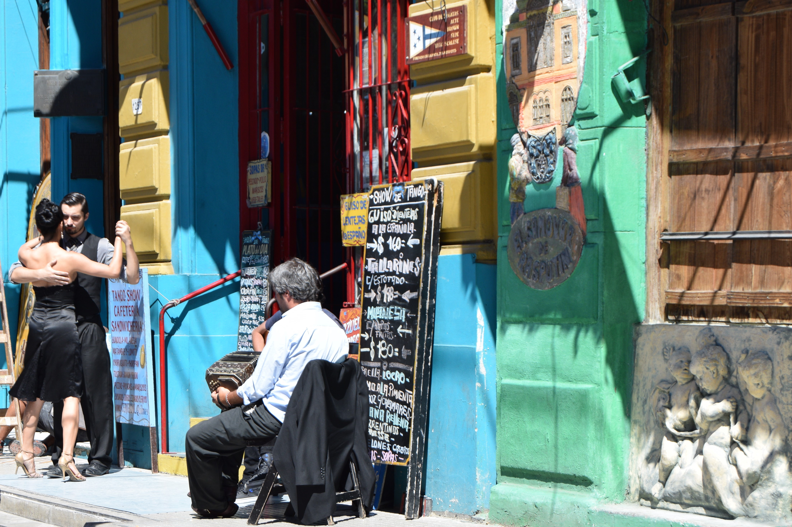

>“Without the streets nor dusks of Buenos Aires a Tango cannot be written.”

Jorge Luis Borges.

##Transport & Hostel

To get to Buenos Aires we took a bus from Puerto Iguazu, which cost us £80 and took 19 hours in total; it left at 14:00 and arrived at 09:00 the following day. We paid for ‘executive’ seats which were more like first class seats on an airplane.  We were given three meals, mostly bread and crackers, there was a TV with films dubbed in Spanish and we were given a small bottle of red wine with our meal. Our first taste of Malbec in Argentina. During the night we drove for hours through thunderstorms, with the lightening lighting up the sky every few seconds, luckily we couldn’t hear the thunder.

We stayed in [Puerto Limon Hostel] (http://puertolimonhostel.com/en/) which is easily our favourite hostel of the trip so far. The staff were friendly and there was a hostel cat called Max who Dan took a liking to. After Alz left we stayed in a private room which had cable TV, so I was able to watch Disney films dubbed in Spanish and it had a bath, so Dan was happy. The wine in the hostel was also $75ARS, which is around £2.70 for a good bottle of Malbec, #winning!

##San Telmo

Buenos Aires is a massive city and the hostel was in the oldest barrio San Telmo, which was very picturesque. It had cobbled streets and bars with tables set out in the plaza’s and on the streets. On Sunday there was a huge market which spanned down more blocks than we could walk down, selling lots of local crafts. Dan managed to find a cheap leather belt for his now too big Levi’s and we both bought new football shirts.

##Food

We could hardly go to Argentina and not go out for steak and wine, so we did, twice. We ate in [La Brigada] (http://www.parrillalabrigada.com.ar/), a restaurant recommended by the hostel for the best steak in the area. There were so many cuts of beef we managed to try t-bone, lomo (sirloin), tail of lomo and beef of chorizo; all mouth wateringly delicious.

Due to the immigrants settling in Buenos Aires from 1857-1940, there is an obvious Italian influence throughout the city. This has also shaped the way Argentinians speak Spanish, as beer is birra not cerveza. So, we thought we ought to eat at one of the many pizza restaurants too. We’d been warned that people think that the Argentine pizza is too cheesy, I didn’t think this was possible, but it really was! Dan had also researched a place called [Chicken Bros] (http://thechickenbros.com/) which sold all you can eat chicken wings on a Tuesday, so it was inevitable that we were going to end up eating there too. We ate around 70 chicken wings in total, pure gluttony!

##City Centre

As day three of Lollapalooza was cancelled we decided not to waste our time in Buenos Aires and we did the first of three [free walking tours] (http://www.buenosairesfreewalks.com/), excessive we know. Our guide Fernando told us about how Argentina became a country and stories of the first people to settle there. He talked to us about Eva Peron, the first lady of Argentina from 1946-1952 who the nation loved and who Madonna played in the film Evita. He also showed us the Italian and Parisian architectual influences in the city.

La Recoleta Cemetery was one of the more peaceful places in the city. It was nice to get away for a short while from all the people shouting “cambio, cambio, cambio” at us on the streets of Buenos Aires, asking for us to exchange our money for their probably fake Argentine Pesos at their dodgy rates.

##La Boca

I really wanted to see a Tango show whilst we were in Buenos Aires but they were pretty pricey and the cheaper ones offered a lesson thrown in which Dan point blank refused to participate in. We’d heard that there were Tango performers in the barrio La Boca on Caminito so we headed to this area on the local bus to do some exploring. The boys were happy with this too as it meant a museum and stadium tour of La Bombonera, Boca Juniors football ground. We did a walking tour of the area as we’d been warned about theft at gunpoint in La Boca and to be aware of our belongings. Maru, our guide, told us about the area’s history and how the immigrants that came to populate Argentina ended up there. She also told us about the birth of Tango and a guy in La Boca let us look inside his house where he had lived for 40 years. He told us that at one point he lived with 11 other families all sharing one bathroom.

It was a very vibrant and colourful part of the city which made for some great photographs. Maru explained that the origin of this came from people using scraps of material from the port to build their houses, included scraps of paint, meaning that they ended up being bright and multicoloured.

We had a look around [La Bombonera] (http://www.stadiumguide.com/bombonera/), which didn’t take long as the ground was tiny! We’d learnt on the tour that the people in the houses around the stadium had gone back on their agreement to sell their properties, so they could only build half of the stadium which is why it is so small. After the tour we stopped for a beer and watched the Tango dancers for a tip.

##Palermo

We went to Palermo on our last day for a graffiti walking tour. We’d heard that as a city Buenos Aires was tolerant of street art and often commissioned artists to paint their houses, a lot of which occurred in Palermo. As soon as we walked into Palermo we realised we’d found the ‘hipster’ neighbourhood, full of bars selling craft beers and vintage shops. We spent the afternoon photographing the art in this area of the city and drank a few South American honey beers.

## Our Verdict on Buenos Aires
Buenos Aires is a huge city with different districts; each one with its own style and personality. Our personal favourite was Palermo, with its quirky bars, vintage shops and graffiti on every block. We also tasted the best steak we'd ever had in San Telmo accompanied with a delicious bottle of Malbec which was for once within our budget.