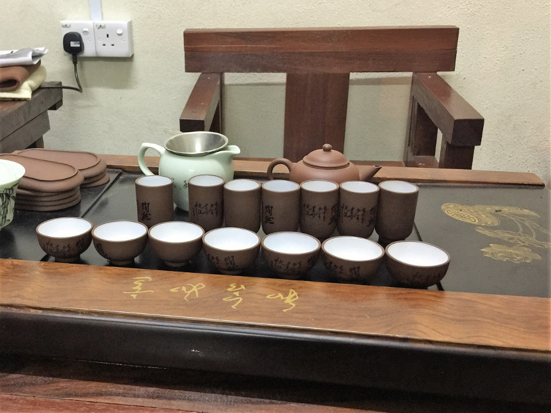
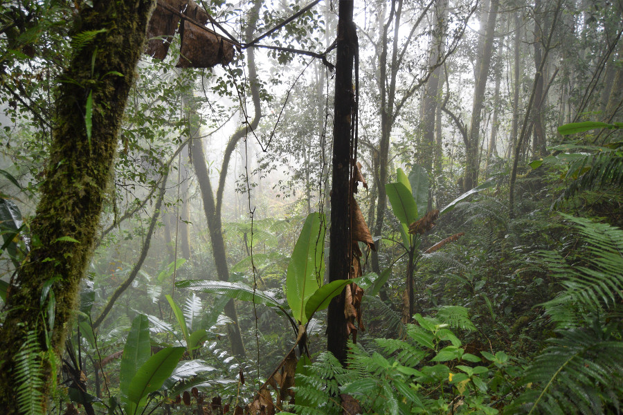
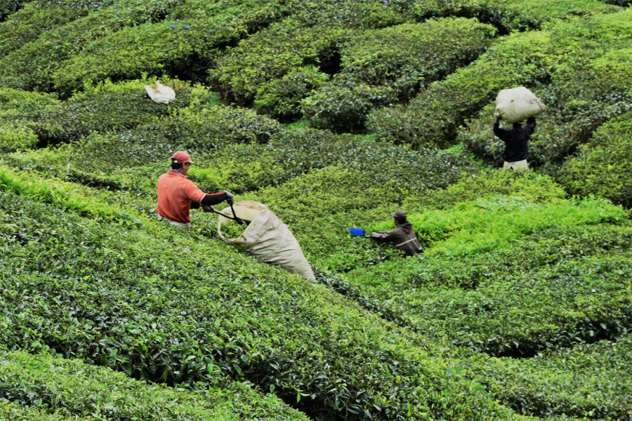

##Tanah Rata

We took a bus from Kuala Lumpur to Cameron Highlands with [Unititi Express](http://www.unititi.com.my/) which took around four hours. The last hour or so of the journey was on winding jungle roads but the driver was cautious so no one was sick. The town we stayed in was called Tanah Rata and it was tiny, without a car to get round there wasn’t a lot to do. There were some hiking trails but it kept pouring with rain so we decided to give these a miss and chill in the Airbnb we had booked. Compared to Kuala Lumpur, the food left much to be desired, although we did find a nice Indian called [Singh Chapati](https://www.facebook.com/SINGHCHAPATI/), which was proper home-cooked Indian food.

##Chinese Tea Ceremony
The Cameron Highlands is famous for its tea plantations and our host for the Airbnb, Charen, offered to do a Chinese tea ceremony for us for 10MYR each (£2). As the other housemates staying in our Airbnb were doing it, we agreed to join them. Charen explained that Chinese tea ceremonies are completed for business between Chinese men and she let us try Oolong tea and local Malaysian tea in her tiny teapot and cups.

Charen explained that the host always drinks the tea first, this came from men at war drinking together and fear that they would be poisoned. So, to show the tea was okay, the host would always drink first. She taught us how to say thank you in Chinese 'xiè xie', pronounced 'syeh-syeh'. She told us if our pronunciation was off we'd end us saying 'shoes shoes', which is 'xie' in Chinese. Cameron Highlands was the first time we'd had a private room in an Airbnb and we really enjoyed spending some time with our host.

##Mossy Forest
We really wanted to see a Rafflesia (a giant flower that smells like dead elephants) in the Cameron Highlands, but we were told it was the wrong time of year and that the tour agencies will take our money without any ability to find one. So instead, we opted to go to the mossy forest. However, after the glorious forests we’d seen in South America and New Zealand, this one turned out to be a massive let down. We did it as part of a tour as it is so difficult to get around without a car and we ended up with the most clapped out old jeep on the road. The guide explained a little about the plants on the side of the road when we arrived; letting us smell the medicinal plants, pointing out the cobra lilies and insect eating plants and then he became very distracted by his phone for the rest of the tour. We were able to walk through the mossy forest on a walkway which was packed with tourists and the path wasn’t long at all, it probably took us twenty minutes dawdling. The weather was awful, it was raining and it was so cloudy we couldn't see anything from the viewing tower.

##BOH Tea Plantation
We then headed to a tea plnation as part of the tour. After the coffee tour we’d done in Colombia, we were interested to see how tea is made and to sample some of the local tea. Once we got there we realised our mistake, not only was it European school holidays, it was also Malaysian school holidays and Eid al-Adha. This meant the tea factory was actually closed for the public holiday and everyone seemed to have decided to visit [BOH Tea Plantation](https://www.bohtea.com/). We had a quick look around the explanations of how tea is made and then had to go to the heaving cafe to sample the tea. After a thirty minute wait we finally got our tea which turned out to be one of the best brews I've had for a while, but as everyone was 'reserving seats' for their friends and families in the queue we had to stand to eat and drink.

After this we were meant to visit a butterfly farm and strawberry farm but there was so much traffic and the guide had stopped guiding and just kept using his phone. No one was in the mood to visit these places so we ended up heading back to town.

##Our verdict
The Cameron Highlands were a massive let down but poorly timed on our part, with the school holidays and Eid al-Adha. Although we did discover a brand of tea that would give Yorkshire a run for its money.

