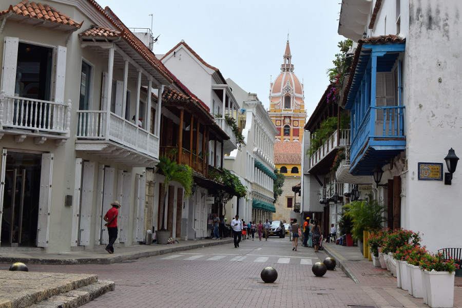
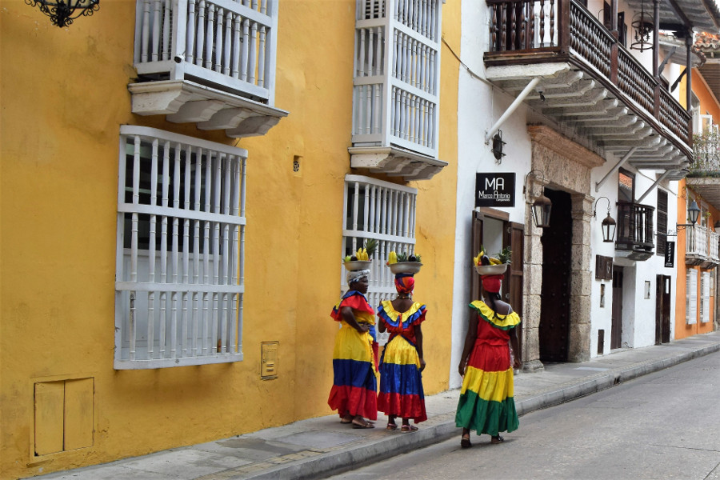
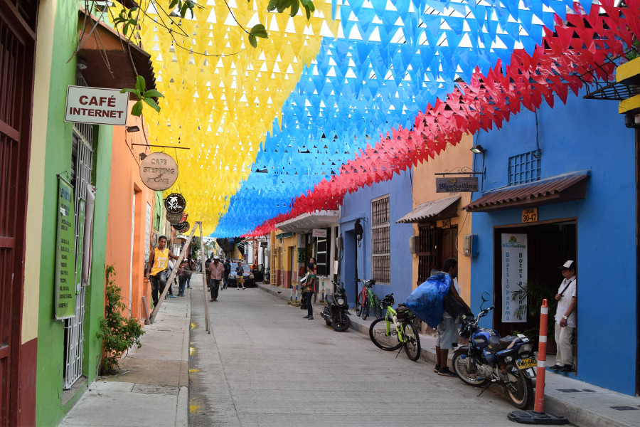
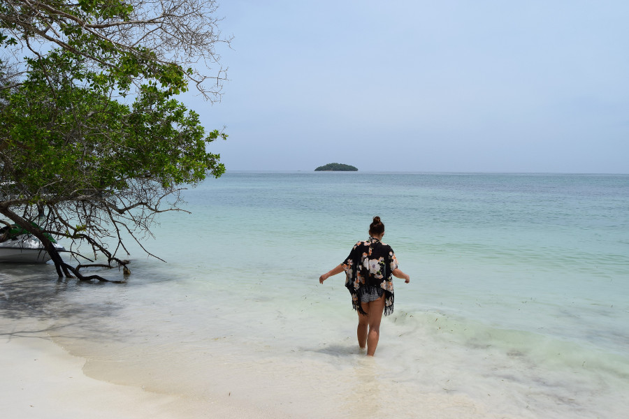

>"Twenty years from now you will be more disappointed by the things you didn't do than by the ones you did. So throw off the bowlines, sail away from the safe harbor. Catch the trade winds in you sail. Explore. Dream. Discover."

Mark Twain

##Old Town
On our first day in Cartagena, after a much needed long lie in, in a room with air con and no windows, we went on a wander around the city's streets. We headed straight to old town; this part of the city is surrounded by walls with narrow cobbled streets and old colourful houses. It felt very touristy compared to anywhere else we had been in Colombia. We found a quirky coffee shop in a library with a huge courtyard out back and had iced hot chocolate and lemonades which were very refreshing in the intense Caribbean Coast heat. Later in the afternoon we did a walking tour in old town and the guide told us lots of dates, facts and figures about Cartagena as we walked along the streets and  walls of the old city. It was reminiscent of a walled European city like Dubrovnik or Kotor but more colourful and much hotter!

The guide told us about the meanings of the different door knockers on the old town doors, hands are for religious men or women and lizards mean wealth. He also showed us the Cathedral and talked a lot about the history of the African slaves that were sold and traded in the area. He also talked about the indigineous people in the area; that some of them come into the city to sell fruit. Luckily the rain held off for the length of the tour and afterwards we hit [Collage Charaldero](http://collagecharladero.com/) for the cheapest two for one Mojitos we could find in old town.

##Getsemini
We were staying in [Hostal Caracoles](http://hostalcaracoles.net/) just between the Old Town and Getsemini. When we arrived the streets didn’t look like much at all, it didn’t help that the absolutely crazy taxi driver had no idea where he was going, couldn’t read a map and thought it was acceptable to drive between two cars on a two lane road to overtake. We actually feared for our lives. To annoy us even further he tried to take a tip when we paid with a 20.

Getsemini turned out to be our favourite part of the city, mostly at night! There were colourful flags decorating some of the streets and the buildings were old and crumbling housing cocktail bars and hipster type restaurants. Holy Trinity Square came alive at night as people brought beers from the nearby shop and drank on the square whilst watching the street entertainment. One night we watched a guy impersonating Shakira which was so awful it was great and another evening watched refugee from Venezuela play his violin; he was amazing! We also went to an Indonesian restuarant called [Saint Roque Restuarant](https://www.tripadvisor.com/Restaurant_Review-g297476-d4305957-Reviews-Saint_Roque_Restaurante_Cafe-Cartagena_Cartagena_District_Bolivar_Department.html), we ate there twice. The owner was really friendly, the food was delicious and the profits went to schooling poor children in Colombia.

After partying in Medellin, we decided to do the same in Cartagena, on Izzy’s penultimate night. However no matter where we went, bars on the squares, by the coast in the old town, everywhere seemed dead! We guessed this was because it was a Thursday as it was much busier on the Friday! Either way we still had a great time and a good send off for Izzy.

##Isla Baru
Before we got to Cartagena we’d done some research and heard that it wasn’t as beach-y as people expect and that trips to the Rosario Islands were where the beaches could be found. However we read blog after blog of people’s bad experiences being crammed in speedboats, forced to visit an aquarium and ending up with an hour at a nice beach. So instead we decided to visit an island ourselves and spend the night, maximising beach time. We went with Isla Baru and [Aura Hotel Baru](http://www.sportbaru.com/) which was the cheapest we could find but it was definitely still well out of budget. We had found cheaper places to stay in Playa Blanca but we read lots of reviews about rats running over peoples beds and thought we’d give that a miss.

We hopped on a private speedboat to the hotel first thing in the morning and the ride wasn’t too bumpy. After checking in we had two hours on Agua Azul, a beautiful white sand and blue sea beach, where the water was warm! There weren’t too many sellers to irritate us and barely any other tourists so it was lush! The hotels ‘beach’ was more man made but it was still a nice change to snooze on the sun beds as we hadn’t done that since Brazil. After making the most of the sun we headed back to Cartagena the next afternoon feeling very refreshed!

##Our verdict on Cartagena
Cartagena was one of our favourite cities in Colombia, although the most pricey. It was definitely set up for tourism; the old town had been restored and was really chic and clean whilst Getsemini was more rustic and a great place to drink in the bars and clubs.