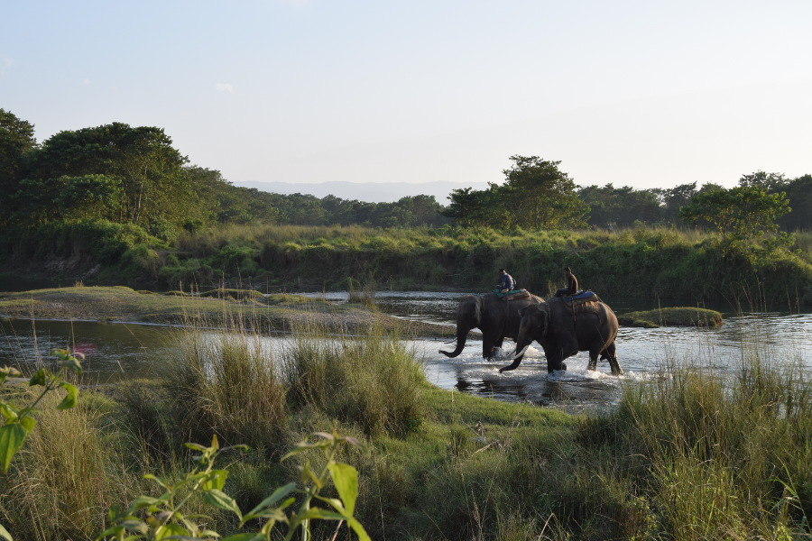
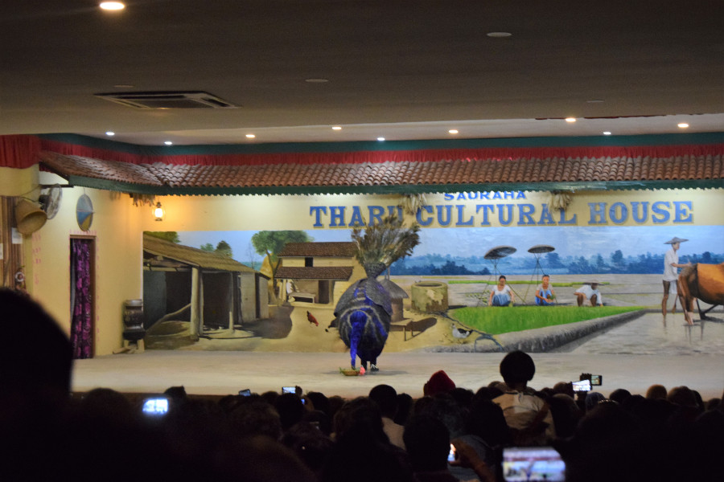
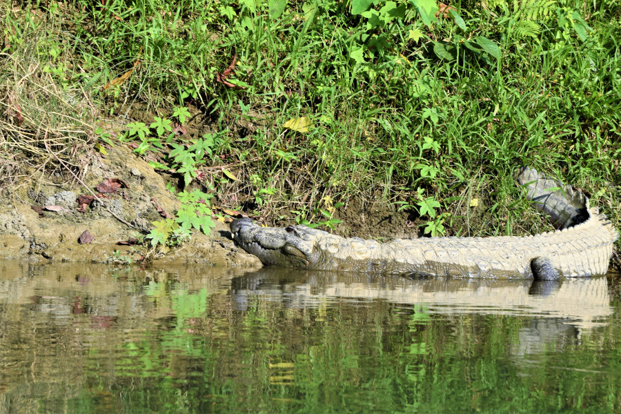
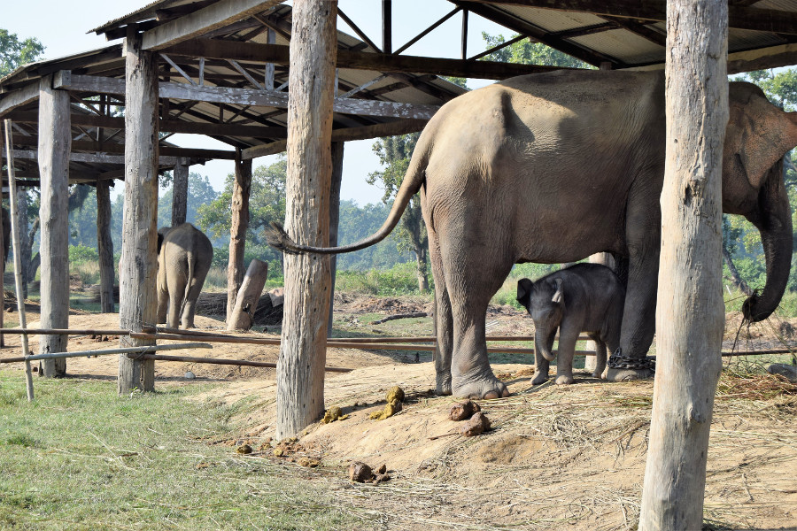
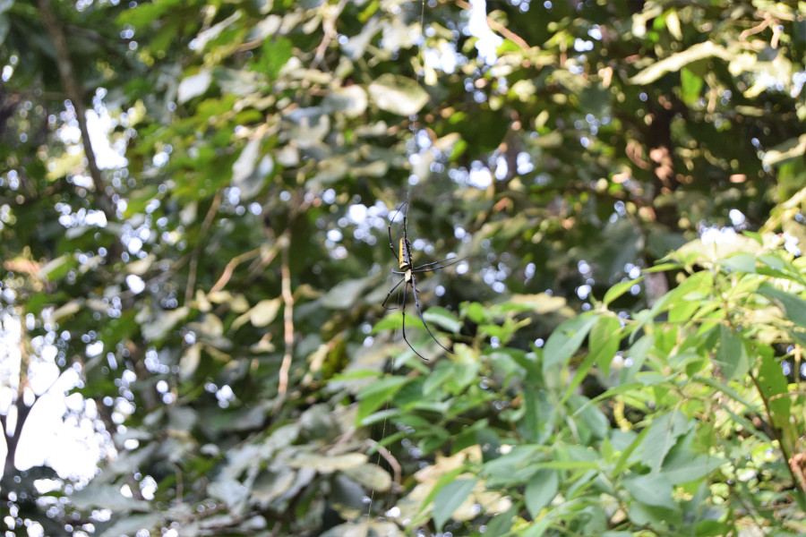
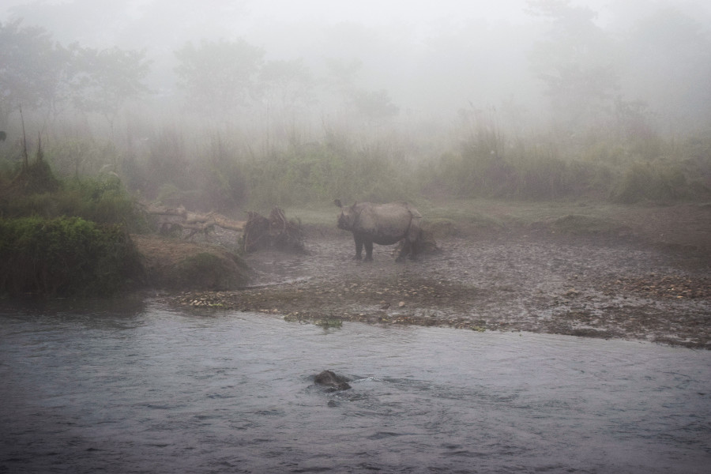

##Chitwan National Park
Having endured a very sweaty and bumpy 5 hour bus journey we arrived at Sauraha, a little city on the edge of Chitwan National Park. Our hotel, [Tiger Residency Resort](http://www.tigerresidency.com) picked us up from the bus station and after a quick lunch we met our 'tour guide', Sisir. We booked our 3 days trip via [Chitwan Safari's](https://www.chitwanjunglesafari.com) for $150 (£115) each. We booked online as we knew October was high season in Nepal and we didn't want to miss out on another jungle adventure. However, it wasn't quite like any of the other jungle adventure's we'd had. The hotel was actually on the edge of the city and visitors are not allowed in the park after sunset and before sunrise, the activities were also clubbed together with other hotels and in hindsight, we wish we'd have just arranged the whole thing ourselves. By booking through Chitwan Safari's, we actually ended up booking through an agent [Breakfree Adventures](https://www.breakfreeadventures.com) and we know we could have got the whole thing much cheaper by booking directly through the hotel.

##Sunset walk
The main reason we'd decided on a third jungle trip on our big adventure was because in Chitwan we'd have the chance of seeing rhinocerous and tigers. Sisir told us that Chitwan was Nepal's first national park and that it used to be named the Royal Chitwan National Park, as until 1951 aristocrats and royals used to hunt there. Our first activity in the park was a short walk to Rapti River to look for greater one-horned rhinoceros (aka chubby unicorns). The rhino are only second in size to an elephant and Sisir told us that they often come to the river at sunset. He told us that 600 can be found in Chitwan National Park and he could give us a 80-90% chance of seeing them. He told us it is more likely if we opted for an elephant trek, which we'd decided against doing. Another family joined us on the walk, a Dad who was from Wolverhampton but had been living in Denmark for 17 years and his son who was from Peru and couldn't have been older than 12. They had also been traveling for 8 months but their trip sounded much more adventurous than ours, as they set off from Croatia and cycled all the way over to Nepal through Iran, Kazakhstan and India! Unfortunately we didn't see a rhino but we did see a sloth bear across the river jump down from a tree and run through the grasses. We also saw some domesticated asian elephants and their mahouts coming back from the jungle and a number of pied hornbills flying in pairs above us. Annoyingly our guide kept referring to them as 'toucans' which really annoyed us as we'd seen both types of birds and they're completely different.

After dinner we were taken into town to watch the Tharu Culture Show. We were led into what seemed like a school hall with a packed audience. There were also a few western school trips in the audience including a group of friends in front of us that looked just like the main group of kids from Stranger Things, minus Eleven. We were told afterwards that many Nepalese visit Chitwan for their holidays and as we had arrived just at the end of Dashain Festival, many people were enjoying some time off, meaning that Chitwan was packed with locals and tourists alike. The show itself was interesting in parts, but it felt a bit repetitive compared to other cultural shows we'd seen. The best part was probably the 'peacock dance' and watching the very enthusiastic families join in at the end.

##River cruise
The following day was very busy, although we'd signed up for a 'three day' visit, really it was just one day jam packed with all the activities. At 7:30AM, we went to the river for a cruise downstream to try and find some crocodiles. We were packed into a very suspect dug out canoe. They packed so many of us in there, we were basically sat between each other's legs. The boat man stood balancing on the back of the boat as he steered by leaning with a long stick, a little like punting. The boat was extremely wobbly and there was about 2cm of room above the water before it entered the boat. At one point when the boat tilted water spilled over right next to us, just as Soph was having a panic attack behind me! Dug out boat is now offically her least favourite way to travel! Spotting crocodiles wasn't a problem and we saw around 10 on our 30 minute boat ride, mostly basquing in the sun on the river banks. There are two different types in Chitwan, gharial that has a long narrow snout with a bulb like shape on the end which eats fish and the flesh eating marsh mugger! The gharial is listed as critically endangered due to loss of riverine habitat, depletion of fish resources and entanglement in nets. They are the nearest living relative of the dinosaur. We also saw a macaque monkey having a wash in the river, lucky he wasn't caught by one of the crocs and some peacocks roaming on the grass.

##Jungle trek
After a short rest and lunch, Sisir took us out for a jungle trek, again in search for rhinocerous. The guy from Wolverhampton had warned us about leeches so we made sure to wear long sleeves and to tuck our tops and socks in! We were very glad we did as our guide took us through some overgrown paths where our legs and shoes ended up being absolutely covered in leeches. Fortunately we managed to flick them all off before any were able to find some skin, latch on and fill up with blood. Once again we were unlucky on our chubby unicorn hunt, but we did manage to see a lot of deer. Some were chital, they're spotted deer, like bambi. These were mostly in herds and got scared off very easily. We also saw a barking deer, a smaller darker deer. We just heard and saw a glipmse of it jumping through the long grasses and it spooked us a little, thinking it might be a bear. Sisir wasn't worried though and told us it was just a deer. Considering tiger and bears roam the park, although it's pretty big and unlikely that these big animals would come to the edge, it was a little worrying walking through long grasses with a small Nepalese man armed with just a stick. He told us that the only animal we really needed to worry about was a wild asian elephant bull, as there was a little a human could do to defend themselves. He explained that a stick is usually enough for a bear or if we ran into a rhino we could run in a zigzag as they're almost blind and pretty stupid.

##Elephant Sanctuary
We'd actually contemplated not visiting Chitwan National Park at one point because it is home to a lot of domesticated elephants. Neither of us are angels and 5-10 years ago, we'd both naively ridden an elephants in South East Asia, that in hindsight perhaps weren't treated in the best way. However, I'd read an [article](https://www.thelongestwayhome.com/blog/nepal/elephant-tourism-in-nepal-is-it-different/) about the pro's and con's of having domesticated elephants in the park; they create jobs for local people, it makes tourism more eco-friendly and people are able to monitor the wildlife in the park. In the end, we decided there was no pressure to ride an elephant again and we opted to do a jeep safari instead of elephant safari. However, Sisir still took us to the elephant sanctuary, which we had to pay for and it annoyingly came out of the package we'd paid for. There was some information inside about how they train the elephants and it contradicted the information that I'd read in the article. We read that the elephants are trained for 20 days and the mahouts use metal hooks on elephants, despite the fact that we'd read this had been changed and they were only allowed to use wood. We'd also read that the elephants are not chained up during the day, but we saw a long row of female and juvenile elephants with their feet chained to wooden poles. Sisir told us that the baby in the sanctuary was only 2-3 weeks old and he'd be kept with his mother for a number of years before being trained. He also told us that they no longer keep bull elephants to breed with. He explained that they used to have one but when the female elephants were in season, wild bulls would come to the sanctuary to breed with them and they ended up killing the male bull they had there. We knew that the elephants here were being treated much better than the ones in other parts of South East Asia but we were happy with our decision not to ride them.

##Jeep Tour
Sisir took us into town to book us onto a 12 seater jeep and told us we would have around a 4 hour ride. He intially told us he thought a jeep would be better than the elephants, as we had more chance of seeing tigers and bears but in hindsight we think it was just because he'd have struggled to find us an elephant to ride in high season. We had a different guide in the jeep, crossed the river in a dugout boat, avoided the wild boar on the other side and found our seats on the jeep. The tour itself felt more like a ride in a theme park than exploring the wild Chitwan Park. Sadly, we barely saw any wildlife and even if we'd found any with a screaming child and some chatty Europeans in the jeep if we had seen anything it would have been unlikely that they'd have stuck around. At one point I think the guide was worried our ride was really dull, so he stopped the jeep so we could look at a spider. We did manage to spot a few deer, the same as those we'd seen on our hike and we also saw some langur monkeys playing in the tree's. Towards the end of the jeep tour we stopped at a crocodile sanctuary for around 15 minutes; most of that was spent queuing for the one squat toilet. There were hundreds of the two types of crocodiles in the sanctuary but absolutely zero information about what the sanctuary does or information about the animals there. In the end, we thought the four hours in the jeep went really slowly. We think we'd have had to have been really lucky to see a tiger or bear on a road full of jeeps in the buffer zone of Chitwan National Park.

##Sunrise
As we didn't see any rhinocerous on our jeep tour, Sisir told us to be up for 6:00AM so that we could go in the park first thing in the morning to see if we could see any by the river. There was so much fog in the morning we were worried that even if there were rhino's we wouldn't be able to see them anyway. Sisir told us to keep a look out for them because they cross the river's for the night and are found in the morning going back. He showed us some fresh poo and a footprint and it wasn't long before we heard a rhino crossing the river. Luckily, he stuck around for a few minutes and we were able to make him out through the fog. We saw 3 of them in the end and the sunrise was spectacular. It was the best part of the whole time in Chitwan, even more so because for once there were only a handful of other tourists with us, instead of swarms of them!

##List of most of the animals we saw in Chitwan National Park;
* Black Ibis
* Peacock
* Common kingfisher
* Pied hornbill
* Wagtail
* Stalk
* Heron
* White throated kingfisher
* Peacock
* Chickens
* Rose-ringed arakeet

* Asian elephant
* Greater one-horned rhinocerous
* Sloth bear
* Goats
* Buffalo
* Wild boar
* Spotted deer
* Sambur deer
* Barking deer
* Grey langur
* Macaques

* Flying fish
* Gharial crocodile
* Marsh mugger crocodile
* Red cotton bug
* Leeches
* Common monitor lizard

##Our verdict on Chitwan National Park
The highlight of our trip to the park was our sunrise walk where we managed to catch a glimpse of rhinocerous. Sadly, the park wasn't what we expected but at this point after amazing stays in the rainforests of Borneo and the Amazon, we think we'd been pretty spoilt by the wildlife we'd managed to see! In hindsight we maybe should have travelled a little further afield to Bardiya. National Park, which is less touristy and there are higher chances of spotting tiger!