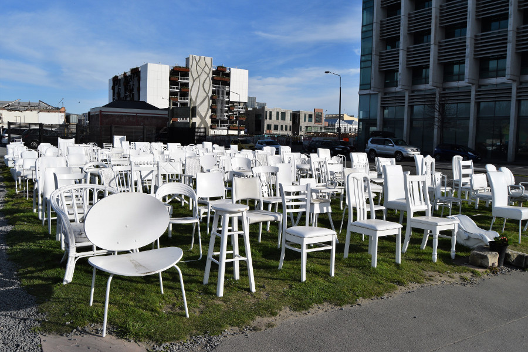
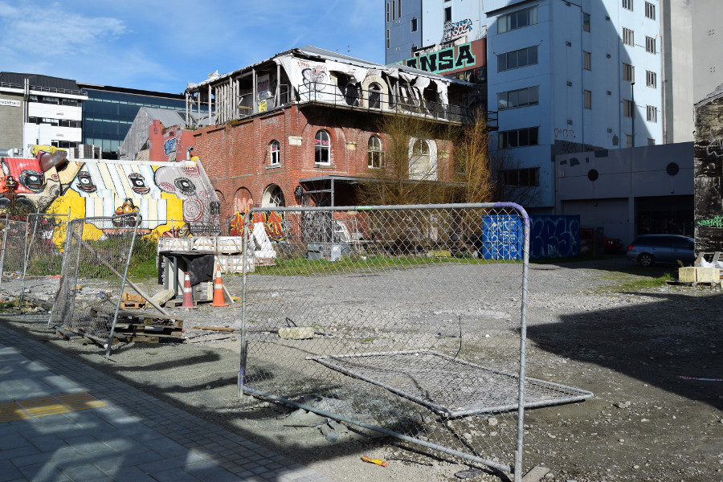
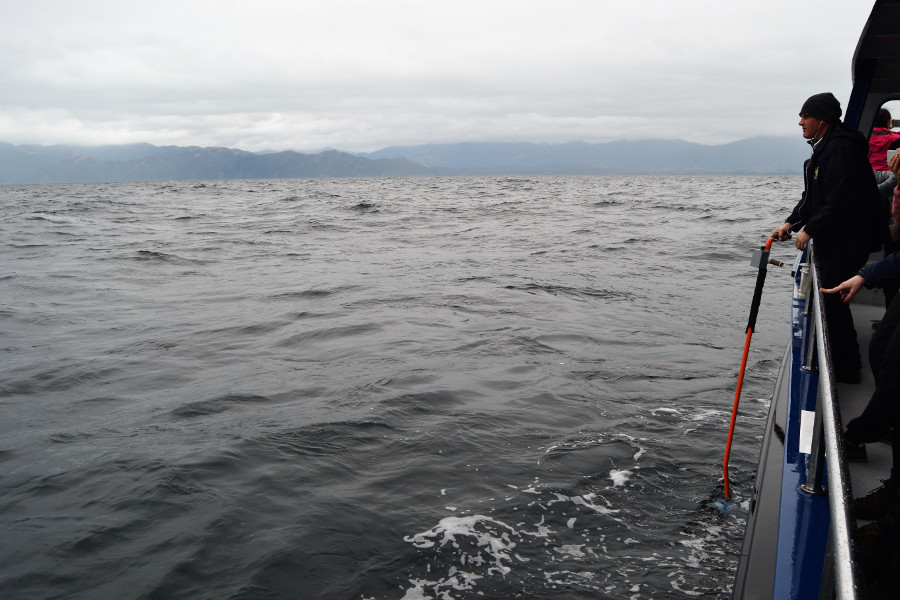
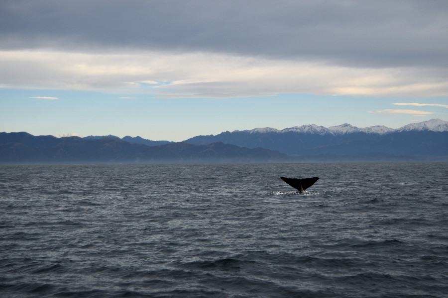
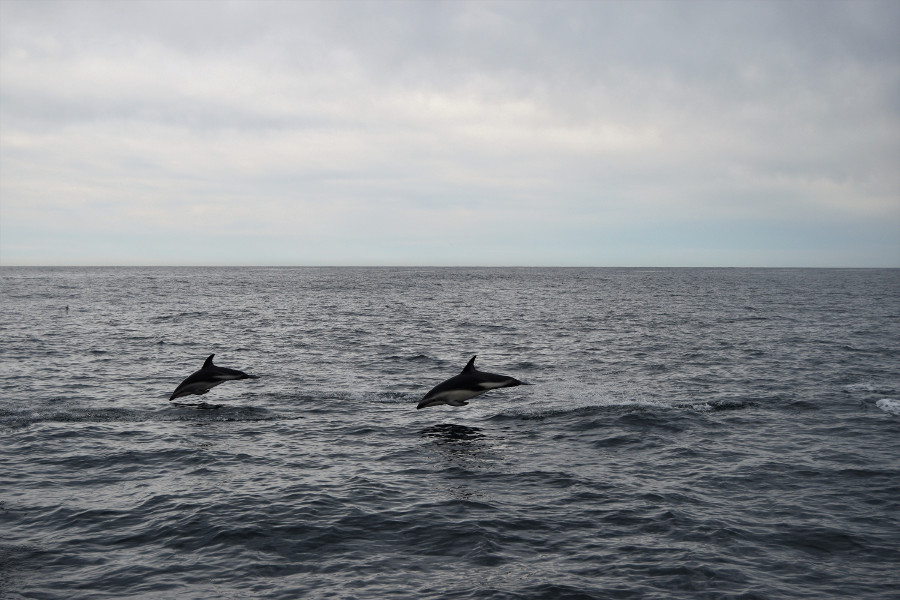
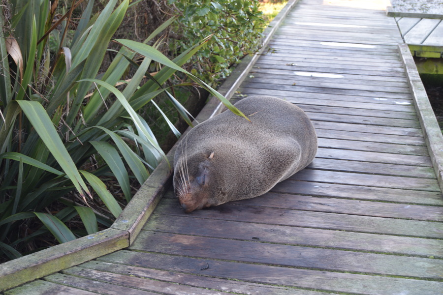
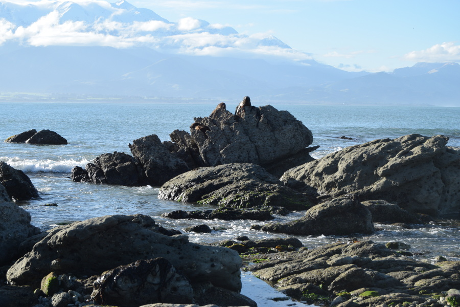
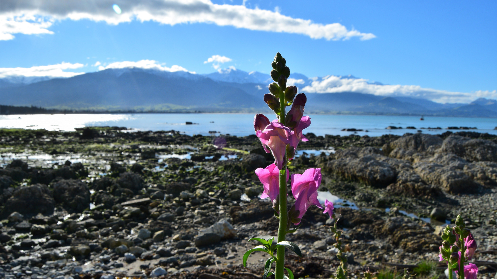

##Christchurch
After a roast pork and gravy sandwich (the most English place we could find to eat in Dunedin) at [Bacon Buttie Station](https://www.baconbuttiestation.com/), we caught our Intercity bus to Christchurch. This took around six hours to get there. We only had one day in Christchurch as we decided to lengthen our time in Kaikoura giving us a more opportunity to see the whales. This meant we had little time to explore the city, but a day was probably enough anyway. We stayed in [Around the World Backpackers](http://aroundtheworld.co.nz/) which was a converted old school and a little out of the city centre.

The city itself is still being rebuilt after the earthquake on Tuesday 22 February 2011, a magnitude 6.3 which caused severe damage in Christchurch and Lyttelton, killing 185 people and injuring several thousand. It is estimated that it will take 20 years to return Christchurch to the city that it was and the scale of the damage is evident even now. There was lots of scaffolding all over the city, lots of buildings being propped up and lots of land where buildings once stood, now being used a public car parks. The spire was no longer on top of the cathedral and it's boarded off like a derelict building. The most harrowing was the '185 White Chairs Memorial' to represent the 185 people who died in the earthquake; one of the chairs was a highchair, the other a baby car seat.

We walked the city, watched the tram drive by, paid a visit to Rememberence Bridge and North Hagley Park. We also walked to one of the suburbs to see Brockworth Street Art gallery, which was a little underwhelming after seeing some of the other graffiti around Europe and South America. As the city is being rebuilding, almost from scratch, there are lots of new quirky looking bars to visit so after a Thai meal we went to [Smash Place](http://thesmashpalace.co.nz/), although it was pretty dead on a Monday night.

##Kaikoura
Kaikoura is three hours from Christchurch and really we'd used Christchurch as a break up in the journey from Dunedin. We arrived in Kaikoura to cloudy and rainy weather which went into the morning of the next day, the morning we had booked to go whale watching. We stayed at [Dusky Lodge](https://duskylodgebackpackers.co.nz/) in the small township of Kaikoura, which is mostly just one main street. There wasn't much to explore so we mooched around the supermarket stocking up on our last western goodies and made the most of the log fire in the hostel.

##Whale Watching
The morning of whale watching was rainy and visibility across the sea was poor so we were pretty shocked that the boat wasn't being postponed. And of course, there were rough sea's and a sea sickness warning. After stocking up on @ease tablets and ginger and manuka honey sweets to try and curb any forboding sea sickness we checked in and boarded the boat. There is only one whale watching company in Kaikoura called [Whale Watch Kaikoura](https://www.whalewatch.co.nz/) and its $150 (£72)for a 2.5 hour whale watching tour. The staff recommended sitting at the back as the boat is a little smoother so we did. They really weren't lying when they gave the warning of rough sea's, the boat was rocking all over the place and the waves were so high that they kept covering the horizon line which I was desperately trying to focus on to avoid being sick. Around 10 people on the boat were sick which was horrificly unpleasant.

The captain of the boat drove us out to Kaikoura Canyon, where the water is around 1000 meters deep and where their resident sperm whales feed on squid. The captain used sonor equipment to listen to the sound of the whales and to try and track one down for us, the closest we got was after a plane radioed one in but by the time we got there the staff just saw its tail as it dived back into the deep water. The tour felt completely frantic and sadly after two and a bit hours, we had to give up and we were offered an 80% refund. As we had changed our bus back to Christchurch to 16:40 we had the next morning to try again so we moved the tour free of charge. The only catch was that the only boat that wasn't booked up was 07:15AM. We figured that although we'd be up early if we were unlucky enough to not see a whale again, we could at least book a flight in the early afternoon and try our luck from the skies.

The weather was much nicer on our second attempt and we were up early enough to see a beautiful sunrise! We were told the sea's were much calmer today but I still medicated up, just in case. We headed out to the boat and the staff told us that their brother vessel was already out in the ocean and had located a sperm whale, he had just been on the surface and gone down for a dive. The staff told us that the sperm whales dive for 45-60 minutes and come up to re-oxygenate for 10-15 minutes so we had a good chance of catching him come up for air. The sea was much calmer than the previous day and there was loads more wildlife around. As the boat stopped and the captain tried to track the whale we saw loads of albatross and other sea birds. The captain told us he could hear the whale clicking, which meant he was hunting. Once it went silent, the staff told us to look out for the blow in the ocean. It wasn't long until we saw the top of a whale spurting out water. It was a really overwhelming moment after waiting around 3.5 hours in total to see one of these huge animals out in the ocean. We watching him for around 10 minutes blowing air out of his blowhole, with a snowy peaked mountain range in the distance and the sun still rising. It was so idyllic and the complete opposite to our experience the previous day.

After the whale had dived back under and everyone had 'the picture' of his tail out of the water before he went back in, the captain drove us out to find a pod of dusky dolphins. The pod was really scattered but there were hundreds of them showing off, jumping in and out of the water and chasing the boat. Not only were there dolphins but the seals were also putting on a show for us too jumping out of the water or chilling on their backs bobbing about in the water. There was a boat where people were swimming with the dolphins and seals; we thought they were really brave given how cold it was!

##Kaikoura Peninsula Walk
After the unsuccessful whale watching tour, the weather brightened up immediately after we had come back to shore and we decided to do the 3-4 hour hike around the Kaikoura Peninsula. We walked along the black beach and had a look around the old marina and there were the odd fur seals dotted around on the rocks. After around an hour or so of walking we reached the Kaikoura fur seal colony. We literally stumbled across them, as we turned the corner there were two seals sleeping in the sun on the path.

There were signs everywhere saying stay 10 meters away from the seals as they can attack and we'd read not to get between them and their route to the sea. However, we saw very stupid tourists standing around 1 meter behind the seals to get their selfies. As the tide was out the rocks went out some distance and there were some people quite far out so we had a wander out to where there were even more seals. The rocks were quite slippy and there was clearly a channel at one part as we had to step over some puddles of water. Concious that the tide might come in we had a quick look at the seals on either side of the rocky area. However as we headed back we realised the tide had been coming in and the channel was filling up. It had filled up so much that there weren't enough rocks surfacing the water for us to hop across. Our only option was to walk through the sea with our boots on.

After panicking and reaching the other side, we both had very squealchy shoes so decided to head back to Kaikoura the way we came rather than walk up the hill on the peninsula for a view and back around the other way. Definitely an adventure and the closest we had managed to get to the exceptionally cute fur seals!

##Our Verdict on Christchurch & Kaikoura
We didn't spend long in Christchurch but it's somewhere worth a bit of time. We did want to visit [Quake City](https://www.canterburymuseum.com/whats-on/quake-city/) but it cost $20 entry so decided against it. Kaikoura was another of my favourite places on the South Island; our second attempt at whale watching was incredible and definitely something I would do again!
