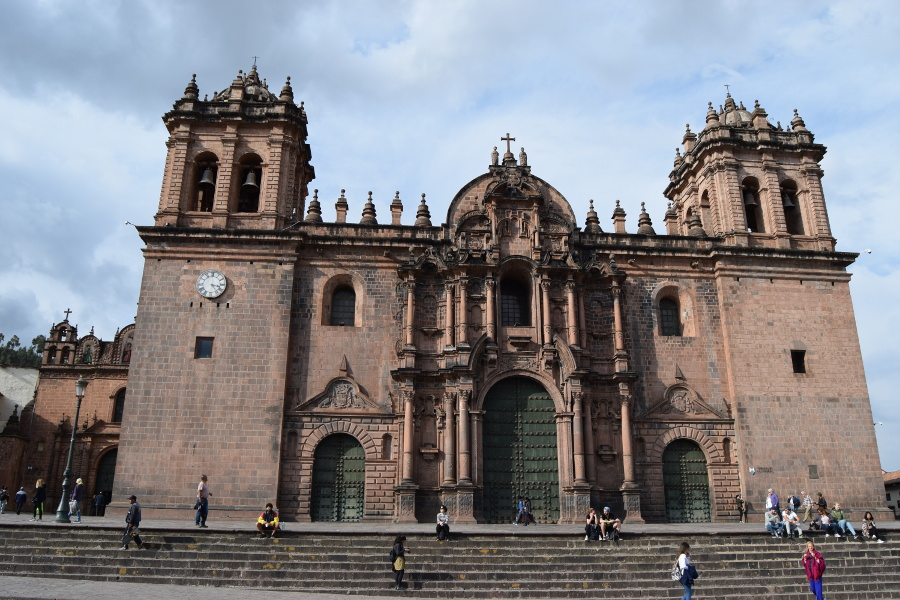
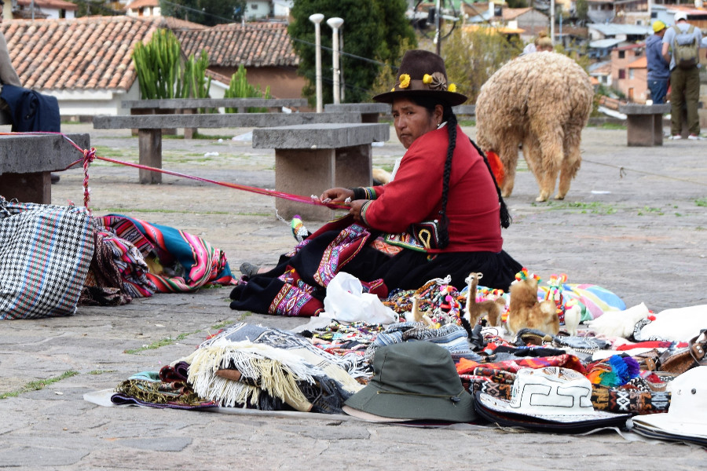
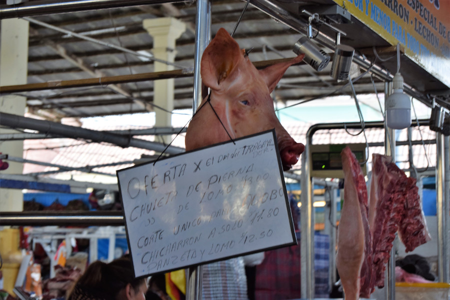
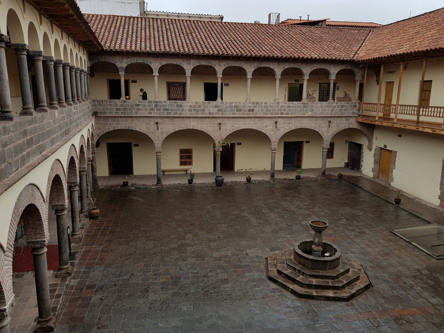
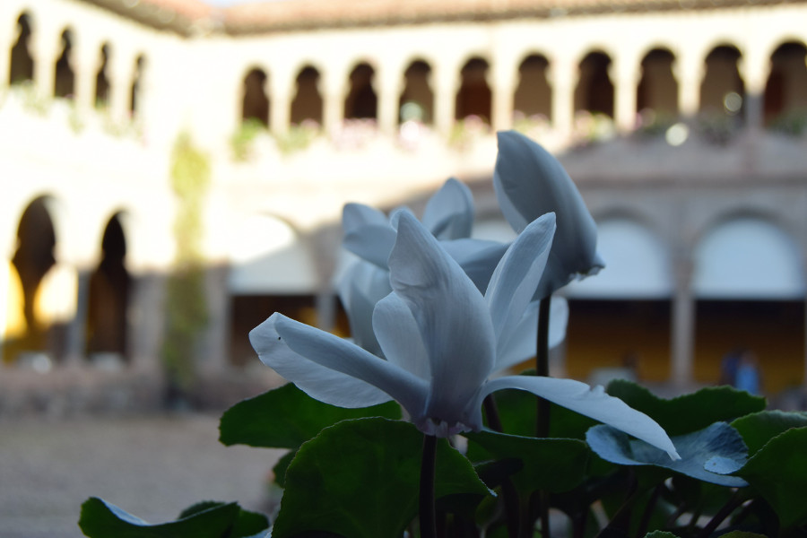
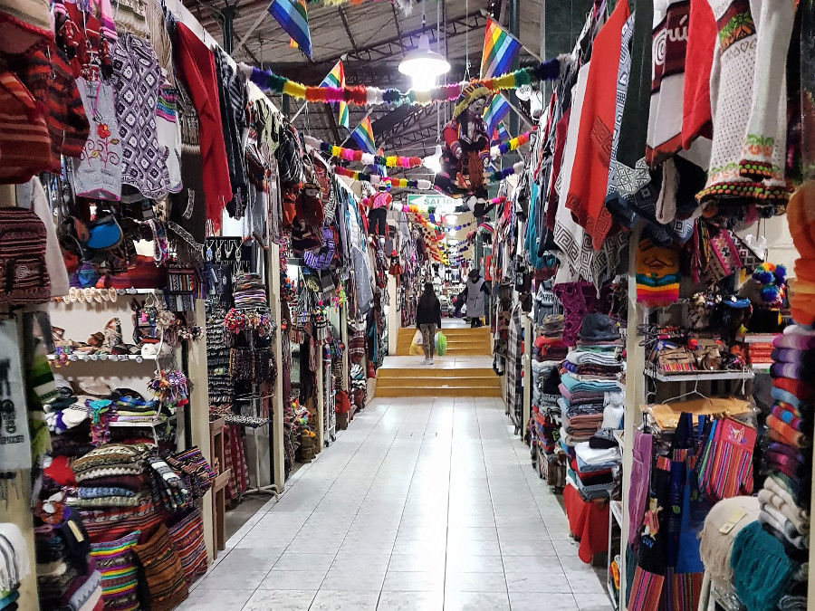
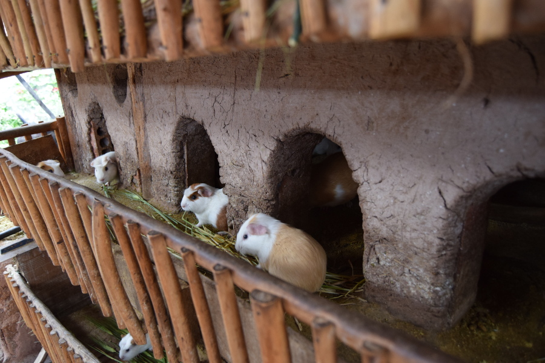
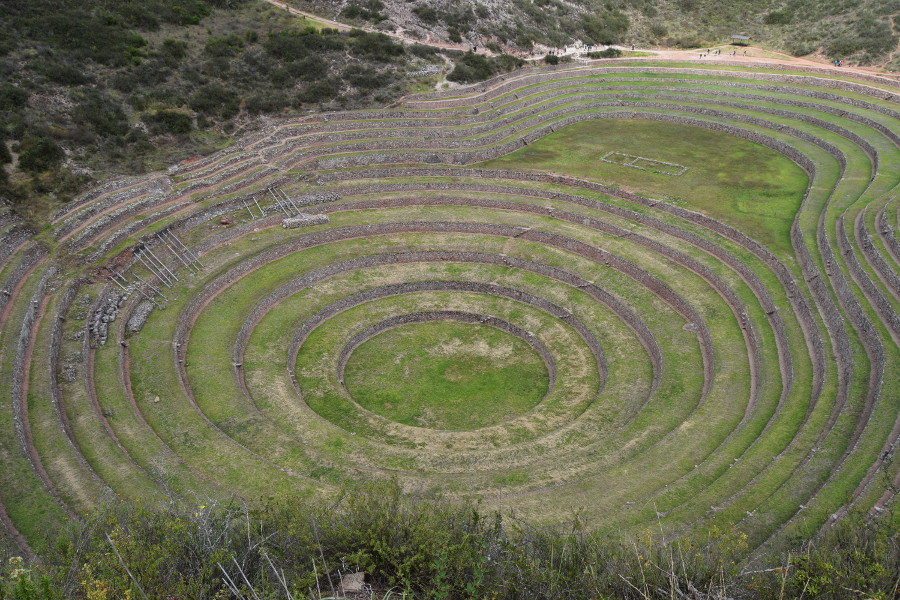
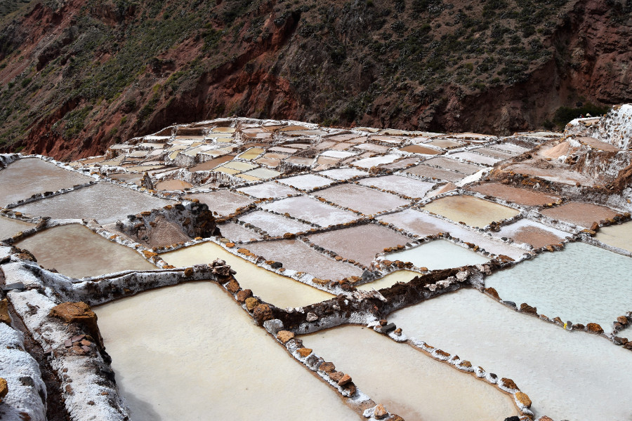
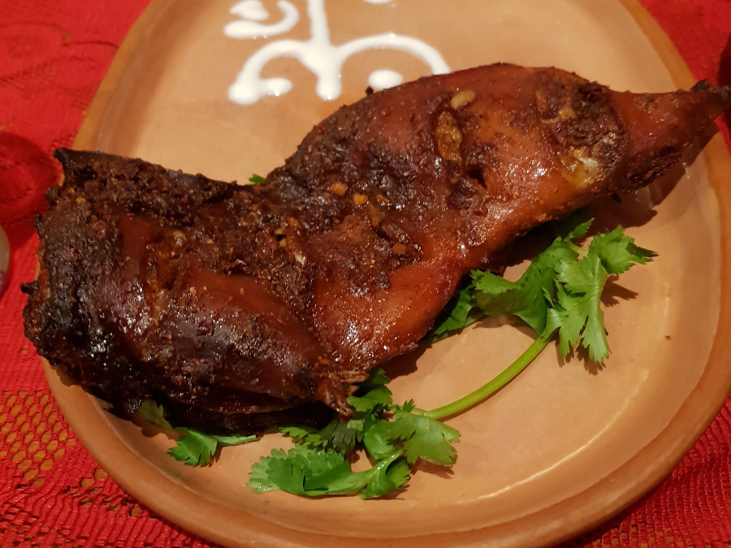

>"The word that most perfectly describes the city of Cusco is evocative. Intangible dust of another era settles on its streets, rising like the disturbed sediment of a muddy lake when you touch its bottom."

Che Guevara

##Cusco City
Cusco is a really charming city, it sits in a valley surrounded by hills with a huge Plaza de Armas and lots of cobbled narrow streets in the centre. We arrived on an overnight bus from Arequipa with [Cruz del Sur](http://www.cruzdelsur.com.pe/) for £29, pricey for Peru but it was the best overnight bus we’d been on so far! We had our own TV, choice of movie and a VIP lounge in the bus station which included sofas and a clean toilet. We stayed in the Santiago District in a hostel called [Tayta Wasi](http://hostelincusco.com/), it was a big room with hot water, at £7 each a night it was great value for money too!

On our second day in Cusco we did a free walking tour. The guide talked a lot about the Spanish conquest; how the people that had been living in Cusco at the time had been a civilised nation but that the Spanish did not portray them in this way. He said the Spanish described them as naked savages but he pointed out in Cusco it’s too cold to be naked. Cusco was the centre of the Inca Empire which stretched from Colombia to Chile. The guide explained why llama were so important; they can carry 60kg and walk all day so without llama the Incas would not have been able to conquer their territory so quickly. The guide was passionate about Cusco's history but even more so about football in Peru. He said that their best player was Guerrero but he had been suspended for taking a banned substance. His suspension was under appeal which would be decided before the World Cup squads could be announced but they were hopeful Guerrero would be available for selection, he acutally received a 14 month ban (FYI, Dan added this bit in).

We were going to visit a white Jesus statue at the top of the hill but we were told it was S./130 to visit by the couple from New York we met on the Inca Jungle. We later found out that this wasn’t the case and it was free to visit, but it was too late to go up there by then. Instead we visited San Cristobal Church for a view of Cusco City. It took us a while to hobble up the stairs to the church as our legs ached from Machu Picchu and we continued to hobble about for four days after. There were a few llama and some ladies selling their crafts at San Cristobal, it was nice to sit somewhere peaceful and watch the city below.

##San Pedro Market
San Pedro is a market in the middle of Cusco city, it was designed by the same man who designed the Eiffel Tower, Gustave Eiffel. However it's definitely not as impressive! The market contained mostly food; fruit, vegetables, medicinal plants and unrefrigerated meat! We thought it was horrific until we later drove through a street full of dead pigs for sale.

We also visited San Pedro on our walking tour; the guide told us about a cactus plant, Hauchuma. People who live in the Andes believe Huachuma can help cure almost all mental health problems. He explained that people who live in the mountains use natural plants and rarely visit the doctor. People take Hauchuma just before they go to sleep and then have very vivid dreams due to the plants hallucegenic properties. When they wake they are cured of things like depression, anxiety, doubts and have answers to their questions about life.

##Casa Concha Museum
Casa Concha Museum is in an old colonial building in the centre of the city. It contains items from Machu Picchu that were collected by Hiram Bingham, not the first person to find it, but the first to make a scientific discovery of it in 1912. The Peruvians we met evidently disliked Hiram Bingham and referred to him as a ‘treasure hunter’ not as a scientist. They believe that he stole the Inca Gold that would have been buried with the mummies in Machu Picchu, as lots of Inca Gold later arrived on the black market.

The information in the museum put a lot of what we had seen at Machu Picchu in context. The Museum also had information about how the Incas shaped babies skulls as it was more desirable for their skulls to be long, and there were human bones among the pottery on display. There were lots of chicha cases, something we are yet to try! The Incas were apparently big fans of alcohol and made beer from corn. They fermented it by chewing the corn and spitting it into a big clay vase. Apparently it’s not made like this anymore but people still drink chicha.

The museum explained that scientists believe that Machu Picchu was a country retreat for the Inca King and his family. They believe that it wasn’t an important place as the Spanish did not destroy or build on top of it, as they did everywhere else, and it is not on a main route of the Inca Empire.

##Qorikancha

This was the most important temple in Inca Empire, it’s a Quechua word meaning gold enclosure. It was originally a temple dedicated to Inti, the sun god but was destroyed and looted during the Spanish conquest. It’s foundations were used to build the Church of San Domingo.

There wasn’t much to see actually inside Qorikancha in regards to the Incas; it was full of religious art from the church. However the stone blocks forming the part of the building of the Inca Temple was similar to those we had seen of the temples of Machu Picchu.

##Shopping
There were so many colourful llama items in Cusco and it was so cheap; S./25 (£5.65) for a jumper, S./5 (£1.13) for socks and S./50 (£11.30) for giant blankets, we couldn’t resist and in the end brought so much we had to pay to post most of it back home in a box!

##Chinchero, Maras & Moray
Chinchero, Maras and Moray are all outside of Cusco and we visited them on a day trip. The first stop was Chinchero where we visited an indigenous family; they showed us how they cook and make textiles. Dan and I were really distracted by the guinea pig hutches which were full of the squeaky creatures, not kept as pets but for food! They are raised for at least six months before they are eaten and guinea pig is (an expensive) local delicacy.

Moray was a site used by the Inca’s as a laboratory to test where vegetables, fruits and medicinal plants grow best. It consists of rings that get higher and higher which changes the temperature and the altitude. The guide explained that the Incas grew different things at different heights using different types of soil so they knew where best to grow their crops.

Maras is a salt mine that is still working today and provides most of southern Peru with its salt. The salty water, which has a higher content of salt than sea water, it is believed comes from a volcano as it is also warm, but this isn’t known for definite. Families own pools in the mine and can get hundreds of kilos of salt out of a pool in a year. The different colours are down to the content of salt and this is dependent on the water evaporating by the sun. The mine was used in Inca times although it is believed that was not as big as it is now.

##Food & drinks
We discovered Peruvian food in Arequipa but it just seemed to get better and better. Our first stop was [Jack's Cafe](http://jackscafecusco.com) which was in Cusco six years ago when I first visited, they do the most amazing breakfasts. We went there twice, once for a full English and once for American Pancakes. We ate at [Los Todos Pollo](http://cuzcoeats.com/pollo-la-brasa-urban-perus-favorite-food/) twice too, a place where you can get a massive 1/4 chicken and chips for S./16, just under £4, Dan's favourite! We had a curry at [Korma Sutra](https://www.facebook.com/KormaSutraCusco); Alpaca chilli and mango which was delicious and we tried their tandoori fried cuy. The meat was a little chewy; like chicken thigh and luckily the guinea pig didn’t have a head! We had Peruvian Chinese at [Kion](http://www.cuscorestaurants.com/restaurant/kion/) which was probably the best meal we’d had so far in Peru, arroz chaufas and spicy noodles!

Again we had more than our fill of Pisco Sours as there seemed to be happy hour everywhere all day! We went to [Mama Africa](https://www.theonlyperuguide.com/peru-guide/cusco/nightlife/mama-africas/), a club that offered free salsa lessons, but again Dan couldn’t be convinced to dance salsa. However, we did go there after a bit later on; people were dancing on the bar to reggaeton music and had their faces painted. We definitely have a song of South America now too.

<iframe width="560" height="315" src="https://www.youtube.com/embed/sGIm0-dQd8M?rel=0&amp;controls=0&amp;showinfo=0" frameborder="0" allow="autoplay; encrypted-media" allowfullscreen></iframe>

##Our Verdict on Cusco
We loved this city and we were gutted we couldn’t spent longer there. There were so many things we didn’t have time to do; a tour of the Sacred Valley, Sacsaywaman, Rainbow Mountain and there were lots of churches and museums we didn’t have time to explore. Cusco, we’ll be back!