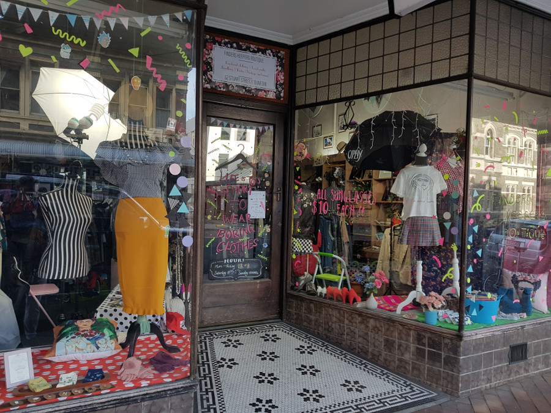
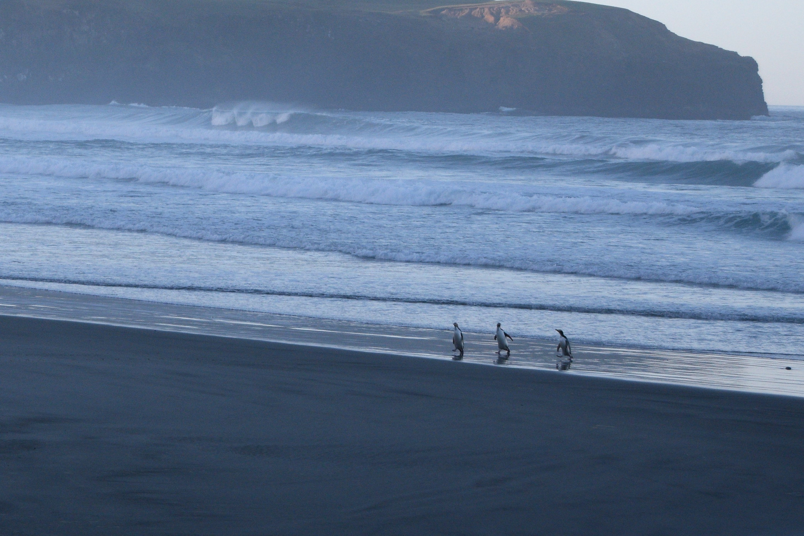

>"I gotta say God really outdid himself down here..."

Bob Harper.

##Dunedin City
The Intercity bus from Queenstown to Dunedin took around six hours and it was less luxurious than the Great Sights buses we had been on along the west coast. Dunedin was different to other New Zealand cities, it felt much older than others like it was stuck in the 1990s. It reminded us of the UK, especially when we walked past the towering Cadbury Factory, the railway station and a shop selling Scottish souvenirs. Dunedin was founded by the Scottish Free Church in 1848 and was built to be the Scotland of the south, which explained a lot.

We had three days in Dunedin, so once we had checked into [On Top Backpackers](https://on-top-backpackers-nz.book.direct/) and Dan had gotten over the excitement of the free pool tables downstairs, we headed out to explore the city. We did a self-guided graffiti walk in the city, a lot of this was in the more industrial part with the garages, art workshops and charity shops. Dan decided to buy the Lord of the Rings Triology (the book!!) in a second hand bookshop.

In the centre there were a lot of bars and it was evident that Dunedin is a student city. There were also a number of vintage shops, which were giving the bits that they couldn't sell away for free!

##The Settlers Museum
On one of our days in Dunedin, we headed to [The Settlers Museum](http://www.toituosm.com/) to learn the history of the area. The [Otago Museum](https://otagomuseum.nz/) was quite far out of town and other than catching a bus to a beach or a hill in the suburbs, there wasn't a lot else to do. The museum was interesting, but given that we had visited Te Papa and now had a good understanding of New Zealand's very brief history, there wasn't much in there that we hadn't already read about before. It was definitely worth a visit though even to see the exhibitions of old vehicles and household goods.

##Wildlife Encounters Tour
Penguins were the entire reason we had planned to go to Dunedin. There are penguins all along the coast but Dunedin was the easiet to reach without forking out more money for the [Bottom Bus](https://booking.headfirsttravel.com/bottombus/) to explore the very south of New Zealand. We booked with [Elm Wildlife Tours](https://www.elmwildlifetours.co.nz/) and we were picked up at 13:00 in a minivan with three other people and driven out to the coast. Our first stop was to see the royal albatross who come to the coast near Dunedin to lay their eggs. Our guide pointed out a number of other birds on the way and we saw a family of kingfishers, around 7 altogether in a tree and along a fence.

The guide told us that the family who used to live in the lighthouse ate the first albatross eggs, when they first came to New Zealand to lay their eggs, but then realised that it was a special bird and the area is now a preserved conservation area. The edge of the cliff where the albatross lay their eggs wasn't accessible without a guided tour, but we did wait around for about an hour to see if we could see one flying. Sadly it wasn't our lucky day and we left after seeing hundreds of seagull and some shags nesting in a different cliff face.

We then headed to the area to see fur seals, sea lions, yellow-eyed and blue penguins. The guide told us that the beach belongs to two farms who have given them access to the beach. There were lots of fur seals lying on the rocks; all mothers and their pups. One was wailing and the guide told us that the seals mothers will go out to sea to hunt and leave the pups on land in the colony. She pointed out that the one crying was skinnier than the others so it was likely that its mother had not returned. The baby seal looked really distressed and approached another mother who had her pup; the mother barked and chased it away. The guide told us that the baby seals will try and go to a different mother, but they won't have it. Basically, the baby seal was going to starve to death. Alone. I was heartbroken.

We walked further down to the beach and as we walked across the dunes we were able to get about a meter away from the sleeping sealions. The guide explained that they are all males and they wait on the beach to hunt the penguins. It wasn't long before a yellow-eyed penguin came in from the sea. He had a good look around for the sealions and did a wide walk around them on the beach before ducking under the fence to go to his nest. The guide told us that the penguins are really good at spotting the sealions and they walk around a kilometre up the hill into the farm to their nests.

At the end of the beach was a viewing hut with lots of nests for blue penguins around, these are the smallest penguins in the world but they don't come back into land until dark so our chances of seeing one were basically nil. Up on the cliff were a number of yellow-eyed penguins who had all come in after a day of hunting and they were oiling up their feathers with oil from a gland near their bums. We saw around 8-10 of them come in, usually in groups of 2 or more and they came in as far from the sealions as they could. We watched a lot of them hop up the cliff face to go to their nests and as we walked back to the bus we saw that some of them were in the field with the sheep! The guide said that the lambs often get curious of the penguins and will go to explore their nests; until the penguins bite them on the nose!

##Our Verdict on Dunedin
Dunedin gave us a taster of some of the wildlife in the south and had we had a car we definitely would have ended up driving further south to Oamaru to see the blue penguins come in from the beach and down to the Caitlins. There were also some dark sky reserves nearby which we missed out on visiting to see the stars (and possibly the southern lights) as we were car less! Definitely another place where we felt limited on public transport, but Dunedin was definitely worth a visit!
