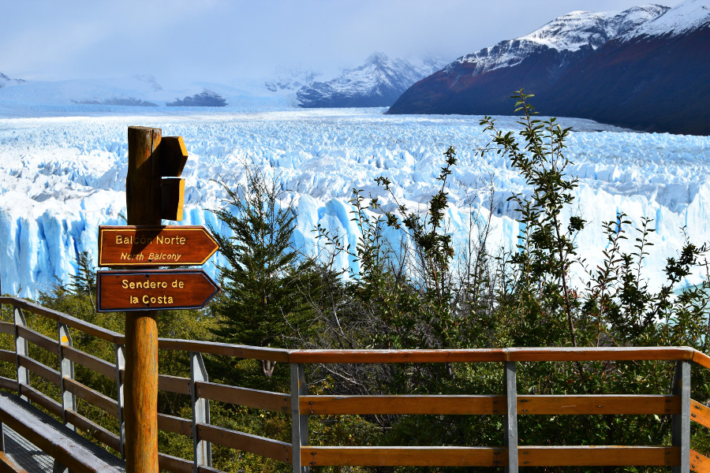

##El Calafate

El Calafate is a small city in Argentina which seemed to be made for tourists. The main street 'San Martin', which is the name of all the main street's in Argentina, was full of bars, restuarants, tour agencies and souvenir shops. Many of the shops looked like they belonged in a ski resort, made from glossy wood and filled with woolly jumpers. Again, there wasn't much to do in the city unless we were prepared to pay £50-100 for day trips on boats and to the surrounding areas.

 We tried to visit Laguna Nimez Reserve, a park full of local birds including Chilean Flamingos that was relatively cheap. It was walkable from the city, but when we got there it was both flooded and closed. We walked around the fence and we reached the edge of Lago Argentino, the biggest freshwater lake in Argentina. Many of the locals were fishing along the edge of the water but the wind was so cold we decided not to hang around. The [El Calafate Historical Interpretation Centre] (https://www.welcomeargentina.com/elcalafate/calafate-interpretation-center.html) was on the way back, but at £6 to walk through a shed and see some dinosaur bones, we decided to save our pesos for happy hour later in the day.

The dogs in El Calafate were different to any of the dogs we’d seen so far in South America. They roamed the streets, some with collars on and we struggled to work out if they were people’s pets or strays. After a bit of research we found out that they were strays but the local people look after them, feeding them, leaving water bowls on the streets and paying their vet bills. The dogs seemed to have territories, they were really playful and just wanted to be fussed. A cute Labrador had adopted our hostel, he just wanted to play fetch constantly with the sticks and pine cones he'd find in the streets. He saw us at the Historical Centre and walked us back to the hostel, he kept turning round to make sure we were following him, so we had no need for google maps!

##Food & Wine

We ate our first Empanadas in El Calafate, a stuffed pastry filled with meat. They were delicious and we were gutted we'd been missing out for so long. Being back in Argentina also meant better wine and Dan managed to find [La Zorra Taproom] (http://cervezazorra.com/), where he was content sampling the honey beers and stout.

##Parque Nacional Los Glaciares

The Perito Moreno Glacier was the main reason that El Calafate was on our itinerary and why we had picked staying here over El Chalten, which was a little further north. The glacier is located in the Parque Nacional Los Glaciares which was around an hours drive away from the city. There was no public transport that went there so we had to suffer the $600ARS (£21) bus there and back. The bus dropped us around 10:30 and collected at 16:00, so we took our time walking around the park.

The park was quite small in comparison to others we'd visited, with three trails offering different views of the glacier. The trails were on metal walkways which meant that they were really easy and didn't take long at all.

Before we could even see the glacier, we heard it. As chunks of ice break off and hit the water, they make a thunderous noise which ecchos through the park. We could also hear the ice cracking and creaking in the glacier. The glacier itself was impressive. It moves 2 metres a day and is one of the only glaciers in the world advancing not retreating. After a few hours of watching the ice break off the glacier, with numb fingers and noses, we admitted defeat and went to the cafe to warm up with a crap coffee and wait for the bus back to the city.

##Bed bugs

We stayed in [Bla Hostel] (http://www.blahostel.com/) in an 8 bed dorm, which was again full of snorers. We struggled to recall a night in a dormatory where we had had a decent nights sleep without someone waking us up in the early hours with their snoring.

Problem one with the hostel was that there were two communal toilets for 50 guests, cleaned once a day. Often there was no toilet roll, soap and they were blocked. Second problem, lack of windows. The dorm we stayed in had a window that didn't open and the heating on full blast - not sure why as it was around 12°C outside. It made the room really stuffy and gave me a sore throat. Third problem, bed bugs. After we had checked out we heard two Aussie guys, who were staying in a different dormitory, having a go at the receptionist as one of them was covered in bites. His mattress had bed bugs and the hostel had left the infested matress in the hallway! Being ridiculously paranoid we grabbed our bags and left spending the time waiting for our flight in a cafe rather than in the hostel.

We were so paranoid that when we got to our next destination we checked through our bags and the seams of our clothes for hours with our torches to make sure we weren't infested with bed bugs too. Luckily, we had a narrow escape, for now!

##Our Verdict on El Calafate

Perito Moreno Glacier was absolutely stunning and made our time in the small city of El Calafate worthwhile. However, our stay was tinged with the paranoia of catching bed bugs which meant we were happy to be moving on.
