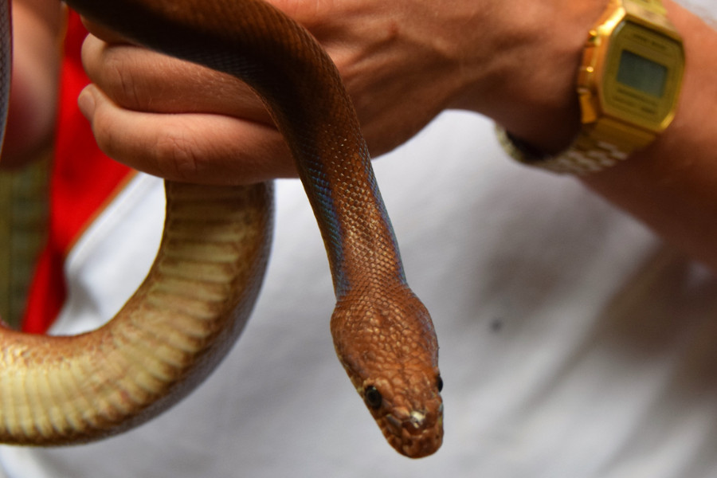
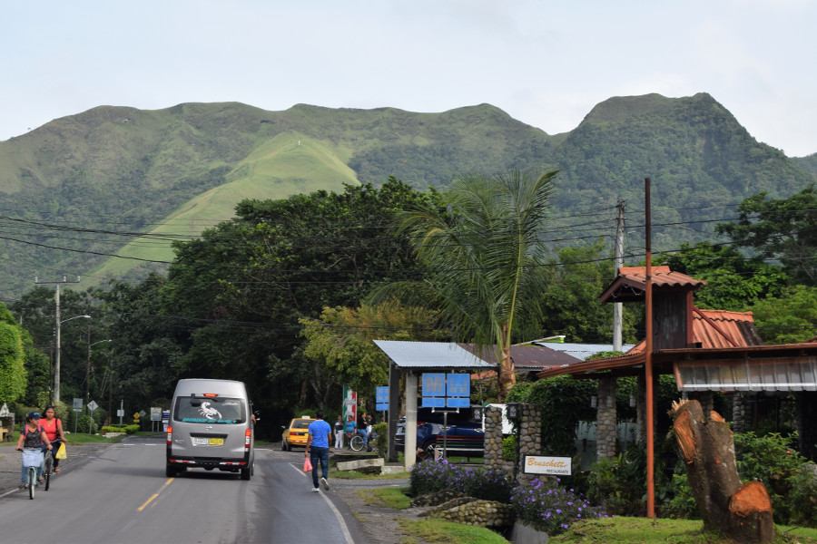
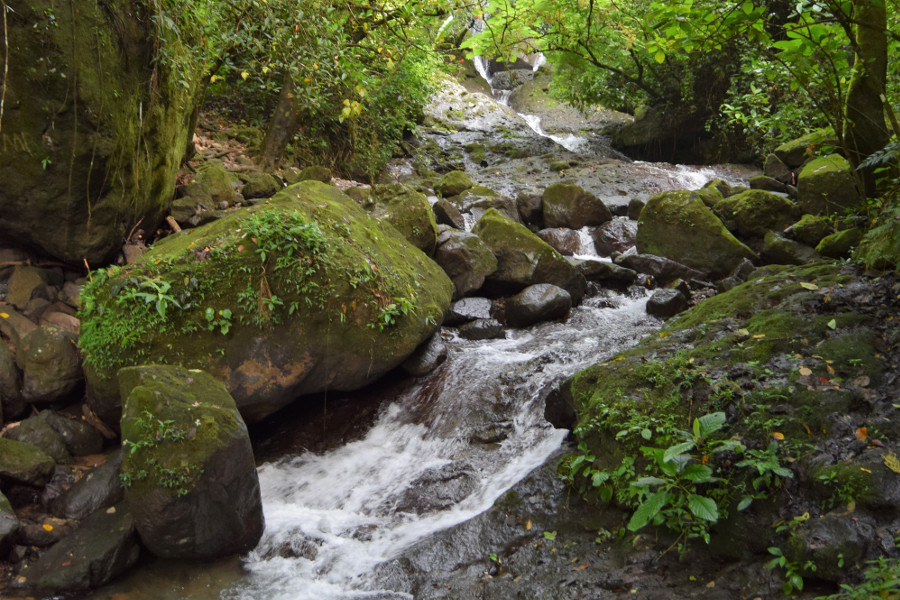
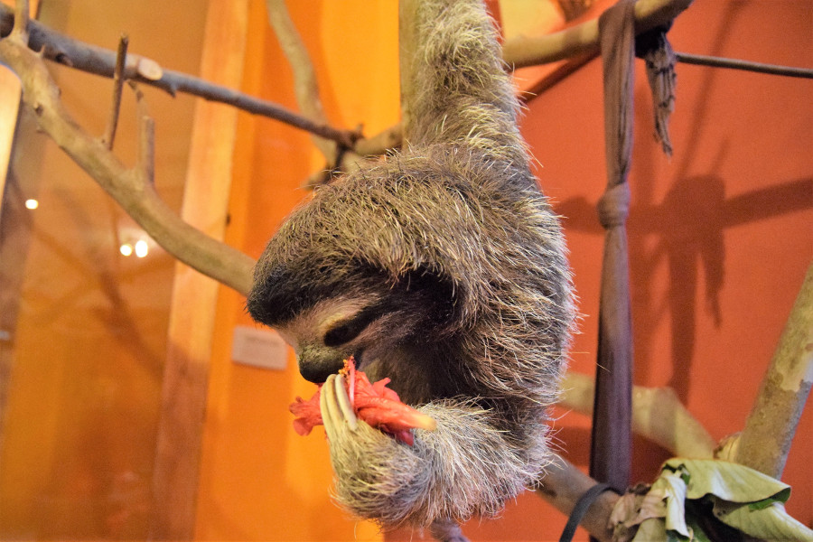
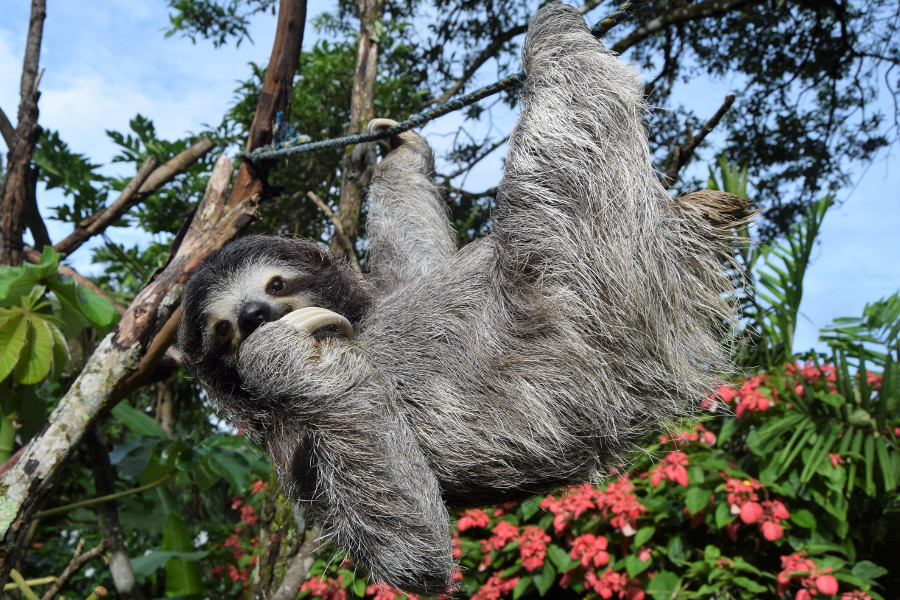

>"Green is the prime color of the world, and that from which its loveliness arises."

Pedro Calderon de la Barca

##El Valle
As it was the end of term for Nick and Char and they were heading back to the UK on the 4th July, Dan and I booked to stay in [Mamallena Hostel](http://www.mamallena.com/) in Panama City for our last few days there. Mamallena wasn't in a very nice area of Panama and the style of the hostel made it feel more like we were by the coast than in the middle of a bustling city.

We decided to go to El Valle for a couple of nights and caught the bus for $4.25 (£3.22). Nick and Char decided to join us for a night as we'd decided to do a hike they hadn't yet done . It took 2.5 hours to get there from the city and we were plesantly suprised as to how quiet and green it was; El Valle turned out to be a beautiful town in the middle of a dormant volcano crater. We stayed the first night in [Bodhi Hostel](https://www.bodhihostels.com) with Nick and Char and made the most of the hostels pancake breakfast and delicious smoothies.

##El Serpentario
We had planned to rent bikes and go to a waterfall nearby but as the weather was threatening to rain, after having a look around the local market we headed to the Snake Zoo rescue centre. This was only around a 20 minute walk from the hostel and cost $3 to enter. It wasn't a very big rescue centre, with a few caiman, turtles and a lot of snakes. The guide told us that sometimes they have rescued sloths there too but at that time they didn't. He showed us some of the different types of snakes and showed us two vipers, fer-de-lance, the most deadly snake and the most common in Panama. The guide let us hold a rainbow snake which they call Lola and have as a 'pet'.

##La India Dormida
We'd planned to do the hike up to La India Dormida which we had been told would take a few hours and was pretty steep. We set off at 08:00, so that we had a better chance of good weather and so that Nick and Char could head back to Panama City.

The hill has the name La India Dormida as the crater is shaped like a sleeping woman. The hike up wasn't so bad and took around an hour; it was slippy on the rocks and the wet clay, mostly we were lucky that there wasn't heavy rain as it would have made the walk down much worse.

The view from the summit was stunning, we could see all of El Valle and surrounding valleys. We spent some time up on the rocks near a sheer drop and walked around the ridge of the old dormant volcano, before heading back down.

##Casa Mariposa
A lot of people had recommended staying the night at [Casa Mariposa](http://www.casamariposaelvalle.com), a gueshouse owned by Ursula and Harry, a Swiss lady and a guy from Colombia. They have two rescued sloths that live in their house which guests can interact with during their stay. A year ago the two sloths had a baby, who also now lives with them. It cost us $55 for the night plus tax, so wasn't the cheapest place we had stayed but it was worth every cent.

After the La India Dormida hike, the heavens opened and it didn't stop raining until the following day. Harry told us that the sloths are more sleepy when it rains but he would fetch us should they wake up. At around 17:00, he told us he had fed them but they hadn't really got up but said we could come and have a look anyway. Luckily, the baby sloth was curious and came out from behind the sofa to see what was going on. Harry told us we could feed her some flowers, which was the equivalent of chocolate to sloths. He told us that the ropes and branches extend throughout their house so the sloths can go whereever they like. He showed us some bells on the doorhandles and told us that the mother sloth was really clever and had worked out how to open the doors, so they have had to put bells on them so they can hear at night if she tries to get outside.

The next morning we got up early, hoping that the sloths would get up in the morning sun and to make sure we caught a bus back to the city early enough to get back in time for the England vs Colombia game. Harry brought the baby and father sloth out and said that they needed to use the toilet, which they only do once a week. He put them in the trees, they climbed down and hid in the bushes for privacy to use the toilet. We fed them more flowers on the branches before they started to make their way back inside. We were surprised by how soft their fur was as it looks really course and how gentle and clever they were.

##Our verdict on El Valle
We loved El Valle, it was quiet and lush green. Sadly, we had terrible thunderstorms just after we had finished the La India Dormida hike which meant that we weren't able to expore the local countryside any further. However, we would definitely recommend to anyone visiting Panama to make some time for El Valle and to spend at least one night at Casa Mariposa.