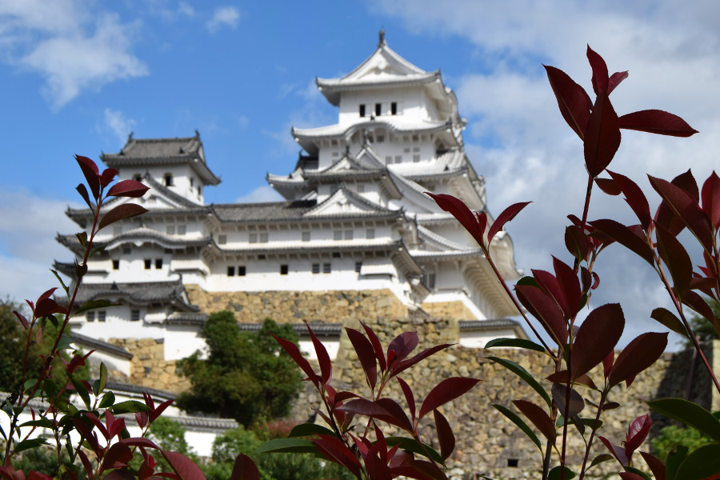
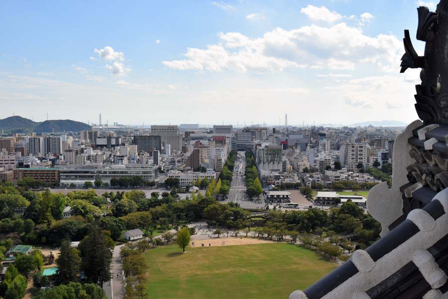
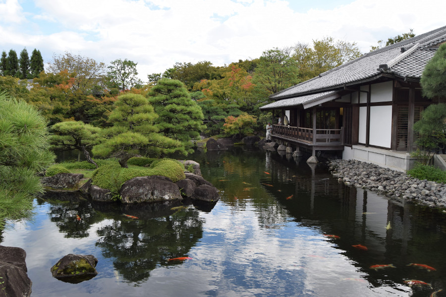

##Himeji
We broke the journey up from Kyoto to Hiroshima with a nights stay in Himeji. We arrived in the early afternoon and headed straight for its main attraction, [Himeji Castle](https://en.wikipedia.org/wiki/Himeji_Castle). The Castle is a UNESCO world heritage site and national treasure; it’s nickname is white heron castle and it’s widely considered to be Japan’s most beautiful castle. Despite Himeji being bombed and completely flattened during World War 2, the castle was never hit, nor has it been destroyed by earthquakes or fire. We paid 1040¥ (£7) to enter the 400 year old castle, it’s grounds and the neighbouring garden Koko-en.

The castle itself is made of wood and we had to remove our shoes and walk around barefoot as the shogunates and samurai would have 400 years ago. There were seven floors in the castle with steep steps up to each one, and although we could see some of the stone drops and places where weaponry used to be kept, the rooms were bare with no furniture. However, right at the top there was a great view of Himeji. We were also able to walk through the west bailey or Nishinomaru, where the princess would have lived. Dan downloaded the Himeji Castle App and at certain points he could scan the QR codes and there were stories and interactive video about some of the history of the castle. One that stood out was about Princess Sen. She was forced to marry at the age of 7 to Toyotomi Hideyori, 12 years later she was rescued from the burning castle but her husband perished. She was remarried to Honda Tadatoki who died 10 years later. She has a son with her husband who died when he was 3 years old. It is said that the ten years with her husband in Himeji Castle were the happiest of her life and after her family's death she became a Buddhist nun for the remaining 40 years of her life.

We had a walk around the Koko-en gardens but as it was autumn, not much was flowering. There were some typical Japanese bridges and Koi in the ponds but other than this, there wasn’t much to see. There also wasn’t a lot else to do in Himeji, apart from visiting a very small zoo. We had an ice cream on the way back to our hotel, [Himeji Plaza Hotel](https://www.booking.com/hotel/jp/himeji-plaza.en-gb.html), Dan tried a chestnut or marron flavoured ice cream. I asked if it tasted like Christmas, he said it tasted like ice cream.

##Our verdict on Himeji
It was definitely worth a visit to see Himeji Castle, however, in hindsight we should have locked our bags in the train station for the day and carried on with our journey as there really wasn't much else to see or do in Himeji.