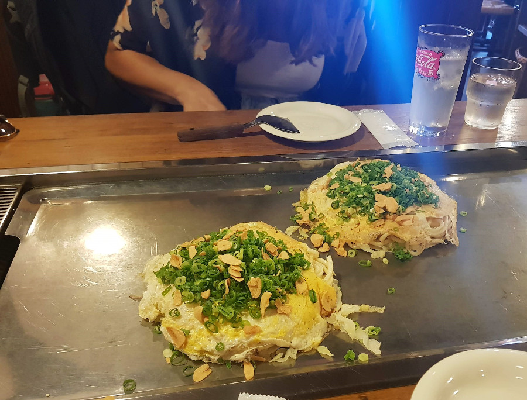
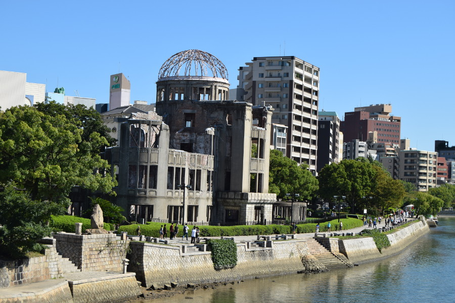
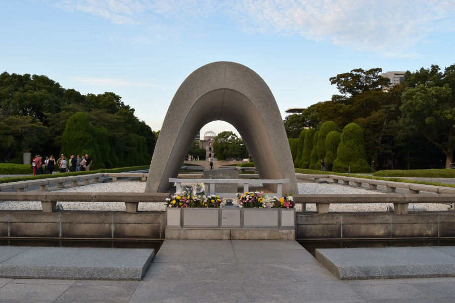
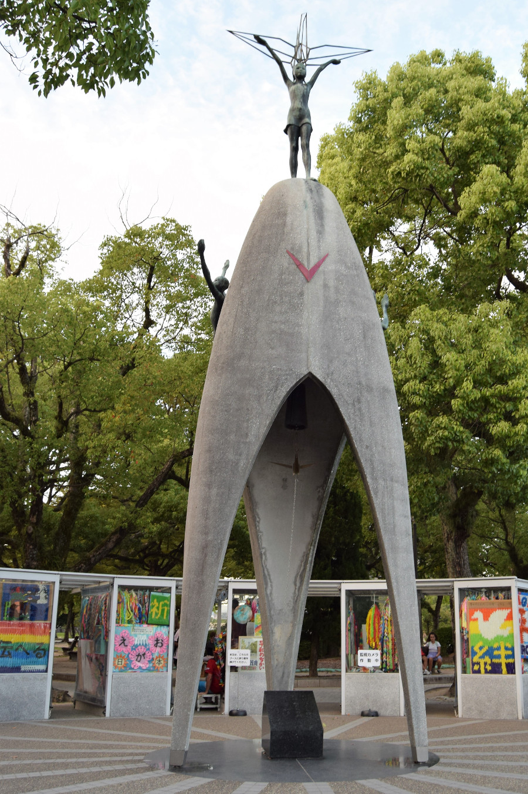
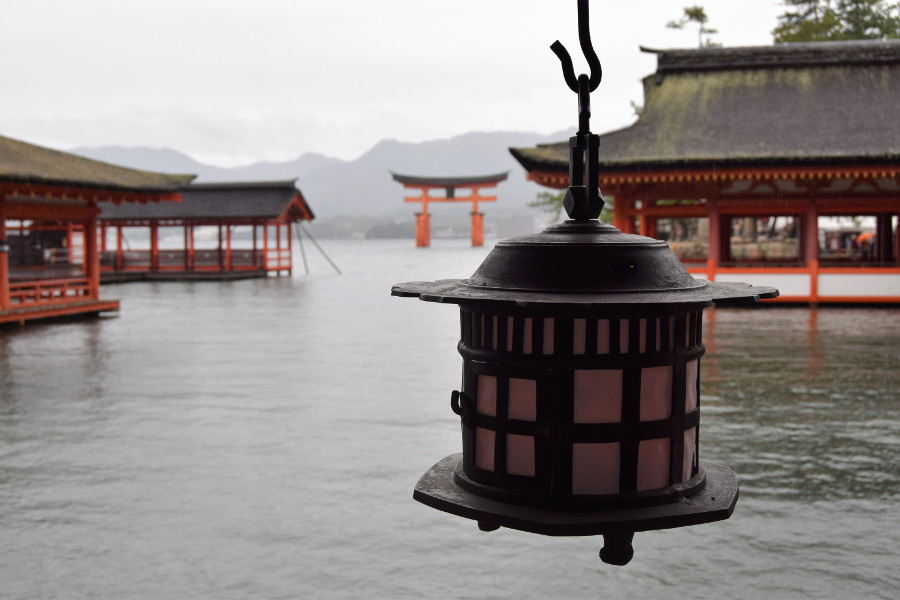
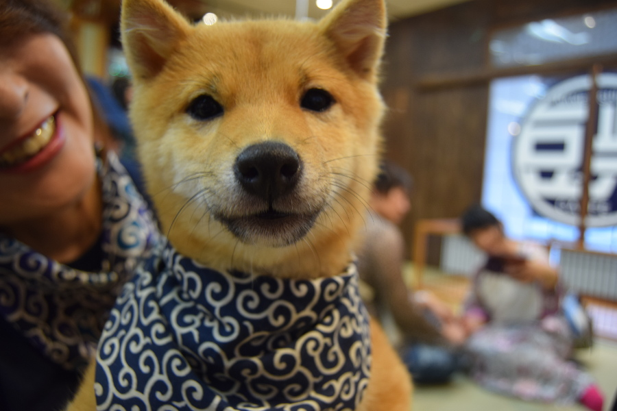

##Hiroshima
We took the Shinkansen from Himeji to Hiroshima, which took a couple of hours. After riding the streetcar from the station, we dropped our bags off at [J Hoppers](http://hiroshima.j-hoppers.com/), where we were staying and headed out for lunch. We tried Okonomiyaki for 1300¥ (£9) at [Nagata-ya](http://nagataya-okonomi.com/en/shop.html), which is Hiroshima’s signature dish. As the Japanese sneak fish into EVERYTHING we’d really struggled to eat and had to go for a veggie option of Okonomiyaki; it's basically pancake batter with noodles on top, beansprouts, cabbage, sweet corn and cheese, topped with egg (like an omelette) and covered in spring onions. It’s served on a hot plate so it remains warm whilst it’s eaten. It was so delicious that we went for more at a local restaurant [Okonomiyaki Mitsu](https://en.japantravel.com/ehime/mitsu-s-okonomiyaki-granny/33987) (which cost half the price and was just as delicious). This time there was no cheese, sweet corn or spring onions, but it came with bacon inside and a plum/ginger sauce on the top.

##A-bomb
One of the reasons we visited Hiroshima, like all the other tourists, was our 'dark tourism' curiosity in relation to the atomic bomb dropped on the city in 1945 during the Pacific War. As we walked along the river towards the Memorial Museum we saw the A-bomb dome stand out like a sore thumb against the modern architecture. The building was directly underneath where the bomb was dropped and escaped the force that flattened all the surrounding buildings to ashes. The building has been left as it was on the 6th August 1945.

##Peace Memorial Park
We also passed through Peace Memorial Park which has a monument dedicated to those who suffered from the atomic bomb and a burning flame. Underneath on a plaque it states that the flame will remain lit until all of the nuclear weapons in the world have been abolished.

There is also a child’s memorial in the park dedicated to Sadako Sasaki, she was 2 years old when the bomb went off in Hiroshima and initally appeared unharmed. However by the age of 12 she was diagnosed with leukaemia from radiation poisoning. Whilst in hospital she started to make origami paper cranes as it is believed that if a person can make 1000 cranes they will get one wish. Her wish was a world without nuclear weapons. It’s said that she did not finish the 1000 before she died and her classmates finished and donated the rest. Now people from all over the world fold and donate paper cranes to the monument, they receive so many that with each ticket to the museum, a visitor receives a postcard made from recycled paper cranes. There is a monument dedicated to Sadako Sasaki with a wire crane above her.

##Peace Memorial Museum
Sadly, the main building of the [Peace Memorial Museum](http://hpmmuseum.jp/?lang=eng) was undergoing renovation whilst we were there so the content of the museum had been squished into a much smaller space, making the museum feel really busy. As we walked in there were huge photos covering the walls of imagery of the destruction of Hiroshima after the bomb had exploded. There was also a 3D model showing the scale of the destruction, highlighting the few buildings in the city that remained standing. We heard some people's recollections on a video. One that really stood out was a man retelling his experience and showing illustrations he had drawn of what happened. He had been at school at the time and had survived and left when the bomb had gone off. He said he had severe burns and his clothing was in tatters, he headed straight for his home. On the way he saw one of his school friends who had somehow had the bottom of his feet burnt and had flaps of skin hanging off, he said he wanted to help his friend so got him to crawl on his hands and knees. He said when that didn’t work he got him to walk on his heels whilst he supported him. He said he grew really tired but ran into his great aunt and uncle who were able to help him. Another man said that he was unharmed as he had been inside a warehouse at the time. He said he helped his boss look for his wife, but she was nowhere to be found. A week later, his boss died from exposure to radiation. Sadly, people were not initally told that the bomb had been nuclear so they unknowingly entered the city and were exposed to radiation after the bomb had gone off and they did not know the causes of their injuries.

The next part of the museum was very factual about the bomb; there was a letter written by Albert Einstien addressed to President Roosevelt urging that the bomb be built based upon fears that Germany were building their own atomic bomb. Another bomb was dropped 3 days later on Nagaski (further south of Hiroshima) which was made of plutonium, wheareas uranium was used in Hiroshima. Unlike Chernobyl and Fukushima, where there have been nuclear explosions on the ground, the atomic bomb exploded 600 metres in the air which is why radiation didn't linger in Hiroshima for years afterwards. The narration in the museum explained that Churchill and Truman kept the bomb secret from the rest of the world and although America asked Japan to surrender, no warnings were given to the country about the atomic bomb.

The latter part of the museum was about the effects of the bomb, not only on Hiroshima and Japan, but on the rest of the world. It explained that there have been increased cases of cancer and leukaemia from people being exposed to radiation. The museum showed photos of people’s burns and injuries and there were descriptions of women clutching onto their dead babies and babies screaming for their dead mothers. A rusty tricycle was on display that belonged to a young boy who used to ride it everyday, there were burnt items of clothing and a photo of a girl who’s kimono pattern had burnt onto her body (the black parts would have reached higher temperatures). People described that they saw a huge flash of white light and after that it rained black rain and was dark like night. We struggled to read all of the accounts and look at all of the personal belongings on display. The museum, like Auszchwitz and The Killing Fields, is definitely one of the saddest places I’ve ever visited. The overwhelming message of the museum was that we must learn from the horrific events in Hiroshima and Nagasaki, as well as the effects of nuclear testing to avoid the suffering of innocent people from happening again. Obviously this is so much easier said than done, but as the museum alludes to, until every single nuclear warhead is destroyed the number one threat to humankind remains.

##Itsukushima Shrine
Itsukushima Shrine is on Miyajima Island, a ten minute boatride from Hiroshima. The island itself is thought to be a shrine and so the tori gate is, at high tide, in the water and it is one of the most famous shrines in Japan. Sadly, the day we went it was raining and misty over the forest covered mountains. As well as visiting the shrine, there are a number of other temples and hikes that can be done on the island but as the weather was so bad we decided not to bother.

It cost 300¥ (£2) to walk around Itsukushima shrine which was mostly wooden walkways over the water. Like Fushimi Shrine in Kyoto, it was absolutely rammed with tourists, and like Nara there were deer wandering around. After we'd braved the rain and took a few photo's we had a walk around the nearby streets which were full of restuarants and souvenir shops. We tried a cake made from maple and had some lemon beer and lemonade and Hiroshima gin before heading back to the port.

##Mameshiba Cafe
As we'd gone all the way to Miyajima and it didn't take too long to look around Itsukushima Shrine we decided to visit the [Mameshiba Cafe](https://exp-tours.com/map/1305/) before heading back. It cost 780¥, (£5), including a drink for 30 minutes stroking and playing with the Shiba dogs. Luckily, it wasn't overly busy and there were plenty of dogs running around. They were a little shy, especially the puppies and we weren't allowed to pick them up, we had to wait for them to come to us. They were really friendly and confident around the staff so once they'd jumped into their laps they brought some of the dogs around so we could stroke them and have a play. They were super soft and the 30 minutes went way to fast!

##Typhoon Trami
We had planned to spend 2 nights in Hiroshima and then head back to Tokyo for two more days in the amazing city before we had to leave Japan. However, typhoon Trami had other plans for us. We woke up at 7:30AM and [NHK News](https://www3.nhk.or.jp/nhkworld/en/news/) told us that the shinkansen would stop running mid-morning. We threw our things in our backpacks and headed straight to the train station, however, we'd missed the last train to Tokyo which left around 8AM. We decided to get the train the next morning and confined ourselves to a hotel room until the storm had passed. We booked into [Hotel Century 21 Hiroshima](https://www.j-hotel.or.jp/en/hotel/250/) and picked up some supplies before we checked in at 13:00. From around 14:00 until 19:00 there was heavy rain and high winds in Hiroshima, we watched the Japanese news to track the route that Trami took. Fortunately for us, the eye of the storm didn't pass over and it seemed that people were still going about their daily business in the city. We went out for dinner at around 19:30 and apart from some strong winds and an abandoned broken umberella there was no destruction from the typhoon.

##Our verdict of Hiroshima & Miyajima
Hiroshima was worth the visit to learn more about the atomic bomb dropped in the Pacific War and the local cuisine was also our favourite in the whole of Japan! We loved Miyajima too and despite the weather managed to spend our time wisely in the Mameshiba Cafe!
