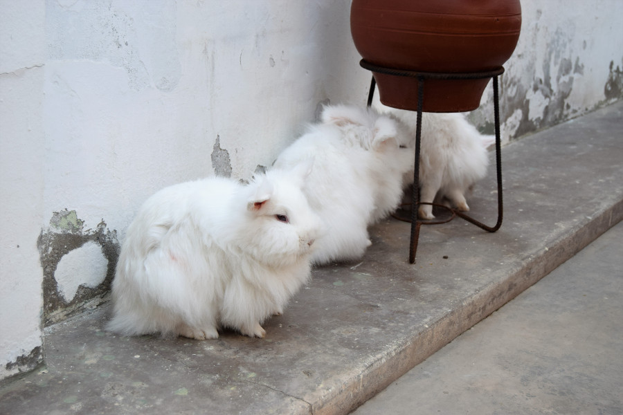
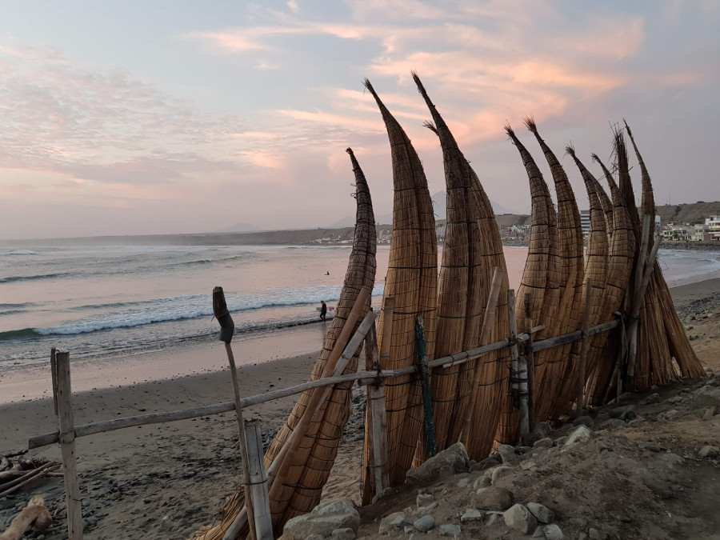
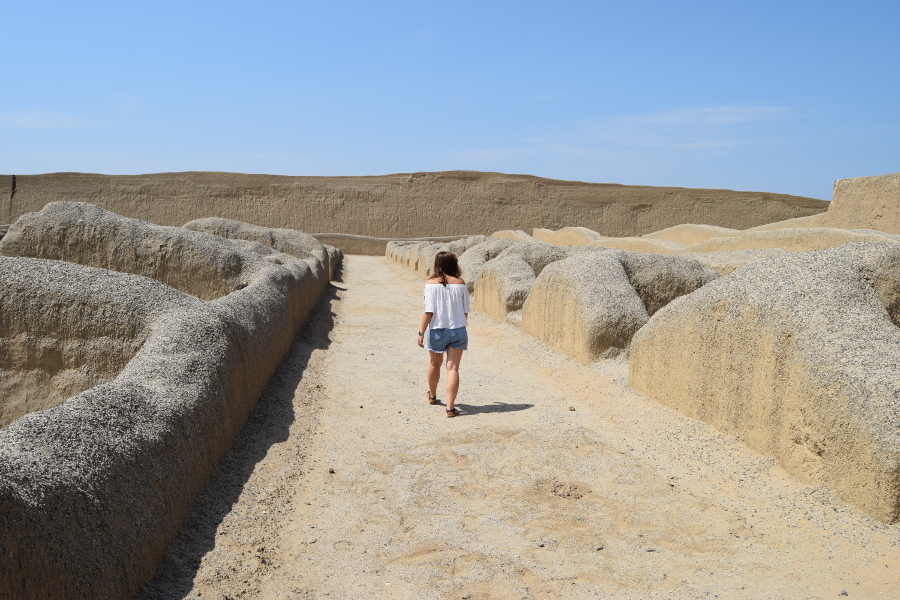
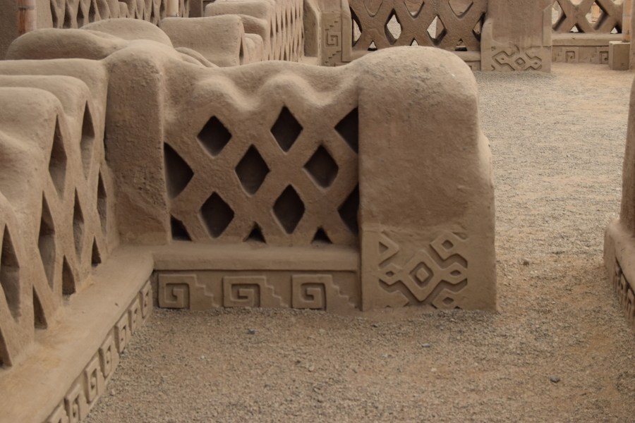
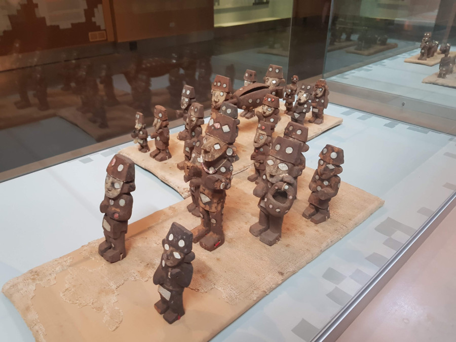
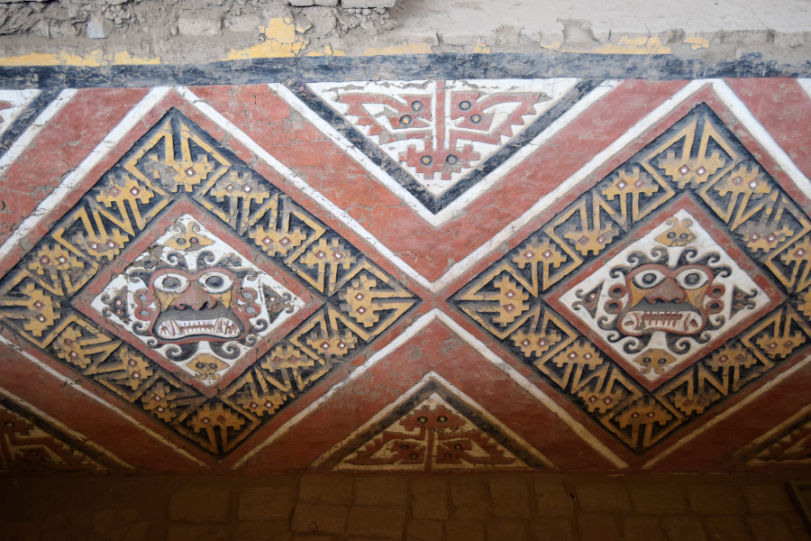
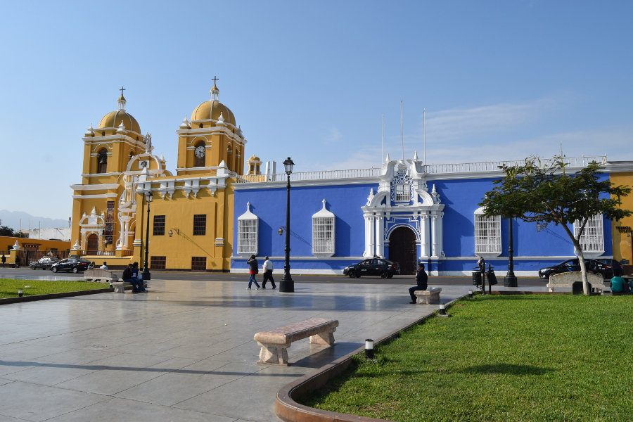

>"Yoga is not about touching your toes, it is what you learn on the way down."

Jigar Gor

##Yoga & Surfing
Huanchaco is a little town in Peru along the coast, not too far from the city of Trujillo. Our hostel, [ATMA Hostel & Yoga](https://atmahuanchaco.com) offered both daily yoga lessons and surfing equipment for free. The waves were absolutely huge and neither of us fancied being thrown off the boards in the milder weather, so we opted out of surfing and used our time to chill out by the coast. ATMA was possibly the best hostel we’d stayed in in Peru and it was also home to a cat called Fiddle, a turtle called Donoco and three very fluffy bunnies who had free reign of the courtyard.

There wasn’t a lot to do in Huanchaco and we had been warned that the beaches weren't great and were full of litter. The sand was very dark and it definitely wasn’t the kind of beach we'd sunbathe and relax on. It was such a quiet town, restuarants would shut by 18:00 if they had no customers and there wasn't even a supermarket. We brought our food from the local 'Mercardo' which was incredibly cheap and ate out in [The Lighthouse](https://www.facebook.com/thelighthouserestaurante/) two nights in a row. They did incredible wings and kebabs cooked on a barbeque.

##Sunset
The weather was really cold and foggy in the evenings, but we were lucky enough to catch one sunset in Huanchaco! We never actually saw any of the fisherman in their Caballito de Totora boats made from local reeds, but we did get the iconic Huanchaco picture of the boats at sunset.

##Chan Chan
The main reason we’d ventured so far north, further north than most tourists bother to go, was to see the ancient ruins of [Chan Chan](https://en.wikipedia.org/wiki/Chan_Chan) and Kuelap. Sadly Kuelap is in Chachapoyas and we ran out of time to go so far north. However, we did manage to get as far as Chan Chan. In the south of Peru we’d learnt a lot about the Incas but there were other pre-colombian civilisations before the Inca's, such as the Chimu and the Moche people. Chan Chan was located in between Trujillo and Huanchaco so we caught a public bus for 30p and paid the entrance fee of £1.10, instead of £2.20 because we had ISIC student cards. This was pittance compared to what we paid for Machu Picchu.

Chan Chan definitely wasn’t as grand as Machu Picchu, however it was much bigger, spanning 20kms in pre-colombian times, 900 - 1470AD! We were offered a guide but they only spoke in Spanish so we decided to wonder around for ourselves. Sadly, there was no information in the site, in either Spanish or English and overall we were a little disappointed with Chan Chan. There is now an ugly roof over the top of the section of the ruins that have been restored in Chan Chan meaning it was impossible to get the iconic photo of the ruins. It also meant we couldn't walk through all of it and the bamboo posts made it difficult to imagine the areas as rooms, houses, graves and plazas.  However we were able to wander through some parts that hadn’t been restored fully and we managed to get a feel for how big Chan Chan was.

##Huaca de la Luna
The temple of the moon was on the other side of Trujillo and we’d heard his was worth a visit, despite being further away than Chan Chan. Feeling adventurous, we got a bus into Trujillo and then a collectivo to the ruins. We had to wait 45 minutes for a guide in English, as visitors can only see the ruins with a guide, so we wondered around the museum which was full of artifacts excavated from the site. This turned out to be really interesting with all the information about the [Moche](https://en.wikipedia.org/wiki/Moche_culture) culture and the purpose of Huaca de la Luna in English.

Often the temples are referred to as Huaca de la Luna and Huaca del Sol (Temple of the Moon and Temple of the Sun). However, we were only able to visit the Temple of the Moon. The ruins were discovered in the 1990’s and sadly five years ago funding and sponsorship stopped, subsequently archaeologists stopped excavating the site and Huaca del Sol is not open to the public. We were shown around the ruins with our guide who explained that the temples were created between 100-700AD and that the Moche culture used Temple of the Moon for religious purposes. She explained priests ruled their civilizations and that they made annual human sacrifices to the Gods, but also when a natural disaster occurred such as an earthquake or heavy rain as they believed the Gods were angry with them. They did this by having male warriors fight, the loser was stripped naked and brought back to the temple where they were sacrificed. She said their blood was drained first and either poured on the ground or drank by the high priests.

The temple itself was really well preserved and we were able to see the original colours from the Moche peoples depictions of the decapitated God, who they made sacrifices to. This is because every 100 years the Moche people built over the already existing pyramid to make it bigger, therefore inner pyramids had been covered in sand and kept safe from sunlight and weather. In our opinion this was way more interesting than Chan Chan and definitely worth the £2.20 to visit.

##Trujillo
We'd heard mixed reviews about Trujillo, some saying it wasn't worth visiting and other saying the Plaza de Armas was stunning and worth a quick stop. On our way back from Huaca de la Luna we decided to grab a late lunch from the historical centre of Trujillo. The coloured colonial buildings around the Plaza de Armas reminded us of some parts of Arequipa and we thought the Plaza de Armas was worth the quick visit before jumping on a collectivo back to Huanchaco.

##Our verdict on Huanchaco
People who surfed seemed to be staying in Huanchaco for at least a couple of weeks, for us it was a nice lazy town where we could rest for a few days before heading back to the bustling city of Lima. We had intended to go further north than Huanchaco to Chachapoyas to visit some more ruins. However, due to cramming in the Amazon Rainforest (no regrets there) Huanchaco was as far north in Peru as we’d get. The Temple of the Moon was definitely worth a visit and for the price so was Chan Chan!