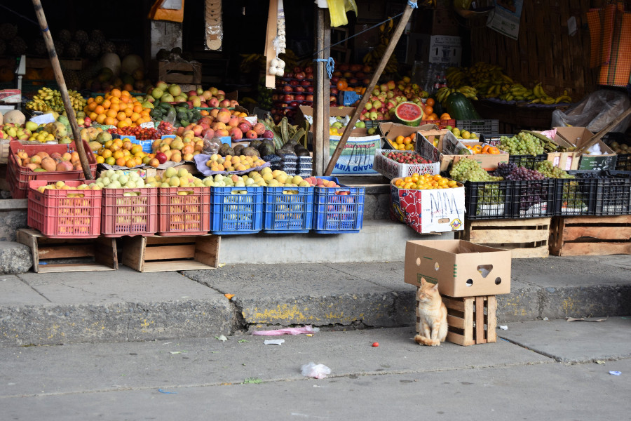
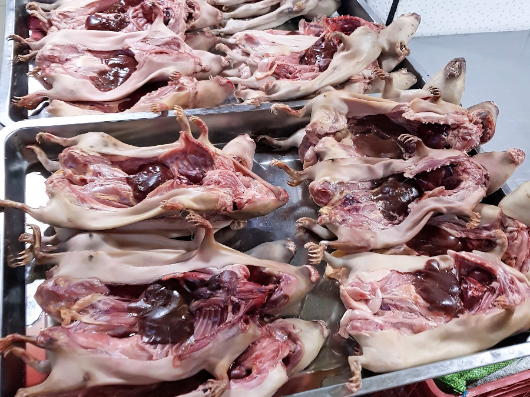
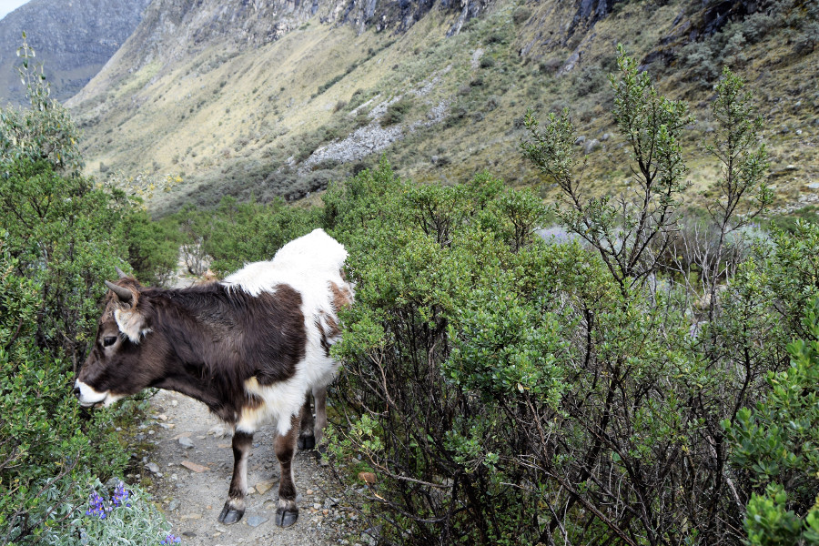
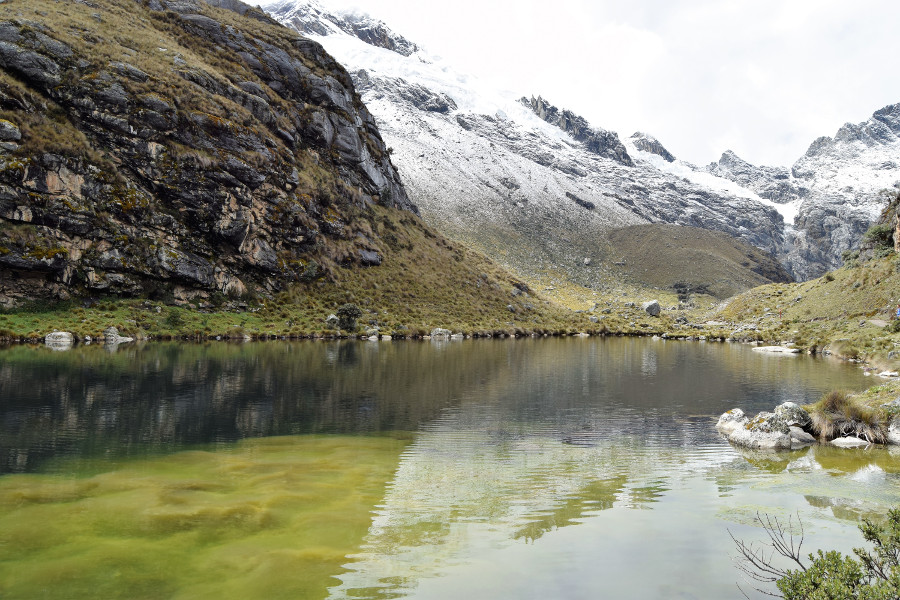
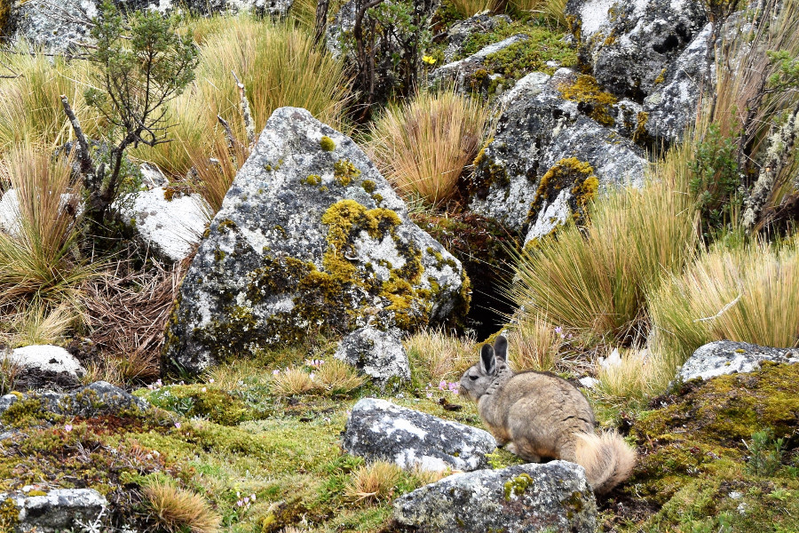
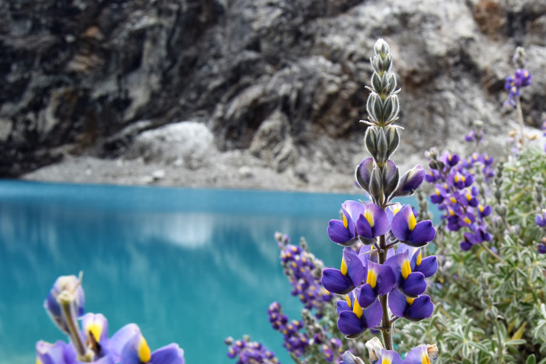
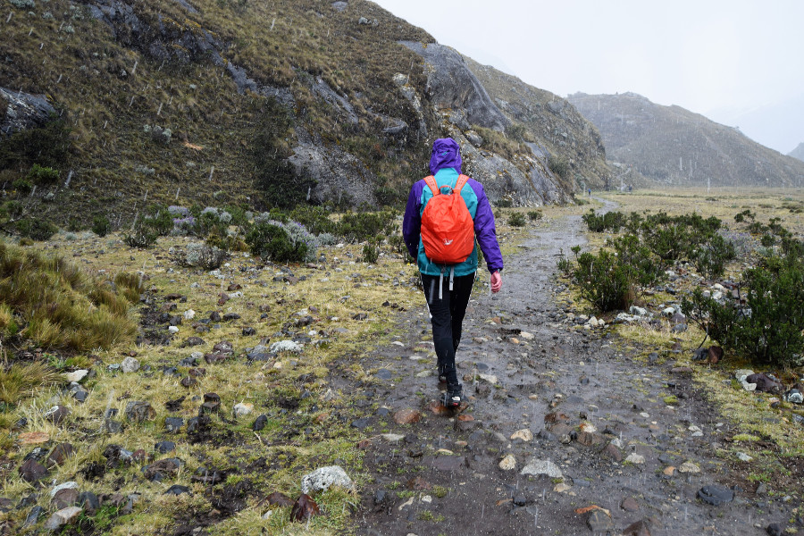

>"A lake is the landscape's most beautiful and expressive feature. It is earth's eye; looking into which he beholder measures the depth of his own nature."

Henry David Thoreau.

##Huaraz
We took an overnight bus from Lima to Huaraz which left at 21:30 and dumped us in Huaraz at 06:30. Very disorientated and tired as there was more than one snorer on the bus we tried to find [Vacahouse B&B](https://www.booking.com/hotel/pe/vacahouse-huaraz-b-b.en-gb.html?aid=357026;label=gog235jc-hotel-XX-pe-vacahouseNhuarazNbNb-unspec-pe-com-L%3Aen-O%3AwindowsS10-B%3Achrome-N%3AXX-S%3Abo-U%3AXX-H%3As;sid=afa45bdb0846f6aa56e77743f5f154c6;dist=0&sb_price_type=total&type=total&) where we had booked to stay. However, we didn't realise there was more than one so around an hour later and a cheap motortaxi ride later we managed to find it.

Huaraz itself is a small city and it isn't very touristy, it's more of a hub for people to trek the Huascaran National Park. It's 3052 meters above sea level so we were also conscious to take it easy at first to avoid altitude sickness.

##Mercado Central de Huaraz
Aside from the Plaza de Armas, which was home to a crumbling derelict church, there really wasn't a lot to see in the city. However, we'd read a few blogs that said the market was worth a visit. We'd been to a few of these in South America and you'd think we'd have learnt our lesson; mostly they contain fruit, strange herbal medicines and smelly unrefridgerated meat. Mercardo Central de Huaraz was no different, we pretty much ran through it holding our noses, stopping for a picture of the skinned and gutted guinea pigs and the hanging plucked chickens.

##Laguna 69
We'd been warned by a friend who had previously done this hike that it was difficult because of the altitude. His exact words were "Laguna 69 trek, it may kill you but worth it". We'd booked a tour, mainly as it was easier and just as cheap as getting there by public transport. We were picked up at 05:00 and taken for breakfast in the middle of nowhere. Laguna 69 is located in Huascaran National Parl and is 4604 meters above sea level. We started the hike at around 3800 meters and the first hour was pretty flat, the only challenge was getting around the cows blocking the paths.

After this was our first climb, it was reassuring that people on our tour muttered "it's hard" as we kept crossing each other after resting. Due to the altitude, we had less oxygen and less energy so every step up was effort. Dan reached the top before me and I thought we'd made it. Turned out we were about halfway and it was just a different lake.

We were graced with a break in climbing, as we crossed along another flat part of the hike before the even steeper climb up to Laguna 69. We managed to spot a Viscacha, which are rodents native to South America.

During the climb, each step was effort and everyone who'd kept our pace had to keep stopping every 4-5 meters to catch their breath. It was so hard because of the altitude but we got a final burst of energy when a guide told us we were about five minutes from the top.

We were so pleased when we saw the blue water and we knew we'd made it. We were told it would take us around three hours to get to the top but we did it in two hours and forty five minutes, it took others three and a half hours to get to the top! We took lots of photo's and ate our picnic lunch just as it started to hail, ready for the two hour walk back down. Because it had been raining whilst we were at the top, the paths on the way down had turned into streams but we didn't care as the walk down was so much easier than the climb up.

##Our Verdict on Huaraz
We mainly visited Huaraz to hike to Laguna 69 and we were glad we did. It was the hardest hike we'd done, ever, but it was worth it for the views of the sapphire blue lake and the stunning scenery in Huascaran National Park.

