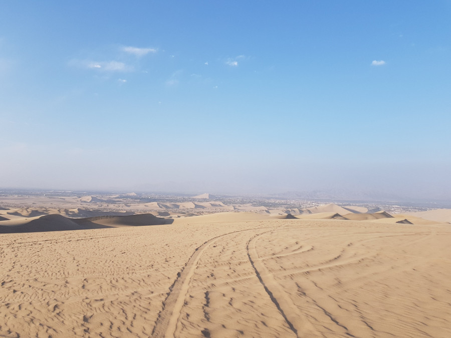

>“All journeys have secret destinations of which the traveller is unaware."

Martin Buber.

##Huacachina
We didn't actually stay in Ica, opting to stay instead by a little oasis in the desert called Huacachina, just outside of Ica.

Mainly people come here to ride the sand dunes in a sand buggy and to sandboard. There wasn't a lot to do here other than this, so we stayed in [Rochabus Hostel](https://www.booking.com/hotel/pe/il-vecchio-bungalows.en-gb.html?aid=357026;label=gog235jc-hotel-XX-pe-ilNvecchioNbungalows-unspec-pe-com-L%3Aen-O%3AwindowsS10-B%3Achrome-N%3AXX-S%3Abo-U%3AXX-H%3As;sid=9474d9d1bdb38f3e4d3c5b8158430d7d;dist=0&sb_price_type=total&type=total&) which had a pool and some hammocks to fill our free time.

##Sandboarding
We booked our sandboarding trip through [Find Local Trips](https://www.findlocaltrips.com/) which came recommended by the Bolivia/Peru Hop buses, it also appeared to be good value for money. At around 16:00 we strapped into our 14 seater buggy and headed for the dunes. However, initally our buggy got turned away and went back into town, the driver picked up his wife and kid. It seemed that we hadn't been allowed up there as the buggy wasn't full. Eventually we got up the first dune, ready for our rollercoaster ride over the dunes and the buggy was super slow. After messing around with it for 10-15 minutes, the driver gave up and called for another buggy; not a great start! The second one was tiny, there was only really room for four people in the back but it had five straps so we had to squeeze in, we didn't see any other buggy's with five in the back. The driver didn't seem to care and he drove up and down the dunes whilst we bumped around squished in the back.

Finally we reached the first dune to sandboard down, it was steep but wasn't so high. We had great fun and then went down two smaller ones but pumped full of adrenaline we hoped that they'd get higher! We got back in the buggy, the driver raced up and down the dunes but a few minutes later the axel for the back wheels bent. The driver looked really annoyed but we figured it was because they'd shoved too many of us in the buggy.

We had to wait there for around 15 minutes for yet another buggy, we couldn't sandboard as we couldn't get back up the dune and the sun was setting fast. An even smaller buggy came and we squashed in to race up the dunes to catch the sunset. As the driver pulled up the sun sank behind the dunes, we'd missed it! We couldn't believe our bad luck.

##Nazca Lines
Nazca is two and a half hours away from Huacachina so we caught a [Cruz del Sur](http://www.cruzdelsur.com.pe/) bus there and back. These were double the price of the public bus (£6 one way) but they were quicker, more reliable and we were able to watch a film. Historically there have been lots of accidents with flights going over the Nazca Lines, so we did a lot of research and went with [Movil Air](http://www.movilair.com.pe/en/) who we'd read had newer planes, more experienced pilots and their planes were bigger, holding twelve passengers not six. We checked in at the 'airport' but were sent off in a group of six; we were given a map of the lines and realised we'd been shoved with a different plane company, Air Brag.

The plane was really small and we had to wear headphones. We'd already been told that the planes tip left and right which can make people sick, so we'd taken anti-sickness tablets before and hadn't eaten all day, just in case. Before take off, Dan saw an error message come up 'transponder failed', the pilot cleared it and continued to the runway. This did not fill us with confidence! We took off and saw each of the ancient geoglyphs from the sky. The plane tipped from side to side so everyone got a good view and it wasn't long until the woman sat behind me chundered into her sick bag.

The geoglyphs are thought to be from the Nazca culture, between 500 BC and 500 AD. Archaeologists, historians, and mathematicians have all tried to determine the purpose of the Nazca lines; they hypothise that they were either made for the Gods, they are related to astronomy or were created to summon water. Either way they were pretty cool to see from the sky.

There was a bit of turbulence in the little plane which felt so much worse than in a big aircraft. We loved seeing the amazing geoglyphs from the air and for £65 the flight was well worth it, but were very pleased to have our feet on the ground again.

##Our Verdict on Ica
We mainly went to Ica to stay in Huacachina for some adrenaline filled sandboarding and sand buggying; sadly this didn't really happen due to two of the buggy's breaking on us! The Nazca Lines however did not disappoint and to fly in such a small plane over the geoglyphs was another thing ticked off the bucket list.

