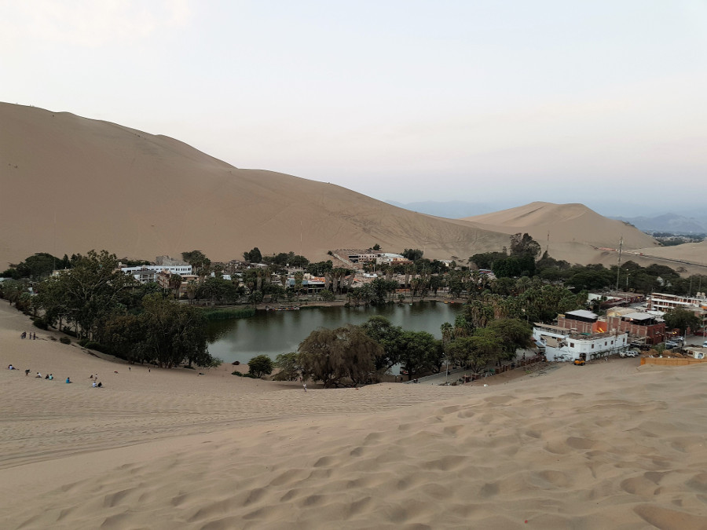
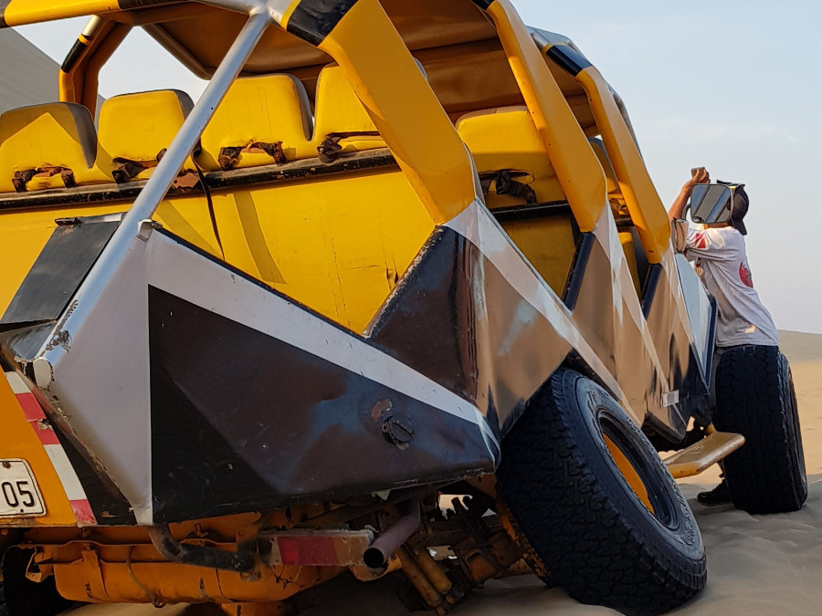
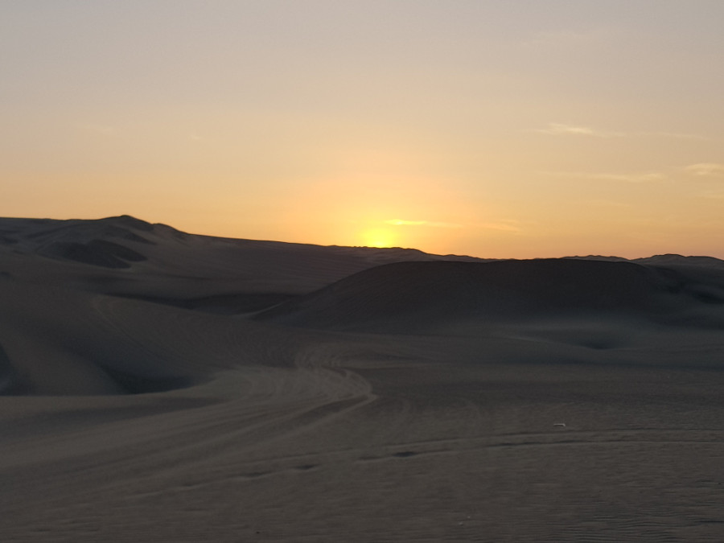
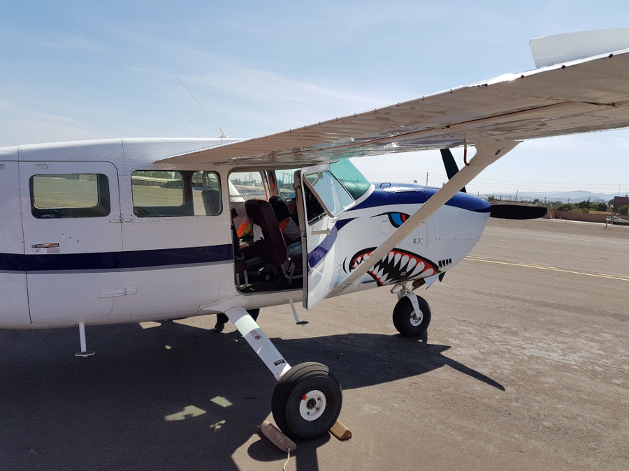
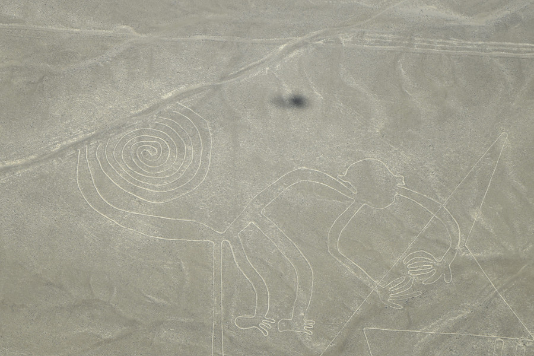
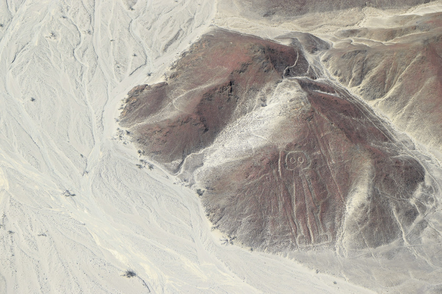

>“All journeys have secret destinations of which the traveller is unaware."

Martin Buber.

##Huacachina
We didn't actually stay in Ica, opting to stay instead by a little oasis in the desert called Huacachina.

Mainly people come here to ride the sand dunes in a sand buggy and to sandboard. There wasn't a lot to do here otherwise so we stayed in [Rochabus Hostel](https://www.booking.com/hotel/pe/il-vecchio-bungalows.en-gb.html?aid=357026;label=gog235jc-hotel-XX-pe-ilNvecchioNbungalows-unspec-pe-com-L%3Aen-O%3AwindowsS10-B%3Achrome-N%3AXX-S%3Abo-U%3AXX-H%3As;sid=9474d9d1bdb38f3e4d3c5b8158430d7d;dist=0&sb_price_type=total&type=total&) which had a pool and some hammocks that we could chill in in between activities.

##Sandboarding
We booked this through [Find Local Trips](https://www.findlocaltrips.com/) which came recommended by the Bolivia/Peru Hop buses, the trips on there also appeared to be good value for money. Around 16:00 we got strapped into our 14 seater buggy and headed for the dunes. However, we got turned away and went back into town, then the drivers wife and kid got in. Apparently, we hadn't been allowed up there as the buggy wasn't full. Eventually we got up the first dune and the buggy was super slow. After messing around with it for 10-15 minutes the driver gave up and called for another buggy. Not a great start. The second was tiny, there was only really room for four people in the back but it had five straps so we had to squeeze in. No other buggy's had five in one row. The drivers didn't seem to care and he drove up and down the dunes whilst we bumped around squished in the back.

Finally we reached the first dune to sandboard down, it was steep but wasn't so high. We had great fun and then went down two smaller ones. We hoped that they'd get higher! We got back in the buggy and in a few minutes the axel for the back wheels snapped. The driver looked pretty annoyed but we figured it was because they'd shoved too many of us in the buggy.

We had to wait there for around 15 minutes for another buggy, we couldn't sandboard as we couldn't get back up and the sun was setting fast. Another, even smaller buggy came and we squashed in to race up the dunes to catch the sunset. As the driver pulled up the sun sank behind the dunes, we missed it. We drove to a photo spot of Huacachina and headed back into town.

##Nazca Lines
Nazca is two hours away from Huacachina so we caught a [Cruz del Sur](http://www.cruzdelsur.com.pe/) bus there and back. These were double the price of the public bus (£6 one way) but they were quicker and we could watch a film on the way and way back. Owing to the fact that historically there have been lots of accidents with flights going over the Nazca Lines we did a lot of research and went with [Movil Air](http://www.movilair.com.pe/en/) who we'd read had newer planes, more experienced pilots and their planes were bigger. We checked in at the 'airport' but were sent off in a group of six. We reached our plane and realised we were now flighing with Air Brag.

The plane was really small and we had to put on our headphones. We'd already been told that the planes tip left and right which can make people sick, so we'd taken anti-sickness tablets before and hadn't eaten that day. Dan saw an error message come up 'transponder failed', the pilot cleared it and continued to the runway. This did not fill us with confidence! But we took off and saw each of the ancient geoglyphs from the sky. The plane tipped from side to side so everyone got a good view and it wasn't long until the woman sat behind me chundered into her sick bag.

It is thought that the geoglyphs were from the Nazca culture between 500 BC and 500 AD. Archaeologists, historians, and mathematicians have all tried to determine the purpose of the Nazca lines; they hypothise that they were either made for the deities above, they are related to astronomy or were created to summon water. Either way they were pretty cool to see from the sky.

There was a little bit of turbulence in the little plane which felt so much worse than a big aircraft. We'd loved seeing the amazing geoglyphs from the air but were pleased to have our feet on the ground again.

##Our Verdict on Ica
We mainly came to Ica to stay in Huacachina for some adrenaline filled sandboarding and sand buggying; sadly this didn't really happen due to two of the buggy's breaking. The Nazca Lines however did not disappoint and to fly in such a small plane over the geoglyphs was another thing off the bucket list.

