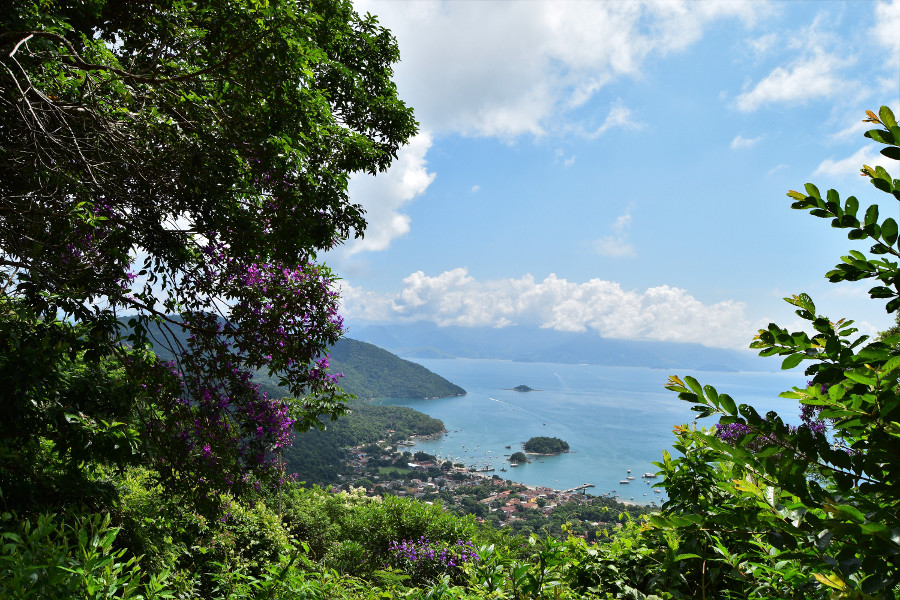

>“Is it normal to have sweaty ears? I’ve never had a sweaty ear in my life… They’re not even doing anything and they’re hot.”

Karl Pilkington on Brazilian weather, An Idiot Abroad.

##Arriving on Ilha Grande

After four busy days in Rio de Janiero, we’d planned to spend some time relaxing on the beaches of Ilha Grande. We booked a door to door transfer with [Easy Transfers] (http://easytransferbrazil.com/en/) from Rio to Ilha Grande, we were collected at 07:00 and taken straight to the island; it was around a 3 hour drive and 45 minutes on a slow boat. We sat on the top deck and enjoyed the sunshine and a few beers until we got there. As we approached the ‘Big Island’ we could see why people in Rio had raved about how beautiful it was. There was a small stretch of bars, restaurants and pousada’s, coves of beaches and a pier towered by green hills covering the rest of the island. Dan said that it looked like ‘that island’ from Moana; he meant Te Fiti. The island was supposed to be very secluded with no cars and no ATMS, however on one of our treks we saw a bus full of tourists on the jungle path driving to Dios Rios. Definitely no banks or ATM’s though.

##Hostel

As the town was so small it didn’t take us long to reach [Biergarten Hostel] (http://biergartenhostel.blogspot.com.br/), where we had booked in an 8 bed dormitory to stay. It had two hammocks just outside our room and an odd shaped bench in the kitchen which Alz kept stubbing his toes on.  There was also a buffet style kilo restaurant attached, where we paid for the weight of food on our plates. On our second night in the hostel, new people came into the dorm, including two of the guys who had been at Books Hostel in Rio. One of them was Norweigian and had spent a night in Rio chatting to Alz about politics and finance over Caipirinhas; we joked that Alz had pulled so found it hilarious when he, by coincidence, ended up in our dormitory in the hostel on Ilha Grande. The second guy was from Bristol and snored like a fog horn; he was so loud my Harry Potter audiobook couldn’t drown him out, but at least we got to catch up on some sleep snoozing on the beaches.

##Wildlife

The most common animal we saw on the island were dogs. Lots and lots of dogs. They were everywhere, pooing on the beach, begging for food at night and walking the jungle trails to other parts of the island. We even saw a dead one, decomposing and washed up on the beach by the tide. Dan was highly amused by one dog who had dug a hole in the sand, was sat in it and was wearing a green tie. Some of the dogs seemed to have owners but others were strays and it was upsetting to see them so skinny and begging for food. It also meant that there was poo on the paths and main beach in Vila do Abraão, so we ended up spending most of our time in the little cove beaches slightly out of town.

On our first night on the island we spotted a couple of Black Tufted-ear Marmoset’s in the Vila do Abraão on the electric wires, I managed to take one photo before they ran off and disappeared. As we had read that there were howler monkey’s on the island, we decided to do a bit of a walk through the jungle on the second day to see if we could see any. This wasn’t supposed to be for long as we wanted to chill out on the beach; we were also wearing sandals and had about half a bottle of water between us. As we reached the beginning of the trail, there was  a warning about mosquitos carrying yellow fever. We'd had our vaccinations but Alz hadn't. He decided to come with anyway as the vaccination hadn't been compulsory to visit Brazil and armed himself with insect repellent. We ended up walking along a trail to Dois Rios, which was on the opposite side of the island and at one point we became determined to do the 3-4 hour trek all the way there. However, after reaching a viewpoint we turned back as we were out of water and according to the map we were only about one third of the way there; the sun was out and it was midday so carrying on seemed like a stupid idea. The view was stunning of the bay and it was well worth the hour walk there and back. Sadly, we didn’t see any monkeys, just big ants, butterflies, a few types of birds and a great big spider.

##Beaches

As we felt like we’d failed the trail the day before, the next day we decided to hike to Lopes Mendes rather than take the boat trip. This was a 3-hour trek and we were way more prepared, armed with snacks, lots of water, DEET and walking boots. We followed the signs from Vila do Abraão to Lopes Mendes and once we got off the beach and into the jungle we questioned what we’d let ourselves in for. The beginning of the trek was so steep; climbing up steps naturally made from tree roots and holes in the clay ground. We were all soaking in sweat within about 30 seconds and only saw one other person walking the trail who over took us, so it felt like we had the jungle to ourselves. The first part of the hike took us about 2 hours to the first beach, Enseada das Palmas. This was also pretty much deserted, and it was tempting to just stop there; however, we’d read that Lopes Mendes was one of the best beaches in Brazil. We had another 40-minute walk through the jungle to get to the next beach Praia do Pouso and from there we booked our speedboat water taxi back to Vila do Abraão for later in the afternoon. To reach Lopes Mendes we had another 20-minute walk through the jungle, this bit was busier with other visitors who had taken boats from Vila do Abraão to Praia do Pouso, as the boats did not go straight to Lopes Mendes.

Lopes Mendes delivered as promised. The beach was huge and secluded, there were no restaurants or pousada’s there, just a couple of men with their carts selling drinks and snacks. The sand was white and so fine, as we walked along the beach it squeaked beneath our feet. The sea was crystal clear, warm and it was so shallow we could go out really far and the water was only up to our waists.  Even though we were knackered when we got to Lopes Mendes, we felt a sense of achievement. It was well worth the 3 hour trek across the island to get there but we were exceptionally grateful for the speedboat back to Vila do Abraão.

After a long day we ate at a restaurant called Steak n’ Beach and had a huge mixed grill for the three of us. It came on a sizziling hot plate and consisted of two pork chops, two steaks, two chicken breasts and four Brazilian sausages, accompanied with a bowl of rice, a mound of chips and some salsa. It cost us $145R which is around £32.

##Paraty

After a few days on Ilha Grande we left for Paraty on our Easy Transfer and it took around 4 hours to reach the town from the island. The weather was overcast and it rained for half of our time in Paraty. On our walking tour in Rio, the guide had said that we had come to Brazil at a time where the seasons were changing which meant that the weather was hot but with some rain in the afternoon. Because of the weather, there wasn’t a lot to do in Paraty. I also felt a little unwell and Alz developed a fever, headache, muscle ache and loss of appetite. He googled his symptoms and decided it was likely he had yellow fever. It turned out that in November 2017 an outbreak of yellow fever had started in the State of Rio de Janiero and State of Sao Paulo; worsening in January 2018. Specifically people had contracted the disease on Ilha Grande!

For some reason the free walking tours had been cancelled in Paraty and we didn’t want to risk a boat trip or a bus ride to Trindade to spend the day on the beach as it kept raining on and off. Therefore, we milled around the old town which was very picturesque, with its colourful boats, buildings and cobbled streets. The people of Paraty also seemed to have a fondness for classic VW Beetles, which were colourful and matched the style of the town.

It was here that we finally saw more monkeys! We were having breakfast in our hostel, [Samba Canuta] (https://www.facebook.com/sambacanutahostel/) and the staff told us that there were monkeys in the tree’s, they tried to coax them down with banana’s but they were having none of it. They lingered around long enough for me to get some good pictures on my camera though.

 The hostel itself was very quiet and we were pretty much the only guests staying there, which made the communal areas very awkward as all the staff seemed to do all day was play guitar and sing the Portuguese version of the Eagle's 'Hotel California'.

##Verdict on Ilha Grande & Paraty

Ilha Grande didn’t turn out to be such a relaxing destination after all as we did lots of hiking through the jungle across the island. We ended up with around 30 mosquito bites between us but totally worth it for the beautiful views and beaches. Following this, we enjoyed our chilled out time in Paraty; a beautiful colonial town with lots of character that wasn’t even the rain couldn't spoil.
