>“I'm struggling here, if I'm honest with you. I don't know how to sell it with... Do you like llamas?.”

Karl Pilkington on Machu Picchu.

##Inca Jungle
We booked the Inca Jungle before we left the UK, as we knew that some of the treks get booked up months in advance to Machu Picchu, mainly the four day classic Inca Trail. We booked Inca Jungle with [Loki Travel](http://lokihostel.com/en/travel), we were sceptical as they have a reputation for being a party hostel, however the Inca Jungle was cheaper than elsewhere, £186 all inclusive. We didn’t fancy hiking on the four day classic Inca Trail and the Inca Jungle seemed a little more adventurous. We decided on the three day Inca Jungle, the classic one is four days, but this meant we missed out the day of hiking and instead we'd get a taxi to catch up with the four day group that left the day before us.

##Day 1
We had to be at Loki Hostel for 06:30AM, which was a killer as it was the other side of Cusco to where we were staying. We were driven to Ollytaytambo to get some final things we might need; Dan and I had been prepared and had everything we needed but couldn’t resist the overpriced Dairy Milk Caramel in the shop. We then drove for another hour and a half to the top of Alba Malaga Pass, a 4800 metre mountain which we were going to bike down.

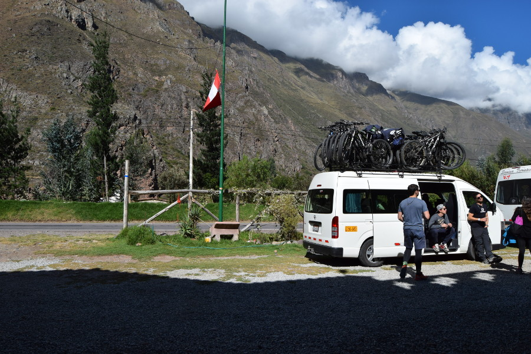

Next was the safety gear; helmet, body armour, gloves, knee pads and a visibility jacket. The guide told us that the minivan would drive behind the group for safety reasons and he talked us through the nine gears on the bike and how to break safety. The ride was 50km with 90% of it being downhill and 10% of it flat, it had sheer drops and blind corners with lorries driving up and down. The guide mentioned biking through streams but we were on a main road so we thought he was joking. It was an easy bike ride in the sense that we didn’t have to pedal and just had to keep putting the breaks on for the corners. However, after the ‘halfway point’ we got lower and closer to the jungle so not only did it get so much hotter but we found out the guide wasn’t joking and we had to bike through streams over the road so we ended up soaked! It was surprisingly good fun and Dan and I managed to beat the rest of he group to the bottom!

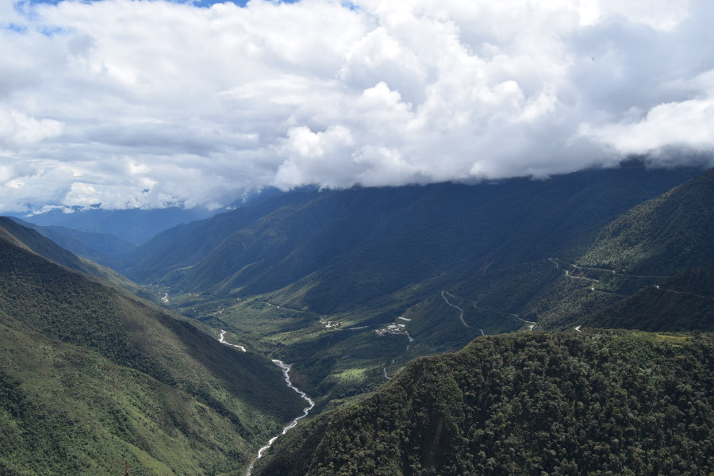

A short drive later we were in Santa María where the people who were doing the four day Inca jungle would be spending the night. As we’d opted for the three days, we had lunch there before getting our taxi to Santa Teresa to meet the other group. We had the option of rafting but I didn’t fancy it and Dan wanted to watch  the Champions League instead.

The taxi turned out to be awful! The driver had so many cracks in his windscreen it was surprising he could see out of it at all. There were two locals in the taxi too, which made it a squeeze, and the driver blared his music the entire thirty minute drive. The gravelly road from Santa María to Santa Teresa was only wide enough for one car with a sheer drop at the one side and at one point he nearly crashed into the mountain. Eventually we arrived in Santa Teresa and no one really had a clue what was happening. The other half of the group and the guide were going to be arriving around four hours after us and we had been told to either wait at the lodge or head to [Banos Termales de Cocalmayo](http://www.portalmachupicchu.com/en/things-to-do/hot-springs/hot-spring-of-santa-teresa/259/) where we could try and find them.

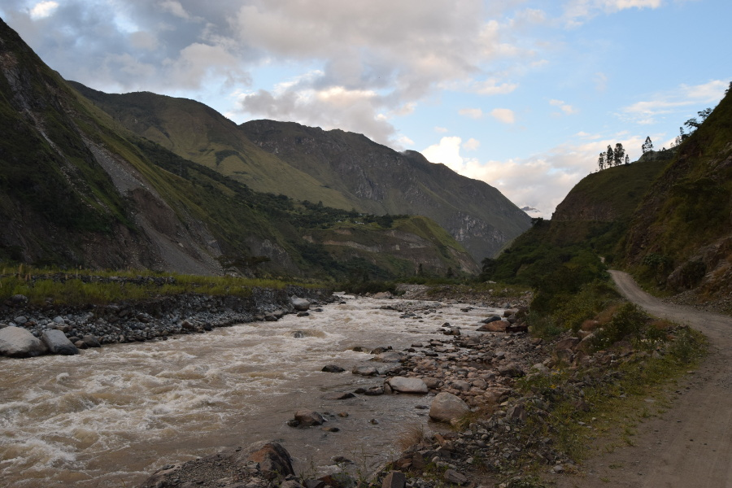

We headed straight to Cocalmayo hot springs and after a short walk in the wrong direction we managed to find it. The sun had gone down and after a long day it was amazing to relax in the hot water. The springs actually seemed clean and the water was clear too which made a change to the hot springs we’d been to in Bolivia. Once our fingers were like prunes we got out but showered in the hot spring showers first as we knew the hostel would only have cold water.

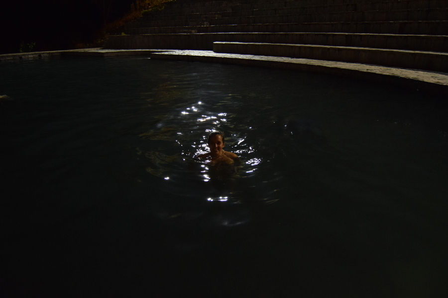

At 20:30 the guide and the rest of the group arrived at the hostel. The guide told us we’d missed a great day hiking where the other group had tried lots of medicinal plants, coffee and Cuy (Guinea Pig). However, it seemed a little ironic that that evening the guy from New York was really sick and he seemed to think it was all the weird plants he'd felt obligated to try on the hike. The guide made us try his medicinal tea which apparently could cure most health problems, it was really bitter. He then somehow convinced us to sign up to the ziplining the following morning. After dinner he gave us a shot of Inca Tequila but Loki’s party reputation didn’t seem to be holding up and we were in bed by 21:00.

##Day 2
We were up at 06:30 to do the ziplining with [Inca Flyer](https://www.tripadvisor.com/Attraction_Review-g294314-d3849665-Reviews-Zipline_Inka_Flyer_Santa_Teresa-Cusco_Cusco_Region.html); 3km, 5 ziplines and a suspension bridge in the trees. We had to sign a waiver first to acknowledge that health and safety may not be the same as in our own country and that it was a risky activity and we may die. This totally filled us with confidence. We got to the first zipline which was over a huge valley and the Urubamba River. The only test was sending over one of the members of staff and we were then quickly shown how to break and told the guide would hold a yellow sign to slow down and red to break. In order to do this we had to hold onto the wire with our leather gloves on, compared to the zipline we had done in Wales the previous year this didn’t at all seem safe.

After a couple of people had gone it was our turn, luckily we survived unharmed and had great fun. By the fifth one Dan seemed to have forgotten his fear of heights and did the line like ‘Spiderman’, upside down!

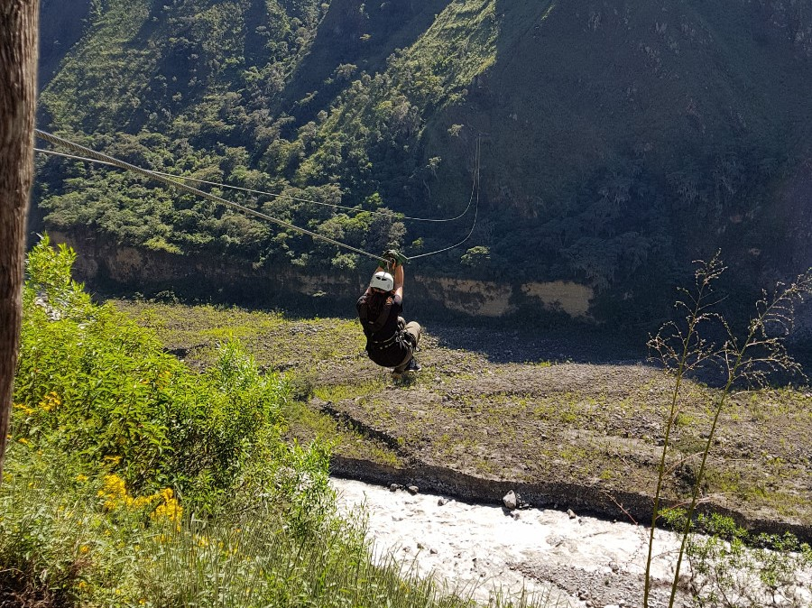

Full of adrenaline we decided to do the suspension bridge too which ended up being really scary! We had to walk along the rotting planks of wood up in the treetops and when we reached certain parts we had to balance unhook and hook our safety clips around the frame of he bridge. This was whilst other people were on the bridge making it wobble!

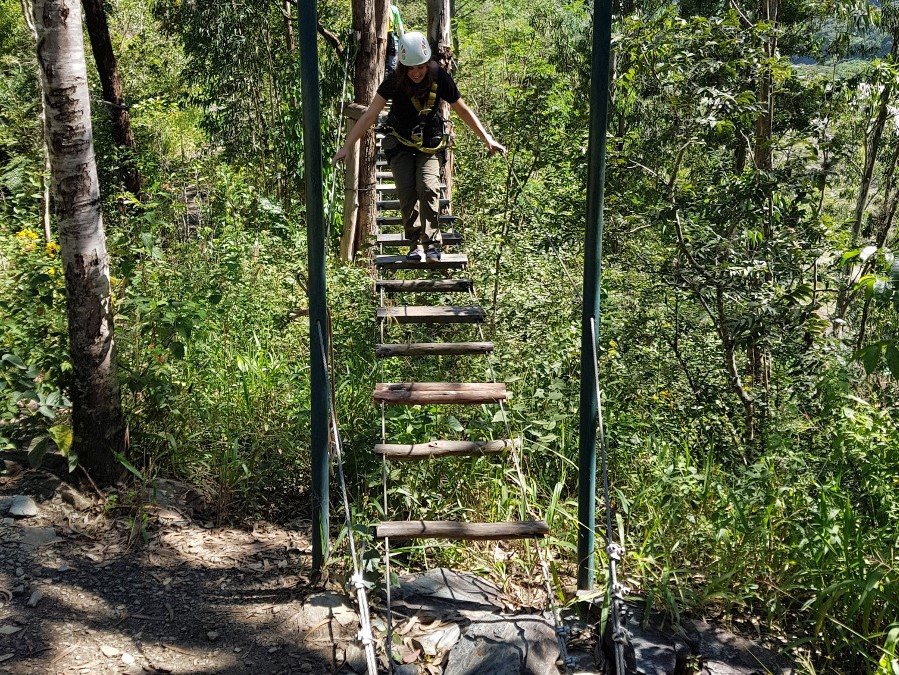

We headed straight towards Machu Picchu after this for our hike from the Hydroelectric station to Aguas Calientes, which was around three hours and along the train tracks. We didn’t realise until some time in, that the trains actually still drive on the line and constantly beeped to get people to move off and out of the way. We’d got talking to a couple from New York and a guy from Romania and as we were faster than the others our guide told us all to walk ahead but meet him and the rest of the group at the first carriages. We got there in under an hour and decided to go in the bar opposite for a drink and some shade whilst we waited for the rest. We waited for 45 minutes but there was no sign of the group so we decided to carry on walking and had to ring Loki when we got phone signal. Once we got to Agues Calientes we caught up with our guide and the rest of the group, who hadn’t bothered to check if we were in the bar when they got to the carriages and they’d carried on ahead of us.

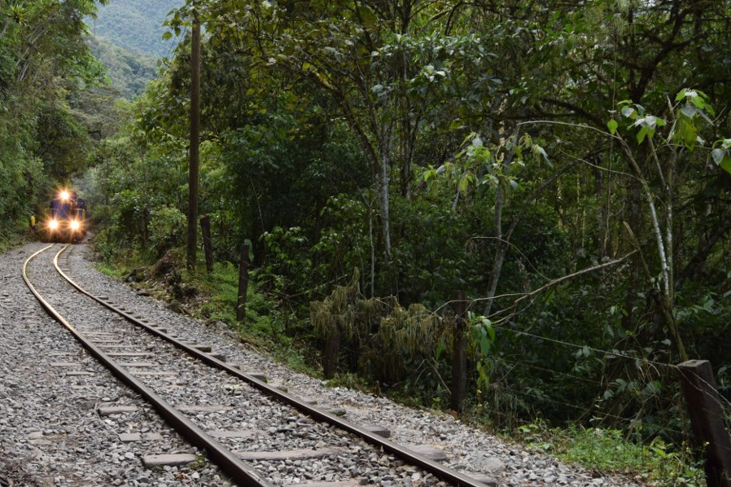

There was then a massive dispute over the rooms. Three couples refused to share dorms but hadn’t paid for a private room; they were exceptionally rude to our guide. After a very awkward five minutes they agreed to pay more and went to another hostel. The rest of us weren’t fussed about where we slept and ended up each having rooms of our own now anyway. Dan and I started to put our bed bug guards on our beds and then we saw them. Bed bugs! One of the beds was infested they were in between the blankets and on the sheets and they looked like head lice. We gathered up our things and threw them into the hallway. We told the guide who was really apologetic, he seemed to be having a really terrible day! We were moved to the other hostel with no extra cost. We later met for our ‘final supper’ as we had a different guide at Machu Picchu, and on the way we had our first close encounter with the Peruvian hairless dog, a black dog with no hair except for a blonde tuft on top of its head. The guide gave us a free Pisco Sour, which helped us get to sleep by 21:30 ready for a 03:45 get up the next morning!

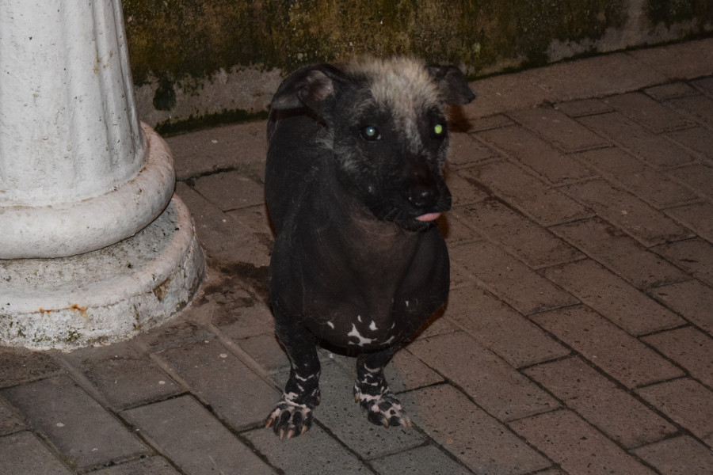

##Day 3
Even though the first bus didn’t leave until 05:30, we arrived at 04:20 and there were already a lot of people in front of us. We ate our breakfast in the queue and ignored the fact that it had started to rain. By 05:40 we were on a bus on the way to [Machu Picchu](https://en.wikipedia.org/wiki/Machu_Picchu), unfortunately as we got higher there was more cloud and more rain. Not the kind of rain we get in the UK, it was like a rainforest downpour and within minutes our waterproof jackets were soaked through, our waterproof covers on our backpacks failed to work and our waterproof walking boots were soaked too. We managed to find our guide and as half the group hadn’t yet come up we were ushered off with another guide to start our two hour walking tour.

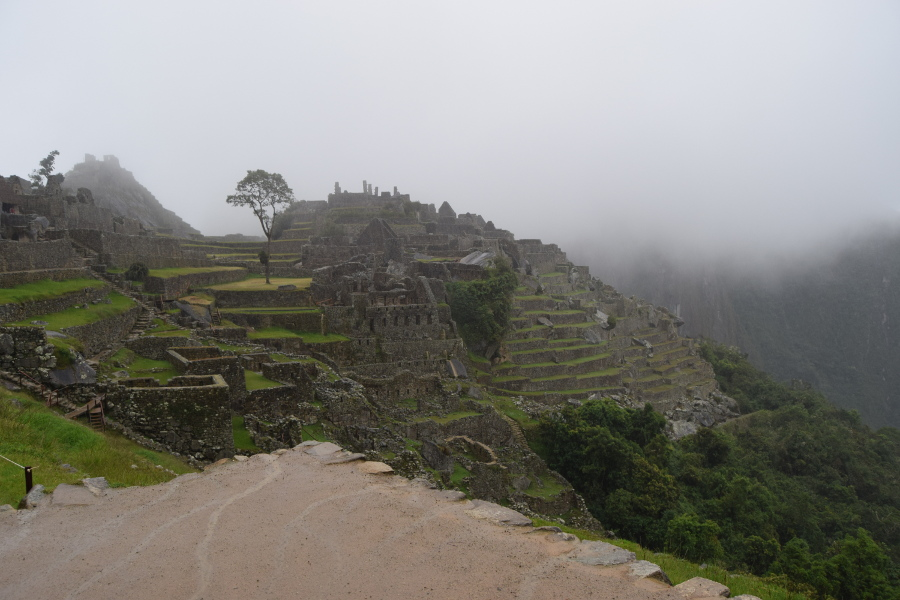

It was really hard to appreciate Machu Picchu’s magnificence to begin with as we were tired, cold, soaked, the rain wasn’t easing up and half of Machu Picchu was covered in cloud. Our guide walked us through the ruined city, pointing out the temples, sacrificial stones, the school and explaining how they cut the stone. Even in the pouring rain, our guide remained really upbeat. He also told us that the name Machu Picchu means ‘old mountain’ in Quechua, the universal language at the time of the Incas and that it is actually a reference to the mountain behind the city, not the city itself. He explained no one really knows what the city was actually called. We were also just about able to see Huayna Picchu, meaning ‘young mountain’, both can be climbed for an extra cost but have to be booked months in advance.

The one good thing about the rain was that it demonstrated how the Inca drainage systems still worked today, 500 years later. At the end of the tour were two huts with a roof, where we were finally able to get some shelter. By then everything was soaked through and we were dithering, praying the clouds would break and the sun would beam like it had done the day before.

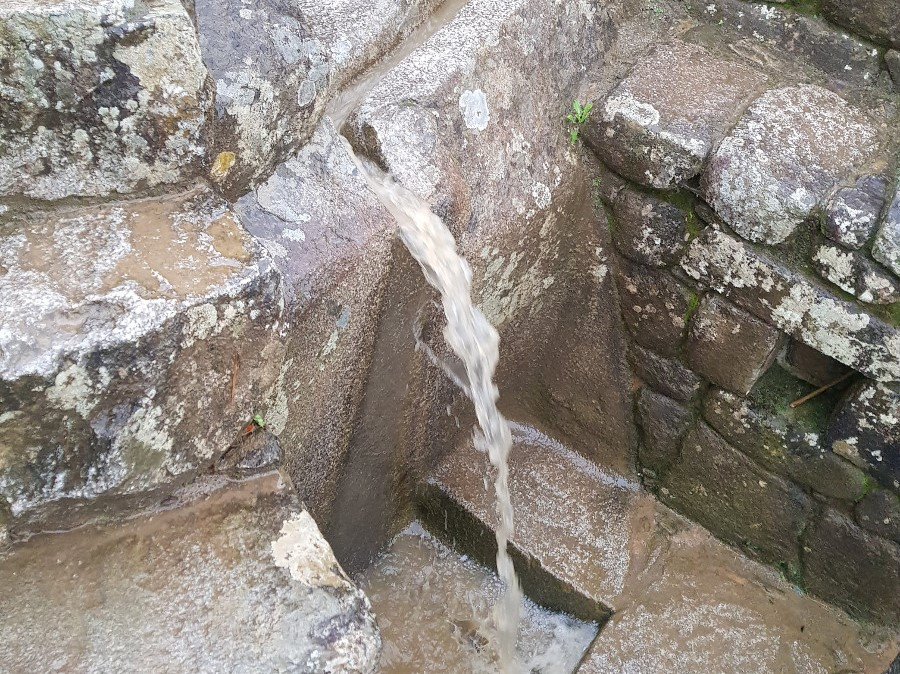

Thankfully after around an hour the clouds started to disappear and the rain stopped. We walked the rest of the city on our own before heading out to use the toilet and have some lunch. When we re-entered Machu Picchu we were finally able to have our 'wow' moment of the magnificence of Machu Picchu. We went up to the guard house first for the ‘postcard picture’. We had to wait in line at the good spots and at one of them a couple spent ages taking a photo of a cuddly llama in front of Machu Picchu before filming themselves chanting Machu Picchu in their Machu Picchu tshirts. We thought this was a bit much. Another girl did the classic jumping pose and was told off by the guards, not only did they tell her jumping was forbidden but they made her delete her photos!

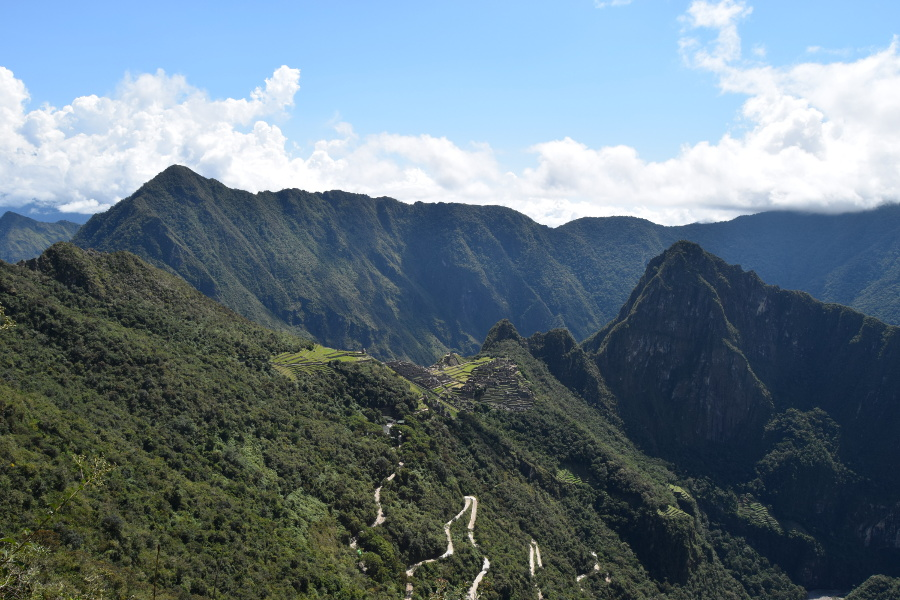

As we walked up to Intipunku (the sun gate), the sun was blaring and it felt like tropical jungle; insect repellent and sun cream was needed! On the forty minute hike to Intipunku there were lots of llamas. The guide had told us that llamas are supposed to live in the highlands for the right diet so they are unhappy as they have the wrong type of grass at Machu Picchu as it is at lower altitude. One of them went a bit rogue as it came up the stairs in between tourists, it almost trod on a little girl and then stormed at two other llamas in the field. The other two ran off and as they were chased they ran into a group of about six people.

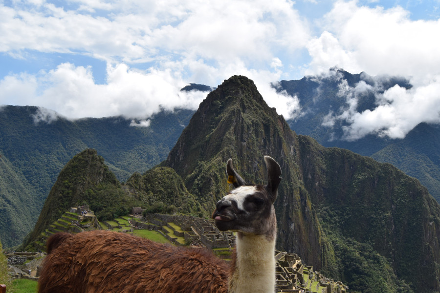

We got great views at Inkipuntu of Machu Picchu and the place was starting to get a quieter as people had taken their photos and were starting to get the buses down. Sadly, Machu Picchu had changed a lot since I last visited six years ago; we were only allowed re-entry once, but the toilet was outside which meant we could only go to the toilet once during our visit. It also had a one way system which meant that we had to follow the arrows and if we took a wrong turn it was bad luck. We’d contemplated going to the Inca Bridge but unfortunately took a wrong turn. Instead we walked around the city unguided taking photos of the bits we hadn’t been able to that morning because of the rain.

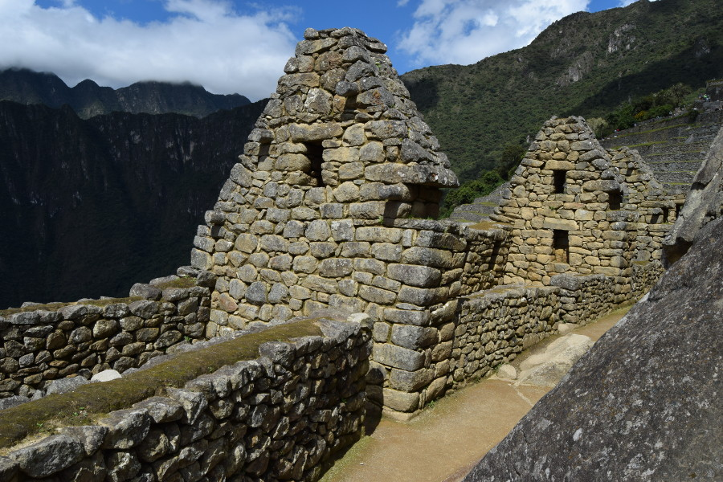

The bus up or down from Machu Picchu to Agues Calientes was $12 (£9) one way. We’d paid to go up but decided to do the hour walk down. It was further than we anticipated and by the last step down our legs were like jelly and our feet felt like they were going to drop off. We also couldn’t work out if they were still wet from the morning or whether they were now just sweaty from the heat. We headed straight to the hostel to change out of our boots before going to get a very late lunch.

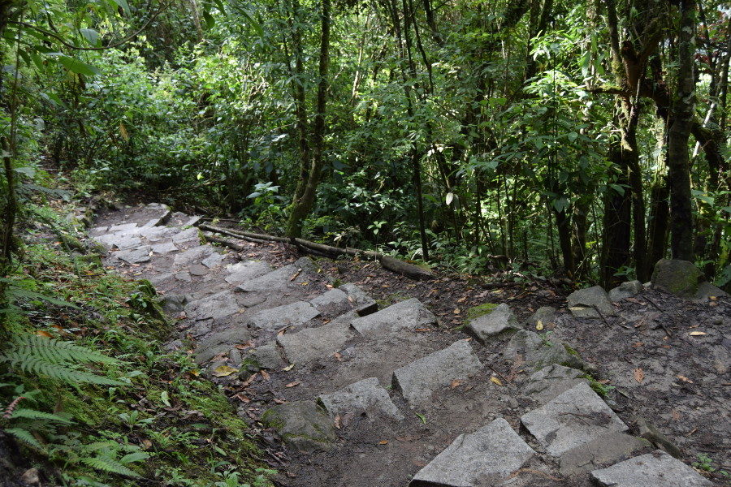

Our ride back to Cusco was a long one. We had a train to Ollytaytambo at 18:20 which took around an hour and a half and then a two hour bus journey back to Cusco. We’d been told that when we reached Ollytaytambo someone would be there with a sign with our names on. They weren’t but using our atrocious Spanglish we were able to find the right minivan back. By the time we got back to our hostel it was around 23:00 and it had been maybe the longest, but one of the best days of our trip.

##Verdict of Inca Jungle
The Inca Jungle was a really fun and adventurous way to reach Machu Picchu, especially as four days of hiking up and downhill, camping and carrying all of our gear for hundreds of pounds to do the classic Inca Trail didn’t really sound like our thing. Machu Picchu itself was phenomenal, even the second time around, and we were lucky in the end as we saw the drainage systems working in the rain, we were able to take photos up in the clouds and saw the city in the clear sky with the sun beaming down. Machu Picchu definitely deserves its status as one of the seven wonders of the world!