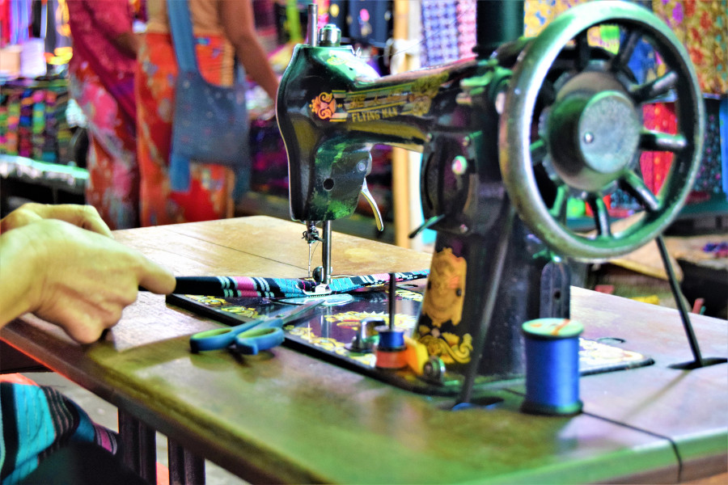
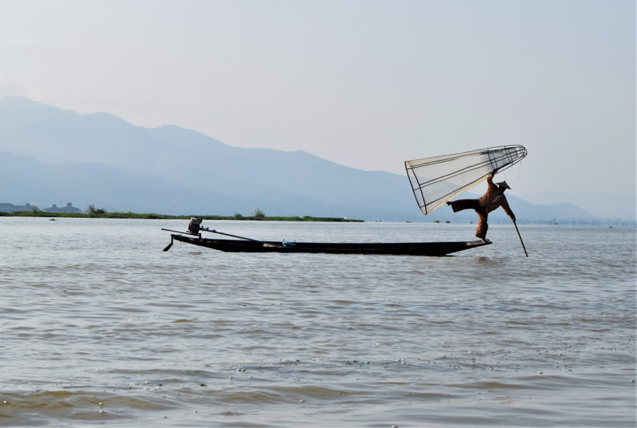
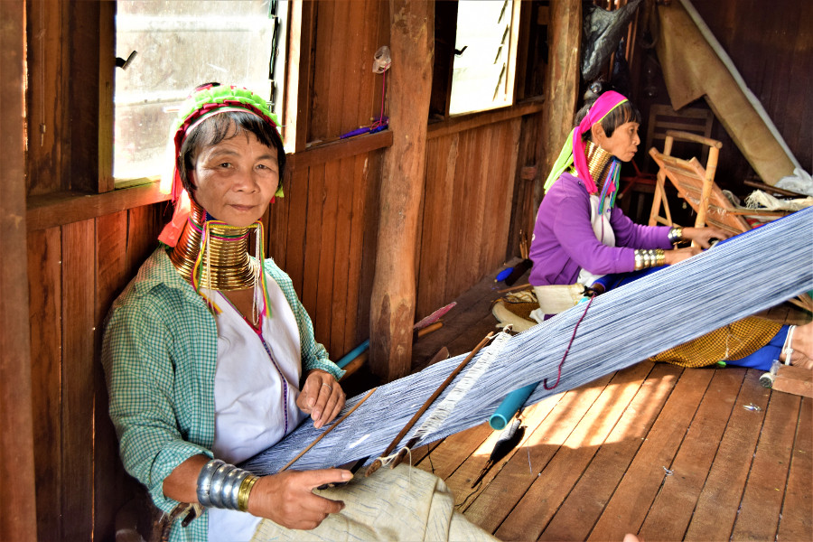
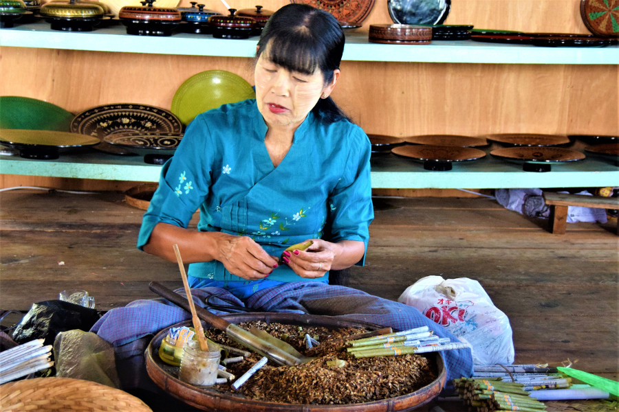
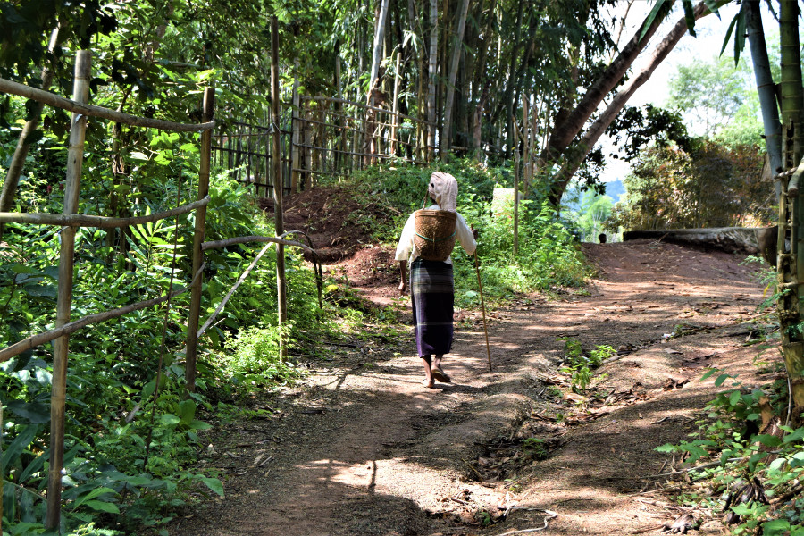
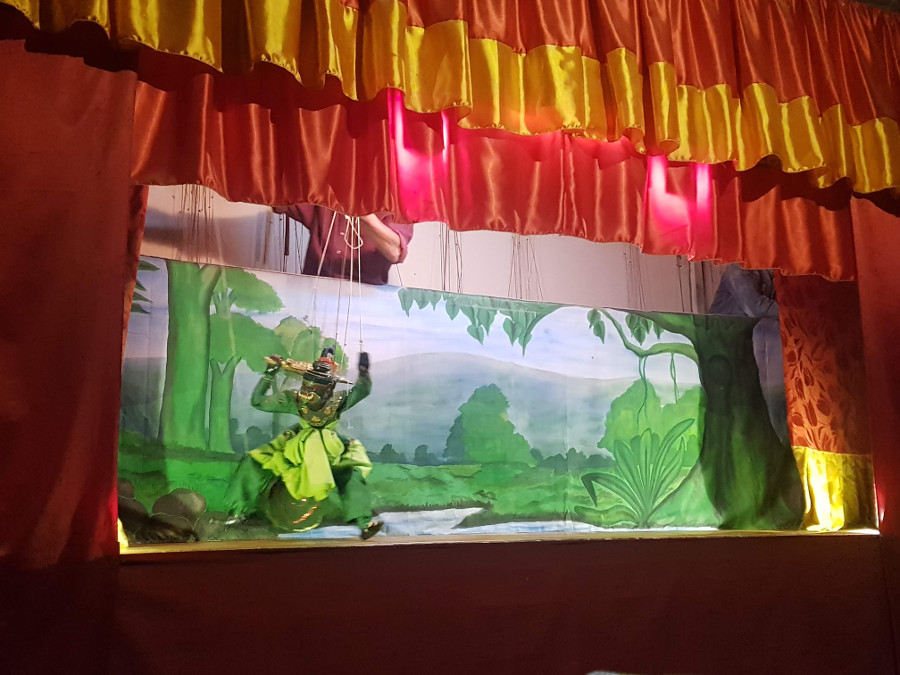
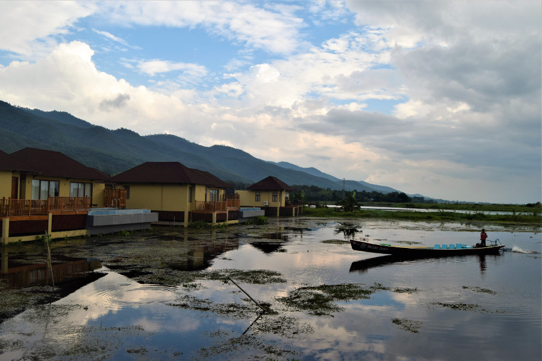

##Nyaung Shwe
We decided to stay in Nyaung Shwe when we visited Inle Lake due to the hotel's on the lake being super expensive. We picked the family run [Motel Album](http://motelalbum.com/) and the staff made us feel very welcome during our stay, although we were pretty much their only guests! After arriving at 5AM on an overnight [JJ Express](https://www.jjexpress.net/) bus and were allowed to check in early so that we could catch up on some sleep. The staff provided us with a nice breakfast outside usual hours and they also gave us a drying rack for our washing, moving it under cover when it rained when we were out.

There wasn't much to do in Nyaung Shwe, so after a quick wander around the town and market; where Soph picked up a longyi for 8000ks (£4), we headed to [One Owl Grill](https://www.facebook.com/oneowlgrill/) for happy hour, where cocktails were 1500ks (75p). Our favourite restaurant in Nyaung Shwe was the top one on Tripadvisor; [Innlay Hut Indian Food house](https://www.facebook.com/Stan313AKA/). The owner is obsessed with Eminem and runs a small, homecooked Indian restaurant. The butter chicken was delicious and so cheap, we ate as much as we would in England and it only cost us £3 each. The owner also had a 20 day old puppy who was called Lil' Pump who he got out right before we left.

##Inle Lake
We arranged a full day tour of Inle lake through the hotel for a bargain of 20,000ks (£10). We were collected at 7:30AM by two young guys on motorbikes, having never ridden one before we asked them to drive slowly on the bumpy roads and in about five minutes they dropped us at the jetty. The younger of the two, he looked around 15 years old, was our boat driver for the day. As it was so cheap, it was a 'no frills' tour, the driver just played on his phone whilst he was waiting for us but we couldn't complain as it had cost us next to nothing. As soon as the boat pulled out into the lake, we saw the infamous balancing fisherman. They use their legs to oar the boat, leaving their hands free to use their nets to catch fish. We only saw a couple of people doing this all day and read later that people on the lake no longer need to do this so some fishermen 'stage' the iconic image for tourists for tips.

Our first stop was Nan Pan Village to a silversmith where we were shown how jewellery was made in the workshop and Soph bought a silver ring with a fern on from the shop, a throwback to our amazing time in New Zealand for $18. When we were finished our driver pointed us towards a market which was beyond a precarious narrow bridge of firstly 2 planks of wood and then a solitary plank of wood over the lake. The market was a long path of aggressive sales people who, if you stopped and looked at something, pretty much bagged it up and arranged a price in seconds. We hurried along past the stalls and boarded our boat again feeling bad for seeming rude.

Our next stop was at a house in the Ywama Village on the lake, where women from the Kayan tribe live; they are known for their long necks caused by the brass coils they wear. We were able to pick them up and they're really heavy! The people are known as Padaung in Shan state, where Inle Lake is located and one of the younger women explained about their tradition. She told us that over the years they add longer coils and it shortens their ribcage and deforms the clavical. She said her sister didn't like it so does not wear them, but people who decided to wear them to be like their anscestors. We read up a little more about it, as our boat man was just a driver and not a guide, anthropologists believe that the rings are worn to protect women from becoming slaves, making them less attractive to other tribes, or that the coils originate from the desire to look more attractive as women have more slender necks than men. It has also been suggested that they are worn to give women the resemblence to a dragon and protect them from tiger bites. Either way, we were pleased to hear that this type of body deformity is now the women's choice.

In the same village we visited an umberella making workshop, where they make umberellas out of paper and we visited the Phaungdaw Oo pagoda. Compared to some of the others we had seen we didn't think it was anything special. The Ywama village is also part of the rotating five day floating market which sadly wasn't on the day we decided to visit the lake.

We also stopped at a silk and cotton weaving workshop in Inpaw Khon Village where we saw the talented women weave fabric using a wood constructed weaver and browsed their shop. They also did lotus Weaving making cotton from a plant. Another stop was at a cigar shop, which produced and sold different types of cigars and cheroots (cigars with the ends snipped off). The only tobacco in them is the single leaf that holds the rest of the ingredients together. They come in different flavours including star anise and honey, banana, mint and original. They were sold in packs of 10 for 4500ks (£2.25) and the cigars were in packs of 6 for 500ks (£2.50).

Our favourite place on Inle Lake was Indein Village and the Nyuang Ohak and Shwe Inn Thein Pagodas, which we later learnt can only be reached by the 8KM creek during rainy season and winter. The village is home to the Pa-Oh people who we saw with their products in the village, many wore scarves on their head. There is a huge cluster of pagoda on a hill which is reached by a 700M walkway lined with stalls and vendors. Some of them are white, some gold, some bricks and some crumbling to pieces. The pagodas were comissioned by an old king and most date back to the 17th and 18th century, other than this there was little information about the stupas and the village. We thought the stupa's were really picturesque and it was the highlight of our day trip.

Our last stop was Nga Hpa Chaung Village, to a monastery with floating gardens. We overheard a guide telling other tourists that mostly tomatoes are grown on the lake and that the vegetation is able to float due to the amount of limestone in the water. We didn't really see anything special about the monastery, like many places in Myanmar it was just full of souvenir stalls. After a few Mynamar tourists asking for photo's with us, clearly pleased they'd met some westerner's, we left. We later learned that the monastery is nicknamed 'jumping cats monastery' as the monks there taught the cats to jump through hoops. Now, at regular intervals during the day, women put on a show of the cats jumping through the hoops; sadly we missed it.

##Yoke thé
There wasn't much to do in Nyaung Shwe during the evening, but we'd heard about a traditional Burmese puppetshow by a puppet master at [Aung Puppet Show](https://www.lonelyplanet.com/myanmar-burma/nyaungshwe/entertainment/aung-myanmar-puppet-show/a/poi-ent/1368972/1335729). It cost 5000ks (£2.50) per person and lastest around 30 minutes. The puppets were really intricate, each one had about 18-19 strings and were controlled by one man, who, by the end of the show was dripping in sweat.

Despite the noisy rain on the corrugated roof, we thoroughly enjoyed the puppet show. I was in awe of the level of skill of the puppet master as you could see his hands just above the stage. The one scene involved a puppet playing keepy upy with a football. As he was using just his right foot to begin with I sarcastically whispered to Soph that he was a bit one footed, not expecting what was to come. The puppet master somehow managed to manuvure the football along the strings to enable the puppet to switch feet between right and left foot as well as heading it.

At the end of the show the puppet master came out to the front and was soaked in sweat following the effort he put into the performance. He explained that his grandfather was a puppet master and passed his skills down the family. However, with the advancement of technology, the locals no longer come to see his shows and now only tourists come to watch. We thought this was a massive shame because he is very talented and the show was well worth the watch.

##Flashpacking
We decided to book a night at the luxurious [Novotel](https://www.booking.com/hotel/mm/novotel-inle-lake-myat-min.en-gb.html) on Inle lake who were kind enough to let us have an early check in and late check out. Up until now we'd mainly used [booking.com](www.booking.com) for sorting out our accommodation, but we found that [agoda](https://www.agoda.com/) had much better discounts in Asia. Unfortunately, during the time we were at the Novotel it rained almost constantly so we only managed to get a few hours of pool time in. However, our room was huge and really nice so we didn't mind too much. We were also glad that we had already had our full day tour on Inle lake as the prices here were astronomical in comparison.

##Our verdict on Inle Lake
We really enjoyed spending a few days relaxing on Inle Lake and the more relaxed vibes on Nyaung Shwe. The boat trip was great value for money and we got to see how local products are made, supporting local businesses buying lots of things we didn't need!