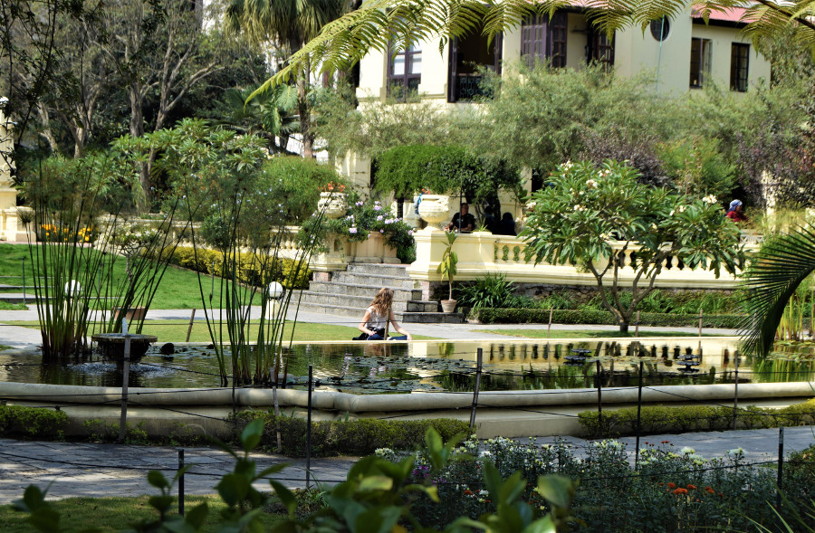
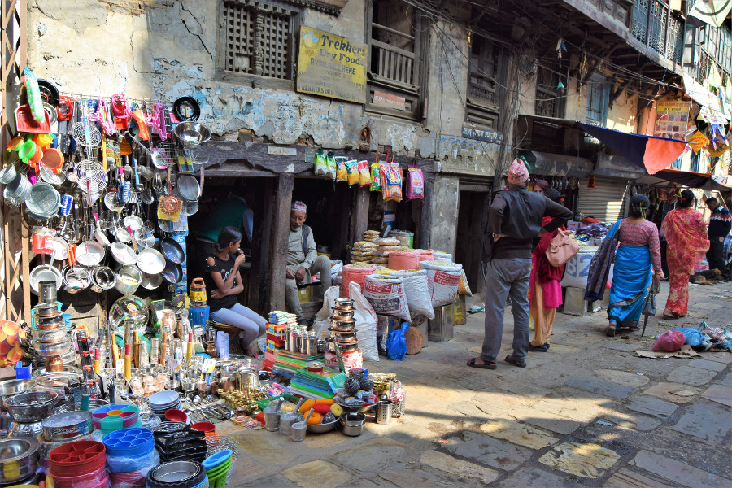
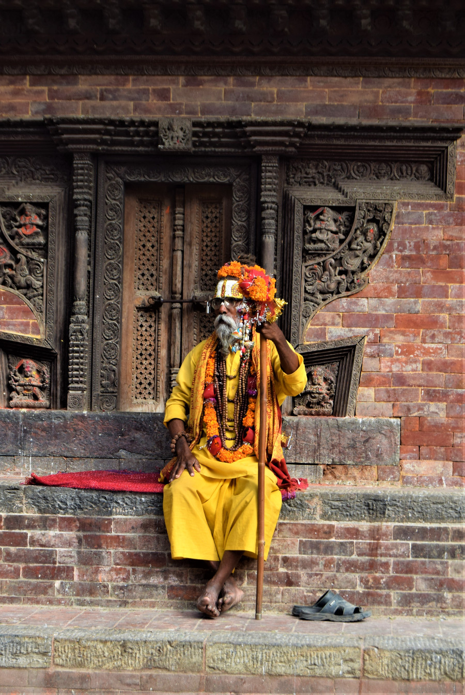
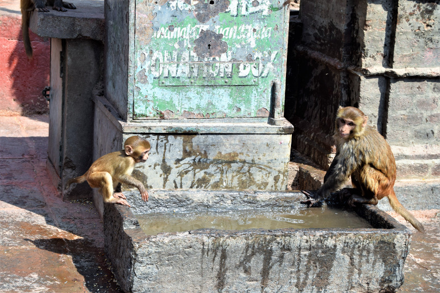
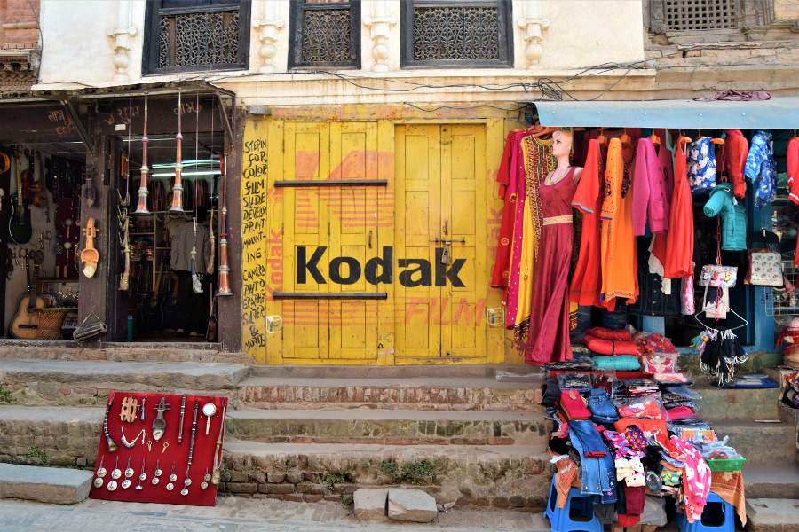
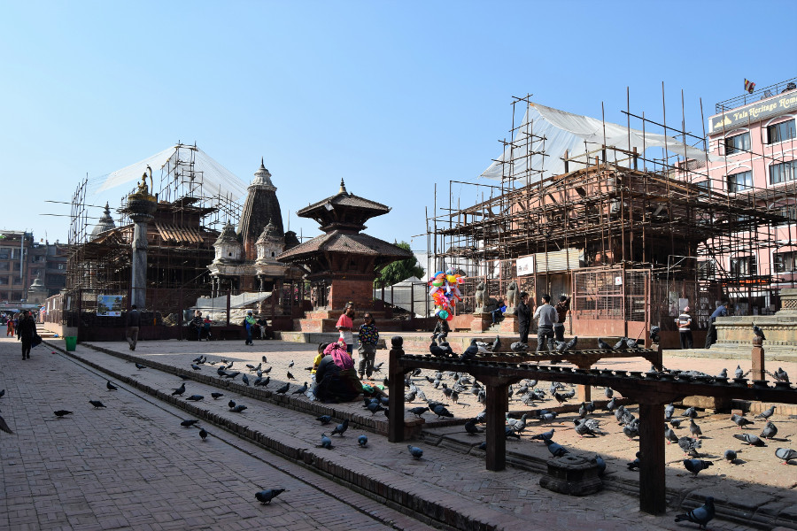
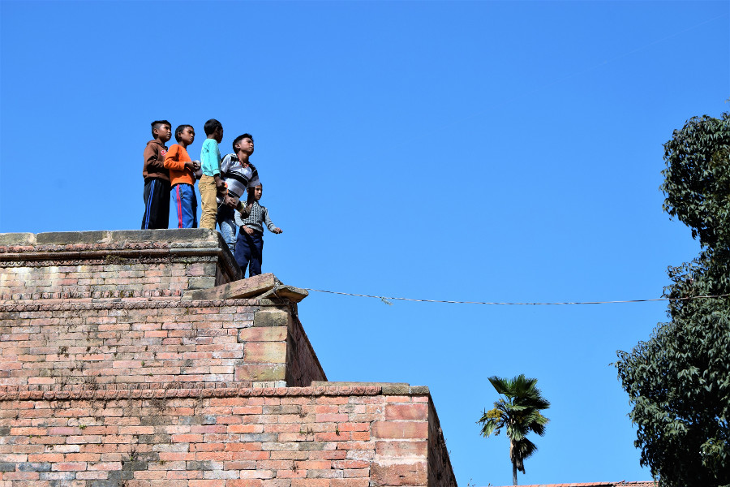
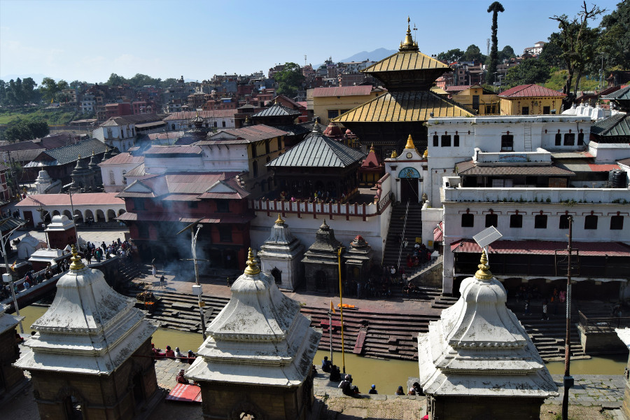
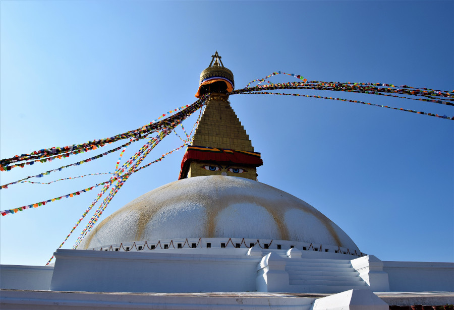

##Yangon to Kathmandu
We flew with [Malaysian Airlines](https://www.malaysiaairlines.com/) from Myanmar to Nepal, despite the countries being close together we had to go back for a connection in Kuala Lumpur. After a long day we arrived in Kathmandu International Airport and it felt like we had gone back in time. We were ushered off the plane but no bus had arrived so a plane load of people were standing about on the runway. Eventually a bus came and we were taken to arrivals to sort out our visa. We’d completed the form online prior to our arrival but still had to fill in an arrival card and queue to pay for our visa. The queues were massive and when a woman complained, staff said there was lots of people off due to [Dashain Festival](https://www.nepalhikingteam.com/dashain-festival/), the longest and biggest Hindu festival in Nepal. After around 45 minutes of queuing we paid for our visa; annoyingly we had to buy a 30 day visa for $40 (£31) as we were in the country 15 days and an hour so couldn’t get away with a 15 day visa for $25 (£19). We then queued to actually get our visa but for some reason the woman was being really slow and picky, she went through all of the stamps in our passport and made us sign a piece of paper to check our signatures. Another 35 minutes later we had our visas but annoyingly it meant we’d paid an extra $15 each to be in the country an extra 10 minutes!

Our next obstacle was money, we’d hoped that immigration would let us get a 15 day visa but as they didn’t they’d taken all the USD we’d changed and so we were left with no cash. The staff at [Hotel Family Home](http://www.hotelfamilyhome.com/), where we were staying, weren’t able to collect us due to the festival, so we had to get a pre-paid taxi from the airport. We’d assumed there would be ATM's in the airport and luckily there was one in a dark hole in the wall that wouldn’t take MasterCard or credit card, so for the first time in 8 months I had to use my back up debit card to withdraw some Nepalese rupees! This continued to be a running problem in Nepal and we only ever found two ATM's that worked with our cards; Standard Charter and Nepal SBI Bank Ltd.

A 20 minute taxi ride later and we arrived in Thamel, the tourist hub of Kathmandu. It was 1AM and the taxi dumped us in an alley pointing to our hotel. We tried to find the entrance, rang a bell we thought belonged to the hotel but we had no choice other than to turn on data roaming to find a number to call someone, taking a hit of £15 in mobile phone charges. By this time we really weren’t happy! After checking into the hotel, just to add the icing on the cake to a terrible first impression, we discovered we were sharing the room with a great big hairy spider and a scuttling cockroach.

##First impressions
We were both apprehensive about travelling to Nepal, never having been to countries around India and this side of Asia. As we were both anxious about how we’d find the city of Kathmandu, we’d booked a highly rated free walking tour with [Himkala Adventure](https://www.himkalaadventure.com/free-walking-tour-kathmandu.html) for our first day, only to wake up in the morning to a message saying the tour wouldn’t be going ahead! With little choice we decided to explore the city for ourselves, trying hard to have an open mind. I downloaded an app called [GPS my city](https://www.gpsmycity.com/) and signed up for the free trial so that we could follow a route and hit all the highlights of the city with a bit of information, without wandering aimlessly as we didn’t have data on our phones.

It was really hard to find anything to like about Kathmandu! We turned out of our hotel and along the road we saw two dead rats. We’d been outside for 30 seconds. We walked through Thamel to [The Garden of Dreams](http://www.gardenofdreams.org.np/) but with narrow streets, no footpath and cars and scooters coming from both directions we found the area really overwhelming. We ducked into the gardens and paid the 200Rs in fees, just for a drink and some peace and quiet. The gardens were really busy with lots of tourists sunbathing on the grass and reading books, so we weren’t the only ones with that idea and it ended up being one of our favourite places in Kathmandu. We returned one morning with our books to chill out and there were 5 or 6 Indian palm squirrels running around, they weren't scared of people and one even jumped onto Dan's knee.

We followed the map past a palace which was closed and a pond which had dried up and had a dead dog outside the gate. This was the third dead animal we’d seen in a couple of hours. We headed to Asan, a market area on the way to Durbar Square. This was where we really found our dislike for Kathmandu, the streets were narrower than Thamel, as Asan is the heart of medieval Kathmandu. Cars and scooters still drive down the streets honking and narrowly missing pedestrians. It was absolute chaos, made worse by the dust covering the buildings from the air pollution and the litter all over the streets. We did later see people in Kathmandu cleaning the streets outside their shops, but as businesses had been closed during Dashain, no one had been cleaning up. We definitely arrived at Kathmandu at the wrong time.

We found the difference in people’s manners really difficult to cope with in Kathmandu; people would hawk back phlegm and spit on the streets, at one point I either trod in that or animal innards (it was very slimy) and flicked all up my shoe. We found it so dirty but locals didn’t turn a blind eye. We could even hear people doing it in our hotel and saw waiters spitting in restaurants, something that would never happen in England and it was something we knew we’d never get used to. No one queues in Nepal either, which as Brits who queue for everything we found really annoying! There were so many massive cultural differences compared to anywhere else we'd been in the world.

We didn’t hang around in Asan for long before we found [Durbar Square](http://www.aghtrekking.com/kathmandu-durbar-square.php). As a UNESCO world heritage site that we had to pay 1000Rs (£6.50) to get into, we had high hopes that it would redeem Kathmandu’s lack of charm. However it was here that the devastation of the 2015 earthquake, which killed around 9000 people was evident. The square is home to the palace of the kings, which is now a museum, but we weren’t able to visit as it was closed due to Dashain. The [Kumari Chowk](https://en.wikipedia.org/wiki/Kumari_(goddess)), a young girl who is selected to be the city’s living goddess and a living symbol of devi, the Hindu concept of female spiritual energy, but she also wasn’t there due to the festival. A lot of the other buildings in the square were sadly still in disrepair, although no building work was being done the day we were there. It made us a little frustrated that in over 3 years restoration to these important religious buildings haven’t been finished, yet the Nepalese government rake in fees from foreign tourists for damage and restoration work and its a UNESCO World Heritage Site. We did manage to get a few photos of the dark wood and red roofs, the pidgeon's and a sadhu, a wandering Holy Man of Nepal.

##Swayambhunath Temple
We decided to walk to [Swayambhunath Temple](https://www.welcomenepal.com/places-to-see/Swayambhunath%20.html) from our hotel which took around half an hour and we slowly made our way up the pilgrims path of 365 steps to the top. Almost immediately the temple lived up to its nickname as numerous monkeys, some with babies on their back, were running up and down the steps and sliding down the handrails. The site is thought to date back 2,500 years. According to local legend a lotus flower was discovered at the centre of an ancient lake that filled the Kathmandu valley by Manjushri, the buddhisattva of wisdom. Seeing that the valley could be a good settlement and to make the site accessible, he cut a gorge to drain the water from the lake. The lotus settled in the spot that the stupa sits today. The monkeys are said to be holy because Manjushri let his hair grow and head lice grew, which then transformed into these monkeys.

Having arrived at the top we paid the entrance fee of 200Rs (£1.30) and we immediately thought that the temple should be nicknamed pigeon temple instead, as they greatly outweighed the number of monkeys. We walked clockwise around the stupa, as it is thought to bring good luck and noticed it has three eyes on each of the four sides, which look out to Kathmandu valley. They are thought to represent wisdom and compassion. Sadly the views of Kathmandu from the top were hazy due to all of the air pollution! The white stupa, the eyes and colourful prayer flags made the temple one of our favourite place in Kathmandu.

##Thamel
This part of Kathmandu is tourist heaven, full of hotels, bars, restaurants and shops both souvenirs and trekking gear! Our advice to anyone travelling to Nepal to trek is to buy good basics at home; thermals, down coats, boots, sunnies and waterproof layers and then buy the rest out here. Dan managed to pick up some ugly beige North Face (definitely fake) walking trousers for 1000Rs (£6.50). In terms of souvenirs there are shops full of hippy trousers, gurkha swords, prayer bowls and flags, felt animals, pom pom coasters, hemp bags and lots of statues of Buddha and Hindu gods.

##Patan
Patan is around 30 minutes from Thamel and we headed there on a day trip. We could have caught a public bus around the outskirts of Nepal but we figured we’d run out of patience and the little minibuses we’d seen were absolutely packed. Instead we paid $45 (£35) for a driver for the day to take us to all the tourist spots. We preferred Patan’s Durbar Square to Kathmandu’s, mainly because the museum was open so we got to go inside the old palace and have a look around. There was lots of information about Hinduism and Buddhism but not much in there about the history of Nepal. Like Kathmandu's Durbar Square we had to pay the 1000Rs entrance fee (£6.50) and even more of the buildings here were covered in metal railings and scaffolding.

##Bhakpatur
This was probably our favourite [Durbar Square](https://en.wikipedia.org/wiki/Bhaktapur_Durbar_Square), despite the fact that it cost 1500Rs (£10) to enter and most of it was covered in scaffolding, by this point we were really annoyed that we were paying £6-10 in fees to see buildings covered in metal scaffolding. However in Bhakapatur it was a little different, as it joined with two other squares and it was really big. Taumadhi Square had a huge pagoda in it and the little streets adjoining the squares were really picturesque. We stopped in the [Daily Grind Coffee Restro](https://www.facebook.com/pages/Daily-Grind-At-Durbar-Square/1339369846089520) and had some chicken momo for lunch, which were delicious. There was also a ruined temple that people are climbing, so we followed suit and watched 4-5 kids playing with their kites on the top!

##Pashupatinath Temple
We didn’t know much about [Pashupatinath Temple](https://pashupatinathtemple.org/) before we got there, the manager of the hotel said it was one of the temples we should visit in the city. We paid another 1000Rs (£6) to enter and like everywhere else refused the guides who approached us at the entrance. We walked along the Bagmati River and it wasn’t long before we came across a number of sadhu or Holy Men, dressed in yellow with their faces made up. They asked if we wanted a photo (for a fee) and this really bugged us. The holy men are infamous and if you instagram Nepal it won’t take long to find a photo of one but Holy Men (Hindu or Buddhist) are supposed to be ascetic, yet they were asking for money for a photo, not donations for the monastery like the monks of Myanmar. We finally reached a crowd by the river and there on the other side, covered in an orange cloth was a dead man. It wasn’t long before he was set on fire and covered in wood right by the side of the river. It was defintely a moment of dark tourism!

It made me feel super uncomfortable, seeing a dead body burn, surrounded by a crowd of tourists and not knowing who the family was. I was also anxious of the smell but other tourists were just stood there filming and taking photos of the dead body's faces with their great big zoom lenses! We didn’t hang around long before leaving. We read after that the body’s at the temple don’t smell of burning flesh and that the ash goes into the river and people wash their clothes further downstream. It’s thought that this is how soap was invented! The temple itself is a temple of Shiva and Hindu's come to the temple to die as it means that any evil committed in their lives would be forgotten. As people don’t know exactly when they’ll die, they come to live their last weeks and days here so that they die in the temple. When we got back, the driver asked how many bodies they were burning, like it was the most normal thing in the world.

##Boudhanath Temple
[Boudhanath Temple](https://en.wikipedia.org/wiki/Boudhanath) was the last stop on our day trip. The temple was pretty impressive and we paid 400Rs (£2.50) to get in. A huge white stupa stood in the middle of a circle of restaurants, guest houses and souvenir shops. We walked around a couple of times and snapped up some photos of Buddhas eyes and the prayer flags before heading back to the hotel. Due to the amount of fees we’d paid throughout the day we were happy we only paid for a driver and found out everything we needed to know on the internet. We could have booked a tour with a guide but these were more than $100 (£77) for the day and they didn’t even visit all the places we wanted to see.

##Our verdict on Kathmandu
We really wanted to like Kathmandu, knowing it would be really different compared to anywhere else we had been in the world. But the city was so dirty, dusty and polluted, we just couldn’t! Paying extortionate fees to see buildings covered in scaffolding didn’t help, nor did the fact that we were nearing the end of our trip and we were definitely starting to feel ready to go home!

