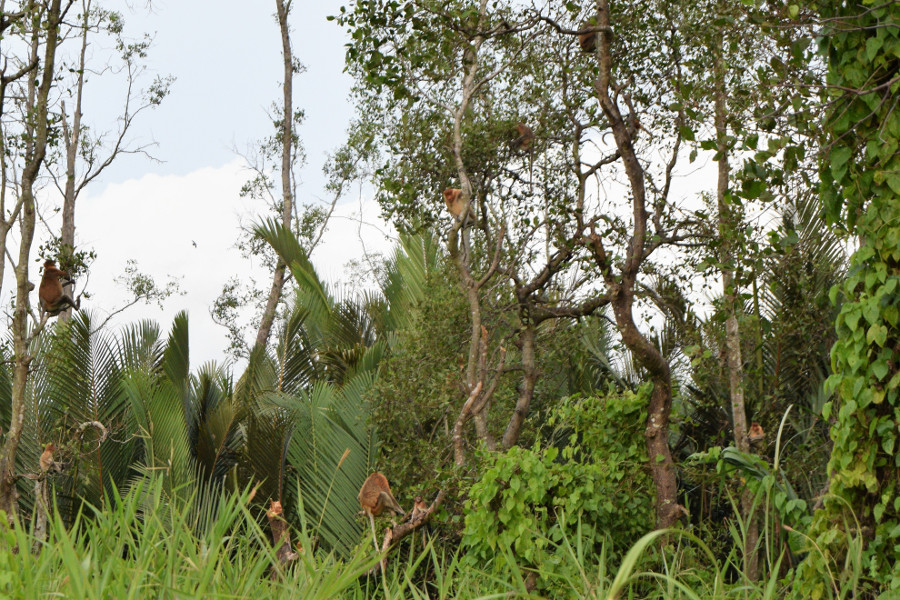
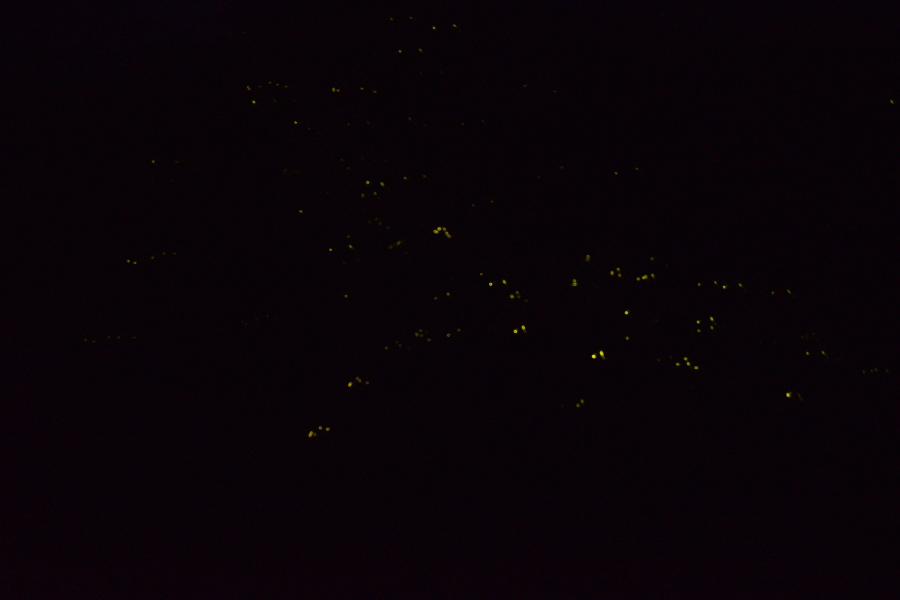
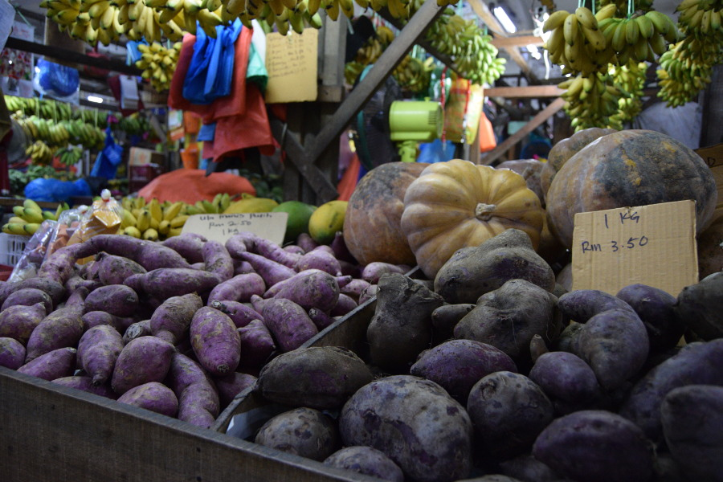
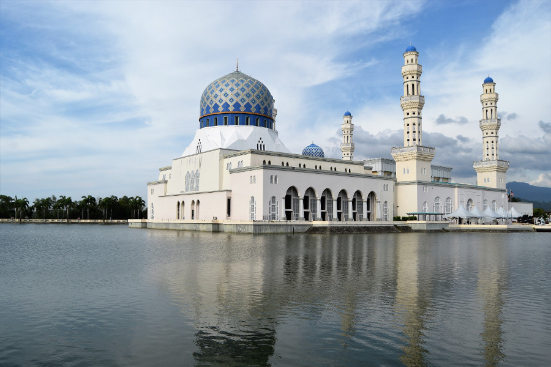
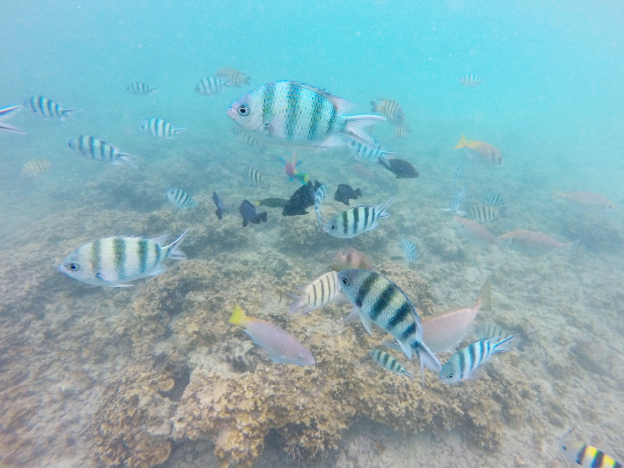

##Firefly Cruise
One of the first things we did when we got to Kota Kinabalu, was to head straight out of the city to the Klias Wetlands. We took a tour booked through our hostel [Akinabalu Youth Hostel](http://www.akinabaluyh.com/) for £28. Mark our guide collected us and drove us two hours south away from the city. We were then put on a busy boat for an hours cruise along the river to find proboscis monkeys. There were loads of them and they were pretty low in the tree's and close to the water. Mark explained that the males have big noses and are bigger than the females. He told us that they are also able to swim and that some people believe that if they eat their noses, they will be a stronger man.

 We headed back to the hut to watch the sunset which was basically non-existant due to being so overcast. Once it had gone dark we went back out on the water to find the fireflies. They were all over the tree's flashing and making the tree's look like they were covered in fairylights. We'd seen the odd firefly in the Amazon, but nothing like this. We were really impressed!

 

##Kota Kinabalu City
Unlike cities on the Malaysian Peninsula, Kota Kinabalu wasn't a modern or culture-filled city; we felt it lacked any charm and was more of hub to reach wildlife in Borneo. It was very dated, grey and full of Western restuarants! We did a free walking tour that was advertised at the hostel with [Sabah Tourism](http://freewalk.sabahtourism.com/) and it actually turned out to be free. The guide left in such haste, no one had chance to give her a tip! She showed us around the city, including some of the buildings that had survived World War 2. She also took us to the Atkinson Clock that was built in memory of Jessleton, as Kota Kinabalu used to be called, after the first district officer died of malaria in 1902 and the Waterfront Markets which were full of fruit, veg and souvenirs.

We also got a Grab out to the city mosque as it was too far to walk. The mosque is surrounded by a moat so it gives the illusion that it is floating. We wanted to go inside but not only was there a 5MYR fee, we also had to rent Muslim clothes to enter which were a further 10MYR, including a headscarf. In the end we paid the entrance fee but stayed on the outside of the mosque to take photos; it was definitely the most picturesque building in all of Kota Kinabalu.

One evening we decided to make the most of happy hour on the Waterfront, which is full of overpriced bars and restuarants and we got lucky with another beautiful sunset! Sadly the food wasn't as good in Borneo as it had been on the Peninsula and it was way more expensive. We ate in [El Centro](https://www.facebook.com/ElCentroKK/), a Mexican restuarant which served mac and cheese, [Mad Ben Cafe](hhtps://www.facebook.com/madbencafe), which did a delicious creme brulee and [Laudroluxe](https://www.facebook.com/Laundrluxe) which did the best passionfruit iced tea!

##Tunku Abdul National Park
We decided to visit two of the five islands in Tunku Abdul National Park, Sapi, which is known to be good for snorkelling and Manukan Island which is supposed to have a picturesque beach. It cost us 40MYR (£7.40) for the return boat trip and snorkelling equipment. At the Jettinson Jetty there are around 12 different companies to choose from which send boats out to the island multiple times a day, so as expected the islands were rammed. The driver took us to Manukan first for a couple of hours, sadly the weather was overcast and the sea was pretty choppy. Some tourists had come on in full faces of make up and lovely evening dresses for a day at the beach, hilariously the driver went really fast and they got absolutely drenched. We thought it was really amusing until one of them in front of us put up her umberella to save her hair, resulting in all of the water going over her umbrella and into our faces instead. When we got there the visibility in the sea looked poor as it had churned up all of the sand and the beach was full of pines from the fir trees, the wind also made it cold and not really sunbathing weather.

After an hour or so we took a boat to Sapi Island, eager to snorkel the reef as it was almost certain to see clown fish! The island was much smaller but the sea was calm, the sun had started shining and it wasn't as busy! We saw signs on the beach to watch out for jellyfish and another sign stating that the reef was closed for the day and we could only swim in the diving area. It was a little annoying but at the same time we were pleased that they had shut the reef off to protect it as the sea wasn't calm enough to swim around it safely without damaging any of it. We had a swim to see what we could find but apart from a few colourful fish that had wandered away from the reef we didn't see anything. We also got really frustrated with other tourists who kept getting whistled at by the lifeguards for going into the reef, some decided to catch the fish in their tshirts and others were feeding the fish god knows what despite being told not to. We were really shocked by other tourists attitude towards the marine life in the park!

##Our Verdict on Kota Kinabalu
Like many other places we had been Kota Kinabalu seemed to be a hub to get to better destinations (unless you have lots of money and can stay at the [Shangri La Resort]). We missed out on lots of things here, a two day climb to Mount Kinabalu, Kinabalu National Park and some islands further north such as Manititi. We were disappointed by Tunku Abdul National Park, mainly because of other tourists behaviour towards the marine life and lack of respect for the rules but the firefly cruise exceeded our expectations and we were really glad we'd done this! It made us look forward to our rainforest stay in Kota Kinabatangan!