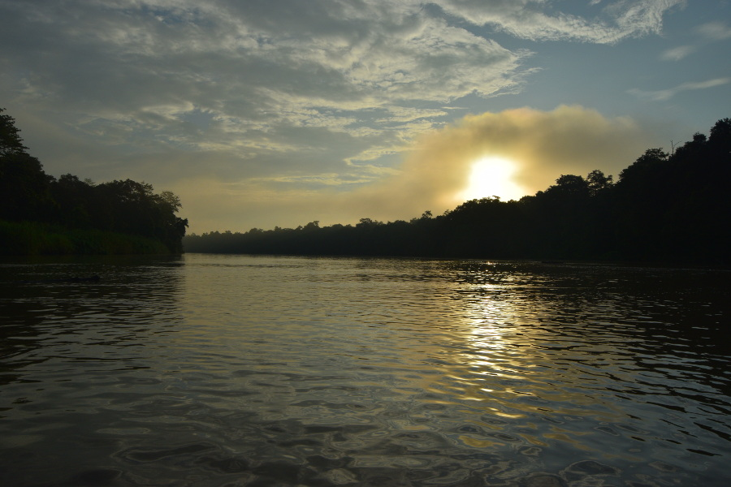
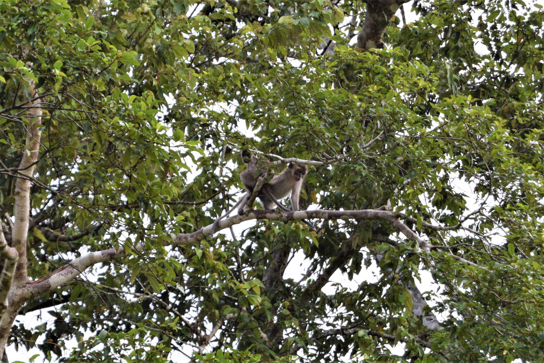
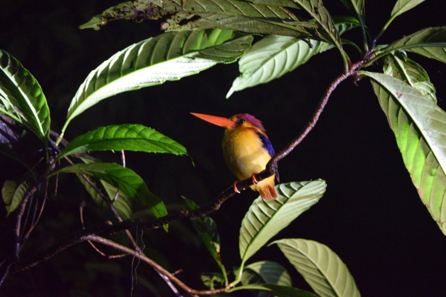
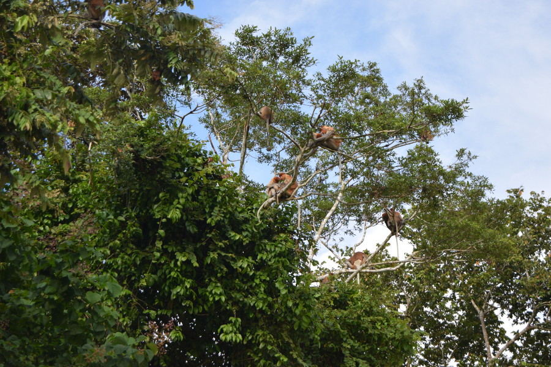
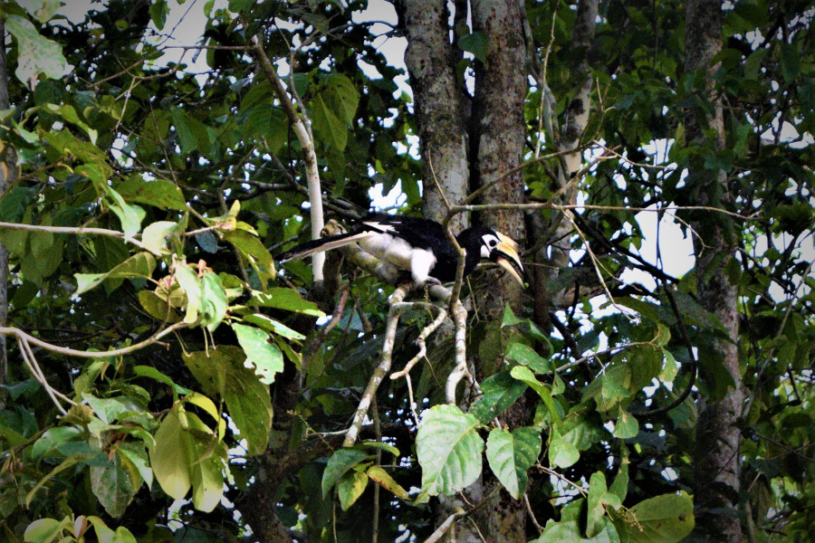
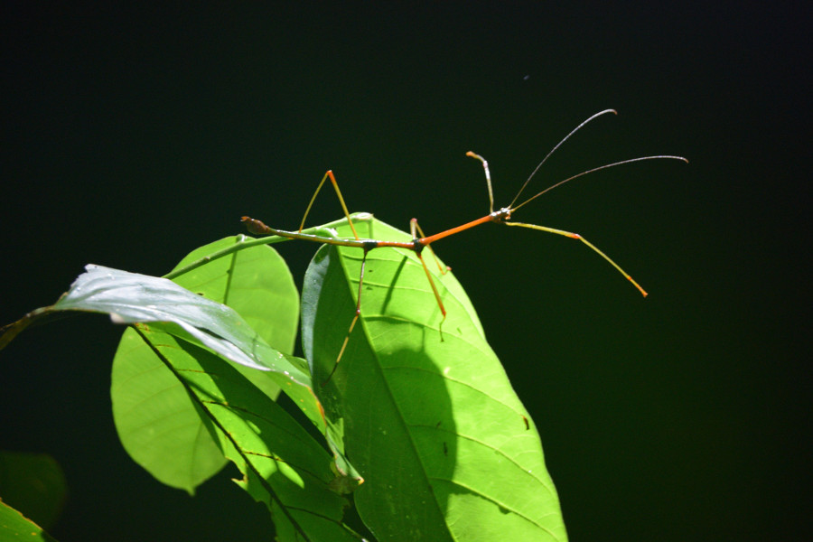

##Nature Lodge
We booked to stay at [Nature Lodge](http://www.naturelodgekinabatangan.com/) in Kota Kinabatangan, an area of rainforest around 2 and a half hours drive from Sandakan. The lodge absolutely exceeded all of our expectations, compared to the basic rickety wooden hut we’d had in the Amazon, this was luxury! We had mozzie nets on the windows plus a plug in, 24 hour electricity, hot water, a fan and air con! Plus a kettle and tea and coffee in the room, it was actually nicer than some of the hostels we’d stayed in and a complete bargain at £112 for 2 nights with all food, water, accommodation, transport, jungle treks and boat trips included! We arrived at around 3 in the afternoon after a having lunch in Sepilok. We dumped our bags and went on a 2 hour river cruise to try and find some wildlife and species endemic to Borneo! We rented a pair of binoculars for 30MYR (£6) for our trip, although this was pricey we knew from our time in the Amazon that a lot of the wildlife would be quite far away and it was the only way of seeing the animals.

 Our guide Mohammed also turned out to be our boatman and with 10 other tourists in the boat it wasn’t the intimate experience we’d had in the Amazon but we were excited about our chances of seeing wild orangutans and pygmy elephants! On our first boat cruise we saw lots of proboscis monkeys, macaque monkeys and some hidden silver leaf monkeys. We saw a few of the common birds found in Borneo and got lucky with a wild orangutan. He was quite far back in the trees making a nest for the night but we could just about see his face through our binoculars. We weren’t the only boat to see him and within minutes there were about 5 boats (so more than 50 people) watching the wild orangutan.

 

After dinner we went on a night walk in the jungle, not my favourite part of a jungle experience. Mohammed told us to wear long pants and tops and to tuck the tops in as leeches are attracted to warm areas of the body, he then told us stories about how he’d ended up with leeches on his penis and his bum. At this point we were pleased we were covered from head to toe with 80% DEET and I had borrowed Dans belt on the tightest notch. We’d rented wellies for 10MYR (£10) for the walk, as it had been raining parts of the forest were muddier than Glastonbury. We got lucky on our first night walk, everyone was respectfully quiet and we managed to see a mouse deer, some colourful birds asleep on branches, a massive stick insect and a civet cat.

The next morning we were up at 05:30 for a river cruise at 06:00. We managed to find some small crocodiles and lots of monkeys looking for some breakfast, including some active silver leaf monkeys. It was at this point that a group of people in our group started to really irritate us. They were chatting the entire time and were so loud they scared off some of the monkeys. One of the guys actually started shouting ‘next’ when we saw a group of monkeys that we’d already seen before. Mohammed took us on a jungle trek later in the morning, we already knew we wouldn’t see anything in the heat of the day with 12 people traipsing through the jungle but he told us anyway. He showed us medicinal plants and pointed out some insects. He also told us some rainforest stories; a time he got lost in the jungle, found by his family after banging on a root of a tree with 15 leeches on him and about a time some pygmy elephants wanted to play football with his daughter, luckily she was okay.

We got super lucky on the second days river cruise. Mohammed took us further than he was supposed to, to the river where the palm oil plantations are in Suruak, this is where the elephants were rumoured to be. On the way we saw our second orangutan in the trees! Sadly we didn’t see any elephants but Mohammed took us onto an oxbow lake and this was nice as it was really tranquil and there was only one other boat on the lake. We managed to see a number of pied hornbills and a couple of rhinoceros hornbills too!

We were really disappointed on our second nightwalk, there seemed to be lots of people going into the forest at once and everyone was really noisy. Tourists kept touching the branches that the sleeping birds were on which in turn disturbed them and woke them up, just so that they could shove their iPhones in the birds faces. Mohammed also found a tarsius tarsier (ghost monkey). He told us that there hadn't been one in the area for around three months and that we couldn't linger for long as they could get stressed and kill themselves. It made us really sad that even after being told this, people were still flashing their torches in its face to get a photo and being really noisy. Evenutally it jumped off hopefully to go and hide! Luckily Dan and I remained leech free in the rainforest, but some of the noiser members of the group who'd decided to trample off the path weren't so lucky!

On the final morning we headed out for a last river cruise and we managed to see more orangtuans getting up in the morning. We also got lucky as another boat had spotted a gibbon so we were able to linger around and watch him through the binoculars.

List of most of the animals we saw in Kota Kinabatangan Reserve:
* Proboscis monkeys
* Macaque monkeys
* Silver leafed monkeys
* Borneo gibbon
* Oriental pied hornbill
* Black hornbill
* Rhinocerous hornbill
* Orangutans (six)
* Oriental dwarf kingfisher
* Stork billed kingfisher
* Blue eared kingfisher
* Green imperial pigeon
* Stick insect
* Bats
* Civet cat
* Mouse deer
* Crocodile
* Wallaces hawk eagle
* Blue throated bee-eater
* Black squirrel
* Storms stalk
* Pygmy squirrel
* Serpent eagle
* Bat hawk
* Tarsius tarsier

##Our verdict on Kota Kinabatangan
Overall we enjoyed our time in Kota Kinabatangan; it was amazing to see orangutans in the wild! However, we left feeling really annoyed and frustrated by the way other people had behaved!
