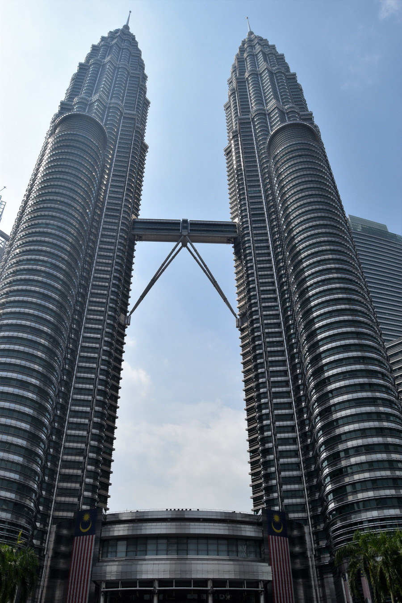
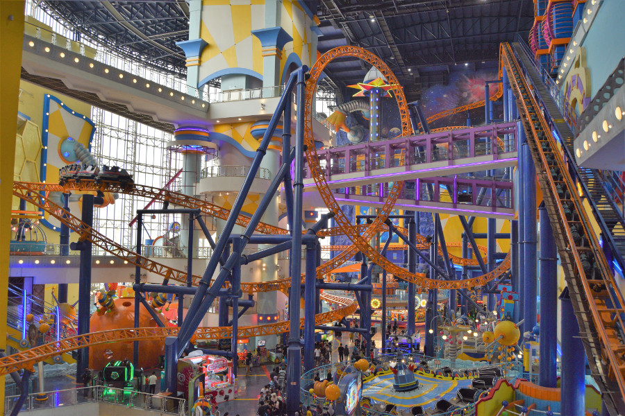
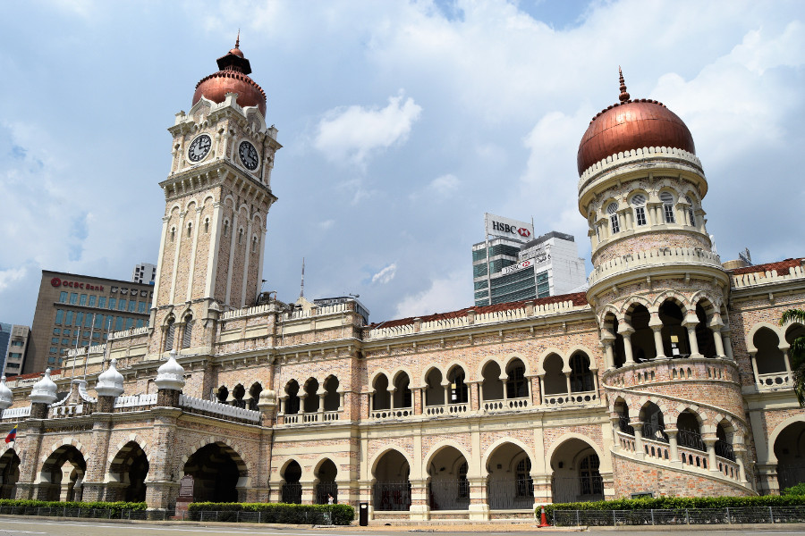
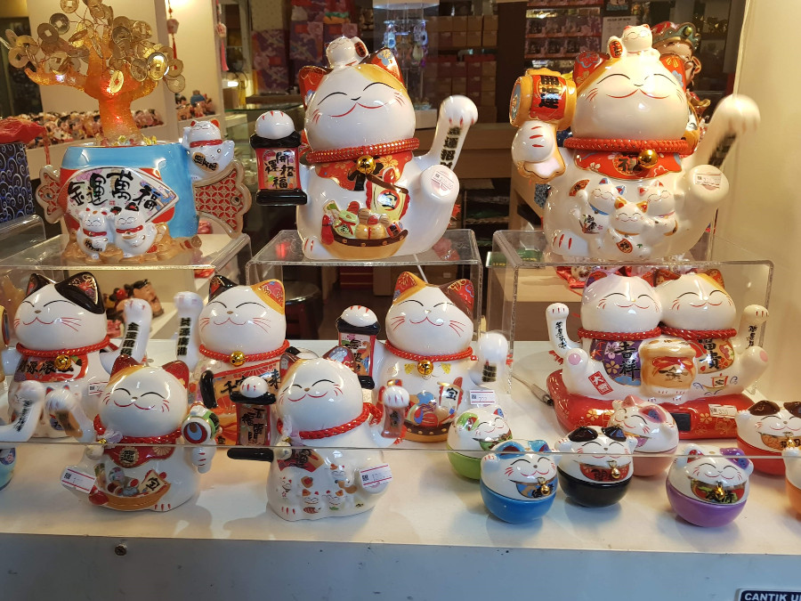
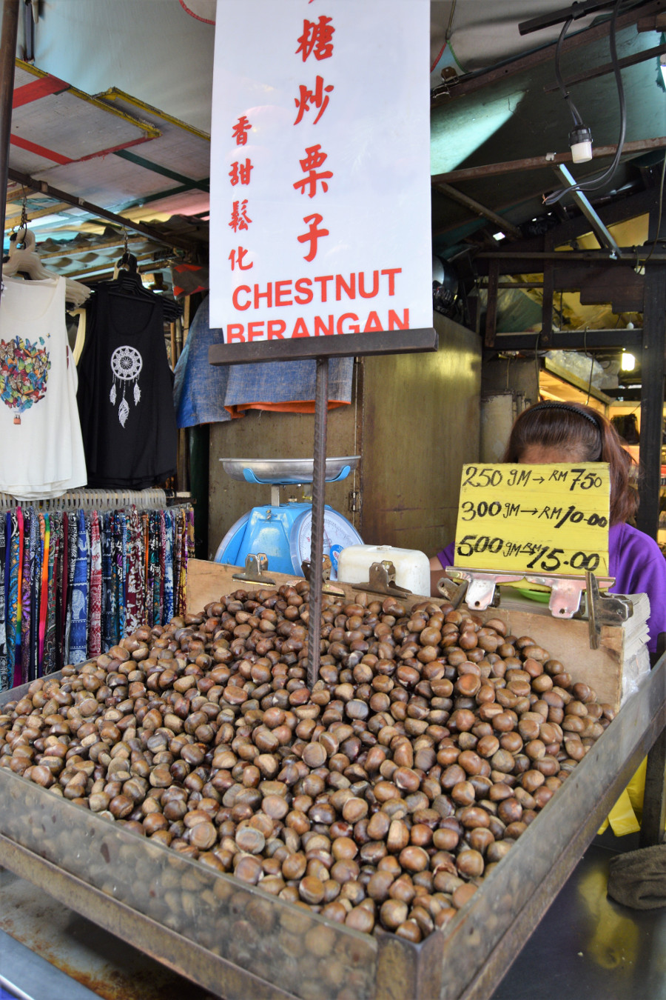
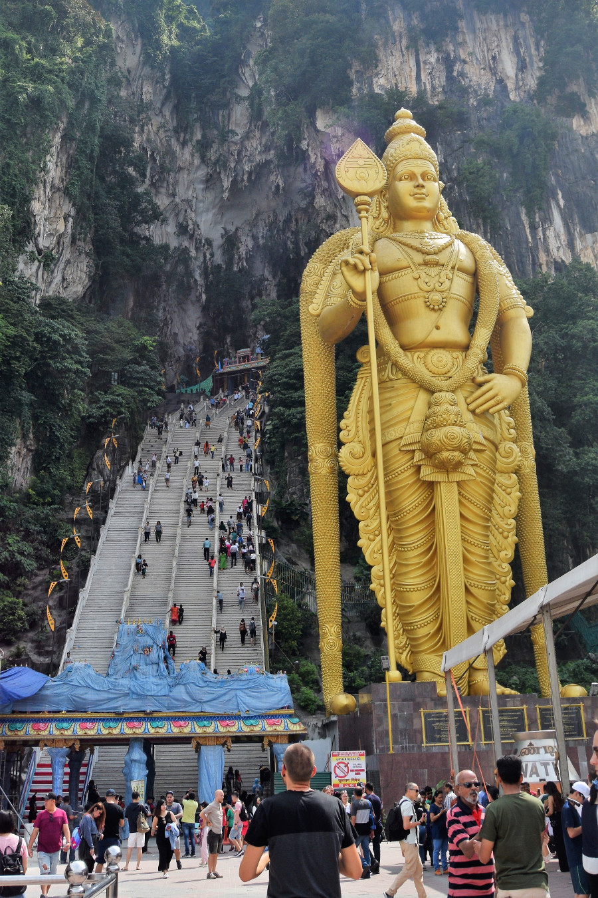
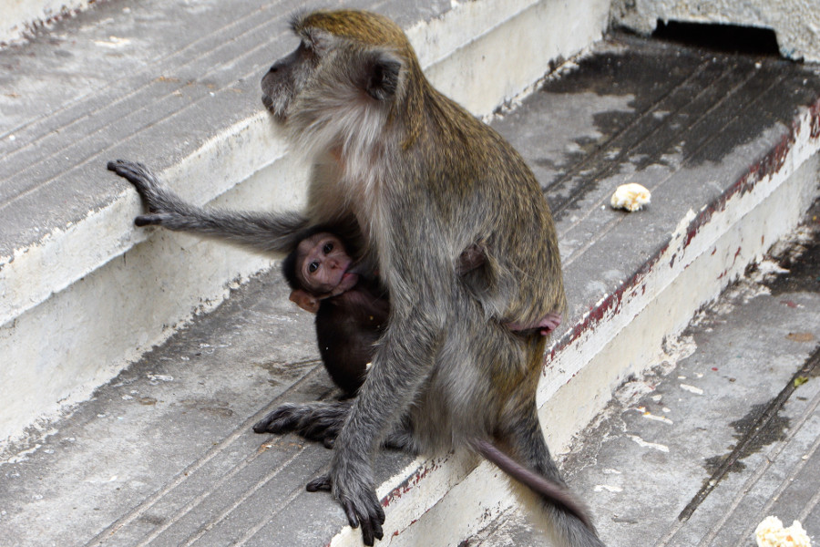
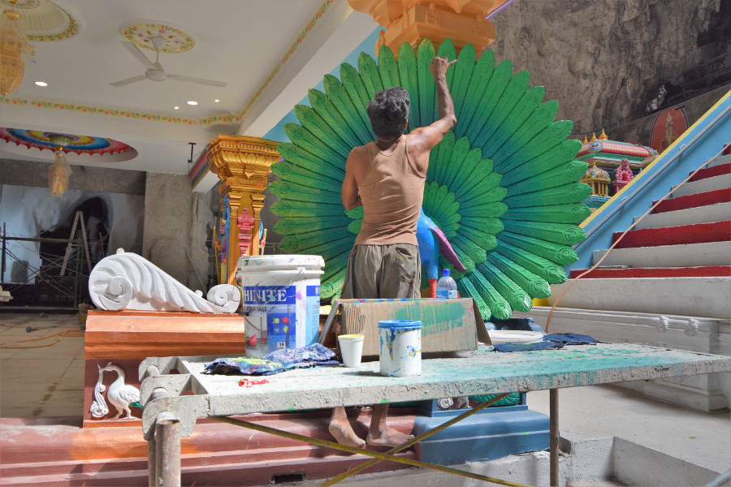

##Kuala Lumpur City Centre (KLCC)
We ended up bringing our plans forward to visit Malaysia as we decided to cut out Bali and Lombok, given the reoccurring earthquakes, the Gili's being off the cards and the UK government advice, so we headed straight to Kuala Lumpur from New Zealand. Our flights were long and we ended up visiting four countries in 24 hours; Christchurch (NZ) to Brisbane (Aus) to Bali (Indonesia) and finally Kuala Lumpur.

As we’d had a lush hotel booked for Dan's birthday in Ubud with an infinity pool and a luxury room, we tried desperately to find the equivalent last minute in Kuala Lumpur. We struggled! Eventually we managed to find an Airbnb in Marc Residence, just a few minutes walk away from the Petronas Towers. From the outside the building looked posh, but the pool was constantly filled with children and the studio apartment was a massive disappointment. We had no hot water and a blocked shower drain for 24 hours, no pots and pans to cook with and it wasn’t the cleanest. However it was pretty central and as Kuala Lumpur is such a big city we barely spent any time there anyway.

KLCC was a nice area, we ate at [Naughty Nuris](https://www.naughtynuris.com.my/) in the Life Centre on Dan's birthday and there were lots of bars and restaurants around. The mall near the Petronas Towers was really posh with a Tiffany’s and lots of other upmarket stores selling goods with 0% GST for the holiday period (1st June until 1st September 2018) but the shopping was still well out of our budget.

##Malls
Kuala Lumpur is filled with malls and places to eat. Malaysian pastime is to shop, eat, eat some more, shop and eat again. The first mall we visited was the [Megamall](http://www.midvalley.com.my/), it was quite far out of the city so we took a [Grab](https://www.grab.com/my/). Grab is a great service in Malaysia, like Uber but better. You can collect rewards and use promo codes to get money off and once you’ve searched for a journey the price is locked in, even if the driver cancels. As there was two of us, Grab mostly turned out to be cheaper than paying for public transport and it was much quicker despite the city traffic. The Megamall was huge, like all the malls, it had 6-7 floors, English shops like Topshop and Sports Direct and a huge food court. There was even a pet shop selling the usual birds, fish, rabbits alongside cats and dogs.

We ended up visiting many more malls. [Times Square Mall](https://berjayatimessquarekl.com/) had 12 floors and an indoor theme park with a rollercoaster that goes around the mall. This had Malaysian branded clothes and I managed to pick up a Disney tshirt for 12.90MYR which is £2.50. We went to [The Pavillion](http://www.pavilion-kl.com/) which was slightly posher with shops like Michael Kors and Armani. Another was called [NU Sentral](https://www.nusentral.com/) with high street shops and more food. Our favourite was [Lot 10](http://www.lot10.com.my/), not just because it had a H&M, but for the Hawker Market in the basement. We ate there one evening trying different street food dishes including dim sum, noodles and spring rolls. One of our Grab drivers explained why there are so many malls in Kuala Lumpur; he told us that it is hot in Kuala Lumpur all year round and families visit the malls during the weekends to make use of the air conditioning and get out of the heat, which is exactly what we had been doing.

##Bukit Bitang
This area was really touristy especially after it got dark. It was filled with malls (surprise surprise), along with restaurants and bars. We headed to the main street for a drink one evening in [The Rabbit Hole](http://www.rabbithole.com.my/) but it wasn’t really our kind of place, filled with Irish bars and tacky clubs. Considering everything is so cheap in Kuala Lumpur, the alcohol was pricey! It wasn’t really more than what we’d been paying in New Zealand but food was so cheap it meant that a beer was more than a meal!

##Muzium Negara
Kuala Lumpur is a massive city and there weren't any good free walking tours that we could find. As we wanted to learn a bit more about Malaysian history, we decided to visit the national museum, [Muzium Negara](http://www.muziumnegara.gov.my/). It cost 5MYR (£1) to visit and we spent a couple of hours there. The museum is like a timeline of Malaysian history from the Paleozoic era and the first signs of life until the modern day. There were really interesting parts and we learned that Malaysia came to life because of Malacca, a city south of Kuala Lumpur that was important for trade - set in the middle of Asia and India. It’s tolerant of all people and religions because of its roots stemming from immigration and its trade routes. We learned that Portugal invaded for control of Malacca in 1511, followed by the Dutch in 1614 and then the Brits took over in 1841 to control the administration side of trade.

The most interesting part of the museum was the modern history. We learned that Japan took control of Malaysia during WW2 and after the war there were communist guerrilla groups and schools educating in english, which prompted Malaysia to start their fight for independence. This was achieved on 31st August 1957 which explained all of the Malaysian flags plastered all over Kuala Lumpur in preparation for their Independence Day.

##Merdeka Square
We visited Merdeka Square on a hot afternoon to see the Sultan Abdul Samad Building, which was pretty impressive. Luckily the road was closed as it was a Sunday which meant we were able to get some good photos of the building standing in the middle of the six lane road.

We also queued for a picture by the ‘I love KL’ sign, and visited the Sri Mahamariamman Temple but we didn’t go in as we had to remove our shoes and leave them on the street. We’d also come unprepared without socks and didn’t fancy walking around barefoot on the city pavement. The outside was very intricate and colourful and not like anything we'd seen before! In Merdeka Square, whilst we were waiting for a Grab, an Asian girl, around 10 years old asked if she could have a photograph with me. We got lots of stares in Kuala Lumpur as we were the ethnic minority; most tourists seemed to be from nearby Asian countries and it was the first time we'd felt this way on our trip.

The Central Market was possibly my favourite place in Kuala Lumpur. It wasn’t new and shiny like the malls but wasn’t dirty and smelly like the markets in South America. It was full of souvenirs and had different areas - Malay, India and China. We even ate in there getting a delicious Pad Thai for just over £3. We found a stall selling lucky Malaysian cats (the waving ones) made from porcelain and decided to invest in one to bring us good fortune when we return to the UK.

##Chinatown
We headed to Chinatown in the evening and it was heaving. It was full of market stalls with everything fake you could imagine; watches, make up, jewellery, bags, shoes, tshirts and caps. Dan managed to find a fake Nigeria football shirt he had been after since he’d seen it before the World Cup, I brought some obligatory elephant trousers for 20MYR (£4) and Dan got the iconic Tiger vest. The street food there we felt was questionable as the area was poorly maintained so we didn’t eat there, except for a bag of roasted chestnuts.

##Batu Caves
The [Batu Caves](https://en.wikipedia.org/wiki/Batu_Caves) are one of the main attractions in Kuala Lumpur. The caves are a Hindu Shrine with a huge Hindu statue of Lord Murugan measuring 140ft high. We got a Grab there, which was 24MYR (£5) and took around 20 minutes. The main Cathedral Cave was free to enter but it was sadly under renovation so everything was covered in blue tarpaulin. However the parts that were being painted that we could see were really colourful!

There were loads of monkeys at the temples too and we’d read that we shouldn’t make eye contact with them and that they would attack for food. However so many tourists were feeding them, we saw young children pretending they had food in their hands so that the monkeys would come over and sit on their laps to open their hands, only to find there was nothing there. We thought it was amazing that no one was bitten!

The Dark Cave and Cavevilla both had entry fees and we decided not to visit these. The Dark Cave was pitch black and you can only enter on a guided tour. It’s main attraction is the trapdoor spiders, the most elusive spider in the world that trap prey in its ‘door’. The Cavevilla cave was more like a zoo and I’d read reviews before we went which said that the enclosures are small and it’s a sad and sorry site. We’d read that the Ramayana Cave was free to enter but when we visited it was 5MYR per person. As a pound wasn’t going to break the bank, we paid and had a look around. There were lots of statues which depicted the story of Rama. It was worth having a look and made our visit worthwhile. As we couldn’t get any WiFi to get a Grab back into the city, we had little choice other than to get the train. The train comes approximately once an hour and we’d luckily managed to time it so we weren’t waiting long. It cost 3MYR each, less than a pound.

##Our Verdict on Kuala Lumpur
We thoroughly enjoyed our time in Kuala Lumpur, it was a great place to shop and replenish our backpacks, and the food was incredible!
