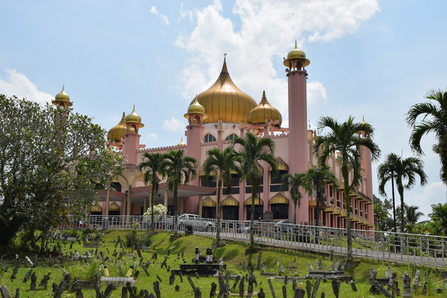
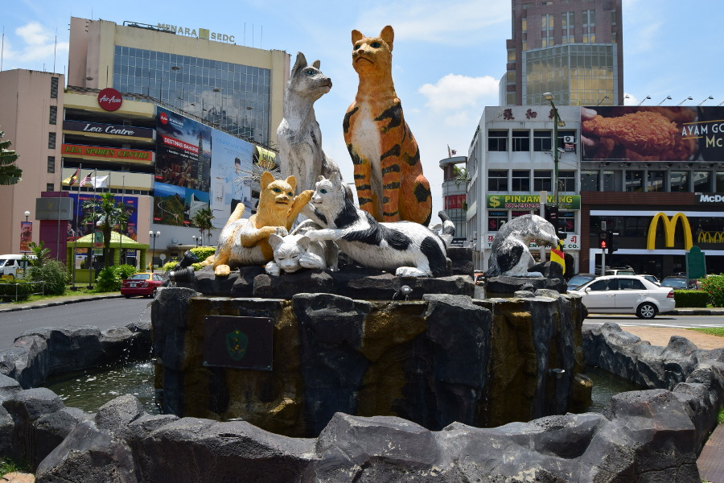
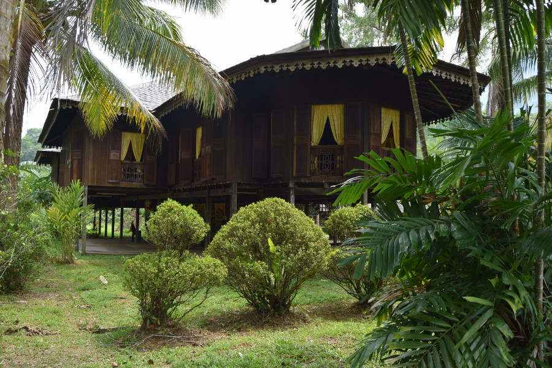
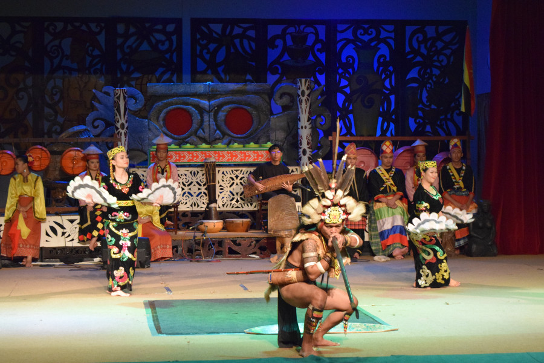

##Kuching
We flew from Kota Kinabalu to Kuching, a city in the state of Sarawak in Malaysian Borneo. We had grand plans for Kuching; visiting Bako National Park, spending some time on Damai beach and going to Seminggoh Orangutan Reserve. But we ended up doing non of those things. We stayed in [My Place Hotel & Lodge](https://www.facebook.com/myplacelodgekuching/) for £11 a night but it turned out to be so damp and smelly we managed just two nights before checking out and upgrading to the [Batik Boutique Hotel](https://batikboutiquehotel.com/) which was £34 for the night. The hotel was delightful and it had a huge stone bath (just like the one we’d missed out on in Bali) so we ended up spending the day, from check in at 2PM until 5PM the next day in the room; catching up on sleep, planning our next stop and having as many baths as we could manage in 27 hours.

Whilst we were in Kuching we visited some of the better known sites, such as the Kuching Mosque which is pink and gold, India Street, the waterfront where we had great views of the Darul Hana Bridge, the government building and Fort Margarita. We also ate in a Fast and Furious Themed cafe called [Feast & Furious](https://www.facebook.com/feastfuriouscafe/), we both had the Sarawak Laksa which was super spicy! We also found a Chinese restaurant called [Life Cafe](http://lifecafe.my/) where the food was super cheap and tasty!

##Cat City
Kuching is known for being the city of cats so of course Dan wouldn’t agree to go to Borneo unless we could visit. Ironically, apart from the statues there weren’t many cats around. We saw 3 different cat statues on roundabouts, one which can be hi-fived in the middle of the busy traffic, but there were more in the city.

We also visited the [Cat museum](https://sarawaktourism.com/attraction/cat-museum/)which was a little far out so we had to catch a Grab. I’m not sure what I was expecting but it was basically a huge hall filled with a crazy cat ladies collection of cat related trinkets and possessions. There were even some badly taxidermied cats right at the end.

##Sarawak Cultural Museum
There were lot of different trips we could have done to visit some of the Borneo tribes in their longhouses in Sarawak. We looked at one to the Iban tribe but read that they put on a cockfight for tourists and we were worried that a trip like this might feel like a human zoo. This wasn’t something that we would have felt comfortable watching so instead we decided to visit [Sarawak Cultural Museum](https://scv.com.my/). It wasn’t authentic but it was an open air museum that displayed replicas of seven different types of traditional houses and longhouses found in Malaysian Borneo that we could walk around, including; a Malay house, a Chinese Farm house, Iban, Bidhyu and an Orang Ulu longhouse.

People were dressed up in the tribes traditional clothing and at 11:30 they put on a cultural show. This was much better than we expected it to be, mainly because of the one guy in a loincloth. As part of his act he was using a blow dart and picked a westerner to help him, which everyone thought was hilarious. It made a good visit for half a day and we even saw a picture of Prince Charles and Camila on the wall of the Iban longhouse from when they had visited less than a year before us. A trip good enough for royalty.

##Our verdict on Kuching
Kuching doesn’t offer anything different to the places we had visited in Sabah so rather than tiring ourselves out doing things that were similar to what we had done in Kota Kinabalu and Sandakan, we used our time in Kuching to relax a little and prefer for our next stop, Japan.

