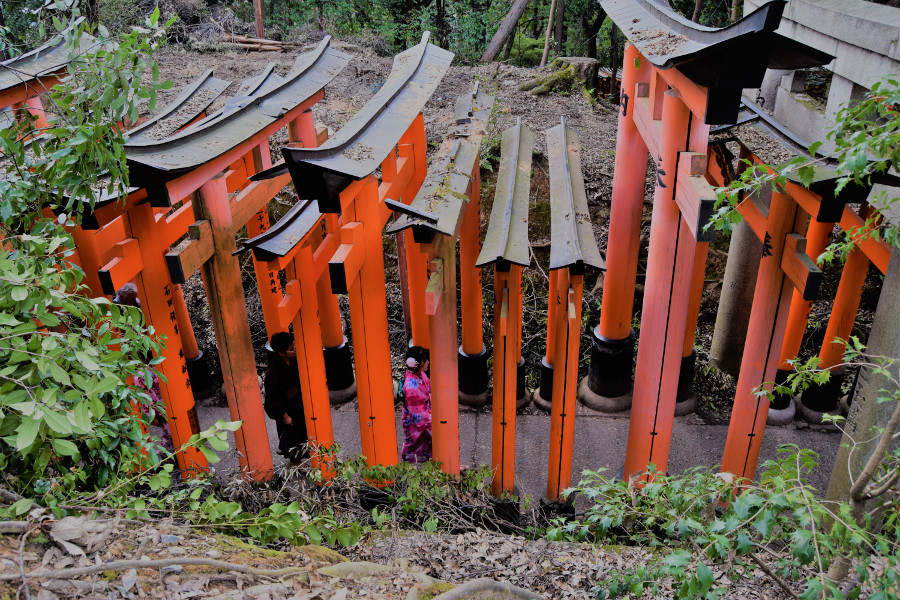

##Kyoto City
The train from Kanazawa to Kyoto, the Thunderbird, took around an hour to reach the city. We stayed in [Slow House Hostel](https://slowhousekyoto.business.site) which was slightly out of Kyoto's city centre. It was also an old wooden house which meant it was exceptionally noisy! We dropped off our bags and headed straight out to do some sightseeing. Our first stop was back at Kyoto Station, where there happened to be a school talent competition on as we were passing through. We grabbed a pie and sat on the steps to watch some of the kids perform. First was a band singing a song in Japanese, which sounded a bit like Greenday. Next up was a cheerleading squad dancing to 'Girlfriend' by Swifty. Hilariously, the school had chosen an undubbed version so we saw the girls dancing along happily to the lines containing swear words.

Initally Kyoto failed to impress us like Toyko, Yudanaka and Kanazawa had. We headed to Gion, the geisha area. Unlike Kanazawa it wasn't so busy with tourists and consisted of around two main streets. Again, sadly, cars are able to drive around the beautiful historic neighbourhood which really spoils the ambiance of the area. We had a walk around some of the streets and saw the Tatsumi Bridge and we also got super lucky and saw a geisha walking to one of her appointments, we only noticed as she had all of her make up on, otherwise we probably would have just thought she was another tourist dressed in a kimono. Luckily, there was no one else on the street so she was spared being mobbed by other tourists.

As we stepped straight out of Gion and onto the main road, we were surrounded by modern shops such as H&M, Flying Tiger and Disney but behind this we managed to sniff out a shopping arcade called Shinkyohoku. It was full of souvenir shops, vintage shops and sake bars. There were even a couple of hidden shrines in there.

We headed to Pontocho as we had heard it was a good area to eat. The street was a narrow alley full of michelin star restuarants, we later heard that there are around 90 in Kyoto and it goes without saying they were all out of our budget. Instead we ate at KFC and then headed to [L'Escamoteur](https://facebook.com/LEscamoteur-1392735951033939), a hipster bar for a £10 cocktail. It was tiny and the staff were all western, dressed to perform as they made the cocktails, one had a great moustache and a top hat.

##Gion
As we failed to fall in love with Kyoto, the same way we had with everywhere else we'd been in Japan, we decided to do a [free walking tour](http://kyotofreewalkingtour.com). The guide Uri was great, however the group was absolutely huge and definitely irritated a lot of the locals. One of them even told him off as 40 odd westerners were blocking the street in Gion. Uri was very knowledgable and told us all about Japanese culture. Geisha are called maiko and geiko in Kyoto; a maiko is a geiko in training, and it takes six years to become a geiko. During this time the girls cannot enter into relationships or marry and they do not earn any money, they are cared for by the okiya who run the houses and tea houses. He told us that the girls come looking for an okiya at the age of 15 and after an interview, her parents have to give their permission for her to start training as a maiko. He explained that the okiya invest around half a million pounds into each maiko over the six years, when they are trained to dance, perform, play instruments, do their hair and entertain their clients. Uri explained that it's very exclusive and although maiko and geiko can be hired by anyone or perform in resturants, they are usually hired by their regular clients. He explained that they will dance and perform for around 10 minutes and spend the rest of the time drinking and talking to the men. He told us that they play drinking games with their clients - one similar to rock, paper, scissors but with old lady, samurai and tiger instead.

Uri showed us where some of the film 'Memoirs of a Geisha' was filmed and took us to the geisha school, where we saw another maiko running some of her errands. Fortunately she was so quick and Uri was a little late in pointing her out that she wasn't mobbed by the group on the walking tour. He told us that he'd asked a maiko what the worst part of their job was; he said that they always reply saying its the way that they have to sleep. Because it takes so long to do their hair and it's very damaging, its done once a week meaning that they cannot sleep on it, so they have to sleep on a neck stand. He said it's something they say they never get used to. Once maiko become geiko they no longer have to sleep in this way and are able to wear a wig instead. Uri was challenged by some of the feminists on the walking tour about the traditions of geisha and he explained that the geisha world is very much run by women, the okiya who invest in the girls are female and the girls chose to be geisha.

##Gion Corner show
Having researched beforehand for things to do here, [Gion Corner's performing arts show](http://www.kyoto-gioncorner.com/global/en.html) was not mentioned anywhere and we only learnt about it from our walking tour. We were pleased to learn that during the performance two maiko perform the kyo-mai dance and desperate to see more than a fleeting glance of maiko we decided to go. Despite the show blatantly being aimed at tourists, we thought it was a good introduction to Japanese arts and entertainment. We observed a tea ceremony, flower arrangement, koto, gagaku court music, kyogen theatre, Bunraku puppet theatre and maiko's performing the kyo-mai dance.

<iframe width="560" height="315" src="https://www.youtube.com/embed/nJwQKOqnQzY" frameborder="0" allow="autoplay; encrypted-media" allowfullscreen></iframe>

For just 2,500¥ (£17) it was great value for money and well worth doing, particularly to watch the maiko's perform. We arrived about 15 minutes before and still managed to get seats, tickets only go on sale 30 minutes before the show. We were also pleasantly surprised by the bunraku puppet theatre, a big puppet controlled by three men wearing black. We later learnt that this is an intangible Cultural Heritage by UNESCO and felt lucky that we had seen it. We definitely started to appreciate why Kyoto is thought of as the centre of culture in Japan.

##Higashiyama District
Higashiyama District is one of Kyoto's best preserved historic districts and was one of our stops on the walking tour. The traditional wooden buildings and narrow lanes made this is a charming area, which was only spoiled by cars driving through and the crowds of tourists all posing in the same area for a selfie. We went inside a Starbucks in the area that was situated inside a traditional wooden Japanese house. Once we got our coffee, we took our shoes off and enjoyed the view of the beautiful gardens upstairs as we sat on cushions on the tatami mats. Soph ordered a 'crispy sweet potato frappuchino' which was defintely not my cup of tea, but she seemed to enjoy it. Also in the area is one of the most photographed street's in Kyoto, with the wooden houses and Yasaka Pagoda in the background.

We also walked through Yasaka Shrine which was founded over 1350 years ago it's one of the most famous shrines in Kyoto. Our guide explained to us how the locals would pray, firstly, they'd purify by washing their hands at a temizuya. Then they would make an offering in a box known as a saisen-bako, followed by ringing a bell to wake the kami-sama (deity). They would then bow two times to greet the kami-sama, clap two times to show appreciation before a silent prayer. There would be a final bow to bid the deity farewell. Our guide explained that in the Shinto religion, there can be a deity for pretty much anything, which goes some way to explain the cross over between Buddhism and Shintoism. He said that his friend worships the god of ramen and before every bowl, he prays that the next one will be the best in his quest to find the most tasty ramen.

We made a brief stop in Maruyama Park, which in April is very busy and crowded due to it's cherry blossoms. Uri told us that people will have work meetings in the park and will send a lower employee the night before to put a blanket down in a good spot and reserve it until the morning. He told us that people work very hard in Japan, around 60 hours a week with an average wage of $40,000. He told us people get around 6 days of annual leave a year which is mainly used for appointments not actual holidays. Subsequently the suicide rate in Japan is high with around 30,000 suicides a year, mostly of men between the ages of 20-44. Soph and I had noticed a lot of people sleeping on trains on their way to work looking very weary and tired. Even on a Sunday, people are suited up, particpating in work meetings and in offices until 8 or 9PM.

##Kodai-ji Temple
We decided to have a look around a Buddhist temple in the area but we weren't brave enough to participate in a 'ZEN experience'. Uri told us that anyone can go to the monks for a ZEN experience and spend part of the day meditating. He told us that monks brought green tea to Japan for the caffeine, to keep them awake during the time of meditation. He explained that during the ZEN experience, if you fall asleep, tourist, local or monk, the monks will hit you on the shoulders with a bamboo stick. Given that we were absolutely shattered and not prepared to be battered with a bamboo stick, we decided to just visit the grounds of a temple instead. Kodai-ji temple was established in 1606 by Kita-no-Mandokoro, in memory of her late husband Toyotomi Hideyoshi. Kita-no-Mandokoro was also known as Nene. We visited the museum attached to the temple too which had some samauri swords and armour on display. One of the members of staff explained to us how important mother's were to the samurai.

##Fushimi Inari Shrine
Fushimi Inari Taisha is a Shinto shrine dedicated to Inari, the god of rice, sake, and prosperity. We stupidly decided to visit on a sunny afternoon and it was absolutely heaving with people, not surprising as its one of the most 'grammed places in Japan. There are 10,000 orange torii gates arranged in a walkway to walk through and they're absolutely postcard-esquw. To get 'the' photo we definitely should have gone at 7AM, but with a bit of patience waiting for a gap in the waves of tourists we managed to get away with our postcard photos. There were lots of statues of foxes around the shrine which are said to be the messengers of Inari, people write messages and fold them up inside the ceramic foxes, leaving them on the shrines for the gods to read.

##Arashiyama Bamboo Grove
We visited Arashiyama bamboo grove towards the end of a rainy day and we were pretty underwelmed. In our heads we'd imagined a huge bamboo forest we could wander around for hours, with lots of shrines and temples to look at. However, in reality there was only a small stretch of bamboo for one road so once we took our photos we soon left. On reflection we were lucky that it was raining when we went as if it had been as busy as Fushimi Inari Shrine we wouldn't have been able to move through the road.

##Nara
We decided to do a day trip to Nara from Kyoto, which was only around 45 minutes by train. Nara is infamous for its Todai-ji Temple and the deer which roam around it. From the station we took a bus to the temple as it was hammering with rain and no sooner did we pull out of the station that we saw deer on the sides of the roads. Some were using the crossing and other's sat outside of buildings. The deer are famous in Nara as according to folklore, Sika deer are sacred and divine. Takemikazuchi-no-mikoto, one of the four gods of Kasuga Shrine is said to have and appeared on Mount Wakakusa in Nara riding a white deer. Until 1637 it was punishable by death to kill one of the deer, since World War 2 they have been stripped of their sacred status and are instead protected as national treasures.

We saw a lot of people feeding the deer crackers, which ultimately lead to 6-7 deer snatching the crackers out of peoples hands and biting their clothing to get into their pockets. We noticed that many of the deer were without antlers and saw an antler cutting ceremony being advertised. This has been a tradition since 1671 so that deer and people can coexist in Nara, as during autumn and the deer mating season many people have been injured by deer antlers so it is managed in this way.

As we walked around the temple it was clear that the older deer were not afraid of humans in the slightest and as we walked past them many bowed to us. When Japanese people say hello or thank you, this is usually done with a gesture of a bow. As long as we showed them our empty hands the deer remained friendly and lost interest in us almost immediately. We had a walk around the temple grounds but there were so many school trips and the rain got more intense that we didn't hang around for long before heading back to Kyoto.

##Our verdict on Kyoto & Nara
The walking tour and Gion Corner is an absolute must when in Kyoto, in order to understand and experience Japanese arts and culture. Even though the tickets to the arts show were a little pricey, it was totally worth it to see a maiko dance rather than seeing a girl being mobbed on the street. We enjoyed the picturesque bamboo grove and Fushimi Inari Shrine but in order to avoid the crowds of tourists (like us) they would be best visited at the crack of dawn!