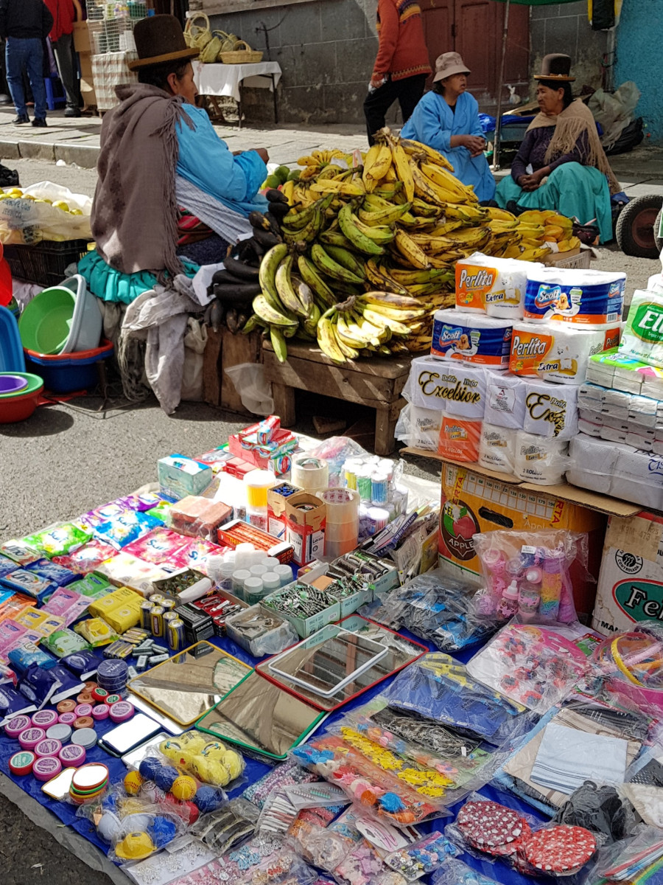

>“The chicken that we eat is chock-full of feminine hormones. So, when men eat these chickens, they deviate from themselves as men.”

Evo Morales, Bolivian President.

##Transport and Hostel

We took an overnight bus from Uyuni to La Paz with [Trans Omar](http://www.transomar.com/es/). This was an awful company, once everyone was on and the bus was full they let locals on. As there were no seats left they were left standing and sitting on the stairs. The bus was supposed to stop once in Oruro but it stopped around 3-4 times. The doors didn’t close properly either so it was freezing cold! The only plus was that they had been flexible in allowing us to travel the next day and for some reason we’d been upgraded for free from a semi-cama to a cama, which was much more comfortable.

The bus arrived in La Paz at 05:30 so we jumped in a taxi and headed to the hotel praying that we could check in as soon as we got there and continue sleeping. We were in luck [Cruz de Los Andes](http://cruz-de-los-andes-hostel.lapazhotelsweb.com/en/) was pretty empty so we were able to check in and pass out!

##El Mercado de las Brujas and La Hechiceria

With a day less in La Paz, following the extended stay in Uyuni, we headed out for a [walking tour](https://www.redcapwalkingtours.com/en). We had already seen and been grossed out by, the llama foetuses hanging up outside the shops in El Mercado de las Brujas and La Hechiceria or the 'Witches Market' near our hostel. Our guide took us inside a shop run by a witch doctor or yatiri, to explain more about Bolivian beliefs and witchcraft.

The guide explained that people of the Andes believe that they must make a sacrifice to the goddess Pachamama (Mother Earth) when they build something, as the land is not theirs it belongs to Pachamama. They believe that bad things will happen if they keep taking from Pachamama without giving anything; these beliefs go back to the Incas. So for example, when Bolivians build a house they bury a Llama fetus in the foundations of the house as an offering to Pachamama. In return Pachamama will ensure that their house is strong and no one is hurt during construction. Our guide asked what we thought people might sacrifice if they were going to build a 30 story building as a Llama foetus would not be a big enough offering. One of the group jokingly said a person but it turns out he was correct! The guide explained that it isn’t known fact, more of a myth, but when big buildings in La Paz are demolished human remains are found in the foundations. He added that people will talk about this ‘myth’ but no one will admit to being part of it. He explained that a special shaman who is said to have been struck by lightening, therefore he has died and been reborn, will find a ‘forgotten man’ such as a homeless alcoholic. It is said that the shaman will then give the man 96% alcohol until he passes out and he is buried alive in the foundations of the building. The guide told us that they face the man down so that his soul cannot come up for revenge. So creepy!

He showed us some other things the local people believe. He told us how they make other types of offerings to Pachamama, using paper and sugar, and bury it for something they would like that year e.g. a car or good crops. He also talked about some of the potions that they use in Bolivia; a love potion which you blow on the neck of the person you fancy and a punishing potion which will make someone your 'slave', by adding three drops of the potion to their drink. Sounds a little like a date rape drug to us!

##San Pedro

We met the walking tour in Plaza San Pedro in the centre of the city. The guide pointed to a building metres away from us and told us that it was [San Pedro prison](https://en.wikipedia.org/wiki/San_Pedro_prison). We were stunned that there was a prison right in the centre of the city and it really didn't look like one - no barbed wire, no guard towers, nothing. We were told that there are only ten guards who patrol the outside of the building, there are none inside. Families live in the prison and the children can be seen in the morning coming out to go to their school, on the other side of the square. This seemed unbelieveable.

The guide told us that the prison is infamously corrupt; prisoners have to rent their cells from $10 per month to $1000, they have to pay an entrance fee and the guards used to be bribed so that tourists could have a guided tour in the prison. However, he said since the release of the book ['Marching Powder'](https://www.amazon.com/Marching-Powder-Friendship-Americas-Strangest/dp/0312330340), this has stopped. I really recommend reading this (since La Paz, I've downloaded it and can't put it down). It's about a British man, Thomas McFadden, and his experiences whilst he was imprisoned in San Pedro for four years for smuggling cocaine.

The guide explained that Bolivia is now the second top country for making cocaine, after Colombia and the purest cocaine in the world used to be made in San Pedro. We were told that the people inside used to get it out by wrapping it in dirty nappies and throwing it onto the street from the roof. We asked why people don’t escape if the conditions are so poor and with such low security. The guide explained that the prisoners have their families living there with them, they own and run businesses on the inside, and he explained that if people are caught escaping they are sent away to a maximum security prison. This works as a deterrent and people remain in San Pedro.

##Cholitas

In La Paz, supermarkets appeared to be non-existant. Instead, fruit, meat, toiletries and anything else we could think of were sold in markets through the streets of the city. It was mainly women selling the produce and most wore big skirts and bowler hats. Our guide explained they are 'Cholita's'. The term comes from the word 'Chola' which actually means mixed-race or 'civilised Indian' and is regarded as a racist term. The word has been changed in South America adding ‘ita’ at the end to make it a more endearing and to be called Cholita as a badge of honour, as one is born Cholita.

Cholita's wear big puffy skirts to make their hips looks bigger which is a sign of fertility. Their skirts come down to their ankles and the guide explained that this is to cover the sexiest part of the Cholitas body, her calves. He told us that their bowler hats came from the British men who were working on the railway in Bolivia in the 1900's, they ordered some that were too small for the men so sold them to the women. He explained if it’s worn on the top the Cholita is taken, if it’s on the side then she is single.

##Cholita Wrestling

[Cholita Wrestling](https://www.redcapwalkingtours.com/en/activity/78024/cholita-wrestling) takes place in La Paz on Thursday and Sunday. As we were there on a Sunday we thought we’d give it go as it was only $13USD (£9) including transport, snacks and a drink. It's inspired by America's WWE and Mexico's Lucha Libre, so we knew it would be fake. We’d read that there was lots of spitting and throwing food, so we also knew it would be a little crass. There were five fights in total, the first was men, the next three were Cholitas and finally another male fight. The storylines were obvious good guy vs. bad guy, but what took us by surprise was that one of the male referees got involved as a bad guy. At times it was uncomfortable to watch him kick and hit the Cholitas but the Cholitas were fearless and faught back. In the end he ran out of the hall with people throwing things at him and calling him all sorts of names.

We read about the origins of Cholita Wrestling a little more afterwards and found that it was initially set up as a way for women in Bolivia who had been domestically abused, to let out their stresses and frustrations. Since 2011, the Cholita's have a female run associations such as [The Flying Cholitas](https://vimeo.com/100569187), and write the wrestling themselves. Cholita Wrestling is a way for Bolivian women to prove their worth in a 'man’s world' and they feel it gives them equal footing to men. Wrestling also provides the female working-class a way to earn money from both tourists and local's alike.

In fact, the locals took it really seriously, the kids were at the barriers trying to get signatures and they were throwing popcorn and food at the ‘bad guys’; shouting and jeering at them. During the last two fights the wrestlers came out of the ring and barriered part and were basically fighting between people. At the end we got a picture with the Cholitas and Dan brought a green shiny mask for £2.50. Cholita Wrestling turned out to be pretty entertaining, although possibly the most bizarre thing we’ve ever seen!

##Politics

Bolivia is a socialist country who absolutely hate America. Our guide told us that in 2003 their former President Gonzalo Sanchez de Lozada robbed the city bank and took off in a helicopter in amongst a crossfire. This was following protests surrounding an economic crisis and the 'gas war'. He showed us the bullet holes in the buildings in the Plaza near the President's House and told us Lozada now lives in exile in America.

Their current president Evo Morales is now in his third term of Presidency of the country. We looked him up after the tour and he's made some very strange comments. For example, he told the Bolivian people that Coca-Cola causes baldness and eating chicken causes homosexuality. He has also introduced a benefit for young parents which is encouraging young women to have babies; he introduced this following protests after he tried to ban the use of condoms in order to populate the country. Bolivia is a poor country and many of the people are illiterate and uneducated, the guide explained that this means people are easily manipulated. He told us that the government in the country use distraction techniques, so at one point the Bolivian Government decided they were going to make all the clocks backwards as the country is in the southern hemisphere. This led the people to protest about this and ignore the real problems in the country.

We’d also heard a lot about Chile and Bolivia's relationship in both countries. From the Chilean side, we found out that they won the War of the Pacific over 100 years ago and claimed the Antofagasta territory, land rich in minerals which used to belong to Peru and Bolivia. This meant Bolivia became a landlocked country and they lost their access to the ocean. People in Chile say that they offered Bolivia use of a port with no taxes but they don’t use it. The matter is now in an international court as Bolivia wish to negotiate and want their land and access to the sea back. Bolivia’s view is that this will help their economy and their country and Chilean's don't believe this will fix Bolivia's problems.

##El Alto

El Alto is a neighbouring city to La Paz up on the hills. We’d heard about a big flea market there on a Sunday which sells everything we could think of; as its up on the hills, there is also great views of La Paz. We decided to go up in the red cable car as it only took ten minutes (after a 45 minute queue).

The market was insanely busy and anything that had been lost, stolen or broken in La Paz was being sold in El Alto market. You could buy remote controls, light fittings, car parts, odd shoes, teddies, the list goes on. We’d been warned not to stray too far away from the cable car station as tourists get mugged in El Alto but somewhere in the market we'd heard people could buy animals and be seen by a shaman. We didn’t venture round for long as there wasn’t really anything there for us to buy but we enjoyed the view of the city on the way down.

##Verdict on La Paz
La Paz was the strangest place we had visited so far. From San Pedro prison, the Cholita Wrestling and their unusual sacrificial beliefs. It was quite a grim and dirty place and we both got sick in our time here. In the end, we felt like Bolivia was out to get us and we were very excited for our next destination, Peru!!