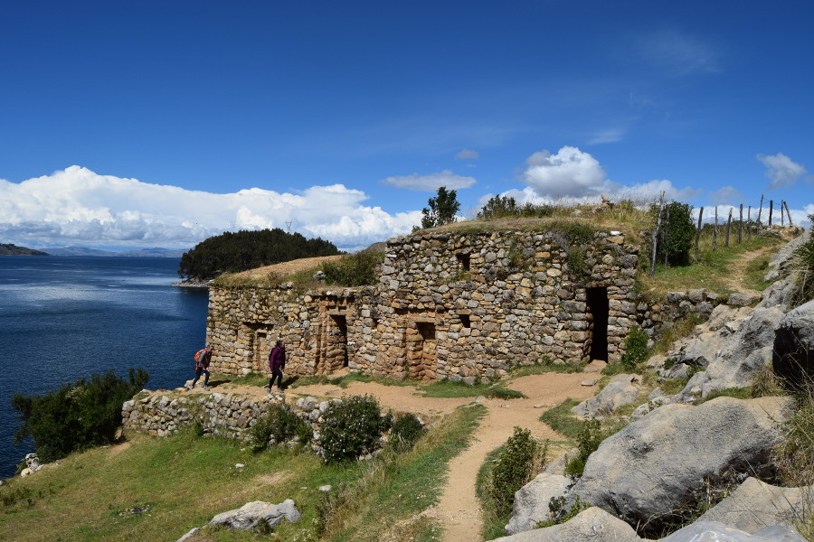
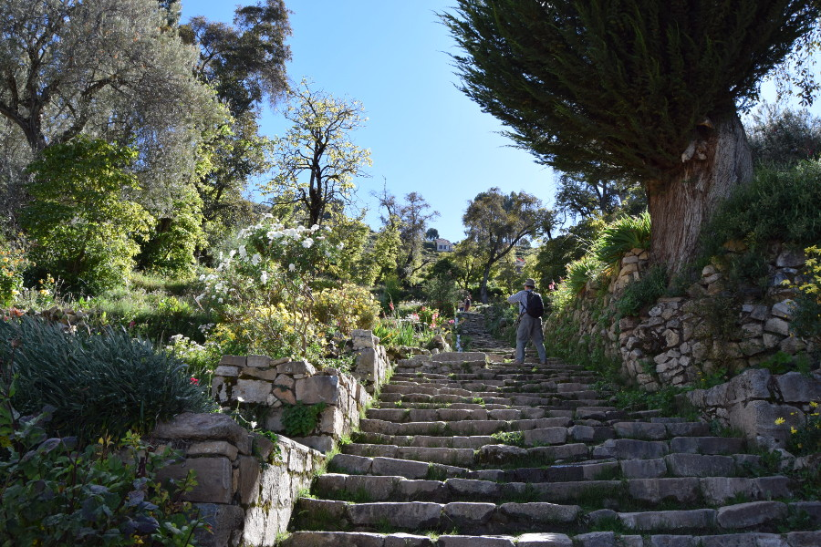
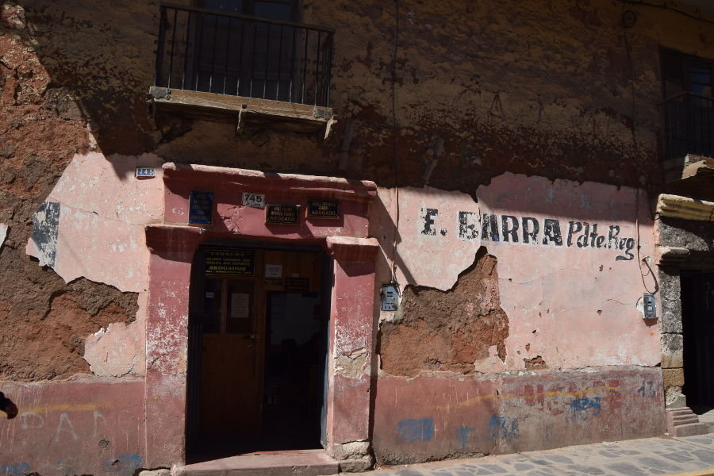
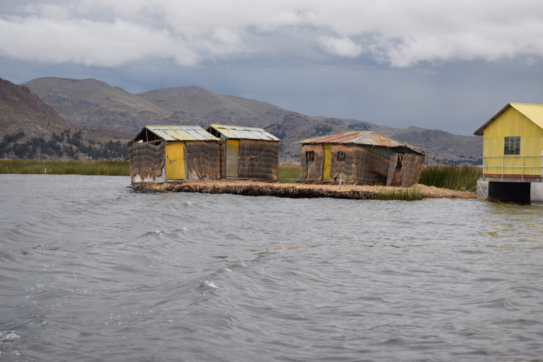
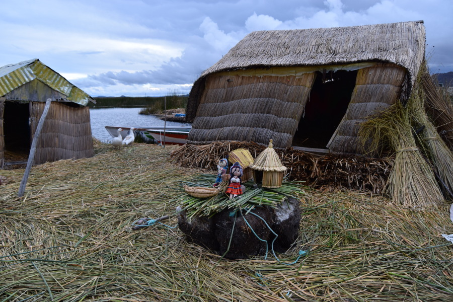
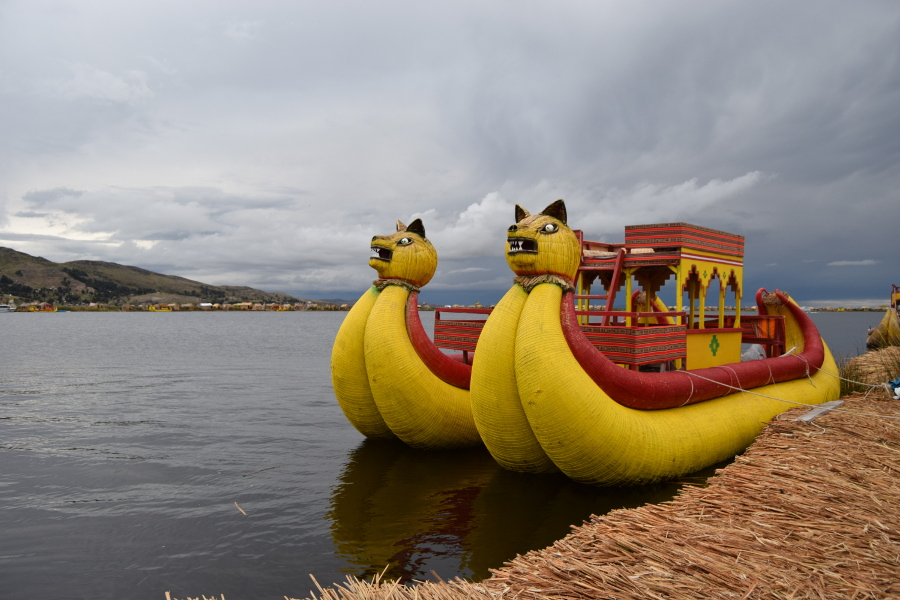

*Local communities believe that the shape of the lake depicts that of a puma hunting the rabbit. Thus the name, Titicaca, comes from the word “Titi Khar’ka” meaning Rock of the Puma in Aymara (a local indigenous language).*

<iframe frameborder="0" src="//www.dailymotion.com/embed/video/xynf5d" allowfullscreen></iframe>

Donald Duck visits Lake Titicaca

##Isla Del Sol
We booked this excursion for convenience with Bolivia Hop so that we could leave Copacabana the same day. The boat picked us up at 13:00 and after an hour or so we were dropped off an a remote pier on Isla Del Sol. We were told the hike was around an hour to Yumani pier, where the boat would pick us back up. The driver offered no explanation or history of the island.

As we climbed up the steep steps, we first saw some Inca ruins. The Inca's believed that the sun god was born on this island, hence the name Isla Del Sol, or island of the sun. There are no roads or vehicles on the island and 800 families live there. Their main income is farming, followed by fishing and tourism. We saw some women and children on our hike along the island, they had Llama's and asked if we wanted to pay for photos. The best part of the island were the fantastic views of Lake Titicaca and other nearby islands.

##Puno
We were initially going to do a day trip from Puno to Isla Uros and Taquile Island. However, after a day in Copacabana we didn't get to Puno until 21:00 and the trips collected at 06:00. So, we decided to use Puno as an opportunity for some rest in our [Huaytusive Hotel](https://www.huaytusivepuno.com/), following a tough few days in Bolivia and we opted for a half day trip to Islas Flotantes De Los Uros.

We had a wander around Puno which is at 3,827 metres, but it is quite small and there wasn't a lot to see. We were just about ready to stomach some beers again, so  we headed to a bar to watch the Liverpool vs Roma Champions League Semi Final, first leg. The game did not disappoint despite the best attempts of the staff at the bar, faffing with the televisions.

##Islas Flotantes De Los Uros
We took a trip to [Islas Flotantes De Los Uros](https://en.wikipedia.org/wiki/Uru_people) or the floating islands with our hotel as it was only S./25 (£5.60). It was very odd as we were rushed away by a woman into a taxi to the port. We were then handed over to a guy who walked us to the boat where everybody was waiting for us. The guide spoke in both English and Spanish but we couldn’t hear him very well due to the boat engine and his monotonous voice.

When we arrived to one of the islands there was a little boy waiting for us with his football, so as soon as we jumped off the boat and onto the island we had a quick kick around while we waited for the group to congregate. We never thought that we’d play football in the middle of a lake on a bunch of reeds. It was at this point that we took note upon how fascinating the islands actually were and how the islands seemed to move with the water and our footsteps.

We were introduced to an Uru family who lived on the small island and the young male explained that the islands were constructed by numerous layers of criss-crossed reeds that grow in the shallows of the lake. He then proceeded to show us where they slept before selling us a couple of Llama key rings and a balsa boat ride to Isla Capital. The young Uros man referred to his boat as a 'Mercedez Benz'. The boat was also made out of reeds and was pushed along by a speed boat as the little boy with his football sang 'Row row row your boat'.

The Isla Captial had a shop and a restaurant, with some signs about where we couldn't walk. The guide explained that every footstep causes the islands to sink a little bit which means that more reeds need to be placed and repairs made. It seemed that Uros people had a tough job of balancing tourism and the maintenance of the island itself.

##Bolivia Hop
We opted for [Bolivia Hop](https://www.boliviahop.com/) due to the convenience of having everything sorted with minimal effort, but with hindsight we wish we had just sorted it ourselves. The La Paz to Puno leg of the journey seemed OK and was efficient, including the crossing of the Tiquina Lake. However, the overnight journey from Puno to Arequipa was particularly uncomfortable. The bus was absolutely boiling, there was limited leg room and the jerky driving led to a terrible night sleep.

##Our Verdict on Lake Titicaca
We had a pleasant few days at Lake Titicaca and enjoyed our rest in the surroundings, particularly after coming out of the busy La Paz. The highlight was undoubtably the unusual Islas Flotantes De Los Uros.