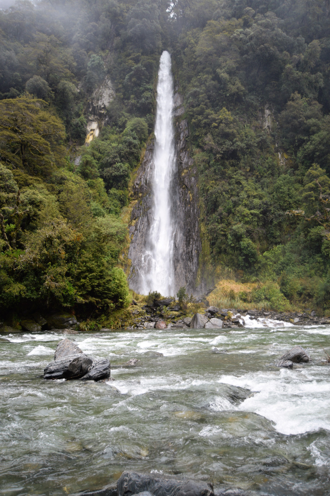
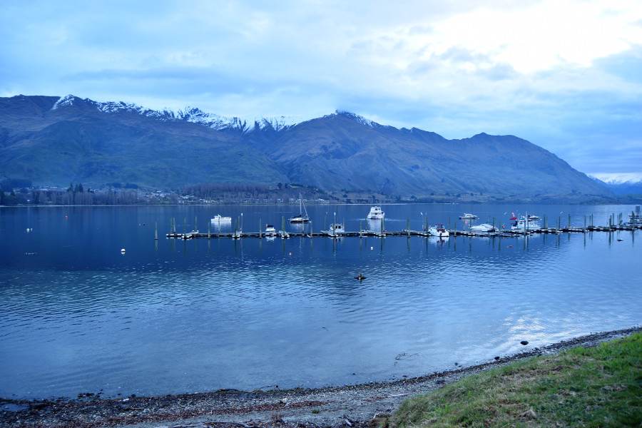
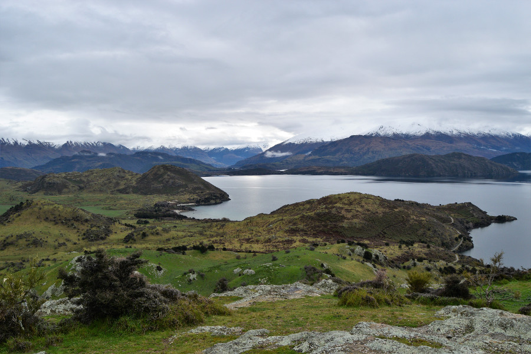

##The drive
We took a Great Sights bus from Fox to Wanaka, our driver Pete gave us loads of great commentary on the picturesque roads all the way there. He spoke very slowly and Dan said he reminded him of Alan Rickman as Professor Snape. We stopped a number of times on the way for photo opportunities and to break up the 6 hour journey. The first stop was Bruce Bay where often Hectors dolphins can be spotted. Despite the rain we jumped out of the bus but sadly didn’t see any. The next stop was a salmon farm where we saw a large white heron, one of New Zealand’s rarest birds.

We drove past a number of lakes, crossed multiple bridges over rivers and drove through bush. The scenery was stunning all the way even with the low cloud and rain. Pete told us about the little village Haast as we went through which is the remotest place to live in New Zealand. We also stopped at thunder creek falls, a big waterfall and had a stop by Lake Wanaka. All the stops and commentary really broke up a long day and we were pleased when we finally got to Wanaka.

We had booked a private room at [Wanaka Bakpaka](https://www.wanakabakpaka.co.nz/) which was a little out of town. It was a nice hostel with great views of the lake and Roy’s Peak behind it. We liked the township of Wanaka, there were lots of outdoor shops as there are so many ski fields around and lots of bars and restaurants for apres ski. We went out for drinks both nights we stayed in Wanaka and made the most of the happy hours there! Our favourite place was [Gin & Raspberry](http://www.ginandraspberry.co.nz/) and we managed to treat ourselves to an Amaretto Sour and an Espresso Martini there.

##That Wanaka Tree
The iconic image of Wanaka is the tree, sat alone in the lake. It is just on the edge of the township so once the rain had stopped we had a walk to it. It was very picturesque with the clear water of the lake and the backdrop of the mountains but some people were having a full on photo shoot with the tree. It is known as the lonely tree which we felt was ironic considering the number of people taking pictures.

##Walk to Ironside Hill
Initially when we had been looking at hikes in the surrounding area of Wanaka we had wanted to climb Roy’s Peak which is approximately a 6-7 hour hike. However, the majority of the time we were in Wanaka the summit of the mountain was covered in cloud so we knew we’d have terrible views over the lake and surrounding mountain ranges. The other problem was that as it was winter the summit was covered in snow and ice so we’d been advised to go as far as we could and we’d then have to turn around. With no guarantee as to how high we’d get up there and what kind of view we’d have we gave it a miss and opted for a walk around the lake.

We headed in the direction of Glendhu Bay but never made it that far round. We hiked in total for 16km and went as far as Ironside Hill, a steep hill coming out into the bay. The view from the top was glorious especially as we had a bit of blue sky and a hint of sunshine. We were able to see some of the Pisa Ranges in Aspiring National Park and we had a great view of the lake. The only downside was that the hill was so steep I went down most of it on my arse, slipping right at the end, covering my leggings in mud and rabbit droppings.

##Our verdict on Wanaka
We liked the atmosphere of Wanaka, with the cute bars and restaurants without it being too much of a party town. We had heard that Wanaka is like what Queenstown used to be, before it became super popular. The lake was stunning and definitely somewhere to come back to in the summer (along with Tongariro National Park) for a hike to the summit of Roy’s Peak!