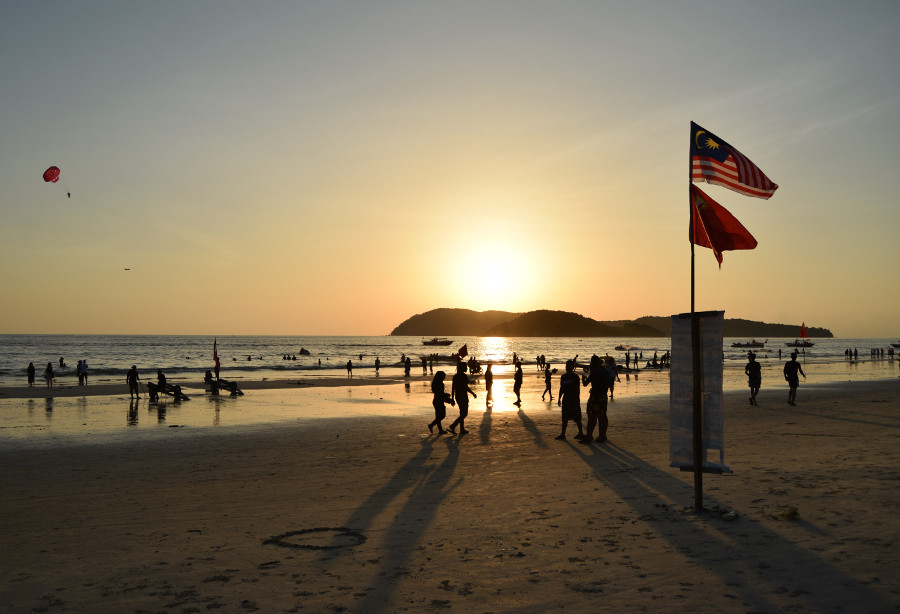
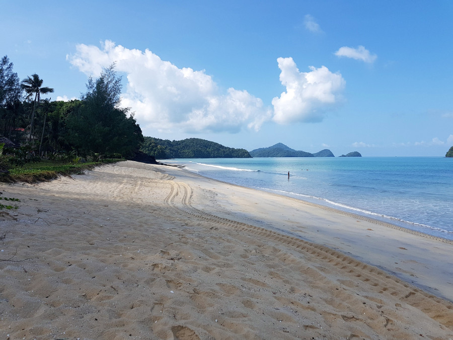
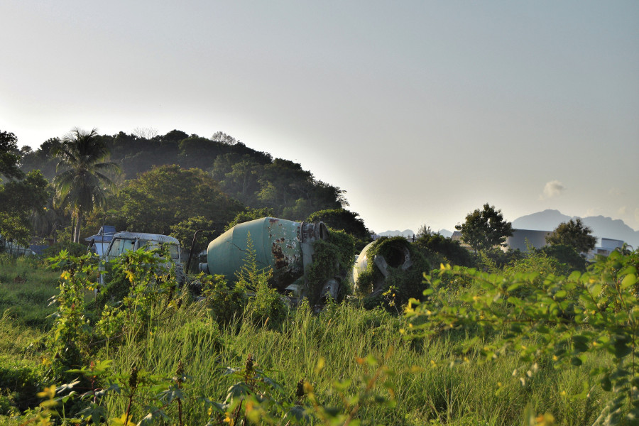
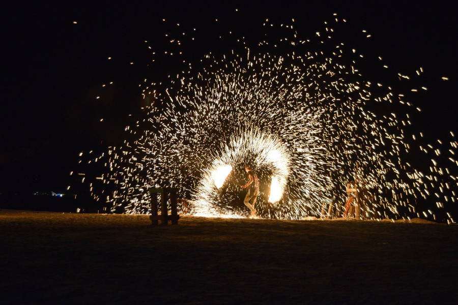
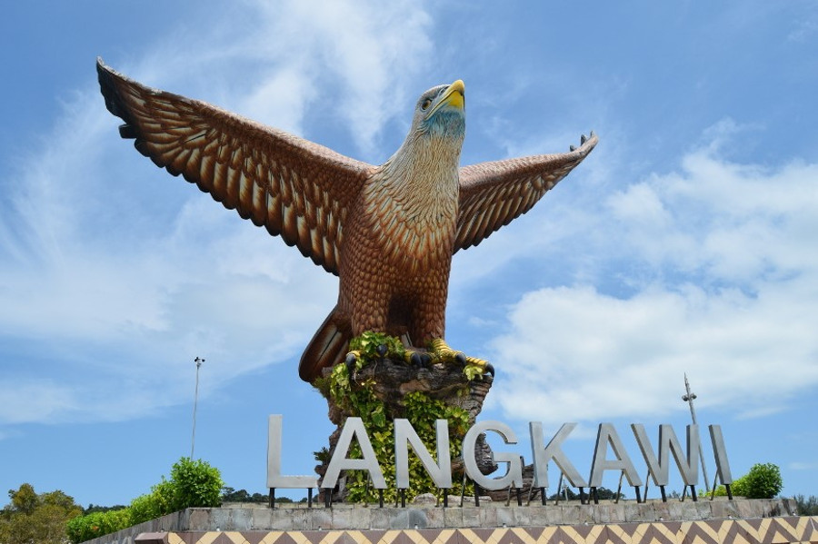

##Getting to Langkawi
Our options to get to Langkawi from Penang were to either take a three hour bumpy boat ride, or fly with [Air Asia](https://www.airasia.com/) for £21 on a 25 minute flight, which was a no-brainer. It was possibly the quickest flight we'd been on, no sooner we were in the air we were decending and the cabin crew had given us our disgusting in-flight meals in carrier bags so we could take them with us. Once we landed it was a short Grab ride to our accommodation, [Saay Haa Inn](https://www.booking.com/hotel/my/sayy-haa-inn.en-gb.html?aid=356980;label=gog235jc-hotel-XX-my-sayyNhaaNinn-unspec-my-com-L%3Aen-O%3Aabn-B%3Achrome-N%3AXX-S%3Abo-U%3AXX-H%3As;sid=becef3c0ec78b87f7fda96baf1ee6cbb;dist=0&keep_landing=1&sb_price_type=total&type=total&), on the outskirts of Pantai Cenang, on the west side of the island.

##Beaches
It took around twenty minutes to walk from our accommodation to Pantai Cenang beach, which is where we went for all but one day of our time in Langkawi. On the first day we sat on our sarongs and towels but the sand was so fine, once it was stuck to our suncream there was no getting it off. After that, we paid 20MYR (£4) for two beds and an umbrella. The beach itself faced some of the smaller islands of Langkawi and like the beach in Penang, it was full of jet ski's and parasailing. However, the water was warm and apart from the odd bit of rubbish washed up on the beach it was generally clean.

Pantai Cenang beach was lined with bars, which were less expensive than mainland Malaysia given that it was a duty free island. We had drinks in a couple of bars, [Kalut](https://www.facebook.com/kalutbar/) and [Yellow Beach Cafe](https://www.facebook.com/yellowbeach.cafe/), although they got really busy at sunset.

There was a neighbouring beach called Pantai Tengah which we had a quick walk up but we didn't stay long. It wasn't as busy as Pantai Cenang, but the strip of sand wasn't as wide, the sand wasn't as soft and there wasn't much shade from the sun. We also found a lot of rubbish on the beach so after picking up as much as we could we headed back to Pantai Cenang.

##Cenang
We weren't really sure what to make of Cenang, there was a lot of building work going on in the area, some of it abandoned and unfinished. It was also the smelliest place we had visited, the heat and wafts of sewage above the drains at times were unbareable. There was also a lot of litter on the streets which made the place look really untidy and dirty. Everything seemed mid-range, there were no five star resorts and restuarants but no shacks, backpacker accommodation and few cheap market eats either. In fact, the food was pricier in Langkawi than in mainland Malaysia and a lot of it seemed to be Western food; pizza, pasta and burgers. Although expensive for Malaysian standards, we did manage to find a great restuarant called [Haroo Haroo Korean](https://www.facebook.com/HarooHarooCenang/) where we tried Bulgogi and some other Korean dishes. There were however cheap clothes in the markets and duty free shops selling beers as cheap as 20p, so we couldn't grumble about the cost of food too much. Dan also managed to pick up a huge bottle of Cointreau for 79MYR.

##Merdeka
On the 31st August it was Malaysian Independence Day and we headed to Kalut bar which was having a beach party with a fire show on Merdeka Eve. After watching the fireshow and drinking a very watery £4 Mojito we decided to head back. At midnight someone somewhere let off a load of fireworks, which we were just about able to see from our accommodation. This was really poor planning on our part, as Kuala Lumpur has a massive festival and parade on Merdeka which would have been amazing to witness and be part of.

##Kuah
On our last day in Langkawi we decided to visit the main town Kuah. By the port is a huge statue of an eagle, which is really the only thing to see in the area. There were also a few malls with duty free shopping. However, as we didn't need to buy anything else and most of the independent places were closed for the public holiday, there was little to do in Kuah. Again, there didn't seem to be many resorts there and we wondered where all the holidaymakers we'd read about get to on the island!

##The rest of Langkawi
There was lots to see and do in Langkawi that we missed out on, but we were desperate for a few days rest! With a lack of public transport, the only way to get around all the sights was to hire a scooter or a car, neither of which we fancied doing either. One of the things we had planned to do, but in the end had no energy for, was going up in the cable-car and walking across the [Skybridge](http://www.langkawi-info.com/attractions/skybridge.htm) for incredible views of the islands. We thought it was quite costly 30MYR for the cable car and 5MYR to walk along the bridge, plus 50MYR in Grabs, so in total it would have cost us £20, which is a lot in Malaysia.

Another activity we had planned to do, but decided to nap in the sun instead, was to island hop. There were loads of different trips going out to the islands, ranging from a long boat journey (over an hour) and feeding baby sharks, to visiting islands nearby and feeding eagles. They ranged from 35MYR to over 100MYR (roughly £7-£20). With plenty to do on the island, it would have been easy for us to stay there for another week!

##Our Verdict on Langkawi
This was definitely more of an easy two week holiday destination rather than a short stop on a backpacker itinerary, however a few days on a nice beach was just what we needed before heading to the busy city of Singapore.