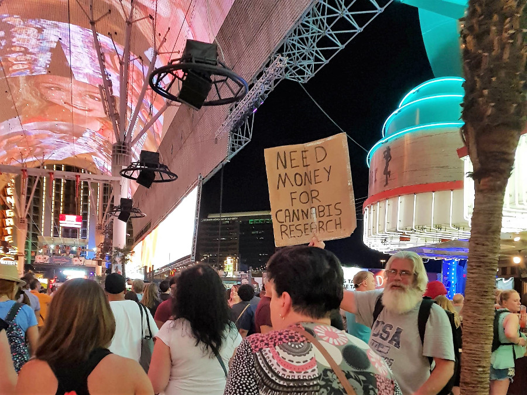

>"This isn’t the real Caesar’s Palace is it?"

Alan, The Hangover

##MGM Grand
We got to Las Vegas by the Megasbus which cost $20 for the 7 hour journey on Route 66. We arrived at around 11:30pm and were met with a queue to check in which was very much like an airport. Soph was amazed at how big the hotel was as it was her first time in Vegas and pleasantly surprised to find not one but three Starbucks inside MGM alone.

We mananged to stay on the strip in MGM as we found a good deal on last-minute.com. It was for a room in the West Wing which many people complained about in reviews, but considering the hostels we'd slept in in South America, the West Wing was luxury. The room was also conveniently located on the strip so we only had to walk outside and we were facing New York New York, another massive hotel. That one had a rollercoaster and a 'minature' Empire State, Brooklyn Bridge and Statue of Liberty.

The MGM Grand itself was relatively calm when we arrived on Wednesday night and Thursday. We made use of this by chilling by the pool and having a quiet drink in the hotel bar. However the crowds soon picked up the closer it got to the weekend. There seemed to be more drunk people stumbling around at 4pm on Saturday, one threw her cocktail down Soph's leg. There were groups of people congregated next to the pool, but not in it so that they could show off their upper bodies they obviously work on for the rest of the year. Towards the closing hours of the pool area there were empty beer bottles and glasses everywhere. A very different Vegas to mid-week.

The MGM's casino itself was massive and Soph mentioned how dated the decor was. From my previous visit, around 9 years ago this area didn't appear to have changed much. Although they had removed the lion that they kept in an enclosure. The hotel was insanely big with a number of different restaurants to eat in, a Cirque dear Soliel show, a night club, comedy club, a spa and test showings of new programs but there was nothing on that we are really into. We also noticed that there were lots of families around with children, often walking through the casino after midnight.

##The Strip
The strip is absolutely huge and incredible. We spent all day walking up and down the strip hopping in and out of the casinos and shops. We walked around the canals at the Venetian, watched the fountain show outside the Bellagio to Elton John's 'Your Song' and browsed the conservatory. We walked through Caesars and Planet Hollywood including their shopping centres. We were out for so long that we got to see the strip both in the day and lit up at night (which was much better). We were absolutely exhausted by the time we got back but after half a bottle of wine we went down to the casino at 01:00 to do some gambling. We only played blackjack and roulette; I lost at blackjack and Soph picked some lucky numbers on roulette so we ended up being $1 up and decided to quit whilst we were ahead.

##Downtown
We visited downtown in the day for breakfast, had a wander down Fremont Street and found some cool graffiti down some of the side streets. We even managed to weigh ourselves outside a restaurant that offered anyone over 350lb to ear for free in the 'fight against anorexia'. We didn't even come close. We then headed to the North Outlet stores where we spent around 3 hours picking up some clothes to replace those that were falling apart. In the Lyft on the way back to MGM we got talking to the driver who recommended a bar in downtown called the Griffin for cheaper drinks and good music. We thought that as it was a Friday and to fully appreciate downtown we had to return later on.

We took a Lyft pool back to downtown later on and it's one of the most memorable taxi journeys  we've taken. Our driver had to pick up  two American girls along the way, who were steaming drunk and on their way to get weed. One was a Republican and the other hated trump. The two of them went on a 20 minute rant about Trump, immigration and the orange baby blimp.

Once we got back to downtown we knew that this was more our scene, there was less glamour, neon signs, cheap beer, more weirdos and trailer trash! There were bands and shows on stages, lots of people dressed up from Alan (the Hangover) to a bloke wearing a cock sling and many people holding up signs. My favourite was the 2 guys holding up a sign to kick the one in the balls. We were queuing right next to them as a woman did just that, he didn't even flinch.

After we had a good look around we found the Griffin. To my delight they served amaretto sours for $8 (mostly amaretto) and there was DJ Mike Fish in the room at the back playing an 80s, New Wave, Indie, Electro set. The drinks were great and the music was even better so we spent the rest of our night here.

##Welcome to Fabulous Las Vegas
Our last stop in Vegas was the infamous sign and it was surprising how many people were queued up to take a picture with the sign. Rather than queuing we snuck to the side took our shot and headed back to the bus station for our ride to LA.

##Our Verdict
Soph was unsure whether she would even like Vegas but we both loved it, especially downtown. There is so much more to do there than just gambling and we could have spent days on end wandering around all the different hotels, watching shows and riding on the rollercoaster. Now that Sophs a convert we will definitely be back!

