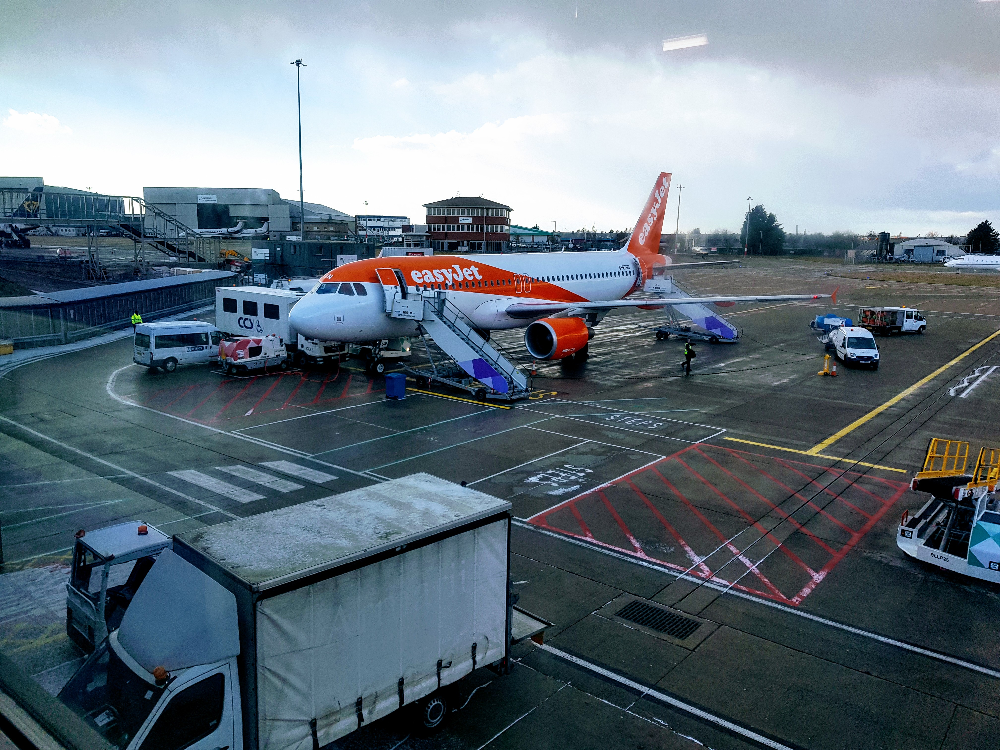

Our first night is a stop over in Lisbon and although very early to be writing a travel blog, given that we haven't even reached the first destination, Dan is still building it and wanted me to test it.

After a long drive to Luton (thanks Grandave) and having everything crossed that *'The Beast from the East'* would stay away until our flight had taken off, we arrived in a very rainy Lisbon at around 20:00. We're staying in [4U Lisbon Guesthouse] (http://www.4ulisbon.com/pt-pt) which is about 5 minutes from the airport and has 80p beers in the help yourself fridge. The lady who showed us to our room was very chatty and spent 10 minutes telling us about her daughters very recent trip to Rio de Janiero where men tried to steal her phone and she continued to tell us that her daughter heard gunfire and saw hundreds of people running away from the noise. Not worrying at all. We also found out that her son is a pilot and spent the last three months in Africa. Note to self: must get used to the small talk.

Dan didn't fancy the snail resturant round the corner, so we had a Boots meal deal for dinner and the only time we left the guesthouse was to find an ATM to pay for the transfer in the morning, given that there is going to be continual rain and thunderstorms. Glad we went for the walk though as we bumped into a French Bulldog, who thoroughly enjoyed being stroked and who's owner covered me with an umbrella for 5 minutes whilst he told me how his Frenchie had grown out of all of his coats.

It's still feeling very surreal that we won't be coming back until November, my brain really can't comprehend how long that is and even Dan shed a tear when he said goodbye to his Dad at the airport.

Going to enjoy our penultimate Alan-free evening.