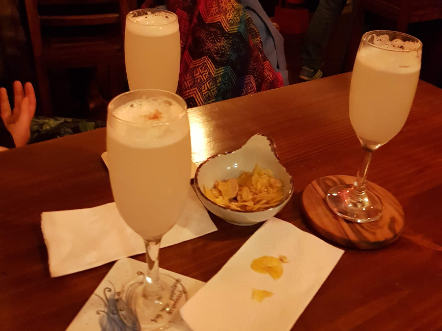
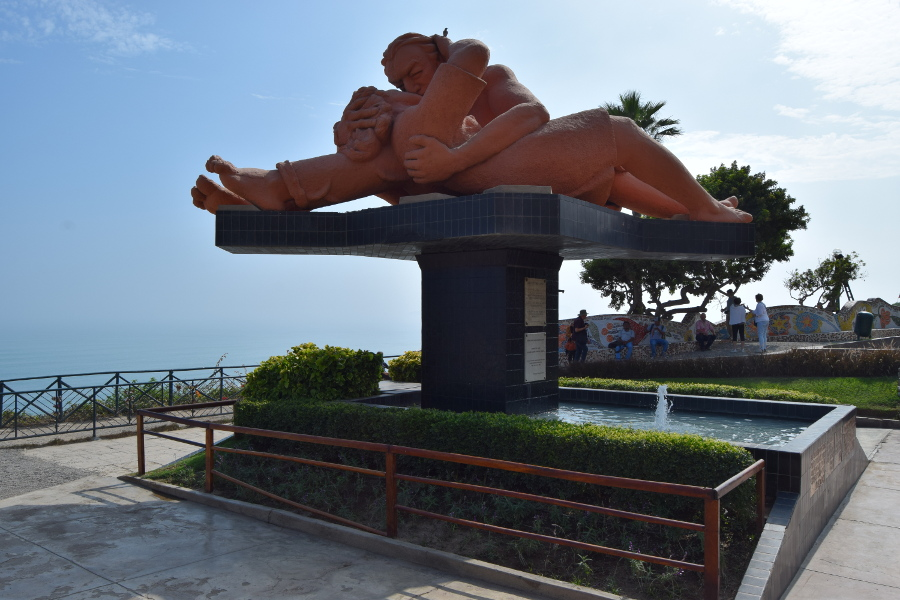
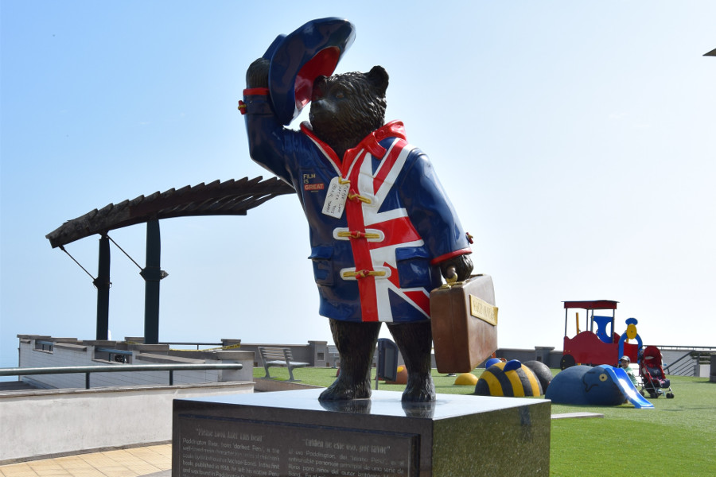
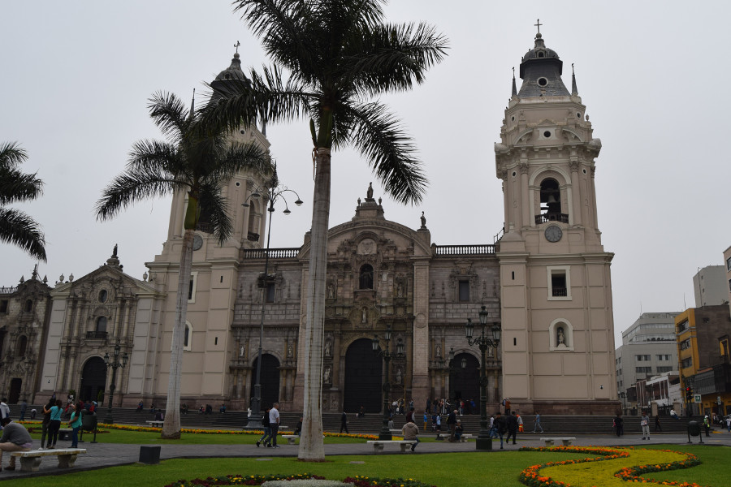
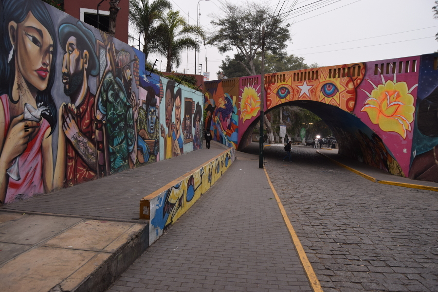

>"For more than half the year Lima has a peculiar climate. It is never cold enough to have a fire, but usually cold enough to make you wish for one. It never rains, but is never dry; that is to say, it is not wet enough to make one hold up an umbrella,yet wet enough to soak one's clothes."

James Bryce.

##Miraflores
We stayed in Miraflores on the three occasions we passed through Lima, in an airbnb, in [Lion Backpackers Hostel](http://lionbackpackers.com/) and in [Guesthouse La Casa de Alvaro](https://www.booking.com/hotel/pe/190-la-casa-de-alvaro.en-gb.html?aid=357026;label=gog235jc-hotel-XX-pe-190NlaNcasaNdeNalvaro-unspec-co-com-L%3Aen-O%3Aabn-B%3Achrome-N%3AXX-S%3Abo-U%3AXX-H%3As;sid=7c3395775e805949feadf9a42f609d7e;dist=0&group_adults=4&group_children=0&no_rooms=1&sb_price_type=total&type=total&). We'd been told Miraflores was the place to stay but it was a strange area. There wasn’t much to do except grab some fast food, visit the artesanal markets or sit in a cheap cafe. It was also very noisy and the traffic was insane, drivers insessently honk their horns at one another all day long for no reason. The area mainly came to life at night and it turned out to be an alright place to grab a 2 for 1 pisco sour!

One of our favourite bits of Miraflores was our two day stay in an Airbnb; we had a fully equipped clean kitchen, which we didn't have to share, a big comfy bed, a washing machine and we hibernated for two full days!

##Parks
Lima has lots of parks spread all over the city. We walked to Parque del Amor which is on the coast; it hosts a big statue of a couple kissing and mosaic benches covered in couples names. We returned to the park with Iz when she arrived in Lima and walked the El Malecon.

We also had a wander through Kennedy Park, a central point in Miraflores. It was full of cats and there were signs everywhere advertising adoption of the cats to help the city to care for them. There was also a World Cup Sticker swap, so people were there with stacks of stickers swapping to fill their books, Dan was definitely a little jealous.

On the walk along the Miraflores coastline, we also hit a shopping centre called Lacomar. It was full of high street stores and set in the face of the cliff. Just outside was a sculpture of Paddington Bear in deepest darkest Peru, we couldn't resist stopping for a photo.

##Historical Centre
The walking tour in Lima took us to the historical centre. The guide was called Elvis and he’d actually been our guide for our walking tour in Cusco. He tried his best to tell us about Lima but it wasn’t easy when Lima is a very random and grey city. He showed us a few churches, one was called the Basilica of the Vera Cruz, it is believed there is a piece of the cross that Jesus was crucified on in the church. We saw the presidential palace and a marching band come out at one point playing music to the crowd. Initially we were hopeful that the historical centre would charm us into liking Lima after spending a lot of our time in Miraflores, sadly it didn't.

After the walking tour we wandered into China Town to have some late lunch in a Chifa. The guide told us that there is a huge Chinese influence and culture within Peru as Chinese people had been brought over for cheap labour a long time ago, after slavery had been abolished and African people had been liberated.

##Barranco
We’d heard Barranco was the hipster neighbourhood of Lima so went there to drink craft beers and cocktails in the hipster bars. Unlike other hipster areas in cities we had been to in Latin America, Barranco was a poor attempt! There wasn’t much street art in the area and although there were lots of bars, we felt like we could have been anywhere. We had a few Pisco Sours in the area and ate more Lomo Saltado in a nice restaurant called [Isolina](http://isolina.pe/). Although the area wasn’t great our meal did not disppoint!

##Verdict on Lima

One word to describe Lima would be grey. For a capital city, even in Latin America, it seemed behind the times. It wasn’t very pretty and seemed to be more of a hub for people going to more exciting destinations in Peru. This is exactly what we used Lima for and it served its purpose.