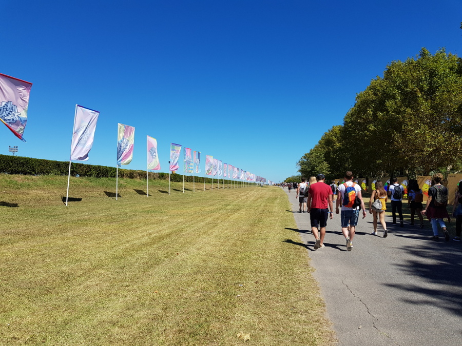
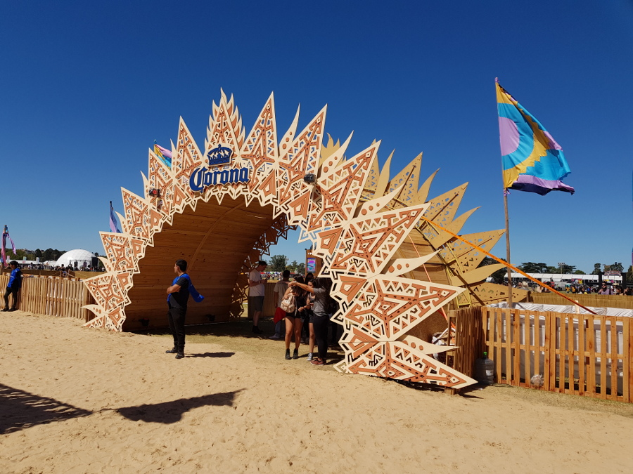
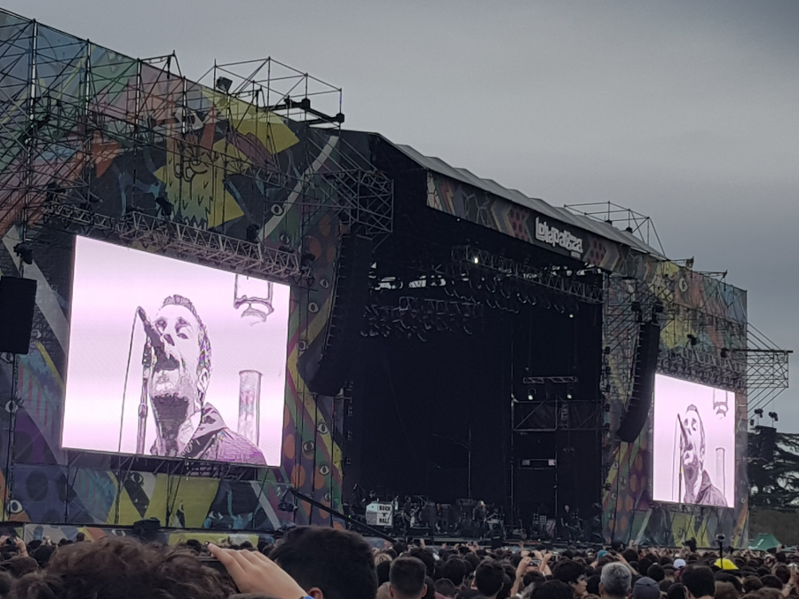
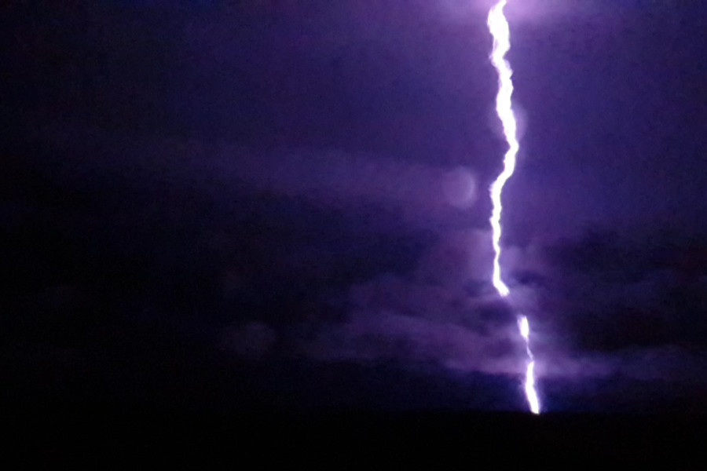

>“You lot are the best crowd I've ever performed in front of.”
Liam Gallagher, Lollapalooza 2018, Argentina.

##Lollapalooza Argentina

We were lucky enough to get tickets to [Lollapalooza] (https://www.lollapaloozaar.com/) before we left the UK. It was after that we did some more research and found out that due to the laws in Argentina, alcohol cannot be sold at events that children can attend, which meant a sober music festival. Whilst breaking the news gently to Alz, we asked him what the worst thing was that could happen at Lolla, his first answer was that it was vegan, then he realised that it was the unthinkable and there was no alcohol. We had some thoughts about burying some or buying scarves with bags hidden in them to sneak some in, but the festival seemed strict. We decided to just accept it, after all, it could have been worse and been vegan!

Our thoughts were right, Lollapalooza turned out to be very strict; on the first day they searched our bags twice and confiscated my biro, paracetamol, antihistamine and bite cream. The security woman contemplated confiscating my inhaler too but went with her better judgement and let me keep it. Security even searched through Dan’s snotty tissue in case he was hiding anything in there. Standards must have slipped after we got in and as the day went on because by 18:00 a lot of people in the festival were getting high on their smuggled in cannabis. But all was OK because at least I couldn’t dish out my paracetamol and antihistamines.

We couldn’t help comparing Lollapalooza to Glastonbury, which will always remain our absolute favourite music festival. In comparison, Lollapalooza was small with four stages for music, it also had a cashless system where wristbands had to be topped up and this was the only way to buy anything there. It had overpriced burger vans and ridiculously priced water which we had no choice other than to buy as the festival did not allow us to bring in our own food and drink. We did manage to find probably the best food at the festival and after a 45-minute queue had Rocking Chips with ketchup, bacon and spring onion. We were also pleasantly surprised that Lolla did turn out to sell alcohol! Alz was feeling better at this point and he managed to sniff out the Corona Beer Garden, so after getting our ID checked three times we were allowed our two per-day allowance of Corona. Hoorah.

Lolla was held at San Isidro which was around 45 minutes out of the city; getting the two metros and a train there and back was an absolute nightmare. Imagine thousands of people trying to catch a train back to the city at the same time after the headliners, it was carnage. The first night took us three hours to get back to San Telmo after a very long queue outside the train station and being squeezed onto an overly packed train. The second night we left 10 minutes early, missing The Killer’s 'Mr Brightside', a blessing in disguise really and managed to get back at a decent time and with room to breathe on the train.

Music wise, the line-up was awesome, in the first two days we saw Oh Wonder, Spoon,Royal Blood, Imagine Dragons, Red Hot Chili Peppers, Metronomy, Liam Gallagher and The Killers. They all put on a great show and made attempts to speak to the crowd in Spanish. All aside from Liam Gallagher who is of course far too arrogant to even say ‘muchas gracias’. However, he did tell the crowd that we were the best he had ever performed in front of! Due to horrific thunderstorms, which may have been summoned by Imagine Dragons when they performed ‘Thunder’, the third day of the festival was cancelled by the government, and we missed out on Milky Chance, LCD Soundsystem, Pearl Jam, Galantis and Kygo. During the night after the second day the thunder was so loud it set off car alarms, and one of the guys in the hostel said that the lightening had burnt up half of one of the stages at Lolla. People had also posted pictures on Facebook of San Isidro flooded and looking even muddier than Glastonbury. Lolla announced that they cancelled the third day of the festival in the interest of people’s safety and promised to reimburse everyone a third of the cost of the festival. Money we happily spent on more steak and wine.

## Our Verdict on Lollapalooza Argentina
The music at Lollapalooza was of course amazing, however the poor planning and organisation of the festival let it down a little. We also think we’ve been totally spoilt by Glastonbury which has everything perfected to a tee. No festival will ever match up to its greatness, we’ll be coming for you Glastonbury 2019.