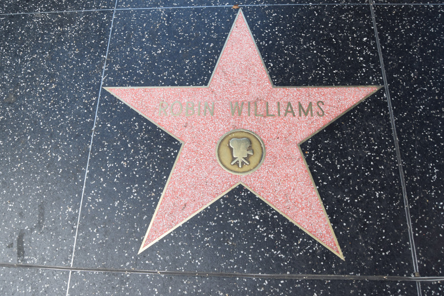
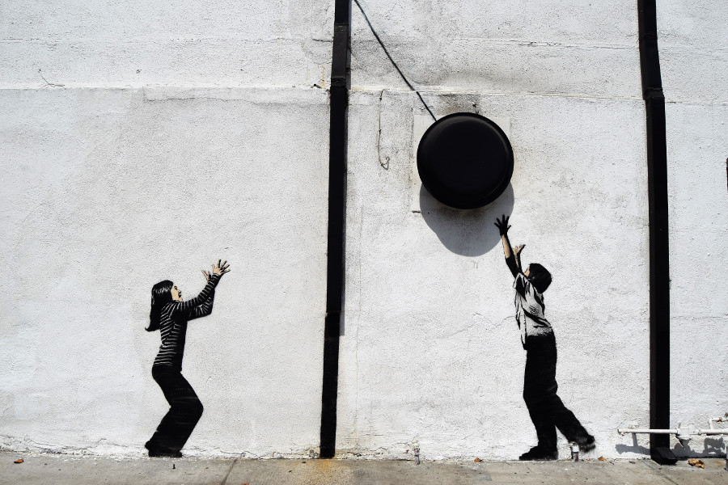
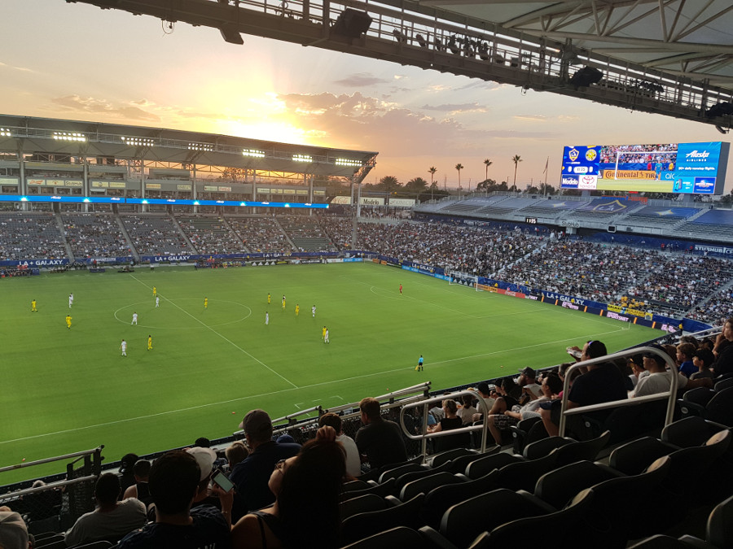
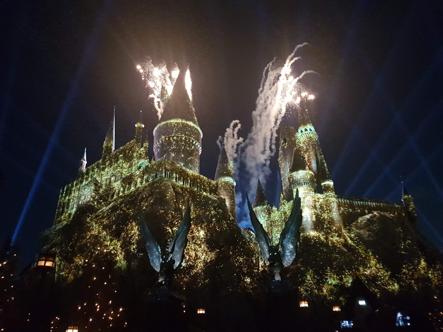
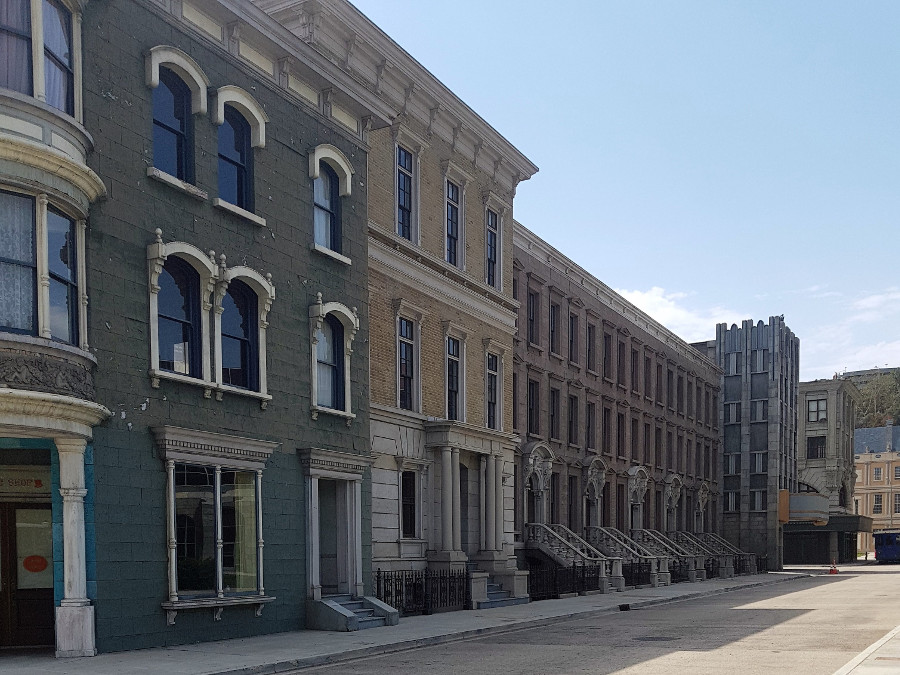
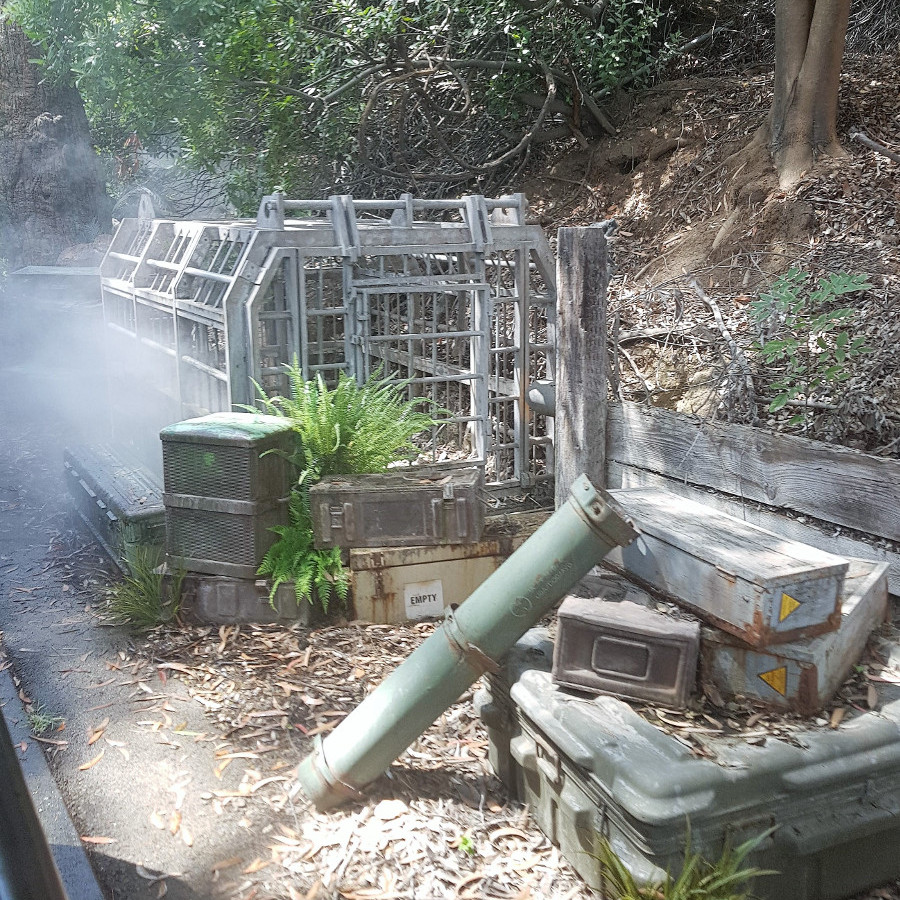
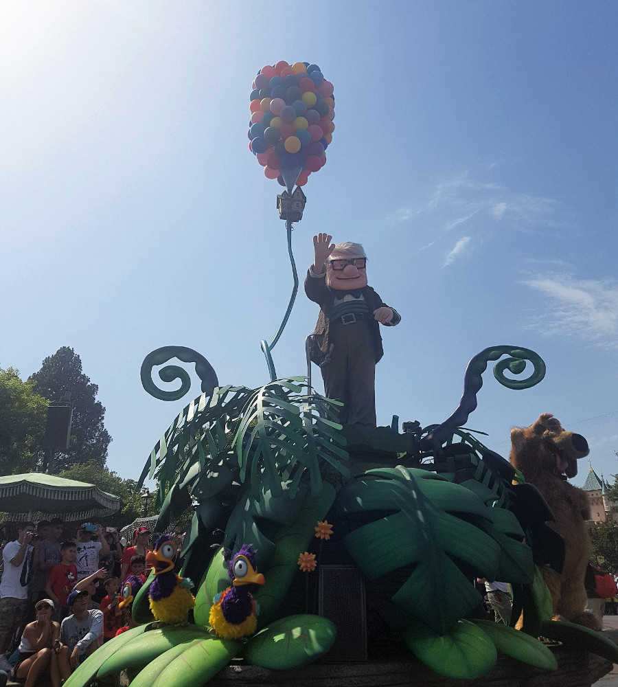
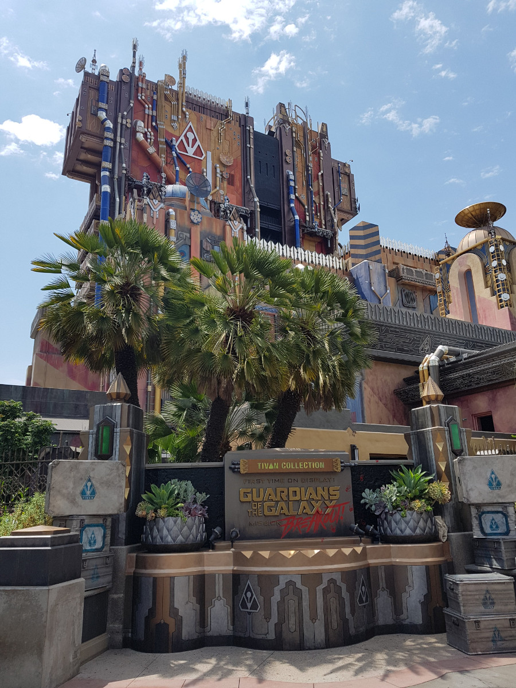
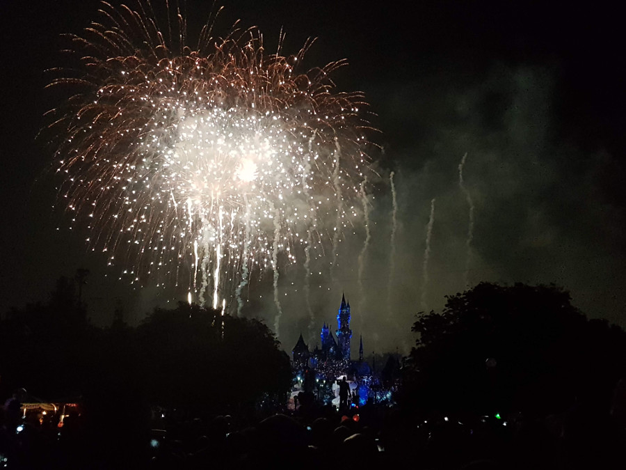
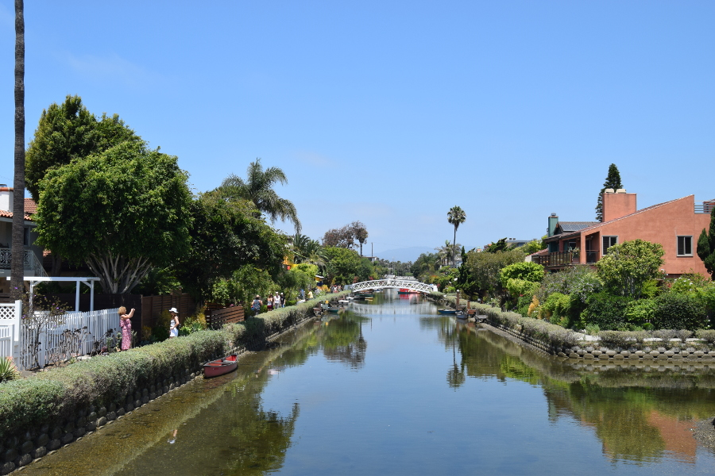

>"Adventure is out there."

Ellie, Up.

##Hollywood
We decided to stay in Hollywood for the first few nights of our stay in Los Angeles as we had heard that the public transport was poor and we had no desire to hire a car. Getting from the airport to Hollywood was a logistical nightmare, Uber's and Lyft's weren't cheap and the [Flyaway](https://flylax.com/flyaway) bus only came once an hour. However this cost $8 (£6) per person and dropped us around ten minutes from [Walk of Fame](https://walkoffamehostel.com) hostel, where we were booked to stay. Eventually, half an hour late, the bus arrived, filled up and took almost two hours to get to Hollywood due to the traffic coming out of the airport.

When we got off the bus and started walking the Walk of Fame to get to the hostel, the heat really hit us. We'd arrived in LA on the hottest day of the year and at 20:00 it was still 38C. The wind was even hot and felt like someone was blowing a hot hairdryer on us, it was anything but pleasant.

After checking into our 8 bed dorm, with no air con and a useless ceiling fan we went out to explore Hollywood a little. We managed to find some famous stars and some Disney Characters and we had a look around the Chinese Theatre, although we never went inside. We also saw the Hollywood sign from a shopping mall in Hollywood (from afar). We'd decided to skip the hike up to the sign due to the weather and lack of time. The sign was a little underwhelming as it's smaller than it looks when seen on TV and it didn't light up at night!

##Melrose Avenue & Farmers Market
After watching England beat Sweden 2-0 at 07:00 we had the entire day ahead of us. We decided to walk to some shops further down on Melrose Avenue, we really liked this area of Los Angeles, it had lots of quirky cafes (including a cat cafe) and was full of vintage and independent shops! There was also lots of graffiti on the buildings in the area.

We walked from Melrose to the Original Farmers Market as the buses didn't seem straightforward and there was no metro in the area; we had a look around the stalls and found some imported food such as gravy, curry sauce and Heinz baked beans which we drooled over before dragging ourselves away. We started to walk towards Beverley Hills and got to the Beverley Centre, a mall with more shops but after that our feet were killing so we got an Uber Pool back to Hollywood and had lunch in In N Out Burger.

##LA Galaxy
As the World Cup wasn't enough Dan booked us tickets to a soccer game, [LA Galaxy](https://www.lagalaxy.com) vs Colombus Crew, mainly as he wanted to see Zlatan Ibrahimovic. We had to get an Uber to the stadium as it would have taken hours on public transport but it was only a 40 minute car ride. We arrived really early and families were drinking and having BBQ's in the car park before the game, we realised why when we got into the stadium where they were charging $12 (£9) for a can of beer. The stadium had a really silly 'safety' rule where you were only allowed clear plastic/vinyl bags into the stadium which meant I had to put my little handbag into a locker for $10 (£8).

There wasn't much of an atmosphere in the stadium compared to European football games, the pace of the game was slow and there were barely any away fans. However, being in eccentric America, every time there was an LA Galaxy goal they set off flares and fireworks and had a flashy light show to welcome the players back onto the pitch for the second half. They also used VAR to check if the ball went out of play which disallowed, what would have been, the only Colombus Crew goal. In the end the game was 4-0 to LA Galaxy.

#Universal Studios
Originally we'd planned to visit just Disneyland Resort in California, but as LA crept closer Dan wanted to visit [Universal Studios](https://www.universalstudioshollywood.com) too. It was only one metro stop away from Hollywood and a short walk through City Walk to get there. There weren't many big rollercoasters in the park and it seemed more to 'show off' Hollywood with areas like Hogsmede from Harry Potter and Springfield from The Simpsons.

One of the better rides we went on was the Hollywood Studio Tour. We piled into a tram and the driver took us around Hollywood Studios, which the park backs onto. He drove us around some of the sound stages, but as it was a Sunday there was no filming going on - currently they are filming the new season of Will & Grace there. We were then taken around a city set which has been used multiple times to depict New York City and to the square from Back to the Future with the clock tower.

The tram also drove us around the sets of Whoville (The Grinch), Jaws, Wysteria Lane (Desperate Housewives), [end of the world film], Bates Motels (Psycho) and we some of the props used in Jurassic Park.

Many of the rides were 3D or shows such as Waterworld and Animal Actors, which we spent some time watching so that we could watch the Harry Potter lights at 21:00.

##Anaheim
We spent two nights in [Maingate Inn](http://maingate-inn.hotels-anaheim.com) near Disney in Anaheim so that we would get a full day at [Disney](https://disneyland.disney.go.com), early in and a late night. From Hollywood, we took a Lyft to Anaheim as it worked out the same price as two metro and train tickets and it was much quicker.

The motel was a typical American 'Bates Motel' complete with a cockroach in the room and we ordered a Chinese takeaway for dinner. The motel was literally around the corner from Disney so we had a fireworks preview the night before.

Initially we had paid $89 (£68) for park entrance to one of the Disney Parks in the resort; there was both Disney Park and Disney Adventure. It was an extra $50 (£38) for a park hopper ticket meaning we could go between the two parks during the day. When we got there at 08:00 and realised the park was open to midnight, we decided to upgrade as there was a Pixar Fest going on in Disney Adventure.

This turned out to be a great decision. The main Disney Park had a much smaller castle than both Paris and Orlando and all of the classic rides; Splash Mountain, Space Mountain, Big Thunder Mountain, It's a Small World. It didn't take us long to hit most of those with Fastpass before we switched parks to Disney Adventure. This one was different to Paris and Orlando as it had a huge Pier, with a wheel and was very pixar orientated; with a Bugs Life and Cars section. There was also a new rollercoaster called the Incredicoaster which had sounds in the headrest from Incredibles 2; it was so good we went on it twice. The Hollywood Tower of Terror had also been revamped in this park and was Guardians of the Galaxy themed; Rocket cuts the wires to the lift as he's trying to rescue the others.

We managed to meet a few characters throughout the day too, including Scully and Mike from Monsters Inc, Dug from Up and Edna and Frozone from the Incredibles. We managed to do everything we wanted in the parks by 21:00 and headed to the castle to watch the pixar firework display. Sadly, because the castle was so small it made it hard to see the projection, but they had a flying Buzz Lightyear and the balloon from Up.

##Santa Monica & Venice Beach
We returned to Los Angeles after our three day trip to Vegas and stayed in New Downtown in [Freehand Hostel](https://freehandhotels.com/los-angeles/) which was probably the nicest hostel we have ever stayed in. It was an old building and reminded us of the hotel in American Horror Story with a 13th floor and a rooftop bar.

We got the metro to Santa Monica Pier, which took just under an hour from 7th Street. On our last day in America we decided to soak up the sunshine and walk from Santa Monica Pier to Venice Canals, which took around an hour. We walked the Venice Boardwalk, past Muscle Beach and what hit us was the overwhelming amount of homeless people that congregated there. We'd been told before we even left to stay in Santa Monica as its the nicest (and most expensive) part of L.A. but we preferred the other areas we had visited. The homeless lined up the beach side of the boardwalk selling all sorts from great pieces of art, conspiracy theories and $1 for a 'shit piece of advice'. The canals themselves were pretty and the houses around them looked ridiculously expensive.

##Our verdict on Los Angeles
We'd been told that Los Angeles is a 'dump' and warned that it wasn't worth our time, but we really liked the city, minus the heat.