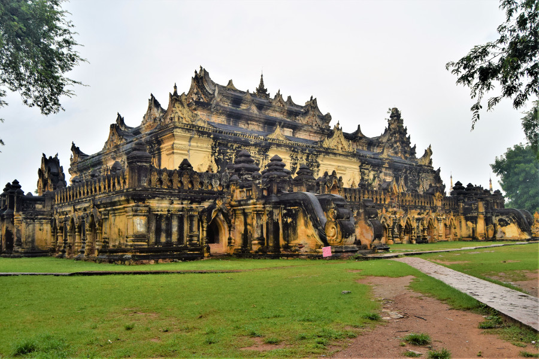

>“Oh the road to Mandalay Where the flyin'-fishes play An' the dawn comes up like thunder outer China 'crost the Bay!.”

Rudyard Kipling, Mandalay.

##Mandalay
We took a bus from Nyuangshwe to Mandalay but we hadn’t realised that the drive wasn’t actually that long, so after a short [JJ Express](https://www.jjexpress.net/) night bus we arrived in Mandalay at 4AM. The bus stopped in the middle of nowhere and we were ushered onto another bus to the downtown area in a very sleepy state. We arrived at [Hotel Sahara](https://www.hotelsaharamandalay.com/), a very basic budget hotel but we were lucky enough to be able to check in and go back to bed!

We stuck to two restaurants in Mandalay, both were within walking distance of our hotel, [BBB Bar & Kitchen](https://www.facebook.com/bbbrestaurant/?rf=1798268933741986) and [Ko's Kitchen](https://www.facebook.com/pages/Kos-Kitchen/329913217076970). On our walk to Ko's Kitchen, a teenage boy started to walk his bicycle and struck up a conversation with us. He had just come from his English class, and we think he wanted to practice. He walked us all the way to the restaurant, asking us about our holiday and telling us about his country and his studies. We found that this happened lots in Myanmar, everyone wanted to practice their english and everyone asked questions about snow!

##Imperial Palace
Mandalay’s main attraction is the imperial palace, which was the last palace of the Burmese monarchy, constructed around 1857. We completely underestimated the size of Mandalay city and the vast size of the palace. The fort and walls surrounding the palace were around 2KM long and there was only one tourist entrance, which meant a very long walk around it. We took a [Grab](https://www.grab.com/sg/) to the entrance but found that taxis in Mandalay were almost triple the price of those in Yangon. After paying 10,000ks (£5) in entrance fees for the palace and some surrounding Mandalay attractions, we unwillingly handed our passports over to the military security guard and headed past the armed guards and into the walls of the palace. We had to walk to the palace but there were signs everywhere saying we were not permitted to take photos and on the 10 minute walk, it felt like we had walked into an army base. A man was practicing his band instruments on a volleyball pitch, there were metal bars fencing roads off everywhere and great big red signs everywhere with warnings in Burmese.

The palace itself was a bit of a disappointment. We discovered that it had actually been flattened by allied bombing in World War 2 and a replica had been built in the 1990’s. The paint job was crumbling and the rooms were empty. There was a small museum at the back of the palace with bits of furniture and clothes that was interesting, but other than this we didn’t feel it had been worth the entrance fee. That is, until we went up to the watchtower and saw the view of it from above, which was pretty spectacular.

##Mandalay Pagodas
We’d planned to visit Mandalay Hill, known to be a good spot for a beautiful sunset but unfortunately it was cloudy the entire time we were in Mandalay so we never bothered going up. Instead, we spent the rest of the afternoon in the city exploring some of the pagodas. We visited two very close to one another, Sanda Mundi and Kuthodaw Pagoda. Sanda Mundi's many stupas are white, which Dan and I thought looked more picturesque than the gold. We later found out that the only reason the stupas are painted gold now instead of white is because it's considered more 'modern' and it's easier to keep them clean.

Kuthodaw Pagoda was just around the corner from Sanda Mundi. Kuthodaw is technically the worlds largest book as it contains 729 stone inscription cave marble slabs of text from the Pali Canon of Theravada Buddhism. Theravada Buddhism is the main type of Buddhism in Myanmar and unlike other types, it follows the teachings of Buddha in its original form. So for example, in other types of Buddhism monks are able to live with their families but in Theravada Buddhism they must live in a monastery. Again the pagoda was white and free from too many tourists making it very picturesque.

##Pyin Oo Lwin
We decided to fill our two days in Mandalay with full day trips out of the city. For $50 hired a driver for the day to take us to a nearby colonial town called Pyin Oo Lwin. The town used to be known as May Myo after British Colonel May and it is famous for it's gardens built by Turkish prisoners of war during World War 1, modelled after Kew Gardens in England. Our driver firstly drove us out to Dat Taw Waterfall, just outside the town. On the way he told us about drivers in Myanmar and that people just pay for their driving licence. Shortly after on a two lane highway, a lorry came speeding past driving on the wrong side of the road. We couldn't believe it!

Dat Taw Waterfall can be reached either by a 30 minute hike, with an uphill climb back to the car, or it can be viewed on the other side of the valley from a resort hotel. We decided on the latter. We paid 1000ks (50p) each to see the waterfall and got a pretty good view with some low misty clouds and the golden pagoda situated right next to it. We decided to stop for a drink at the restaurant as it felt like we had stepped back in time to the colonial period of Burma.

Our driver said we could stop at the Govenors House, but it cost $5 to go inside. We had a quick nose at what the house looked like on the internet and it looked just like some of the big posh houses in Stratford upon Avon, so we decided to give it a miss. We then headed to Naung Kan Gyi Pagoda which on a good day might have offered great views of the surrounding area but it was so cloudy it was a bit of a disappointment. At this point, we were also getting a little 'pagoda'd out'. We went to a nearby park to see another waterfall called PweKauk, in colonial times it was known as 'Hampshire Falls'. There were lots of people swimming in the shallow water, despite the weather being cooler as we were 1000 metres above see level and the fact that it was raining. We looked around the weird sculptures in the park before heading to lunch.

Our driver, like our guide in Yangon, was eager to learn about England mpre so than he was to tell us about life in Myanmar. However, over lunch he decided to get political and started discussing Rohingya, a topic we'd been careful to avoid. He told us that Rohingya muslims are not a recognised ethnic group in Myanmar, which he agrees with because in his view, they do not respect Myanmar culture. He told us that the muslims in Rohingya don't speak the Burmese language so show them disrespect. The driver told us that he does not believe there is a genocide and knows that only 10 or so people have been killed. He told us that Burmese men do not find Rohingya muslim's attractive so he does not believe that they would be capable of committing the horrors and abuse that are portrayed in the news. Dan and sat very uncomfortably during the drivers monologue, avoiding comment on the issue. He continued and told us that people of Myanmar also don't speak to Chinese people that live in Myanmar but explained that they can live together peacefully because they learn Burmese and respect their culture. It was worrying listening to our driver's views about the ethnic cleansing occuring in his own country and many people had questioned our decision to travel to Myanmar. The thought of not going in a tourist protest because of what is happening there had crossed our minds. However, we knew that not everyone would agree with what is happening in their country (and we met a few people who didn't) and we also knew the we would be depriving the working class people in the towns and villages who rely on tourism of their income.

The highlight of the day was Peik Chin Myaung Cave (Maha Nadamu). We were told to remove our shoes, as we had to at every religous site. It was starting to feel like we had explored more of Myanmar barefoot than with our shoes on. The guard directed us to a waterfall which was a walk outside, in the rain, on a gravelly path. At one point a spikey caterpillar crossed Dan's path and he was lucky not to tread on it. We didn't last long before giving up and heading back to the cave. Peik Chin Myaung was huge, full of stupa and buddha statues. One part of the cave was flooding and we were unsure whether it would be safe to continue to walk through but followed the crowd. We later found out that in the 1990's the cave was turned into a tourist attraction and many of the people visitng were tourists from Myanmar.

Our final stop was the National Kandawgyi Gardens, we had a wander around a bamboo garden, a bird avery and went up a watch tower. On a nice day, we imagine the park would have been really colourful and a great spot for a picnic but as the rain continued we didn't spend too long there.

##Min Kun
The hotel gave us the same driver as Pyin Oo Lwin and to avoid any political conversations with him, we played Adele (his favourite artist) through bluetooth in his taxi and put up with his singing throughout the day. We had an absolutely jam packed day and our first stop was to a gold leaf workshop. We found it difficult to understand in a country so poor, why people spend their money on gold leaf to donate to the temples. We even visited a pagoda in Mandalay where the temple with the buddha statue can only be entered by people donating gold leaf.

The driver took us to a monastery in Min Kun, a small town on the banks of the Irrawaddy River, which is home to around 1300 monks. He told us not to talk to them for too long but that we could watch them have their lunch. The lunch hall was absolutely crowded with tourists and we felt really uncomforable, like we were in a human zoo. We decided to go for a walk around the monastery rather than staying with the tourist paparazzi and felt a little disappointed that none of the monks walking past struck up a conversation with us. We went back to the car early and asked the driver if the monks mind tourists surrounding them and taking photo's, his response was that its part of their daily life and they're used to it.

Our favourite pagoda in Mandalay was Hsinphyumae Pagoda, a beautiful white pagoda modelled after the mythical [Mount Meru](https://en.wikipedia.org/wiki/Mount_Meru), thought to be a real place and the centre of the universe. The pagoda seemed cleaner than others, it had one staircase up to the top and had wavy, tiered terraces that could be walked around.

Mingun is known for its ruined Mingun Pahtodawgyi, an unfinished stupa which we also paid a quick visit to whilst we were there. Construction began in 1970 by King Bodawpaya but it remained unfinished as an astrologer claimed that once it was finished the king would die. A gigantic bell was also cast for the stupa, which weighs 90 tonnes and is the largest ringing bell in the world.

##Sagaing
Sagaing has numerous pagoda on it's hills, which we got a great view of from the boat we took from Mandalay to Bagan. We visited two in the area; Soon U Ponya Shin Pagoda and Umin Thonse Pagoda. Soon U Ponya Shin was on top of a hill and had a massive buddha inside. On the other side of the building there was a great view of the surrounding hills. Umin Thonse was beautiful. We had to climb a really steep staircase to the top through the stall sellers, to a row of 30 caves with a crescent-shaped colonnade of 45 buddha images. The outside was ornate and blue and really picturesque.

##Innwa
We decided at this point that if the next place was a pagoda, we were going to ask the driver to skip it and take us to the U Bein Bridge - the whole reason we'd decided to do the day tour. The driver stopped by the edge of the river and told us we needed to get a boat to Innwa to have a look around. He explained that Innwa is an ancient city and was the capital of Burma for almost 360 years on five ocassions from 1365 to 1842. It is on a man made island created by connecting the Irrawadday and Myitnge rivers by canals. However, the city was completely destroyed following a number of earthquakes in 1839.

Our driver explained we could cycle, hire a motorbike, horse and cart or walk around Innwa. He was wrong. When we arrived the roads were so muddy that walking and cycling were out of the question. This left us with the only option of horse and cart, which we were really unhappy about. It cost 10000ks ($5) for a two hour ride around Innwa, stopping at the four main attractions. Our horse and cart driver thought it was hysterical that I am a little scared of horses and told me I had to sit at the front to balance out the cart.

When we arrived in Innwa, another woman had approached us, trying to sell her souvenirs. Being polite, we'd told her maybe later. She took this literally and followed the horse and cart on her scooter for around 30 minutes, even showing us around some of the Yadana Hsimi Pagoda. In the end, I brought a hiddeous jade necklace for 13000ks (£7) to get rid of her. The driver of the cart took us to the watchtower, which we weren't allowed to climb as its falling over. The tower marks the site of the old palace. We also visited two monastery's in Innwa; Maha Thiri Zeya Thinkhaya a wooden teak building which is where royals were educated. And Me Nu Ok Kyuang, a brick monastery built in 1818.

##U Bein Bridge
After two long hours on muddy roads in a horse and cart with an hysterical Burmese woman we were on our way to U Bein Bridge. It's one of the most photographed places in Myanmar and in the sunset looks stunning. The bridge is really long, crossing a lake and made of teak wood. We were supposed to be there for sunset, but it was raining, cloudy and we were definitely too late for sunset, as by the time we stepped on the bridge it was getting really dark. We were really disappointed as we'd also hoped to see the bridge by boat, but had a walk along it anyway, until we spotted a couple of rats and decided it was time to leave.

##Our verdict on Mandalay
We definitely stayed a day too long in Mandalay, but it did give us chance to explore the surrounding areas of the city. Our time there was tainted by the horrible rainy weather but seeing the ruins in Mingun and Innwa made us very excited for our next destination, Bagan!