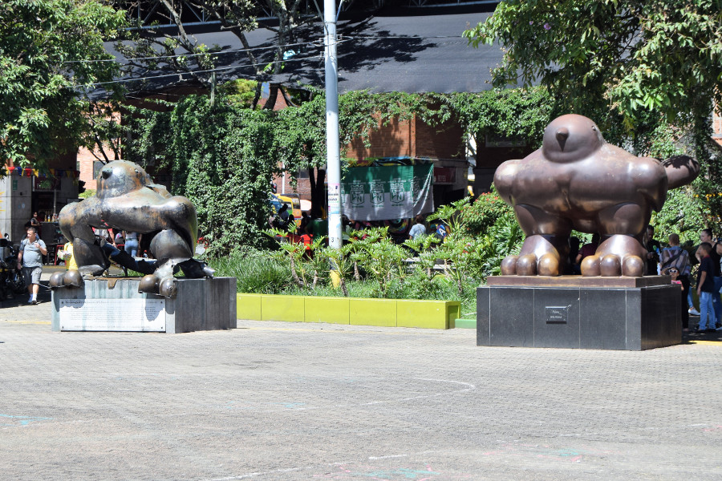
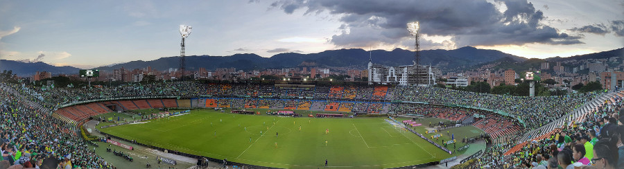
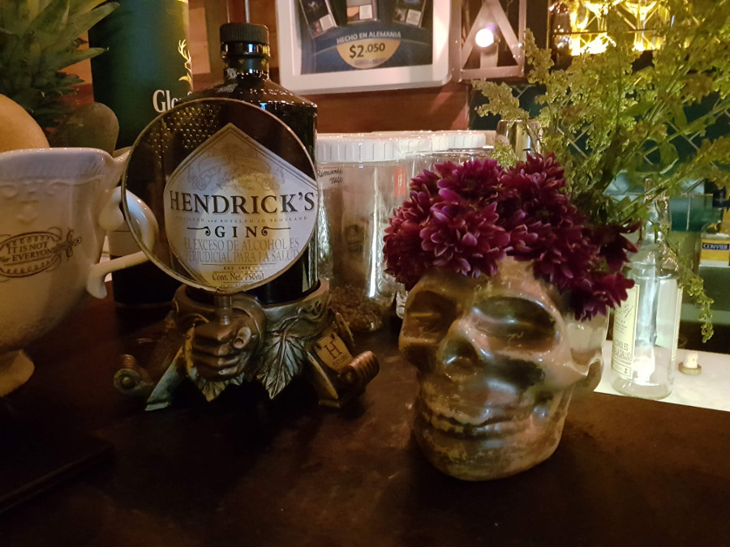
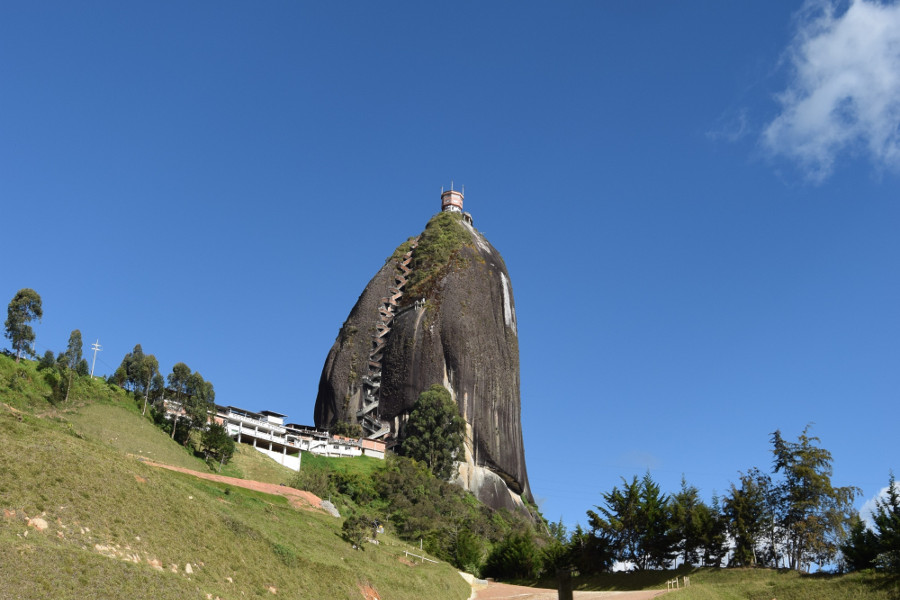
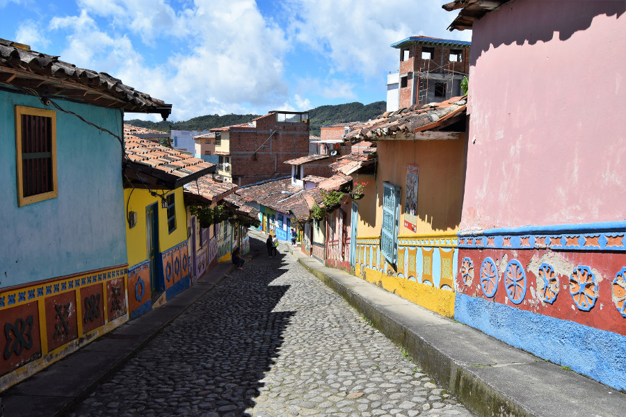

>"My plan is to dance until everything is solved."

Anonymous.

##One hell of a bus journey
We were concerned about getting on another Colombian bus after our trip to Salento but we'd been told that the road to Medellin is much straighter, taking around 7 hours on the bus service [Flota Occidental](https://www.flotaoccidental.com/en/) directly from Salento. Again it only cost $47000COP (£12) and at 11AM after a big brunch we boarded the little minivan and headed out of Salento. The first warning sign of things to come was that there were no seatbelts and poor air conditioning. A couple of hours into winding round the countryside we realised the roads were going to be exactly the same as the ride from Bogotá to Salento. The only difference was it was now daylight so we were able to see how absolutely mental the driver was, going full speed around corners, overtaking on corners, stalling on every hill start and generally being completely wreckless.

Due to the rain in Colombia there were a number of landslides on the road meaning there were road works causing lots of traffic. At one point we saw a car on the other side of the road slam straight into a cow that had wandered into the road. We stopped around four hours into our journey so our driver could catch the second half of the Colombia vs Egypt match and enjoy his beer with his late lunch! Nine hours after we set off, with only one toilet stop, we arrived in Medellin; absolutely knackered, starving and incredibly dehydrated as we hadn’t dared to drink anything. We brought some beers and water from the bus station (essential supplies) and headed to our Airbnb with a takeaway pizza in mind and a good nights sleep.

##Downtown
We’d been looking forward to exploring Colombia since the beginning of our trip but sadly in the back of our minds was the stigma attached to the country, that is that it’s dangerous. Particularly Medellin, the once murder capital of the world! We explored downtown with a [Real City](http://www.realcitytours.com/barrio-transformation-tour/) free walking tour on our first day to see what the city was actually like. We were eager to learn about the country's 54 year conflict and what it had been like living in Medellin, but sadly the tour didn’t live up to our expectations. The guide barely mentioned Colombia’s recent history and it felt like she was ignoring the elephant in the room, which we found really irritating. Instead she showed us where we could shop for fake goods, pointed out the prostitutes that work near the church so that men can repent their sins straight after the deed and we saw some breakdancers who were really amazing dancing to J Balvin, 'Mi Gente'.

Although the guide didn't go into masses of detail about the the political and economical conflict between the guerillas, paramilitary groups and cartels, she did emotionlessly point out a couple of places in the city that had been affected by violence. She pointed out a balcony at the metro station as we walked past where a grenade had been dropped killing lots of people and she also showed us Plaza de San Antonio, which contains two bird sculptures by Botero, one of which had been blown up in 1995 during a music concert killing 30 people and injuring 200. The guide talked a lot about the transformation of the city quite desperately and explained that Colombians are happy people because they forget what had happened to them in the past, and look to the future.

In terms of Medellin being dangerous, there were obviously places that we wouldn't have wandered around during the night but it didn't feel dangerous at all and was like any other South American city. The only difference was that people in the streets would say “Hola Gringo!” and wave; the guide told us not to take this as an offensive thing and that people in Medellin are happy to see tourists and that’s why they stare and say hello.

##Pablo Escobar
Before we had left the UK, a Pablo Escobar tour in Medellin wasn’t even up for debate it was a must! However we changed our minds very quickly once we arrived in Colombia. The first reason was cost a Pablo Escobar tour would set us back between £40-150 to see where he used to live, his grave, where he imprisoned himself and the roof where he was killed. Some of the reviews also said that the guides really glorify him, ignoring the fact that he murdered hundreds of innocent people with his acts of terror; we were uncomfortable enough seeing people selling caps and tshirts with his face on them around Colombia. In Bogotá, the walking tour guide had rightly referred to Escobar as a terrorist and talked about Colombians being unhappy that he is glorified as a protagonist in the Netflix series Narcos. The guide told us that she had met some backpackers who had been to Medellin and told her that they had paid a lot of money for a city tour from John Jairo Velásquez (or Popeye) Escobars hitman. She said they’d been excited about it, until she’d asked them why they were so excited about being shown around by a serial killer.

After we did the walking tour in Medellin, it became evident that some Paisas (people from Medellin) aren’t ready/willing to talk in detail about the violence in their country. We had planned to ask the guide how we could learn more about Escobar without doing anything insensitive but just the question seemed insensitive when she hadn’t even addressed Escobar by name; in the end we didn’t bother and decided to visit the [Museo Casa de la Memoria](http://medellin.travel/MedellinTravelWeb/locations/101/house-of-memory-museum?lang=en) which she recommended to learn more about the Colombian conflict in general.

##Museo Casa de la Memoria
Museo Casa de la Memoria is a museum about the conflict in Colombia in general and is mainly dedicated to the victims of the violence. The museum was very interactive and we were able to download an app to follow around the museum. Sadly most of the interactive stuff was in Spanish so it wasn’t easy to read more about it, luckily free WiFi and Wikipedia helped! It wasn’t a bad way to spend a few hours for free, looking at photos and newspaper articles about FARC, ELN and Narco Terrorism. The most hard hitting part were the big TV's where victims told their stories about being displaced and terrorised during the conflict, these had subtitles in English.

Even though the museum was good, it still didn't seem to satisfy our thirst for information about the history of the country. Something was missing, it felt like the city doesn't want to accept its past and [this article](https://colombiareports.com/medellin-needs-pablo-escobar-museum/) really sums up how we felt about the lack of historical information in Medellin.

##Atlético National vs Atlético Huila (written by Dan)
Greeno and I jumped in an Uber to the Atanasio Girardot Stadium to watch Atlético National vs Atlético Huila in the second leg of the play off semi final. We had bought the tickets from a restaurant on the advice of the tour guide for $76000COP (£20).

When we arrived we were immediately flagged down outside a bar so we stopped for a few beers and to soak up the atmosphere amongst the locals. In between being offered fake shirts, cigarettes and everything else we noticed a group of lads drinking beers and snacking on large bowls of fruit. On reflection this probably explains the lack of obese fans.

Following our struggle trying to find the right entrance we eventually made it inside just before kick off. Having been advised previously to not sit in the south end we could see why. The fans were bouncing and singing all game, which I’m sure would have been an experience, but probably not if you wanted to watch the game. We were on the lookout for players we recognised but it wasn’t until Zuniga, formerly of Watford, who was subbed on that we had found one.

Although the final score was 0-0, for a goalless draw it was pretty exciting and the quality of football was better than we expected. We lost count of the number of times the woodwork was hit and, but for the crossbar, we almost saw a 35 yard free kick fly into the top corner for Huila.

As the first leg also finished 0-0 this meant that the game went to penalties which was probably the best Huila were hoping for, as the game panned out particularly after they had a man sent off. Nacional had the clear advantage as the penalties were taken right in front of the boisterous south stand fans and they subsequently won 4-2.

Unfortunately for Nacional they didn’t go on to win the competition as they were beaten by Deportes Tolima in the final on penalties. Even though Nacional finished top of the table, in the Colombian Primera division, the top 8 teams at the end of the season enter into a play off tournament to determine the winner. I would definitely say they will feel hard done by.

##El Poblado
This was the night life area in Medellin, where all of the bars, lots of restaurants and most of the hostels are. However it was much pricier than anywhere else we had been in Colombia! We went there on two nights that we stayed in the city, the first for some beers and mojitos and the second we ended up in a reggaeton club called [Vintrash](https://vintrash.co/) after a massive jug of spiced rum sangria.

##Guatapé
We did a day trip to Guatapé with a private driver arranged through the Airbnb we were staying at as it worked out cheaper than a tour. We stopped at El Peñón de Guatapé first, a massive rock with over 700 steps to climb for fantastic views of the lake. What we hadn’t anticipated was that it was Colombian bank holiday Sunday, it was sunny  and the place was absolutely rammed! However we had some mango biche and some tinnies at the top before queuing to come back down.

Our driver Cristian then took us to the town Guatapé. It was really colourful, a little like Salento but each house was probably even more colourful with some gorgeous frescos on the walls.

We ate in a restaurant on the plaza and Iz and I had Banjeras Paisa, a typical dish from the Antioque region of Colombia. It’s a tray full of food; chorizo, fried pork belly, mince, rice, beans, fried egg, fried plantain, avocado, arepas and a token bit of salad. Absolute workers dinner and very filling!

##Our verdict on Medellin
We liked Medellin, but felt that the city didn't really know how to handle its growing tourism, not wishing to address Escobar who is sadly a huge part of their history. The city of Medellin is somewhere we would like to visit again in 10 years time to see how it has changed. We definitely didn’t have nearly enough time in Medellin and could easily have spent another week there. Some of the graffiti we drove past around the city was probably some of the best we’d seen in South America and had we been there another day we definitely would have done the graffiti tour in Communa 13, however it was time to head to the sunshine and the islands on the Caribbean coast!