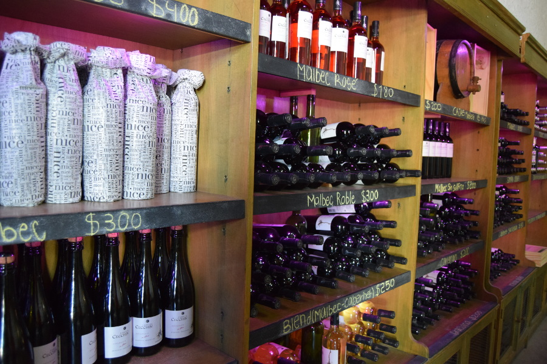
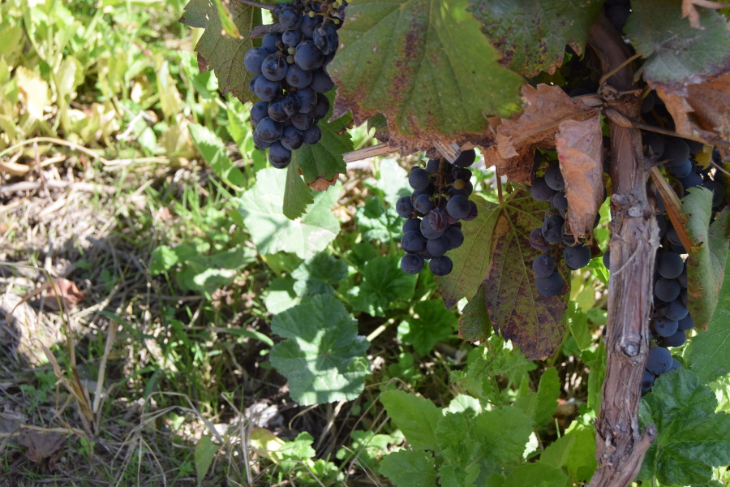
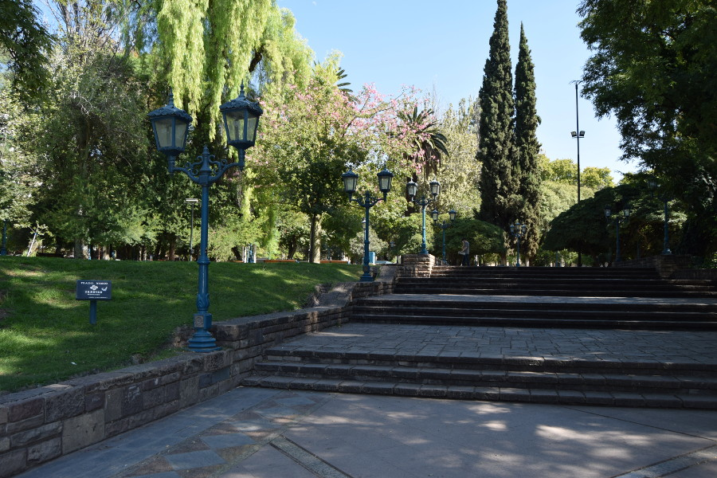
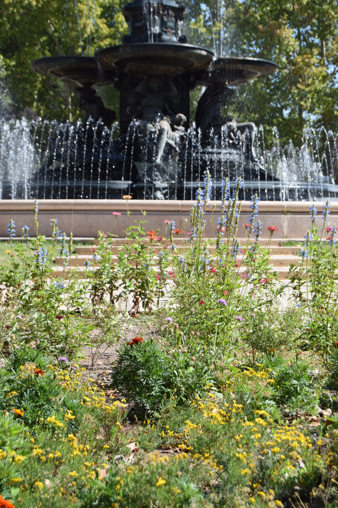
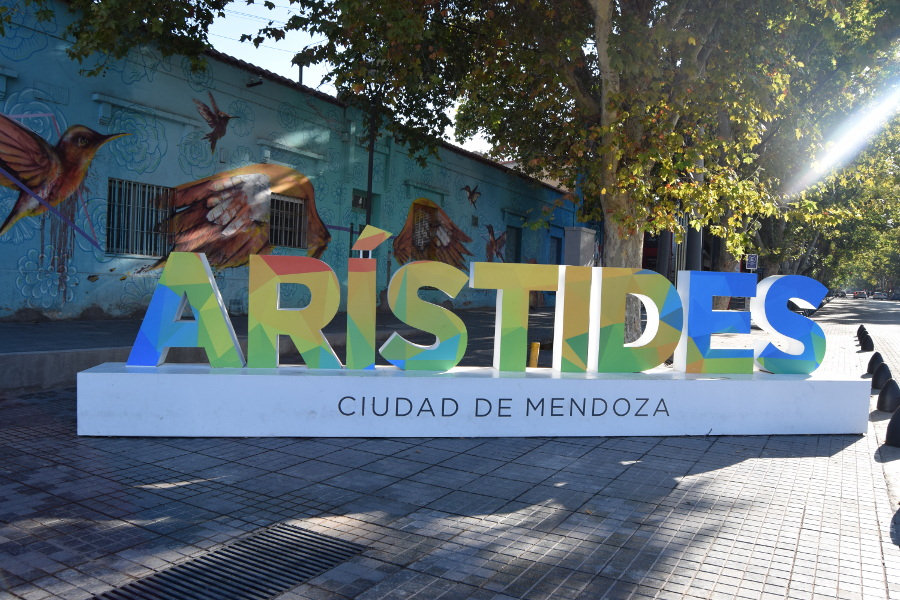

>“My only regret in life is that I did not drink more wine."

Ernest Hemingway.

##From Chocolate to Wine
Our journey from Bariloche to Mendoza was a hardcore twenty hour bus ride. We did some research before we booked; [Andesmar](https://www.andesmar.com/en/) had good reviews so we went with them and booked a cama (bed) for £80. The bus left Bariloche at 13:00 and we arrived in Mendoza the following morning at 08:30. The first interaction we had from a staff member on the bus was around 20:00 when they launched into a very loud game of bingo. At this point we were really thirsty, but at least we could work on our numbers in Spanish. We were finally offered dinner and a drink at 22:30, just 9.5 hours into the journey. If this was a good company we wondered what the others were like!

##Vino Tinto
The main reason people go to Mendoza is of course for the wine, in particular Argentinan Malbec. As we had been so unsuccessful at navigating around Bariloche ourselves, we decided to book a tour to explore Maipu Valley. We went with a full day biking tour booked through our hostel, [Mora International Hostel](http://hostel-mora-mendoza.mendoza-hotels-ar.com/en/) for £30.

The tour itself was a little unbelievable at times; they were over an hour late for pick up, abandoned us for an hour and a half at the first bodega and all the guide really said was 'vamos!'. The bikes were another thing altogether. We use the word 'bikes' loosely as they had no gears, no breaks and we weren't given a helmets. They were basically some metal poles welded together with two wheels and the hardest seat in the world to sit on. We had to hobble around with bruised bumcheeks for days after our bumpy bikeride around Maipu. We also thought we'd be biking around the vineyards, but in actual fact we biked the main roads between the vineyards, not so idyllic.

However, the tours in the bodega's were really interesting; we now know how to taste wine properly, how to tell if its been in an oak barrel and for how long! Proper wine snobbery!

The first bodega we visited was Bodegas y Vinedos Familia Cecchin Organicos. They explained that they use trees and herbs to distract the insects from eating the grapes rather than chemicals. We tasted three different types of wine, all were delicious. Whilst we were waiting for the guide and driver to return, one of the men working at the vineyard gave us all some Malbec grapes to try before the lorry tipped them in the squisher. The second bodega was Vistandes, here we learned the difference between a young wine, reserve and gran reserve and tasted two more wines.

We biked to the Beer Garden for a pint and empanada for lunch and got talking to a Swiss couple who were finding the tour as amusing as we were. We tried to order a glass of red but despite being in the wine capital of Argentina, surrounded by vineyards, they didn't have any. After lunch, we made our way to the last Bodega, Dominica. A tour wasn't offered around the vineyards here, but the guide did teach us how to taste the wine properly and we brought a bottle to enjoy that evening.

##Mendoza City
We did a walking tour of the city and the guide told us lots of things we'd have never known otherwise; that the paths and roads are so wide in case of an earthquake and that there are no trees native to Mendoza, they're all imported from elsewhere. He took us to the main spots in the city, which weren't really grand at all. After spending so long in cities in Patagonia, which are made for tourists visiting the national parks, it was refreshing to be back in a true Latin American city.

We had a Sunday in Mendoza, and like all other cities we had been to, everything was closed, so we had a picnic in San Martin Park and sunbathed all afternoon. We also headed to [Premium Tower Suites Hotel](http://www.premiumtowersuites.com/mendoza/) to have a coffee in their restuarant on the top floor to enjoy the view. However it was closed to the public due to a private function. We did get a glimpse of Mendoza surrounded by the Andes but not for long enough to get a picture before we were shooed away.

On our last night in Argentina we went for steak in [La Lucia Bar & Grill](http://www.laluciagrillbar.com.ar/). It wasn't as good as other's we'd had but it was our last chance for an Argentinan bottle of red and steak. We then headed to Aristides Av., the nightlife hotspot for the university city of Mendoza. We had some beers in Beerlin and Hangar 52, more microbreweries.

##Our Verdict on Mendoza
The main reason we had added Mendoza to our itinery was for its wine and it did not disappoint. The city itself was a pleasant surprise, it was a slow paced, full of plaza's and parks and it felt more like Latin America than the last few places we had been to. A great end to our time in Argentina!

