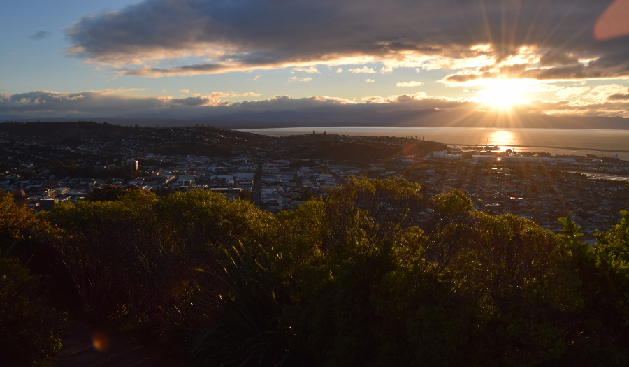
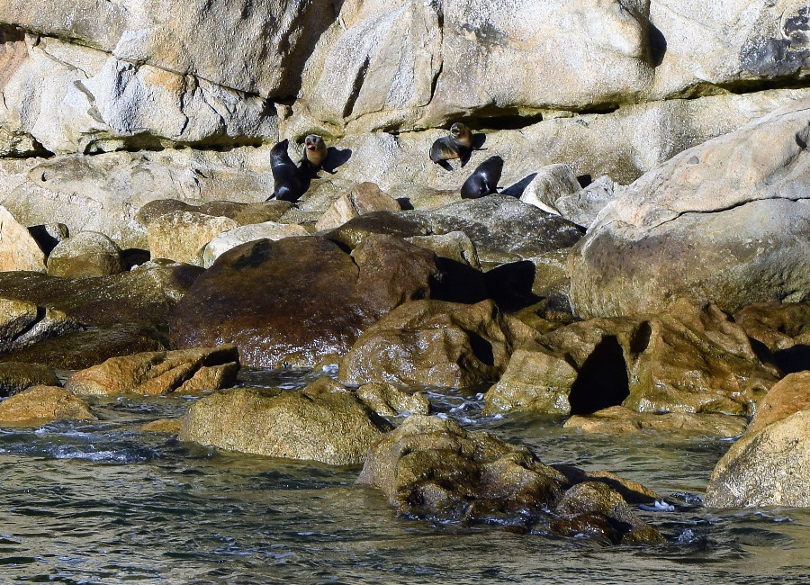
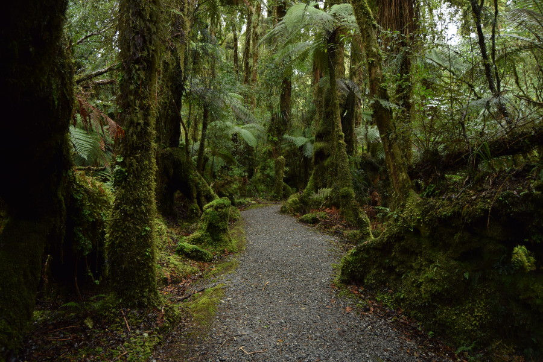

##Nelson
Our journey to Nelson was a long but interesting one. Having set our alarm for 6am, we had a 25 minute walk from our hostel to the train station for the Interisland shuttle bus to the ferry. We were following specific instructions on the InterCity website but we saw the same shuttle drive past locations much closer to our hostel which was a bit annoying.

Once we were settled on the shuttle and seconds before we were due to leave, the arsehole ranted at length about in our [Rotorua blog](/rotorua/) got on. You can imagine what we were thinking at this point!

We boarded the ferry and due to Soph's tendency to feel seasick we sat on the upper deck. It was bitterly cold so we kept going inside and out but the views of Marlborough Sounds on the approach to Picton were incredible. Unfortunately we didn't see any whales but 20 different types have been spotted in the waters!

Once we arrived at Picton we found our InterCity bus to Nelson and you will never guess who got on. Yep, the arsehole again. Soph had made camp near the front of an empty bus and he decided to sit adjacent  us. Fortunately though he didn't get his washing line and wet clothes out to dry! We soon moved further back as the bus was pretty much empty when it departed. The bus driver was very vocal throughout the journey and reminded me of an old school radio DJ as he cracked the same lame jokes about having 'Windows live' on the bus.

Nelson was our first glimpse of the south island and we noticed the lack of indigenous names. We had previously read that during the early settlements in New Zealand, the majority were in the north island.

##The centre of New Zealand
After arriving and dumping our stuff at [Bridge Backpackers](http://bridgebackpackers.co.nz/), we were recommended to do the walk up Botanical Hill to the centre of New Zealand as it was a Sunday and most places were shut. It only took us about half an hour to reach the top which had nice views over Nelson and Tasman Bay just as the sun was setting.

##Abel Tasman National Park
The following day we had booked with Sea Shuttle for a cruise and hike around Abel Tasman National Park for $86 (£44). The cruise was interesting at points but felt more like a water taxi as people got dropped off at different beaches for their hikes, work or because they lived there. We did get to see several New Zealand fur seals as they sun bathed on the rocks and played in the sea. We also saw New Zealand's most photographed rock, named split apple rock.

We were dropped off at Apple Tree Bay for our hike to Anchorage where the boat would pick us up. Although it was a lot colder and didn't have as many creepy crawlies or monkeys, the national park reminded us of Tayrona National Park in Colombia. There are no roads and access to the few holiday homes and camp sites are limited to boats or hiking, so it felt really secluded. There were lots of birds in the park and on our 7km hike, we encountered two Weka's on the paths. They looked just like ducks, but with a sharper beak and claws and fluffier feathers, a little like a Kiwi bird. The walk itself was really easy and didn't take us long so we had some time to basque on the beach in the sun before the boat came to pick us up.

##Fox Glacier Township
We found a deal on [bookme.nz](www.bookme.co.nz) for a glacier helicopter landing at Fox Glacier which is why we decided to come here rather than Franz Joseph. Frustratingly, the weather was awful in our time at Fox which meant we could not fly. Our schedule was fully booked so we could not stay another day either. The approaching paths to Fox Glacier were flooded as well which meant we had little more to do than wonder around the tiny township. I was now beginning to understand why our hostel was littered with motivational posters on the walls.

It was at this point where we were really regretting our decision to not hire a car. Shuttle buses, we felt, were expensive for what they were ($20 per person to local treks) and transport links to Franz Joseph were also limited. Having a car would have given us the flexibility to make the most of the surrounding areas.

The only thing of note that we did, besides watching a few episodes of Flight of the Conchords, was our visit to the Glow Worm Forest. As it was the only feasable walk we could do, we strolled around the forest in the day and again at night when the glow worms were visible. We weren't expecting much so we were pleasantly surprised when we spotted the clusters of glow worms amongst the darkness. They looked like blue stars glittered around the pitch black forest. We couldn't capture the bright sparks of light on camera so this was one for the memory bank. The Fox Glow Worm Forest was well worth the visit and it was something a little unusual from what we'd done so far. For me, it redeemed what we originally thought was a wasted trip to Fox.

##Our Verdict on Nelson
We had lovely weather, despite the cool air, and Nelson was a nice place to spend a few days as we passed through. We enjoyed having Abel Tasman National Park virtually to ourselves in the winter sun, although it would definitely be a place to spend a few days in the summer when we return to New Zealand. We were gutted we never got to the top of Fox Glacier but hoped we would be able to do something similiar somewhere else on South Island.