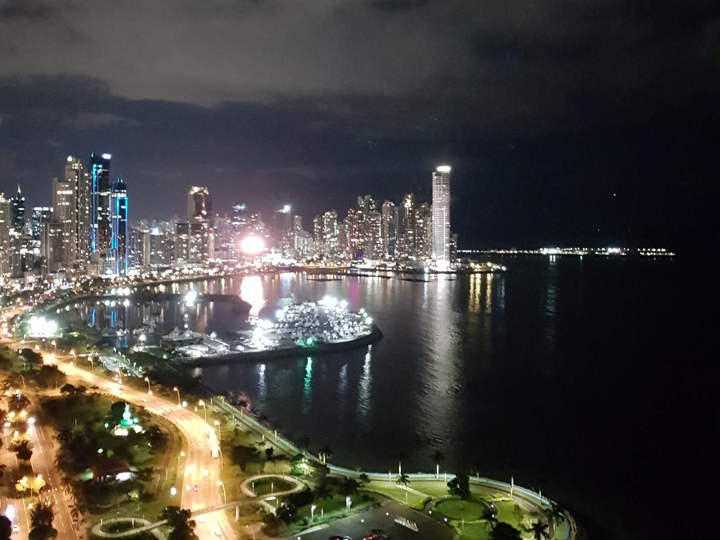
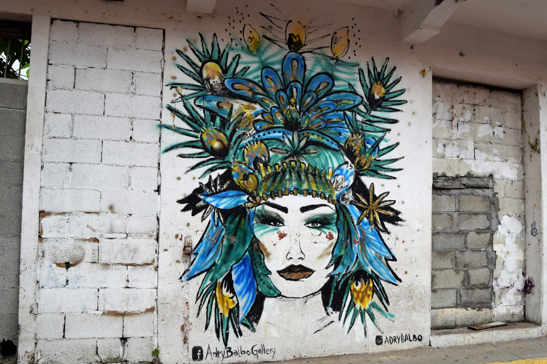
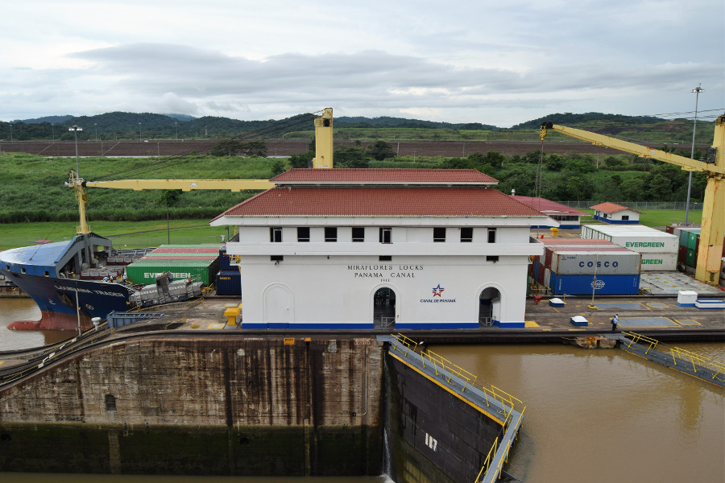
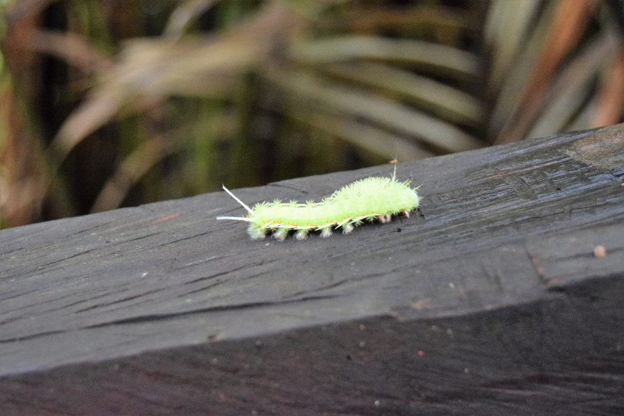
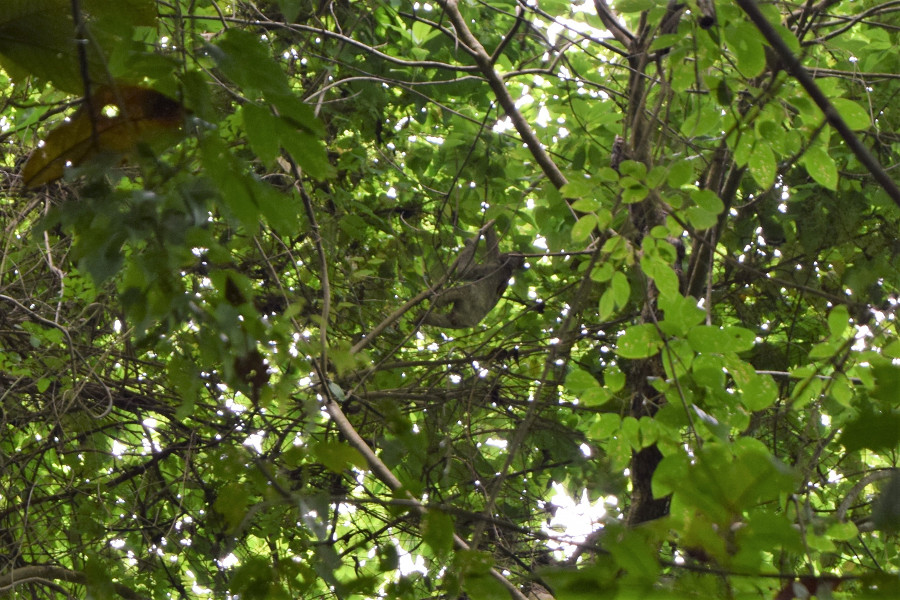
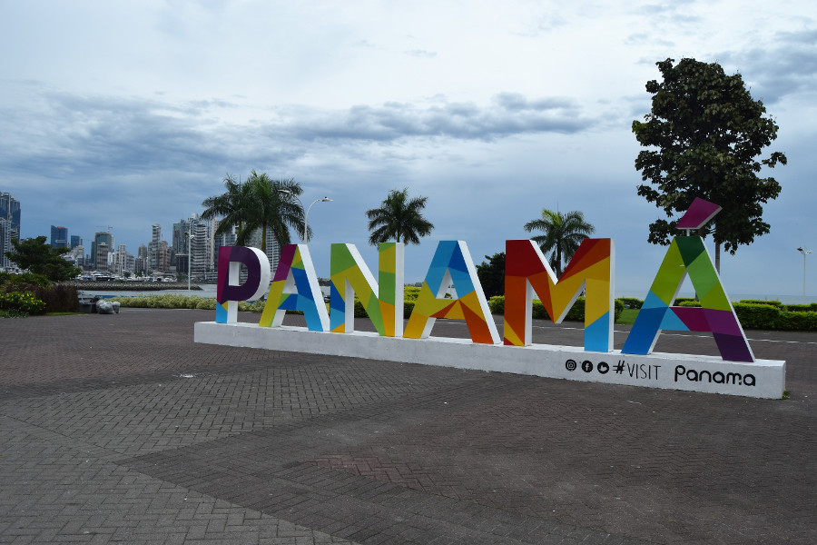

##La casa de Nick y Charlotte
In the end we spent ten days in Panama City as we were staying with friends. Originally we’d had plans to visit Bocas Del Toro and Boquete in the North of Panama for around five days but changed our minds due to tiredness and the weather. We’d arrived in Panama City during rainy season and unlike rainy season in the Amazon or on the Caribbean coast it was much more gloomy, grey skies for most of the day and heavy rain in the afternoon. Instead, we thought we’d spent ten days relaxing and really exploring Panama City as the most we’d spent in one place up until now was four or five days. For most of our time we stayed in Nick and Charlotte's flat which was on Avenida Balbao and their balcony had a brilliant view of the skyscrapers in the city.

We did lots of 'normal' things in Panama City, such as shopping in the malls, we got haircuts and a manicure (me, not Dan), we went to the cinema twice, to see Incredibles 2 and Jurassic World 2, we went bowling and spent time in the bars watching the World Cup. Really we made the most of our time charging our batteries and eating homecooked food.

##Casco Viejo
We visited the old town in Panama City a number of times, mainly as there were some cool bars and restaurants. We went for brunch one Saturday and returned the following day to watch the England vs Panama game. In Panama time this was on at 07:00 so we were up at 05:45, necked Espresso Martini's before we left and were pretty drunk by 11:00. We watched the match in [La Rana Dorada](https://www.tripadvisor.com/Restaurant_Review-g294480-d2694608-Reviews-La_Rana_Dorada-Panama_City_Panama_Province.html) and then went for breakfast in [Casa Bruja](http://casabruja.com/) for more craft beers and a civilised game of 'What do you Meme?'. The Panama fans were brilliant sports, considering we were surrounded by them. The loudest cheer of the game was when they scored, everyone in the bar was on their feet.

Dan and I also went back to Casco Viejo in the day to have a look around. Unlike other old towns, such as Cartagena, Casco Viejo had a lot of restoration work going on. As we walked the narrow streets, many of the buildings were deralict or being supported by scaffolding. There were a few souvenir shops and some hat shops filled with the stereotypical Panamanian hat. We visited some of the plaza's in the area; Plaza de la Independencia, Plaza de Francia and Plaza Boliviar. Unlike many other Latin American cities that we had visited, there wasn't a free walking tour around the area so we were left to wander around and explore on our own.

##Multiplaza
We visited a couple of malls in Panama City, as it’s much more Americanised and Western than the rest of Latin America. We were able to start replacing some of the clothes we’d been wearing and washing continuously for the last four months in Forever 21, Bershka, Pull & Bear and Zara. It was there we decided to go to the cinema a couple of times, which was really cheap in comparison to the UK, $6 (£4.52) for a ticket and $3 for a big tub of popcorn.

Our favourite supermarket in Panama was Riba Smith, it was full of western food. It reminded us of a Waitrose and we were able to find all our favourites in there; nice cereal, gravy, mustard, craft beers, baked beans and the most expensive fruit and vegetables that we'd ever seen; $6 (£4.52) for a cauliflower. Riba Smith made it really easy for us to make lots of home cooked meals, something we'd struggled to do since we left Chile.

##Panama Canal
As we were in Panama City for such a long period of time, a visit to the Panama Canal was a must. It cost $15 (£11.30) to get in, which was pretty steep compared to what we were used to paying. We watched a film about the canal and wandered around the museum that explained how the canal was built and how it has developed over the last 100 years. Unfortunately we'd arrived really early and had to wait a couple of hours to see a boat pass through the canal. At around 15:00 one finally arrived and we watched the water empty out and a big ship full of containers pass through from the Atlantic to the Pacific Ocean. It took a really long time to get it through. Afterwards we thought we would head to Albrook Mally, but the taxi tried to charge us $10 as we were tourists, so instead we caught the local bus for 25c each.

##Metropolitan Natural Park
As we still hadn't had enough of the jungle, we decided to hike around the Metropolitan Natural Park. To follow all of the paths took around three hours but it took us a little longer as we lingered around some of the spots and walked slowly looking for wildlife.

We saw a number of colourful and hairy caterpiller's so we were careful holding onto the handrails and trees. There were some turtles in one of the ponds and we saw two toucan's but they were too quick to snap a photo of. The highlight of the day was the massive sloth that we spotted moving around in the tree's. Considering they have a reputation for being slow, he was moving through the tree's pretty quickly. There were also supposed to be two types of monkeys in the park; howler monkeys and mono titi but they never made an appearance.

##Cinta Costera
One afternoon after the football, we had a wander down Cinta Costera. We walked up a little from the 'Panama' sign for views of the huge skyscrapers against the sea. We then walked from there to Casco Viejo, which meant passing through the fish market. This was my favourite view of the city; the old fishing boats and market, in front of the huge new modern glass skyscrapers and the old town behind.

##Our verdict on Panama City
Panama was just what we needed after a full on four months in South America. It was great to see Nick and Char and do things we hadn't been able to do since we left the UK, such as cook meals from scratch, go to the cinema, get hair cuts and do some shopping that wasn't in a market full of nick naks!