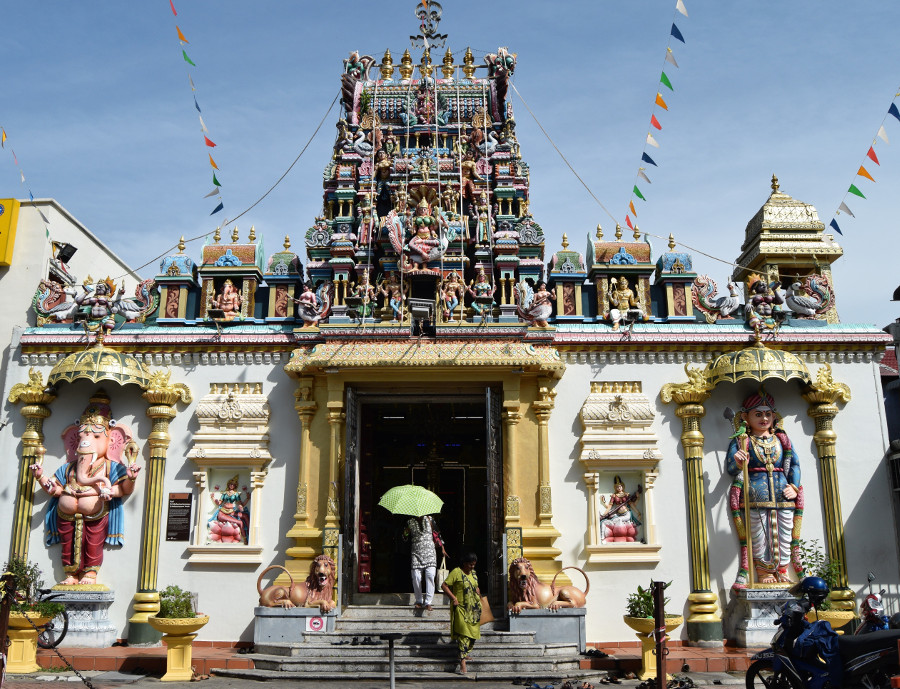
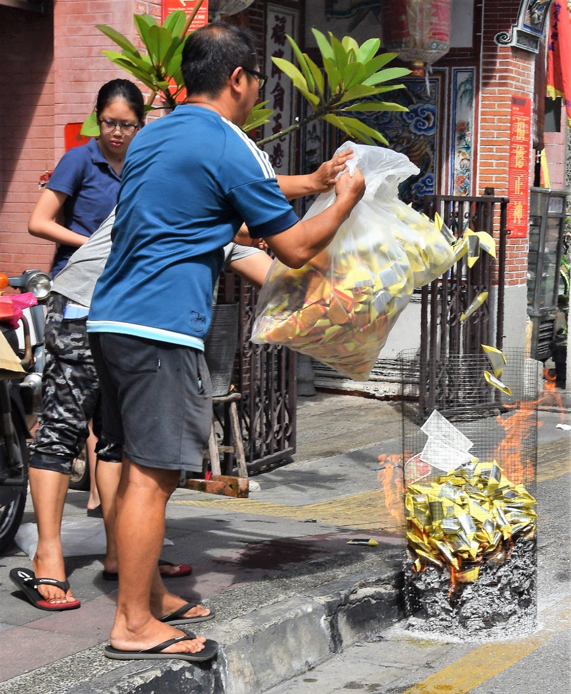
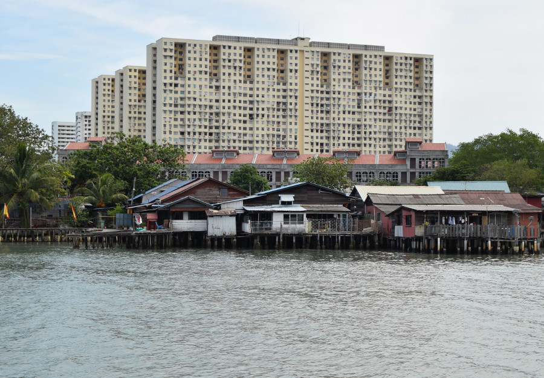
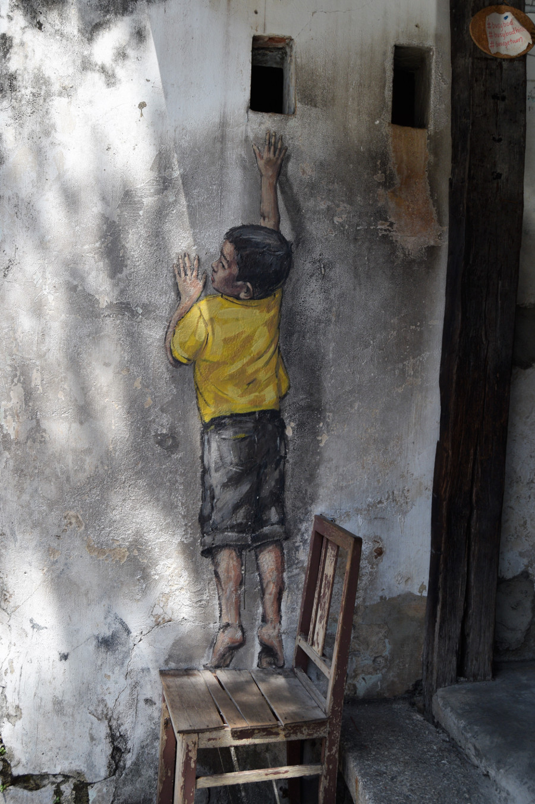
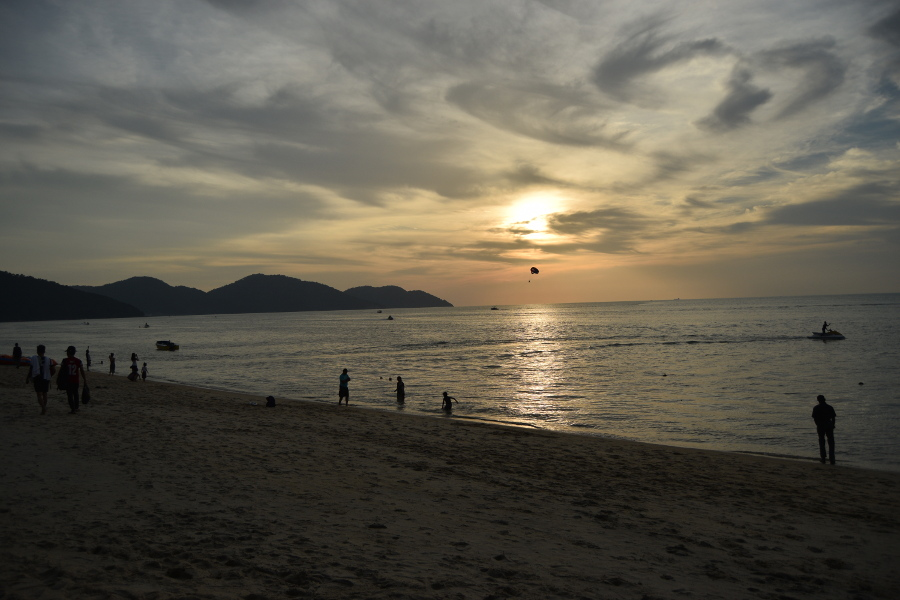
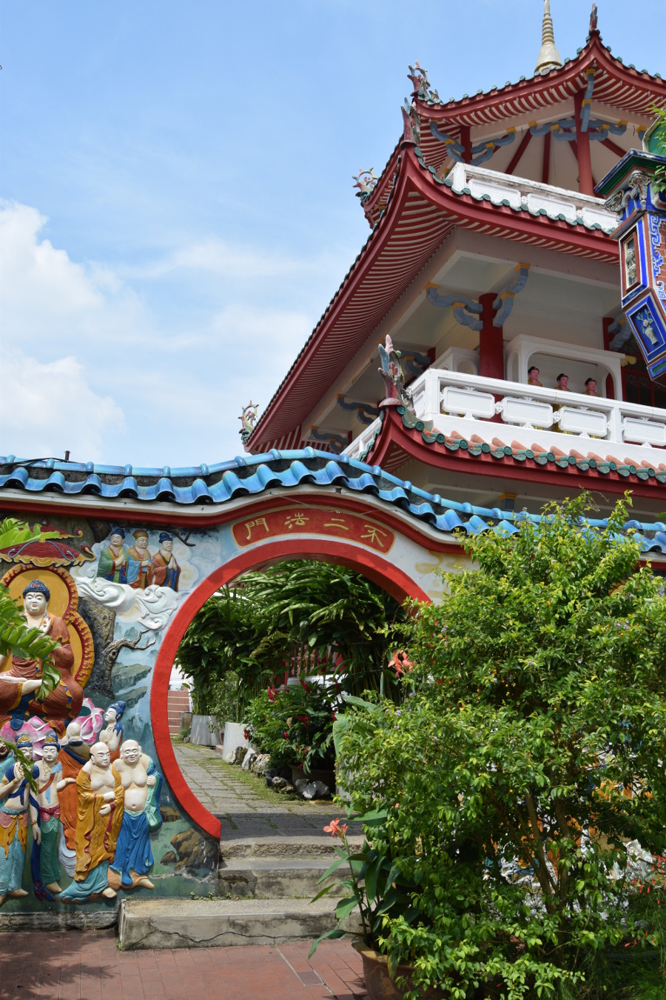

>“We are all Malaysians. This is the bond that unites us. Let us always remember that unity is our fundamental strength as a people and as a nation.”

Tunku Abdul Rahman.

##The journey to Penang
We took a bus from the Cameron Highlands to Penang with the company [Perak Transit](http://peraktransit.com.my/) which ended up being an hour and a half late. We booked the bus tickets via [www.easybook.com](https://www.easybook.com/en-my) and went with this bus company as there were no seats left with Unititi. The driver turned out to be a maniac and drove so quickly and carelessly on the winding roads that half the bus was sick. Despite being late,  he made an extended stop in Ipoh to have a chat with his mate and then decided to miss out our stop at Butterworth, driving straight to Penang Island first. We were supposed to get off in Butterworth and then get a cheap ferry over to Georgetown, where we were staying in Penang, this would have cost us a lot less than a Grab from Penang bus station. However by 21:00, after seven long hours of waiting and crazy driving we got off in Penang and took a Grab for 25MYR (£5) to [ST Hostel](https://www.booking.com/hotel/my/st-hostel.en-gb.html?aid=356980;label=gog235jc-hotel-XX-my-stNhostel-unspec-my-com-L%3Aen-O%3AwindowsS10-B%3Achrome-N%3AXX-S%3Abo-U%3AXX-H%3As;sid=afa45bdb0846f6aa56e77743f5f154c6;dist=0&sb_price_type=total&type=total&) in Georgetown where we were staying. It wouldn’t have made sense to drive on to Butterworth only to get a ferry back to the island.

##Georgetown
We loved Georgetown, it was made a UNESCO World Heritage Site in 2008; it was full of old crumbling buildings, patterned tiled walls and floors, colourful and ornate temples, mosques and churches and old wooden clan jettys. In general we’d noticed that although Malaysia is a Muslim country, on the outside at least, there seemed to be a massive tolerance for other religions and we could walk down one street in Georgetown and pass a church, mosque, Buddhist and Hindu temple all exceptionally close to one another. Malaysians that we met were proud of their multicultural society and would often point it out to us.

Whilst we were in Malaysia it was the month of the Hungry Ghost, a festival where Buddhists believe that the gates of heaven and hell are open for their ancestors to visit, so they burn paper replicas of things they might need in the afterlife, leave them food to eat and put on entertainment to keep them out of trouble. So, as we walked the streets we had to avoid the food on plates (mostly iced gems) and the burning paper. We'd been told one of the main streets shut and there is a big celebration where everyone goes to burn things by the jetty, but it didn't happen whilst we were in Penang.

There were lots of things to see and do in Georgetown, a visit to [The Blue Mansion](https://www.cheongfatttzemansion.com/), numerous museums and art galleries, temples, churches and the jettys. There was also lots to see outside of Georgetown including taking a cable car up Penang Hill and Penang National Park. As we only had a few days we weren't able to do everything and we were happy enough soaking up the sunshine and exploring the streets of the city. There were also some bigger temples further away and Dan found one called [Snake Temple](http://www.penang.ws/penang-attractions/penang-snake-temple.htm) which is home to a number of pit vipers that roam free, one of the deadlist snakes in the world. Safe to say, we gave it a miss as the epitome of dark tourism.

My least favourite part of Georgetown was the Tan Jetty. There are a number of old jetty’s from colonial times and the first we visited the Lee Jetty, which was very picturesque. The Chew Jetty was full of shops and a good view at the end but the Thai Tan Jetty in the middle was horrorifying. We stumbled upon four big cages full of French Bulldogs. They were all panting in the 32C heat and humidity, they had no food and water and some were in cages, it was very clear that some had just had puppies and they were being farmed. We left feeling very sad and sorry for the dogs.

##Street Art
The street art in Georgetown is infamous, so it was one of the first things we looked for when we arrived. The interactive pieces were created by [Ernest Zacharevic](http://www.ernestzacharevic.com/). They’re mostly of children and they feature objects such as bikes, swings and chairs. During the day each piece was crowded with tourists and it was only by 4PM that we were able to see them without being barged out of the way with selfie sticks.

##Batu Ferringhi
We’d decided to spend one afternoon at the beach so that we could see the sunset which we'd heard is spectacular and popular with the locals. We took a Grab there for 22MYR, just over £4 for a thirty minute drive. The beach wasn’t the nicest we’d been to and the sea was full of jet skis and parasailing, however there was a beach front Starbucks to help us stay hydrated!

The sunset wasn’t bad and we stuck around for food in a local Warung called [Andrew’s Kampung](https://www.facebook.com/pages/category/Malaysian-Restaurant/Andrew-Kampung-Restaurant-133698336663827/) and had a look around the night market which was a little disappointing compared to others we had been to in Malaysia.

##Food
Penang is known for its amazing food and it did not disappoint! We ate multiple times at a Vietnamese restaurant next door to the hostel called Bahn Mi, the most our meals cost there were £2.50 and they were delicious! We had a wander around the Hawker Stalls where we could could have eaten for 80p but as the restaurants were so cheap we decided to play it safe. Apart from the abundance of seafood, which we of course ignored, we were in food heaven!

##Kek Lok Si
On our last afternoon in Penang we decided to get a Grab to [Kek Lok Si Temple](http://kekloksitemple.com/), the biggest Buddhist temple in Malaysia. It was really quiet and peaceful, with only a handful of other tourists tearing themselves away from the beaches, food and street art of Penang. We had a wander around the gardens, walked up the pagoda and went up to see the big Buddha statue. The temple was free to visit but there was a 2MYR fee for the Pagoda (20p) and 6MYR (£1) for a ride up and down the elevator to the statue, which we later realised we needn't have paid for. Unfortunately the temple was a tourist trap, there weren't any monks or Buddhists using the temple and it was full of souvenir shops. All the same it was really pretty and unlike anything we had seen yet, it was definitely worth the visit.

##Our Verdict on Penang
Penang surprised us, we knew we would like it given that its full of old buildings, food and street art but there was more to the Island than Georgetown and we could easily have spent a week exploring everything the island had to offer!
