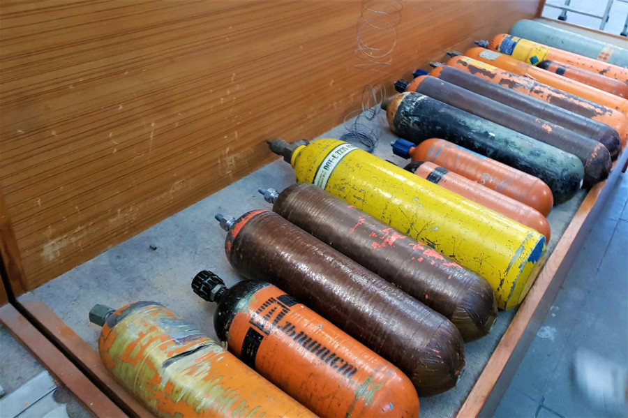

##Plans change
We took a bus from Chitwan to our final destination, a lakeside city in the centre of Nepal in the lower Himalayas called Pokhara. The grand finale of our 8 month adventure was a four day trek to Poon Hill from Pokhara, which we’d read about in loads of travel blogs; we’d get great views of 16 peaks and some of the tallest mountains in the world without going too high in altitude. After a bumpy 6 hour ride from Chitwan squashed in the back of a bus with a cracked windscreen and bald tyres, we checked into our hotel [Hotel Forest Lake](https://hotelforestlake.business.site) and headed for some lunch at [Krazy Gheko Bar & Restaurant](https://facebook.com/KrazyGhekoPKR/?locale2=en_GB). We instantly took a liking to Pokhara, it was relaxed, quiet and had backpacker vibes all along the lakeside. It was also full of restaurants, coffee shops and souvenir shops that were much cheaper than Kathmandu. Finally, we’d found somewhere in Nepal we liked and we were beginning to see the appeal and beauty of the country.

As we’d thoroughly disliked Kathmandu, we’d already decided to move our flight forward two days rather than spend another two days in Kathmandu at the end of our trip before coming home. It only cost us £16 each due to our [STA multiflex passes](http://www.statravel.co.uk/multiflex-pass.htm) so it was cheaper than two nights in hotels and it meant that we could surprise our families if we could keep it a secret!

Unfortunately, on our second day in Pokhara, the day before our trek, I got really sick and spent more than 24 hours very close to the bathroom watching old movies on Nepalese TV. Dan had to go down to the agent [Happy Treks Nepal](https://www.happytreksnepal.com), who we had booked our trek with and figure out if we could do something else in a shorter time. We literally cannot speak highly enough of Mr Happy, the guy who runs Happy Treks Nepal. He was exceptionally helpful, emailing before we arrived, he was friendly and accommodating to our needs! Dan and Mr Happy re-arranged our trek to be 2 days instead of 4 giving me time to get better and recover before we started climbing mountains.

##Lakeside
We spent a lot of time by Phewa Lake in Pokhara, lots of the bars have happy hour on beers, there were great views and lots of shops. We could have rented a boat on the lake for around £3 for a few hours, but after the dug out canoe in Chitwan, I was finished with boats. We noticed that the tourist crowd in Pokhara was different to Kathmandu, there more younger 'hippy' type people and less older people ticking 'trekking the Himalayas' off their bucket lists. We saw lots of tattoo parlours, places to get dreadlocks and adverts for yoga and wellness retreats in the mountains. We later learned that Nepal attracted a lot of hippies in the 1970's (mainly due to cheap marijuana) and it felt like it hadn't really lost that vibe, especially when we were told that Nepal stands for Never Ending Peace and Love!

##Peace Pagoda
After spending a couple of days couped up in our hotel room we headed to the Peace Pagoda, situated on top of one of the hills in Pokhara. There are a number of ways to reach the pagoda, famous for its views of the nearby Annapurna Mountain Range and Phewa Lake; we could walk, get a boat and hike up the hill or take a taxi. We decided to get a taxi and save our energy for our hike. It cost 1200Rs (£8) for the driver to take us, wait and bring us back. We still had to climb a few stairs and avoid people selling souvenirs on their stalls to get to the very top. The Peace Pagoda is actually a Japanese Buddhist pagoda; its called Shanti Stupa, Shanti meaning peace and is one of 80 peace pagoda's in the world. It was surrounded by fields of colourful flowers and when we climbed up the stupa we got great views of Pokhara, the lake and some of the mountains behind the clouds. Unfortunately, we’d chosen to go mid-afternoon and we later learned that the mountains are covered by clouds during the hotter part of the day, the best time to see them is in the morning!

##International Mountain Museum
After our trek we still had one more day in Pokhara so decided to visit the [International Mountain Museum](https://internationalmountainmuseum.org). It cost 500Rs (£3.30) each way in a taxi and 500Rs to get in. The museum was surprisingly big, there was a 20 minute documentary film detailing the trek to Everest Base Camp from Lukla Airport. The museum contained information about the different ethnic groups in Nepal, in particular those found in the mountains, such as the Sherpa people. There was also very factual information about how mountains are formed; taking us right back to year 9 Geography. Our favourite part of the museum was reading about all of the first summits to the highest mountains in the world, such as Everest in 1953 by Edmund Hillary and Tenzing Norgay and seeing the original equipment used on these expeditions on display.

There was also information about pollution in the mountains and we read about a Sherpa guide who completed expeditions to Everest and cleaned up tonnes of rubbish left by previous trekkers. Lots of gas canisters and oxygen tanks were on display, we couldn’t believe people would just leave them up the mountains, until we felt how heavy they were! The museum also talked about global warming and how pollution is effecting the Himalayas; but we found it ironic that the museum gave tips on how to be greener in the most polluted country we’ve visited. We know nothing about Nepalese politics but the countries infrastructure is terrible, the roads are so bumpy and awful to drive on, cars look like they’re scrap metal and would have no chance of passing MOT's in the UK and the country rakes in so much money from foreign visas, taxes and trekking permits, we couldn’t help but wonder where all this money went!

##Dhampus and Australia Camp
Eventually it was time for our (not so) big trek, or as our guide, Raju, referred to it our ‘coca-cola trek’. We were picked up by Mr Happy and Raju at 8AM and drove to our starting point. Along the way Raju gave us information about Pokhara and the Annapurna Mountain range. We stopped for a quick photo by a rope bridge covered in prayer flags and before we knew it, it was time to start our climb.

The first day was a 13km trek to Dhampus, a village in a valley. Our trek started on some gravelly dusty roads and then we walked through green hills and local farms. This was our favourite part of the trek, we didn’t see a single tourist until we got to our tea house and Raju explained that not many people know about the path we took. We were joined for part of our journey by a mountain dog who thought he’d lead the way until he got bored of us. Raju told us that people in the mountains are self sufficient on their farms and only buy items like sugar and clothes. He told us that many of the Gurkha Soldier's are from this region and they still fight with their kukri (swords) in the British army. Raju was really annoyed that a recent marathon had left ribbons all over the path, as he felt that they could have been donated to people in the village. We told Raju we had lots of old clothes that we would donate or get rid of when we got home and he said he would take them to the poorer people that live further up the mountains next time he trekked up there.

Raju was great, he had a good, cheeky sense of humour, gave us lots of breaks and walked at our pace. He told us the names of the mountains, he explained that local people call tourists ‘gora’ meaning ‘white man’, it sounded very similar to being called 'gringo' in South America. Whilst we were walking we had a great view of snowy peaks including, Annapurna I (8091M), Hiunchuli (6441M), Machhapuchhre (6997M), Annapurna III (7555M), Annapurna IV (7525M) and Annapurna II (7939M). We'd seen snowy peaks in Patagonia, the Andes and New Zealand but nothing as high as some of the mountains in the Himalayas. Raju told us that the best trek in his opinion, around the Annapurna range, is the Mardi Himal trek which can take between 5-8 days depending on pace and route. He told us that the trek is up the fishtail mountain (Machhapuchhre), which is a holy mountain and therefore cannot be summited, but the base camp of the trek is still around 5500m above sea level. He told us from the Mardi Himal Base Bamp you can look down on the Annapurna Base Camp and you go so far into the mountains that the teahouses are super basic and the only people up there are Yak farmers.

There are SO many treks to do from Pokhara. Before we arrived we'd read about Everest, which we knew we didn’t have the equipment, physical or mental stamina for and we'd read about the Annapurna Circuit, which can take up to 21 days! We saw two French people who had done this trek and they looked an absolute mess after trekking for 20 days, a trek this long definitely did not appeal to us! Before we left the only trek we’d really found any information about, that was shorter and seemed more manageable for us, was Poon Hill. However, Raju told us that it’s the most popular trek and the sunrise spot is often filled with 500-700 tourists. In the end, we were glad we'd ended up doing a different trek rather than battling hundreds of tourists to the top of a hill for a good spot for sunrise.

After around 3.5 hours of walking we arrived in a small village and stopped for lunch. I had Dal Bhat and veggie curry, the signature dish of Nepal, which turned out to be one of the best curries we'd had on our entire trip! Raju warned us not to have meat in the mountains, as there is no guarantee of how it’s kept so we ate as vegetarians for 2 days. After lunch we had a short 20 minute walk to our teahouse where we had our own little room and bathroom and there was a nice terrace to sunbathe in the afternoon whilst watching the views over the mountains. Luckily, we caught a glorious pink sunset before the air turned cold and we had to wrap up warm for the evening!

The next morning we woke up around 5:50AM and headed up the hill for the sunrise. The little spot we only had to share with 3 other people and once the sun had come above the clouds, the sunrise was glorious. After breakfast we headed on our 12km hike for day two to Australia Camp. As we climbed higher we got some amazing views of the valley below as the Himalaya's disappeared behind the tree's. However, once we hit 2000M at Australia Camp, we got some of the best view's we'd had on our trek of the mountains. After a cup of tea, we headed back down to the road and we were driven back to Pokhara. The walk down was really busy with tourist's, lots of people were staying at Australia Camp and on the road from Kande, there were dozen's of tourists trekking up for the day and starting their longer treks. We were pleased we hadn't had to share our magical journey with anyone the day before.

The day after our trek Raju came to our hotel to collect our unwanted clothes for the people in the mountains. He showed us the biggest kindness and asked us to dinner at his home. He collected us on his motorbike and we had a fabulous evening. It was the nicest gesture that anyone had shown us during our entire trip! By this point we had done a complete U-turn and felt the complete opposite to how we did in Kathmandu; we'd fallen in love with Nepal and the beautiful Himalaya's!

##Our verdict on Pokhara
After a two day trek and a stay in a teahouse in the Himalaya's we finally understood the appeal and attraction of this beautiful country. Even if we had done a 4 day trek like we'd planned, it still wouldn't have been for long enough and we are already planning a trip back to Nepal (hopefully next year) for a longer trek to a base camp at higher altitude in the mountains. The Himalayas is definitely one of the most beautiful places we visited on our trip!