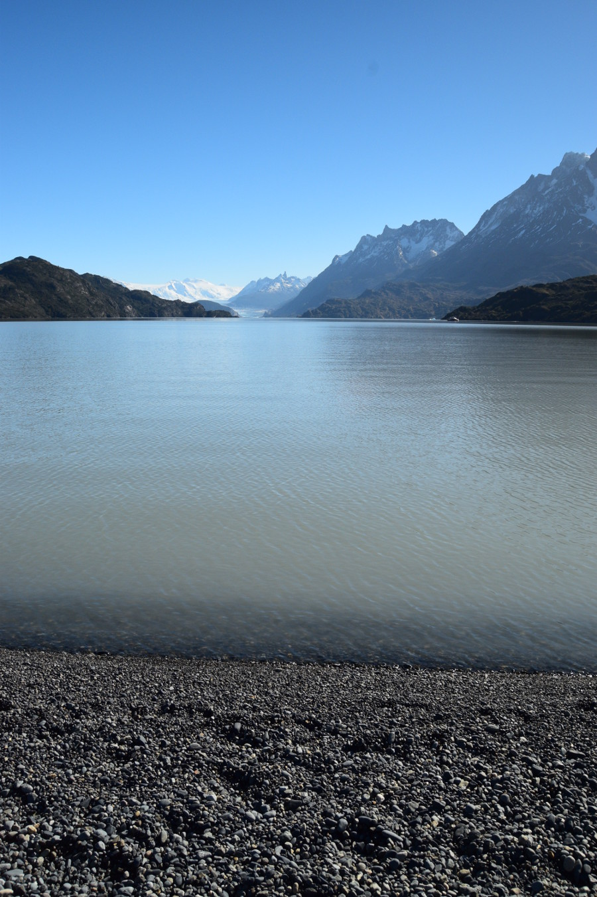

>“Travelling - it leaves you speechless and then turns you into a storyteller”

Ibn Battuta.

##Crossing the border

Our next destination was our first stop in Chile, Puerto Natales. Initially we thought we would have to stay a night in Punta Arenas, but we were able to get two buses to complete our journey in one day. The bus left Ushuaia at 08:00 and dropped us in Punta Arenas at 18:30. Our second bus left at 21:00 and we finally got to our hostel in Puerto Natales at 00:30. One very long day! We crossed the border at San Sebastian, they were really strict about what we could take over the border so we had to eat our meat and cheese sandwiches, nuts and banana's before crossing. Luckily, our driver reassured us that our stash of Yorkshire teabags which we had bought from the UK and had been rationing would be OK. However, the sniffer dog at the border was more interested in his tennis ball than making sure we weren't smuggling anything in our bags.

On the way to Chile the landscapes changed dramatically; they seemed more desert like, like something out of a western film.

Ushuaia is on a large island, Tierra Del Fuego, so to get back to the mainland of South America we had a ferry crossing across the Strait of Magellan. We got off the coach on top deck, for some fresh air and to stretch our legs and we were glad we did as we saw two Commerson Dolphin’s jumping out of the water, they looked like mini Orca’s! Sadly, they didn’t hang around long enough for a photograph. Our stop in Punta Arenas gave us enough time to get some Chilean Pesos out of an ATM, a £5 charge this time, and to get some dinner before finishing off our journey.

##The City of Puerto Natales

Puerto Natales is a small city which most people use as a hub to get to and from their treks to [Torres Del Paine National Park] (https://torresdelpaine.com/en/). It was much more like the South America I remembered from my trip six years ago; less westernised – no McDonalds, Starbucks or branded shops and absolutely appalling slow internet! One of the first things we noticed about Chile, was how much friendlier people here were than in neighbouring Argentina; people smiled and said ‘hola’ as they walked past. It was also full of stray dogs but they seemed friendlier than those in Ushuaia and less diseased. We weren't sure if they were people's pets or actual strays. One of them even followed us back to the hostel from the supermarket hoping we’d share some of our cooked chicken.

We stayed in [Hostel Arkya] (http://www.hostalarkya.com/es-es), which was more of a guesthouse than a hostel. We weren’t allowed to use the oven in the kitchen, which meant we had to eat out every night, but on the plus side, this was the first place we’d stayed where we were allowed to bring alcohol into the hostel rather than buying it from them. This meant even cheaper bottles of wine, so we drank plenty. One evening we ate in a Mexican Restaurant, [Cerveza Baguales] (http://cervezabaguales.cl/) which was also a brewery. Dan managed to demolish half a kilo of chips and three taco’s. They were pretty close to British ‘chippy-chips’ except a little thinner and no vinegar. We also ate at a nicer restaurant on our last evening, El Bote, Dan had Patagonian lamb and I had stewed Guanaco, not bad!

We had three days in Puerto Natales, so aside from a day tour to the National Park,we used our time to relax and mill around the city. Tour companies offered lots of activities but at £60-£100 a day, we had to choose wisely. There were some free things to do in Puerto Natales, so we wandered to look at the sculptures by the water's edge. There were also great views of the mountains on the other side of the water. One rainy afternoon we paid a visit to the [Municipal Historical Museum] (https://www.welcomechile.com/puertonatales/municipal-historical-museum.html), which was really small but had a lot of information about the indigenous people in Chilean Patagonia, who only disappeared in early 1900's due to Europeans settling in the area bringing disease with them. We were hoping that the museum would shed some light on the weird statues we had seen around the town, which were patterned and displayed male genitalia. It didn't.

##Torres Del Paine National Park

Torres Del Paine National Park was massive in comparison to Tierra Del Fuego, at least the bits where we could trek. There are a couple of circuits for trekking in Torres Del Paine, the O circuit and the W circuit. The O circuit takes 8 days and incorporates the W circuit within it, so W was shorter, 4-6 days depending on the weather. We didn’t feel fit enough or really have the time to do either of these treks so due to the park’s size, we opted for a full day tour. We went with [Tourismo Comapa] (http://www.comapa.com/inicio), which we picked randomly off the high street after realising all the companies charged the same amount. The tour cost $27,000 Chilean Pesos, which was around £32 and then we had to pay entrance fees which was the same again on top of this. Another very expensive day trip in Patagonia, but totally worth it.

The coach collected us at 07:30 in the morning and our first stop was the Miladon Caves. The Miladon is a prehistoric animal which looks like a giant sloth and its symbol is all over Puerto Natales. The cave has this name as its bones, fur and skin was found there. On the tour we also bumped into the Danish guy we had met in Ushuaia, who had been on our bus and who we kept seeing in town.

We then headed to a viewpoint of Toro Lake; the bluest lake we’ve ever seen. After this we drove to the Grey Glacier. The roads were narrow and windy, and we read on the leaflet that road accidents are common in the park. Shortly after that we saw a car that had rolled over and off the road as there were scratches all over the top. None of the tourists really seemed that shook up and no one had been hurt. Our guide radioed for help as there is no phone signal in the park and we carried on to the Grey Lake.

We had to cross a suspension bridge over Grey Lake to get to the view of the glacier on the black beach; this only allowed six people to cross at a time. We had a walk along the beach and ate our sandwiches looking out at the Grey Lake and Grey Glacier. Another great view for a picnic!

We then headed closer to ‘the horns’, the mountain ranges of Paine Grande Hill, Cuernos del Paine and Almirante Nueito Mount and had a lot of photo opportunities on the way. We also saw a waterfall, but after Iguazu Falls it was a little underwhelming, even with a double rainbow. We heard a thunderous noise and saw some white 'smoke' on the mountain, which the guide told us was an avalanche. Dan ordered a beer at the lunch time restuarant stop, the barman told us that if we walked to the other side of the hotel and went up the hill there was good views of the lake and mountain. Only a handful of people from the tour were up there so it was peaceful outlooking the lake, and they were by far the best views of the day.

##Wildlife in Torres Del Paine

We came out of the mountainous part of the park and the landscape changed from mountains back to a dry desert like wilderness. We saw a herd of Guanaco’s crossing and the guide told us if we were quiet and slow we could get off the bus to see them. They looked a bit like Llama’s and now I knew what was on all of the menu’s in town.

The driver also  slowed down so we could watch some Emu’s as we drove past and when we got off at the last stop for a view of a lake, we saw a load of Andean Condors and some more Cararaca’s – the guide said that there must have been a dead animal where they were all congregating. We also saw Chilean Flamingo’s chilling in some of the lakes but from a bit of a distance. The second half of the day felt like we were on a Chilean safari, overall, not bad for spotting wildlife.

## Our Verdict on Puerto Natales

We really loved Torres Del Paine National Park, although we felt we cheated a little by doing a day tour and not one of the hardcore circuit treks. We had perfect weather so the park looked very picturesque. Puerto Natales was a quaint little city, which gave us some time to relax and catch up on some rest before heading back to Argentina for more beautiful views of Patagonia.