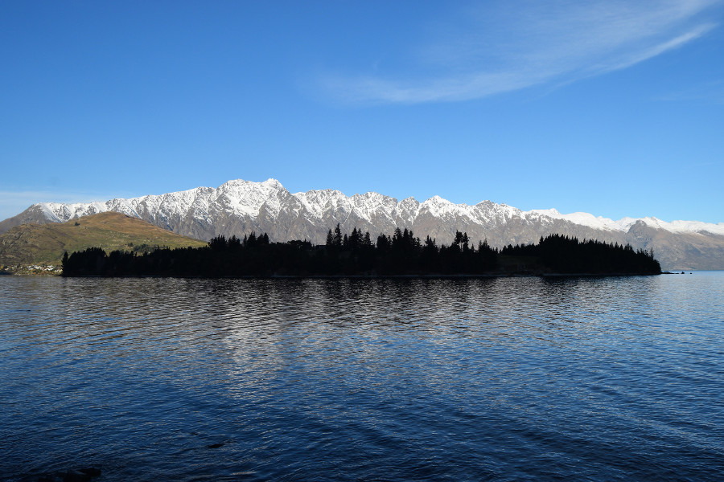
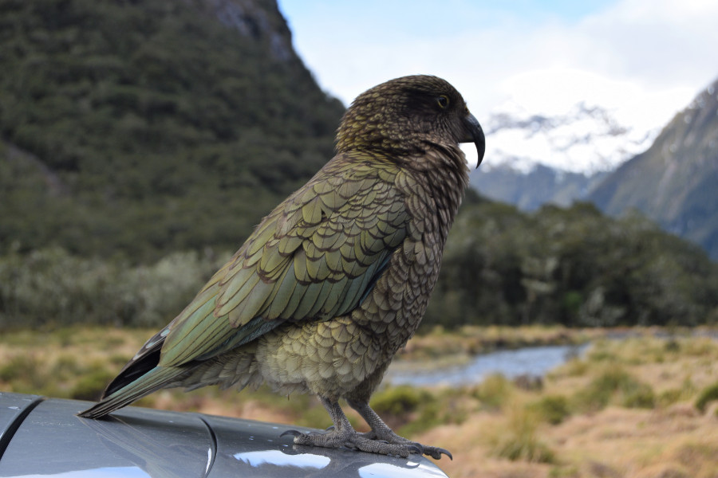
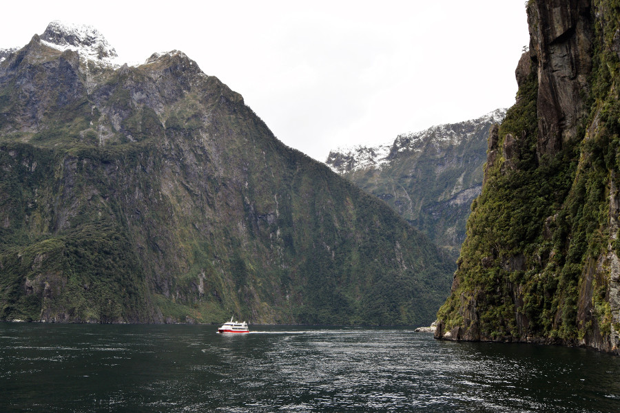
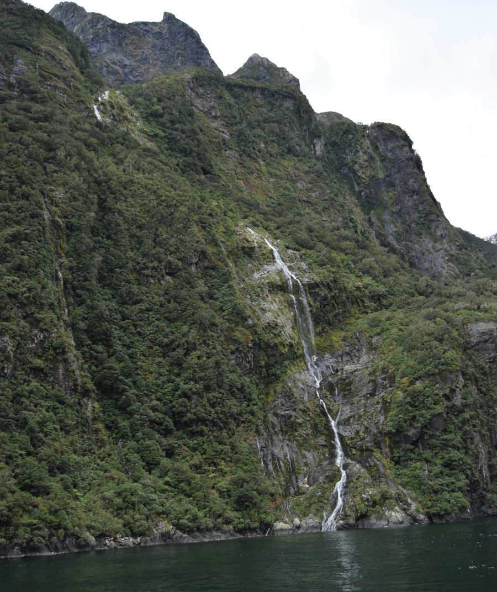
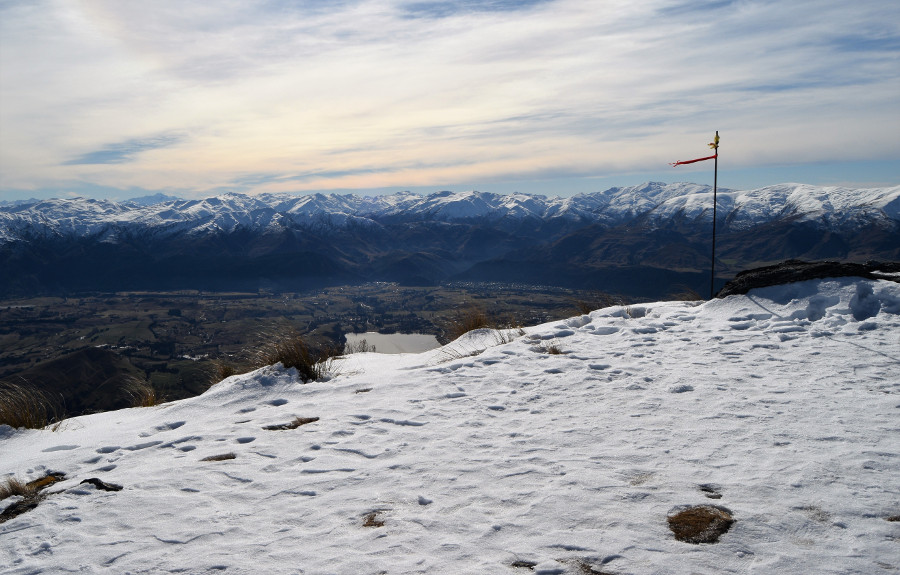
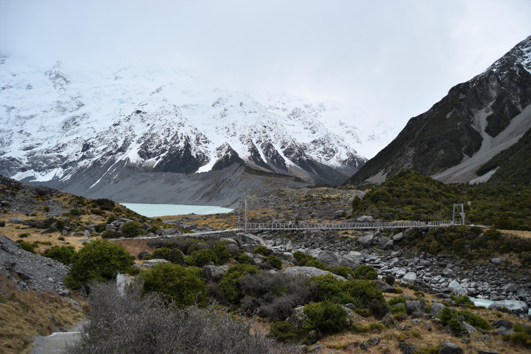
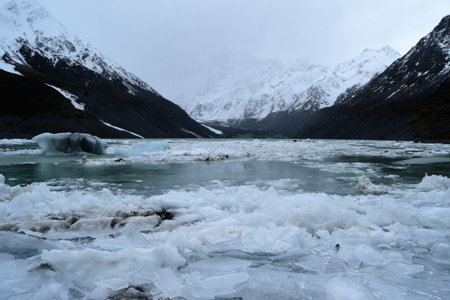

>"There's only one word for New Zealand - EPIC."

Bear Grylls.

##Queenstown
When we told people we were travelling to New Zealand, many people told us we would love Queenstown so we had high expectations! The journey from Wanaka to Queenstown was a short one on a mini bus and the driver told us about Central Otago, the fruit, veg and wine grown there and we made a short stop in Cromwell.

When we got to Queenstown, we understood why people would like it here. The town is completely surrounded by mountains and as it was winter they had snowy peaks! There were lots of restuarants, bars and skiing and outdoors shops.

One of Queenstown's most infamous attractions is [Fergburger](https://www.fergburger.com/), a restaurant with incredible burgers. Every time we walked past there was a huge queue out of the door and once we tried it we knew why! Dan had a ‘Bullseye’ and I had a regular Fergburger with Brie cheese. They were immense! Dans was basically a ribeye steak in a bun that was cooked so well it melted in our mouths.

##Hostels
We stayed in Queenstown for three nights, went to Mount Cook National Park for one night and then returned to Queenstown for another night before making our way to Dunedin. The first stint in Queenstown was spent in a 6 bed dorm in a hostel called [Absoloot Value](http://absoloot.co.nz/). The first night we were there we were woken up by three Aussie girls at 2AM who had gone out partying. We had to be up at 6AM for our bus to Milford Sound. They came in banging around, all three snored and one decided to sleep in just her thong, so I had a 'cracking' view of her almost bare arse from the top bunk. Dan and I got back to sleep around 4AM. The second night an English guy came back at 1AM banging on the door as his key wouldn’t work. He then had a telephone conversation with someone very loudly in the dorm and told them he didn’t like being in a dorm with so many women. The third night was less eventful but we were still woken up by a guy and his very loud snoring.

When we returned to Queenstown we decided there was no way we were going back to Absoloot, and with private rooms being really extortionate we decided to go for a double pod in a shared room. We hoped that the dorm would be filled with other couples and we figured that if anyone snored their partner would shut them up. The risk was that the other couples may not have any problems with being intimate in a shared space. Sleep deprived, we decided it was a risk worth taking.

We stayed in [Sir Cedrics Tahuna Pod Hostel](http://www.tahunapodhostel.co.nz/) and the hostel itself was really nice, clean, free soup, breakfast, popcorn and free use of hair straighteners! Our room mates on the other hand were something else altogether. After we’d eaten we came back to the room, showered and got into our pod, shutting the curtain so we had our own little bit of space. The couple got down from the bunk above us and started to get ready to go out. Whilst we were sorting photos, writing blogs and catching up on social media the two of them were having a very loud conversation, from which we established the following; the guys girlfriend had been cheating on him with his mate called Duncan, he had found out today, they had been together for five years, she had left and taken most of her things, they were travelling together, the woman with him was an escort, she was 20 years old with a 6 month old baby, she was English but lives in Australia, being intimate was not in their contract but they went to shower together and were very intimate with one another when they got back in the middle of the night, the guy asked the escort to call him ‘daddy’ and asked if she could pretend to be his ex-girlfriend whilst they went out to meet a friend. The whole situation was so surreal it was funny, we complained to the hostel the following day who charged the couple for the price of our bed for the night and gave us a lovely little refund!

##Queenstown Hill
The first thing we did in Queenstown was a hike up the hill for views of the town, this was free compared to the extortionate price of the gondola. It took around 3.5 hours return and all the way up to the summit, was an uphill slog made slightly more bareable by the Douglas Fir Christmas trees around us. At the summit we were rewarded with great views of Queenstown, Lake Wakatipu and the surrounding mountains ranges.

##Milford Sound
We booked our day trip to Milford Sound via [bookme.co.nz](http://bookme.co.nz/) with [Jucy Cruise](https://www.jucycruise.co.nz). We were picked up at 07:15 for the five hour drive to Milford Sound, located in Fjordland National Park. About 10 minutes into the journey the bus was playing up and the driver dropped us by the side of the road and told us he needed to go and get a different bus as he was worried this one would break down. Twenty minutes later he was back with another bus explaining that he needed to make up the time as the boat at Milford wouldn’t wait for us. Despite this, he still managed to make a number of stops on the way, we stopped at a Lord of the Rings filming location, by a lake which was like a mirror and at a stream where some Kea were milling about. Kea are a big green alpine parrot and they apparently like to pick rubber off cars and steal valubles. The two that were there posed for photos for us and stayed out of trouble.

We passed through a tunnel in the mountains and went past a lot of avalanche warnings. Five hours later we arrived at Milford Sound. Sadly we found our cruise a little disappointing which wasn’t helped by the weather! The pictures that advertise Milford Sound are always blue skies, green lush mountainsides full of waterfalls. However the reality is Milford Sound is the wettest place in New Zealand so it is often cloudy. Unfortunately for us, it wasn't raining either meaning that there weren’t as many waterfalls so it felt a little bare and dreary. It's such a popular tourist spot that we also felt like cattle being herded around all day; all the coaches made the same photo stops and there were a lot of people on the boat. I dread to think what its like in summer!

Out on top deck it was really hard to hear what the captain was saying over the tannoy as he ferried us around Milford Sound so we missed a lot of the information given too. In the two hours on the water we cruised through one of the fjords and back again at a very slow pace, stopping by some of the waterfalls and by the resting place of some New Zealand fur seals.

The fjords were really beautiful but Milford Sound felt like a tourist trap compared to everywhere else we had been in New Zealand, where we had been able to enjoy the countryside mostly in peace. After we booked the trip we heard about a just as beautiful but less visited fjord called Doubtful Sound and given the choice again, we would have visited this instead!

##The Remarkables
After our glacier landing at Fox was cancelled, we decided to try our luck in Queenstown. Although we wouldn’t be landing on a glacier, just on a snowy peak it worked out much cheaper on [bookme.co.nz](book.co.nz) with [The Helicopter Line] at £85 per person for a 30 minute ride. We were picked up from Queenstown, checked in and in a helicopter within 20 minutes. It took about 5 minutes to fly up to The Remarkables. Flying in a helicopter was a really weird sensation, unlike a plane, we felt like we were being lifted up by a rope.

The view from the top was incredible, we could see the ski field, Queenstown, Arrowtown, Lake Hayes and loads of other mountains surrounding the valley. After 10 minutes of taking in the view and snapping some photos it was time to fly back down again.

##Mount Cook
We spent one night in Mount Cook National Park. It’s a dark sky reserve and we were hoping to see a sky full of stars. However we had more bad luck with the weather as the entire time we were there it rained and was cloudy.

It was a four hour drive to Mount Cook from Queenstown and again the Great Sights driver made lots of photo stops along the way, Lake Pukaki, Linders Pass and one for a good view of Mount Cook whilst there was a passing bit of blue sky and no low cloud. We were dropped at our accommodation for the night [Mount Cook Alpine Lodge](https://aorakialpinelodge.co.nz/).

As we couldn’t check in, we headed straight out and had a quick look around the visitor centre. This was all about Mount Cook and although there was lots of information, it didn’t appear to be in a chronological order so it was difficult to follow. We then decided to hike to Hooker Lake on the Hooker Trail. It was a 4 hour return walk and luckily after about an hour the rain stopped, although the wind picked up. It was a pretty flat trail but we had to cross three swing bridges to get to the lake. Dan went across the second one first whilst I took a few photos but he got half way and then as the bridge started swinging in the wind, he ran back with a horrified look on his face saying he wouldn’t cross it.

Eventually, with a little bit of kicking and screaming, we reached Hooker Lake and it was stunning with the backdrop of the mountains and the glaciers. The lake was frozen on top and there were some icebergs in the water that had broken off the glacier. The National Park was really stunning and possibly one of our favourite places in New Zealand!

##Our verdict on Queenstown & Mount Cook
Although we could see the appeal of Queenstown, it definitely wasn't our favourite place in New Zealand. However we loved Mount Cook and the hike to Hooker Lake; the scenery was just stunning!