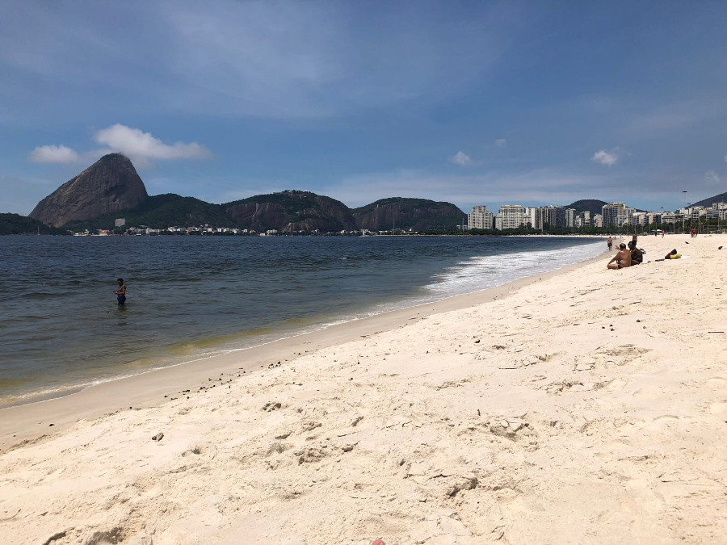
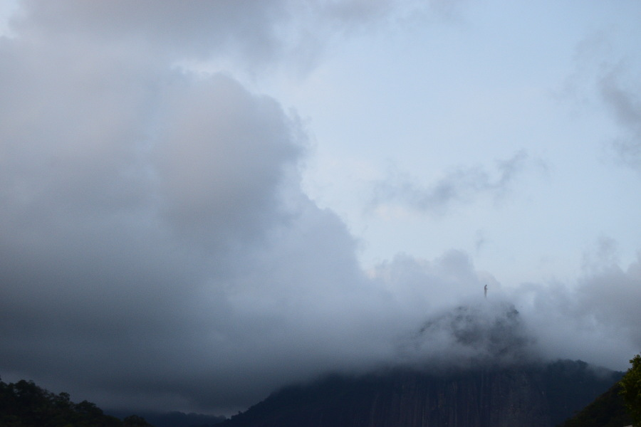
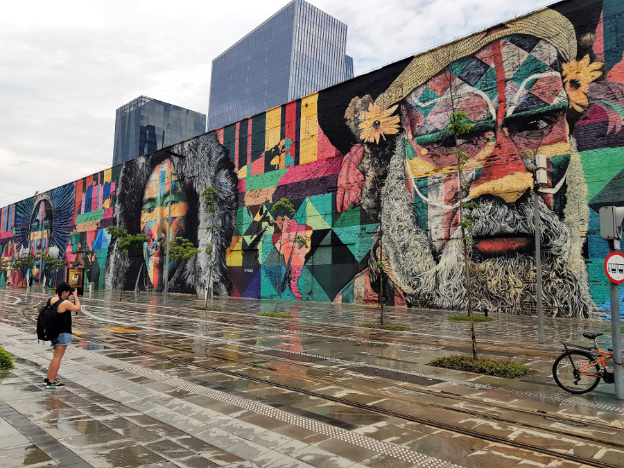

>“I sorta think from a distance...Jesus, top of a hill, lookin’ like he’s about to bungee jump, you pass it, you go, ‘There he is. Great. What else are we doin’?!”

Karl Pilkington, An Idiot Abroad (not bitter at all).

##Arriving in Rio

Before we left for Rio, we were told in many ways about how dangerous it is there. We did a bit of research the night before and read about the trouble following the Rio Olympics. The government arrested some people to make the favela's safe and promised to make the them better. The Olympics came and went and the government didn’t follow through with any of their promises to improve things such as health and education, which resulted in the violence within the favelas escalating. It seemed from google maps that our hostel was also surrounded by favela’s and we then read that because of the trouble there, the military had taken over the city. Felipe running (Books Hostel)[http://bookshostel.com/], where we were staying had also warned us not to take money out at the airport due to credit cards being cloned. To make matters worse, when we arrived in Portugal for a stop over, the lady running the hostel told us about her daughter who had been to Carnival a few weeks ago. She had been staying in Leblon, an area close to the biggest favela in Rio, Rochina, she had heard gunshots in Leblon and saw lots of people running away from the area. She warned us to be careful. This made us question why we were starting our trip in Rio.

After a horrendous flight we arranged a transfer with the hostel as we arrived so late. The driver pulled up in a Fiat with absolutely blacked out windows and drove us through the streets of Rio, we managed to see Christ the Redeemer lit up on Corcovado mountain. No crimes were witnessed in our first hour of Rio, however at traffic lights we heard people chanting and I thought there was going to be a protest or some sort of gang violence around the corner, it turned out to be football fans chanting in a bar following a Flamengo goal.

##Beaches

The first thing we did in Rio was head to the beach. The guy at the hostel recommended Gloria Beach, which he said was walkable. We didn’t take any valuables with us whilst we were still sussing the city out. However, our visit was trouble free, the sand was white and we had a great view of Sugarloaf Mountain and of Christ, when he didn’t disappear behind the clouds. The people selling beer and drinks were very friendly and it seemed to be full of locals jogging or sunbathing. As it is so infamous, we then got an Uber to Copacabana beach, Dan and Alan warned me that I would prefer Gloria and they were right. Every thirty seconds someone was in our face trying to sell something, sunglasses, empanadas, bikinis, canga (sarongs), caipirinhas and weed.

On our last day in Rio, we did a free walking tour of the Copacabana and Ipanema area. Our guide told us about the World Cup and how everyone gathered in front of the big screens to watch the games on the beach. We went to the restaurant where “The Girl from Ipanema” was written and walked to Lagoa Rodrigues de Freitas to watch the sun go down. The guide gave us some Brazilian snacks to try including Biscoto Globo, a weird banana sweet and some Guarana, an energy drink that tastes like red bull. By this time, we felt much more comfortable and confident in Rio and walked around the most expensive part of town to find some food after dark.

##Christ The Redeemer

We had seen Christ the Redeemer lit up at night and from Gloria beach, but what's a trip to Rio without seeing the wonder of the world up close. Following some advice from a dutch girl on our free walking tour of Downtown and Lapa, we decided to do as she did and get an Uber up Corcovado Mountain to see him in all his glory. The driver spoke no english and on the way either stopped in front of a favela to ask for directions or tried to drive through it, we’re still not sure. Either way, luckily a guy wearing an official visitors t-shirt turned him away or told him the right way to go. After getting to the top, we went to buy our ticket, only to be told that there was no visibility at all and the live camera on Christ was just pure white from the cloud. We waited for some time and the boys had more beers, but the cloud didn't shift and in the end we had to give up and pay excessive amounts to get back down.

I was on 'Christ watch' for the rest of the time in Rio, trying to catch a glimpse of him in a clear sky,  meaning we might get the opportunity to go up again. However, during the last two days of our trip he was completely covered by cloud, except for around thirty seconds when we were watching the sunset on our last night, he peeped out just to rub our noses in the fact that we hadn’t been able to see him up close during our time in Rio.

##Art & Culture

To get the full Rio experience we decided to do a couple of walking tours to learn about the history and culture of the city. On the tour of Downtown and Lapa we tried Coxinhas, breaded chicken balls with cheese inside (that tasted a bit like mac and cheese balls) and ended up at the bright tiled steps ‘Escadaria Selaron’, a gift from Jorge Selaron to the city which took him over 23 years to finish. They were really bright and vibrant and one of my favourite parts of the city leading to the Santa Teresa neighbourhood.

We also had a wander to Olympic Boulevard during a pretty loud thunderstorm, one strike of lightning was so close and so loud it made the lady crossing the road next to Alz grab his arm. At Olympic Boulevard we saw probably the best street art we’ve seen in any city we’ve been to so far. It was a huge mural by Eduardo Kobra completed for the Olympics; it was so colourful and vibrant and represented the five continents of the games. On the way we also visited the very ugly Cathedral which is inspired by a Mayan Pyramid, Dan repeatedly told us that “beauty comes from within”. It looked a bit like the old Birmingham Library before it was torn down.

To get a good view of the city, we decided instead of paying extortionate amounts for Sugarloaf and risking the cloud of Corcovado Mountain we walked up the very steep hill to Santa Teresa, the hipster ‘foodie’ area of Rio. On the way Alz got a bit cocky and jumped up a steep step, resulting in his shorts tearing along the crotch. We got a good panoramic view of the city from Parque Das Ruinas, except for Christ, who remained behind the clouds.

Despite Rio seeming to be a city that never sleeps, where the fruit and vegetable stores are open until the early hours of the morning, we had heard that the city is very quiet on a Sunday, and what we heard wasn’t a lie. The only places open seemed to be McDonalds and Starbucks. As there wasn’t a lot to do, we went to the Modern Art Museum, Alz and Dan particularly enjoyed mocking Giacometti’s “Four Women on Base”. We then went to the Museu Historico Nacional which was free on a Sunday; we pretty much had the museum to ourselves as it was so quiet.

##Food & Caipirinhas

The hostel where we stayed sold £1 Caipirinhas, either lime or passionfruit and we definitely had our fill of these, they have possibly rocketed to one of our favourite cocktails. Something which took some time getting used to was that everyone shared 600ml bottles of beer, we got very strange looks when we tried to order one each so followed the Carioca trend and shared and drank from teeny tiny glasses. On Alz’s birthday we went to a local restaurant called Os Ximenes; we had two massive steaks, Brazilian sausage, scrambled egg in Farofa, a tasteless brazilian flour, rice and chips. It was delicious although covered in about three bulbs of diced garlic. Safe to say we stank the next day.

##Our Verdict on Rio

Apart from being hot, Rio really wasn’t what we had expected it to be, it was so much better. It was diverse, colourful, vibrant and full of life. We barely touched the surface in four days and as we didn’t get to see Christ the Redeemer up close, one day we’ll definitely go back.