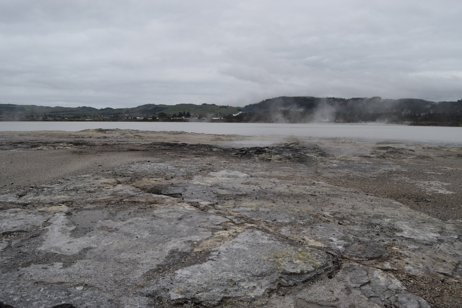
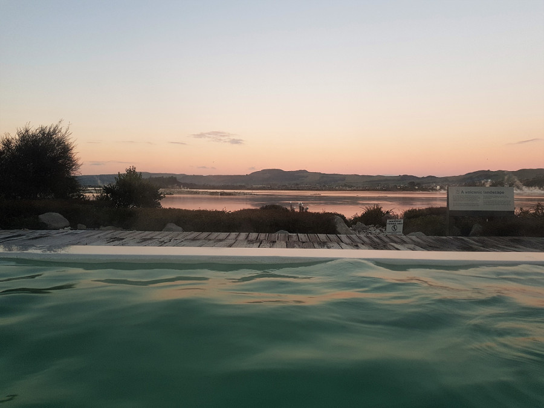
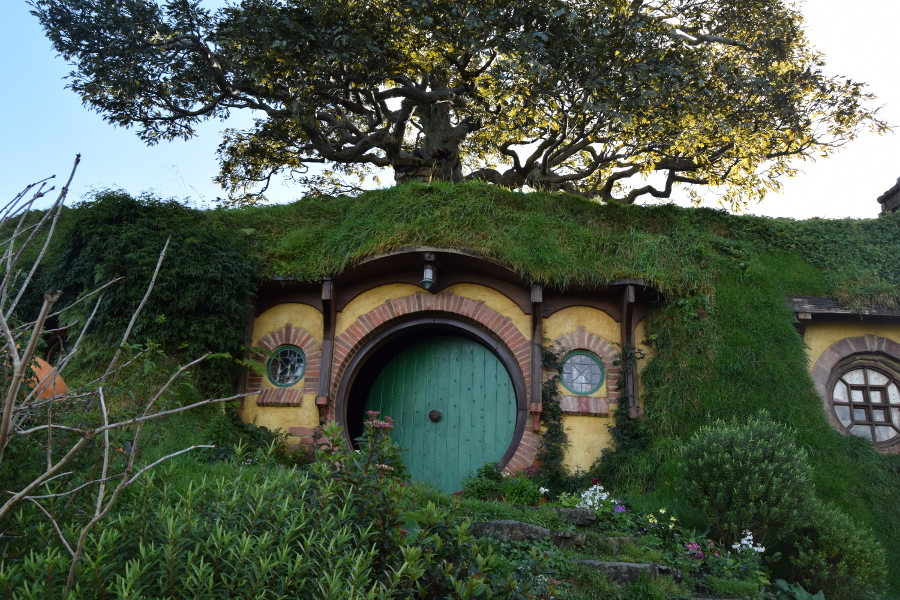
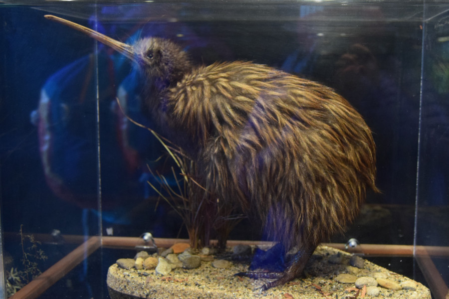
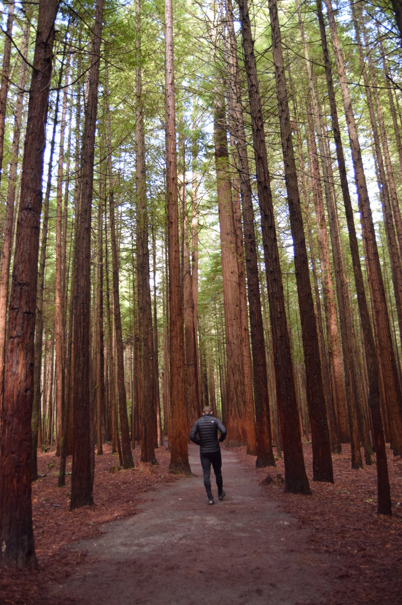
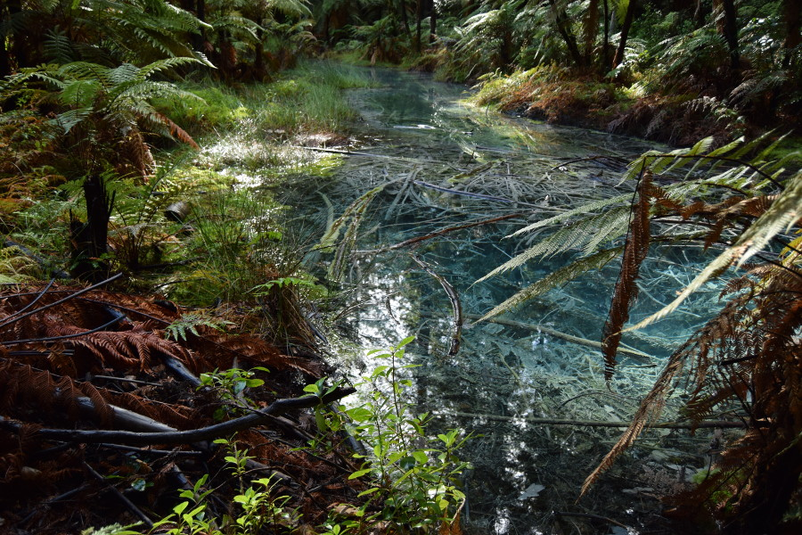

>"Not all those who wander are lost."

J.R.R. Tolkien, Lord of the Rings

We had read about the eggy smell in Rotorua, and having visited Iceland, we weren't quite expecting to be as strong as it was. So it was a bit of a shock when we stepped off the bus. It wasn't a consistent smell, but it seemed to hit in wafts. The smell was stronger and more potent when we went for a walk around the government gardens and Rotorua lake. There were numerous spots where sulphur gas escaped the earth and bubbled up to the surface in pools of mud which was of course the source of the smell.

##Our Hostel and Nightmare Roommate
The bus dropped us off a short walk from our hostel, [Rock Solid Backpackers](https://www.rocksolidrotorua.co.nz/), in the early evening. We met our two roommates as the hostel "upgraded" us from a 6 to a 4 bed dorm. The one guy, who I will call arsehole (this will become clear later) seemed to have made himself right at home as he had set up a temporary washing line for his damp clothes. He also utilised the laundry basket as a table for his laptop which he positioned right next to one of the two unoccupied beds in the middle of the room.

Having been to the supermarket for supplies we returned to an incredibly hot, smelly and stuffy room. The arsehole that had took ownership of the dorm thought that turning it into a sauna was a good way of drying clothes. As he wasn't in the room on our return, we opened the window to let some fresh air in, although this was a bit tricky as he had turned "his" window sill into a dumping ground. By doing this, we thought that at least the arsehole would then understand that he wasn't the only person in the dorm. Clearly this didn't work as, when we returned before bed, the window was shut and the room was even hotter than before. Soph noticed that the heater was wacked up on full so turned it off for the arsehole to immediately turn it back on again when we left the room to brush our teeth etc.

You won't be shocked to learn that we both had a terrible night sleep. I was fully anticipating that the arsehole was a snorer so I went to sleep with headphones in. But as my bed was less than half a metre away from his I was regularly woken up by his inconsistent snores and scoffs. Soph kept waking up covered in sweat on the top bunk, eventually gave up early in the morning and got up.

The next day things were getting worse, after an awful night sleep our patience was wearing thin and the arsehole seemed to be doing things to deliberately irritate us. Once again he was drying his smelly socks and boxers, positioned on the heater conveniently above a sign warning against doing this due to a fire hazard. He even placed a pair of soggy boxer shorts on his locker handle which was inches away from Soph's, meaning that to open her locker she would have to touch them. To avoid this she used a tool to knock them on the floor.

Shortly after returning to the room, he saw his underwear on the floor and muttered "for fuck sake" under his breath. He proceeded to shut the window and as soon as he did Soph asked him to leave it open due to the heat and stuffiness. He snarkily commented that as he was closest to the window he'd get cold and that the window being open yesterday meant that his plane tickets got wet so he had to go and get new tickets printed. As Soph apologised and tried to explain that the condensation was caused by him drying his washing he put his headphones on to cut her off just like a child would.

A tired and frustrated Soph went to reception to discuss the issues we were having with our roommate and the volunteer on reception was too scared or uncomfortable about what to do. This is despite their clear rule that drying clothes on heaters would result in a fine or ejection from the hostel. However, he absolutely knew who the "arsehole", using his words, was as he'd also been the talk amongst the hostel staff for being an arsehole, I guess!

After dinner we decided to go back to the room to watch Netflix so that we could monitor the heat in the room to prevent a repeat of the night before. Obviously the arsehole was still there again watching Netflix. Fortunately the other roommate had checked out so I moved to the bed the other side of the room. Unfortunately, this seemed to have given the arsehole the impression that he could now do whatever he wanted to. As the evening passed we noticed that the arsehole had stashed a crate of beers in his locker. He was smashing beer after beer continuing into the early hours. Again this was a rule that the hostel covered that there was to be no drinking after 10pm. Which must have been why he hid his beers in the locker and not in the communal fridge. On reflection I don't understand this rule because the hostel didn't have any staff working after 10pm so how could they enforce it and who could we complain to.

Even after we'd turned the lights off and were clearly trying to sleep, the arsehole would continue drinking and seemed to become deliberately louder. He would laugh out loud (which noone really does on their own) and make shocked noises as he watched his laptop in between farting, burping and loudly making "ahhhh" noises after sipping a, what must have been, warm beer. I loudly requested that he be quiet but he continued with the noise shortly before turning his laptop off at around 2am. Luckily, however, there was no snoring that night, probably because the air was no longer hot and stuffy.

The following morning, even after we explained what had happened and mentioned that the arsehole was in breach of two rules, we were the ones that had to move room. As we had barely any sleep over these two days and because of how many activities we'd crammed into our New Zealand trip, we really needed to catch up on some sleep. The receptionist only offered a 10% discount on a private room which we reluctantly took. I felt that the hostel had an obligation to do more to help us but Soph was happy enough.

Besides from the arsehole, the hostel was pretty good. I stand by opinion that they could have done more to help us, but as it's not a party hostel, I don't think they encounter issues like we did very often. My only other negative was that the shower cubicles share drainage which means that when the person next to you has their frothy morning piss in the shower next to you, you really know about it. And no the culprit wasn't the arsehole I have previously mentioned, there must have been another one.

##Polynesian spa
During our ongoing issues with our arsehole roommate we decided that a trip to the [Polynesian Spa](https://www.polynesianspa.co.nz/) would help us relax and calm down, which it certainly helped to do. We arrived at about 4pm and spent about 2 hours dipping in and out of the adult pools. Each pool was a slightly different temperature and had different minerals which would help to alleviate various ailments. The hottest pool was 42 degrees which was the first one we went in, but we could only spend a few comfortable minutes inside.

Our relaxation was briefly interrupted by a young asian girl having a tantrum for her mother's benefit directly in front of the busiest pool which overlooked the bay. An older New Zealand couple next to us commented that this should be a great form of contraception to us! We knew we had chosen the adult pools for a reason and we wondered why his girl had been allowed inside, maybe it was unintentional due to the language barrier.

Fortunately the girl stormed off so we could then enjoy the beautiful sunset over Rotorua lake.

##Hobitton
Although not actually in Rotorua, but in the neighbouring Matamata, [Hobbiton](https://www.hobbitontours.com/en/) was my absolute favourite thing we did. We learned so many interesting facts about filming here and the attention to detail is just incredible. As an example, there is just one fake tree (you can't tell) in Hobbiton which is the one above Bilbo's house. Every leaf was individually attached and painted which took weeks. It was on screen in the films for a grand total of 3 seconds!

I was also surprised at how big the set was, there's 44 hobbit holes surrounded by hobbit gardens and orchards as well as the Green Dragon pub. The tour took us around 2 hours to get around with stops for facts from our guide and pictures. It was amazing to see how well maintained Hobbiton was. The guide told us that to give the appearance that hobbit's live there, part of the maintenance routine is to walk up to the washing lines so tracks are left in the grass.

##Cheeky Nando's
We had noticed a few chains of Nando's during our stop offs in New Zealand that we had been tempted by. So we decided to grab a cheeky Nando's while we were here. I don't know whether it was just this franchise in Rotorua but we had a really poor experience. I ordered my usual half a chicken in hot piri piri and Soph went for a chicken halloumi burger. Soph was given her burger first which came without halloumi. About five minutes later they brought my chips out without the chicken. Another 10 minutes had passed by the time my chicken arrived by which time I only had half a portion of cold chips left. Soph also wasn't too happy with her burger after they swapped it for the correct one as the chicken had a rubbery texture. I doubt that we will be trying Nando's here again. We reluctantly paid and left disappointed as true Brits would.

##Te Puia
[Te Puia](https://tepuia.com/) is a geothermal valley, that also offers insights into the Maori culture. It was a 40 minute walk from the town centre and was $49.50 (£26) entrance after 10% discount from [Arrival magazine's app](https://arrivalmagazine.co.nz/). We spent an afternoon as recommended by the hostel and spent most of our time watching the active geysers. We saw a few of the geysers erupt, one reached a considerable height for a constant 10/15 minutes.

This was also the first time we had seen the New Zealand national icon, the kiwi. Te Puia has an enclosure for their 2 kiwis which only had a dim red light for visibility and was very very dark. The kiwi is a nocturnal animal so the enclosure reverses the kiwis perception of day and night in order for visitors to see them up and about. The kiwi is a fluffy blob with large feet and a long beak to assist them on their nighttime search for food. They are a flightless bird, with no wings, and they lay eggs two thirds of their body size. They are an indangered species and native to only New Zealand so they are trying hard to preserve them from predators across the country.

##Whakarewarewa Forest
We ventured over to [Whakarewarewa Forest](https://redwoods.co.nz/) for an afternoon. We decided against the treewalk as we thought at $25 (£13) it was quite expensive for what it was and the night time walk looked much better. Instead we walked the free Quarry lookout track which took us about an hour and a half which was enough time to appreciate the beauty of the forest. The Californian Redwood trees were absolutely huge, both wide and tall.

We also stumbled upon a crystal clear blue pond caused by the sulphur, which looked very interesting amongst all of the fallen branches.

##Our Verdict
I don't think we normally complain but despite our grievances we still thoroughly enjoyed our time in Rotorua and will put our negative experiences down to rotten luck. I think when we look back at our time, particularly with the arsehole roommate we'll have a good laugh about it.