##Salar de Uyuni, the Salt Flats

We were so undecided about whether or not to cross the salt flats for three days from San Pedro in Chile to Uyuni in Bolivia. Before we left the UK we did a lot of research which included reading nightmare reviews about drunk drivers, broken jeeps, no seatbelts, bad food and people generally having a horrible time. This was of course in between people saying they’d had a blast. When we arrived in Chile we contemplated not doing it and looked into getting a bus from San Pedro to Uyuni and then doing a day tour to Salar de Uyuni. But this meant missing much of the Bolivian countryside; in particular Laguna Colorada and the pink flamingos. We spoke to friends who had travelled to South America and each had had very different experiences on their three day tours of the salt flats but both told us we had to do it. After a lot more research we booked with [White World Travel](http://www.worldwhitetravel.com/); they seemed to have the best most recent reviews on Tripadvisor. We paid £138 each all inclusive; a lot of money to gamble for a good driver and a good jeep.

##Day one
##Crossing the border

We were picked up by mini bus from our hostel at 7:40, even though we’d been told 7; not a great start. In around 45 minutes we’d arrived at the Chilean side of the border to be stamped out of the country. We saw the two volcanoes, Licancabur and Juriques up close whilst we were queuing. The Bolivian side of the border was a small shack surrounded by jeeps from all of the different tour companies in San Pedro. Everyone from World White Travel was split up into three jeeps as each one held six passengers and we were lucky to have a great group; a German couple, a girl from the US and an Italian guy. Our driver was called Hugo, he gave us breakfast, wrapped everyone’s backpacks up in tarpaulin and tied them to the roof of the jeep.

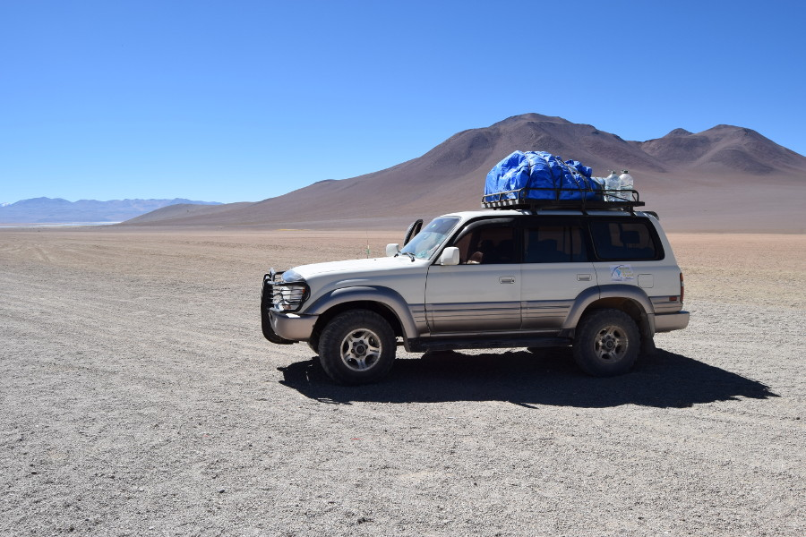

Eventually we were off, it was pretty evident everyone was a little nervous about what the next three days might entail. Hugo went to the effort of learning our names and told us to tell him if we had headaches from the altitude as he had a bag of coca leaves for us to chew on to relieve the symptoms. He was very attentive and gave a good explanation at each stop during the three day tour. This was in Spanish of course but the bits we didn’t get everyone else in the jeep was able to translate, as they could all speak 2-3 languages. After a short drive we arrived at the [Eduardo Avaroa Andean Fauna National Reserve](https://en.wikipedia.org/wiki/Eduardo_Avaroa_Andean_Fauna_National_Reserve) and paid out 150BOB (£15.50) entrance fee for the next three days.

##Laguna Blanca and Laguna Verde

Hugo drove straight past Laguna Blanca, we're not sure if this is because he didn’t like the lake, we were running late or it was to over take all the other jeeps but either way we headed straight to Laguna Verde. This was supposed to be a bright green lake but Hugo explained that this only happens depending on the wind distrubing the sediments in the water. It was at the base of the Licancabur volcano, so we managed to capture a decent photo of the lake with the volcano in the background before we made our way to the next stop.

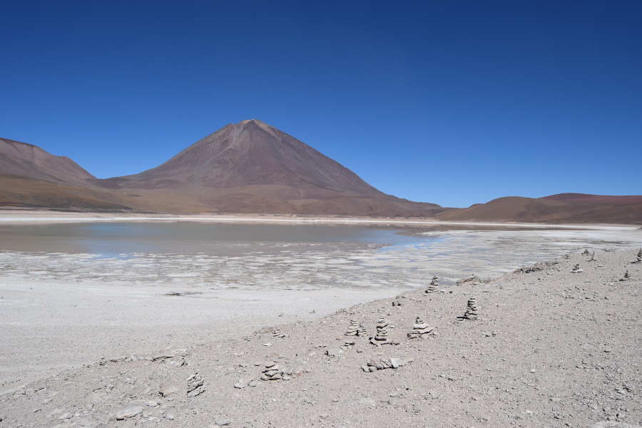

##Dali Desert

On the way we saw a culpeo fox (or Andean fox), Hugo slowed down so we could get a photo through the windows of the jeep. Soon after we arrived at the Salvador Dali Desert. It’s named this because it looks like the landscapes in Salvador Dali's paintings, despite the name he never went there. We stopped for a few photo's and the landscape was very orange or burnt red. We didn't stay long before driving off to the next stop.

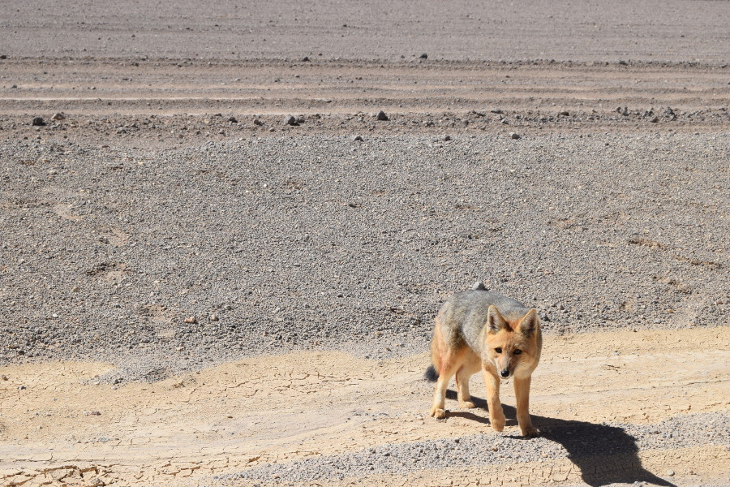

##Sol de Mañana

This was a geothermal field, the name means morning sun in Spanish. We were told to mind our step but allowed to walk between the bubbling pits of mud lakes and steam pools which were up to 150-200C. It smelt like sulphur and we were in a seismically active area so we hoped there wouldn't be an earthquake as we were walking along the thin ridges between the boiling pools of mud! At this point we were 4,900m high; the highest we’d go. We’d started to get headaches from the altitude and our bags of crisps were filled with air and looked like they would pop! Sol de Mañana was beautiful and looked like it was from another world. This was one of our favourite landscapes during the three day tour.

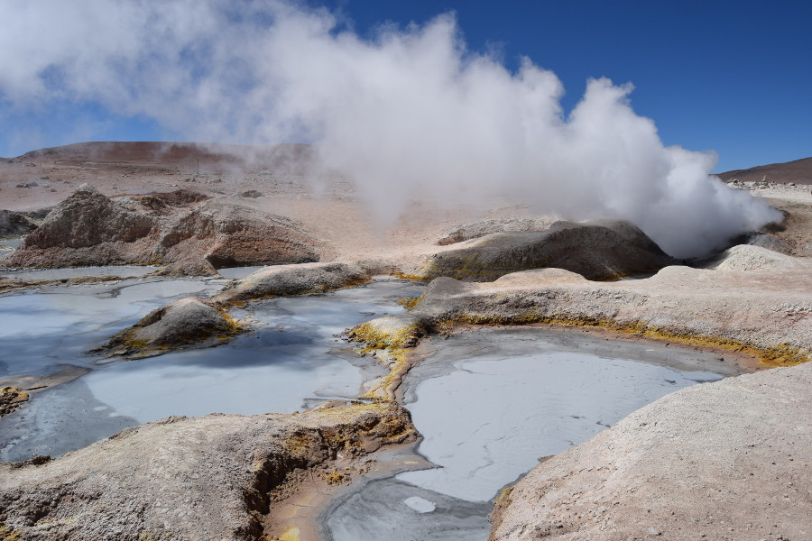

##Thermal Pools in Polques

The thermal pools were more of a photo opportunity for ^BOB (60p) than a relaxing soak in hot water. It was around 28C and we were told not to stay in the thermal pool for more than fifteen minutes due to the possibility of the altitude making us feel light headed when we got out. The water was warm and the sun was shining, but the sides of the pool were really slimey. Apparently the high content of minerals in the water can relieve the symptoms of arthritis and rheumatism but it seemed to us to be more of a tourist stop on the way to the salt flats. We stayed in for about ten minutes and it was relaxing to be in the hot water after weeks of temperamental showers and no baths in Chile.

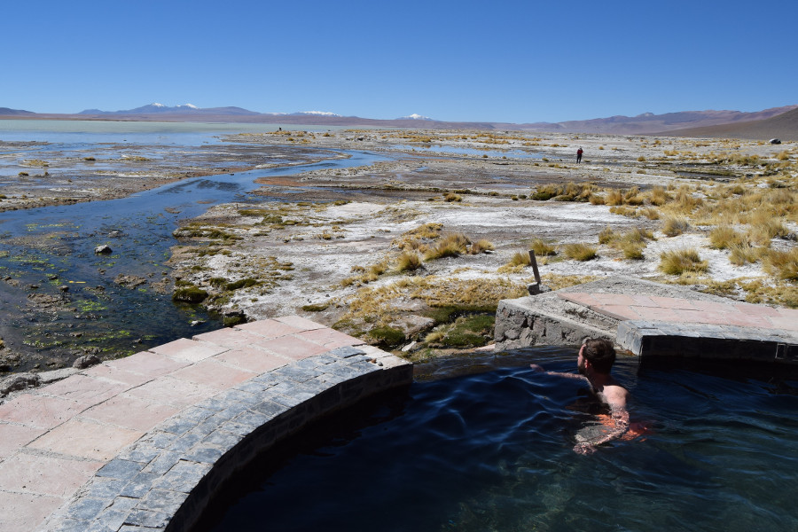

##Laguna Colorada

After some bangers and mash for lunch at the hostel, we headed to Laguna Colorada which was incredible! It was a massive lake that looks pink/red caused by red sediments and pigmentation of some of the algae in the lake. It also has white borax islands which contrast with the red of the water and the green grass, making the lake look multicoloured. There were hundreds of James Flamingos in the lake and we saw some grey baby ones! We had an hour to wander around the lake, which we did slowly due to being short of breath from the altitude.

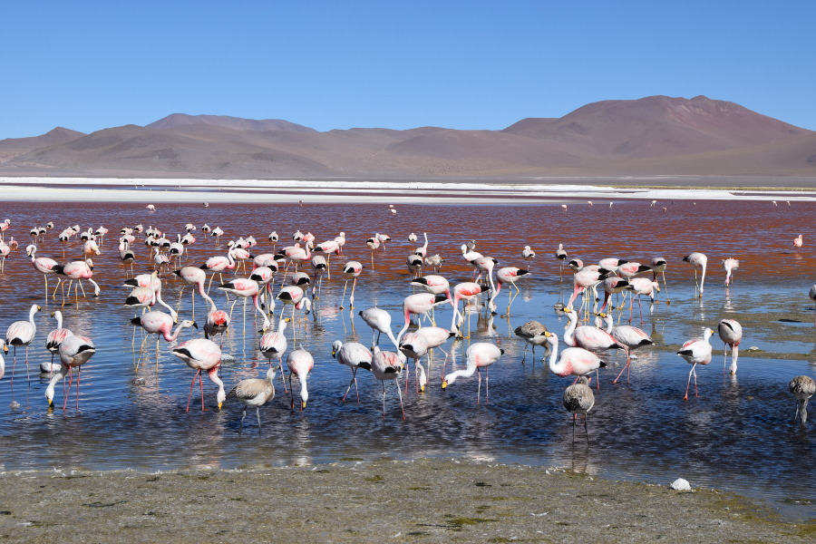

##Hostel

Finally we arrived at our first basic hostel; Huayllajara. It was a concrete room with six concrete platforms and a mattress on top. We were provided with loads of blankets and an extra sleeping bag. We’d been told that as we were sleeping at 4100m it could get really cold between -2 and -5 and of course there was no heating as we were in the middle of nowhere. We had some Mate and some time to chill, no one dared to use the shower as there was only cold water. After a three course meal, which was probably some of the best food we'd eaten since we'd been away; vegetable soup, spaghetti bolognese and fruit, we put on all of our layers and went to bed at 20:30 as we had to be up at 06:00 the following morning.

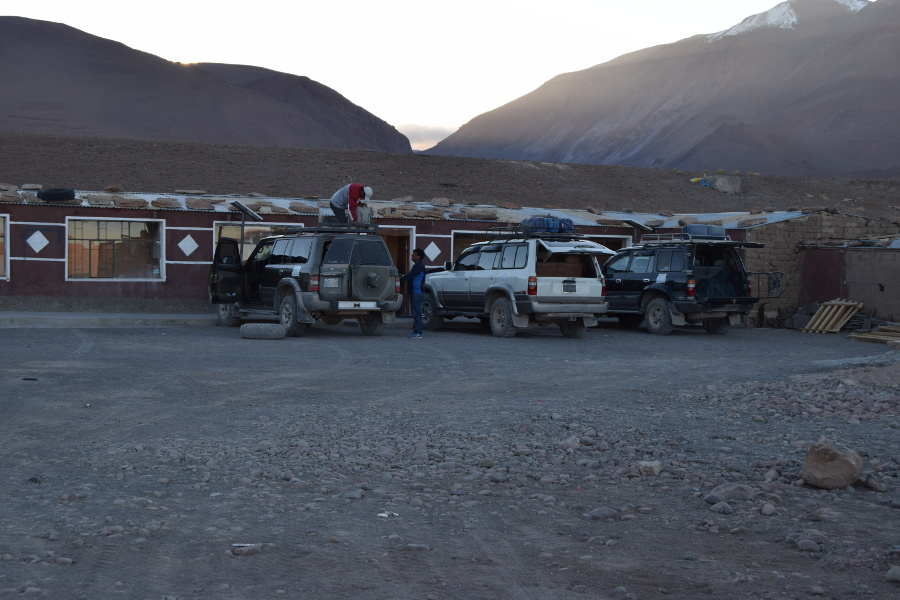

##Day 2
##Alternative route

Surprisingly we were all really warm during the night and had to remove layers; we're not sure if it had been milder, or if it was because there were six bodies in the room but none of us had really felt the cold. On the second day we were supposed to be visiting a stone tree, three lakes and a small salt flat before heading to the Salt Hostel for our second night. However after the jeep was loaded Hugo said that we could do the alternative route with one of the other jeeps. He said two jeeps had to go together and there would be less lakes, more rocks and lots of llamas. Everyone seemed keen to do the alternative route but Dan and I remained suspicious about the drivers motives for taking us on a path not offered by the company.

The route started off-road and we noticed how careful Hugo was when he was driving. He would follow the newer paths with less rocks and he drove slower than the other jeep that had come with us on the alternative route. It was very reassuring after all of the reviews we had read about dangerous driving!

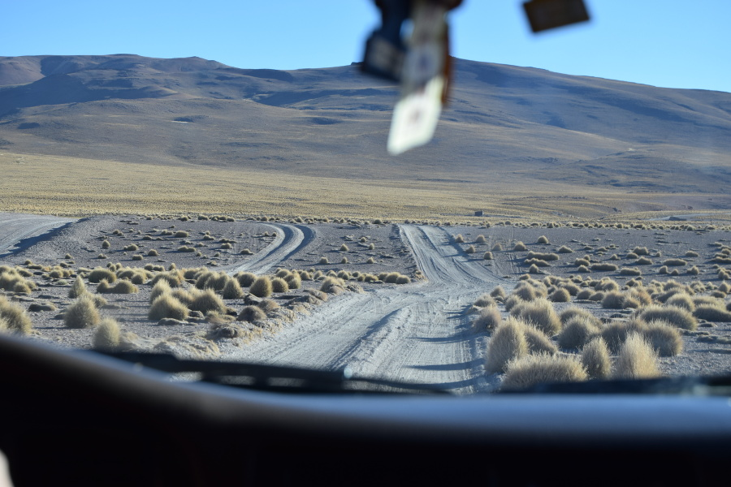

##Laguna Capina

Our first stop was the entrance to Eduardo Avaroa Andean Fauna National Reserve, where we had to show the tickets we purchased the day before. There were no toilets here so we had to make the most of mother nature. We then headed to Laguna Capina, this was a lake near some Borax mines. There were no flamingos here and the lake was a bit dried up. We also stopped at another lake not too much further along the road. There were more flamingos here but it was nothing in comparison to Laguna Colorada. We took a few pictures and then got back in the jeep and headed towards the rocks.

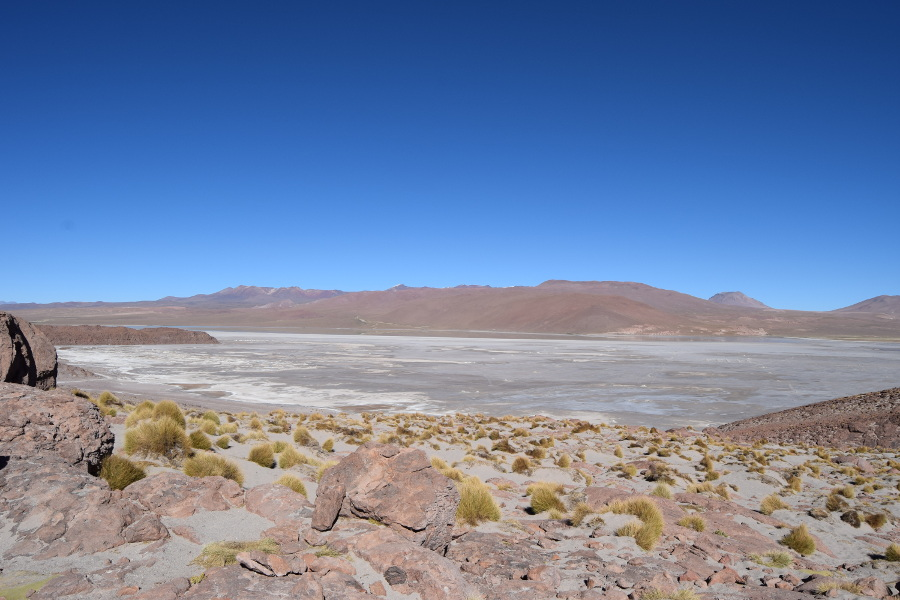

##Rock tree & Lost city of Italy

Hugo wasn’t lying when he said there was lots of rocks on this route. We first stopped at a rock tree, formed from volcanic lava. Then we stopped at a couple of rocks that looked like a face and a teapot. Finally we went to Italia Perdida, Hugo explained that the rocks here were found by an Italian guy on a motorbike who said they looked like his village in Italy, hence where its name comes from. We saw a small Inca house here and a hole in the rocks, a similar shape to Africa.

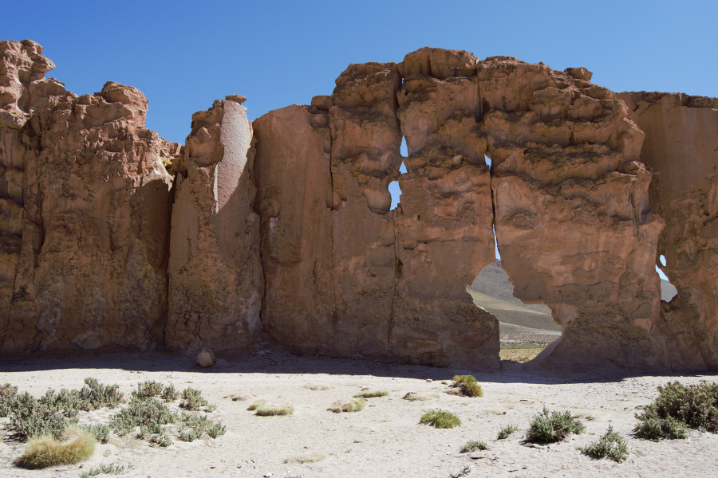

##Laguna Negra

We stopped at Laguna Negra for lunch; rice, tuna and lots of salad. Hugo walked us firstly over some marsh land which had llamas grazing on it. They were decorated with colourful earrings and occasionally looked up to see what was going on. The lake was surrounded by rocks; we climbed up some to get a good view of Laguna Negra. The water in the lake was really dark so there were really good reflections in the water. Apart from the clicking of cameras the lake was really peaceful and we spent some time relaxing here, until a guy got out his drone. The buzzing was awful and ruined the ambience of the lake. We also saw a Vischacha which is a rabbit like creature belonging to the chinchilla family. They were scuttling along the rocks but were way to quick for me to snap on my camera.

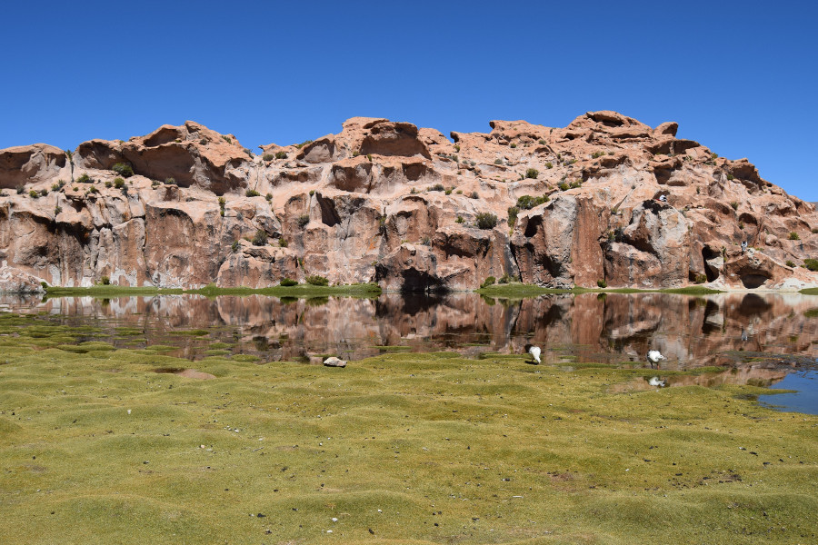

##Anaconda Canyon

Again we were told to be careful as we clambered over rocks to a viewpoint of the canyon; basically a big rock hanging over the edge. It was a big drop and neither of us ventured too close to the edge! The canyon snaked around and Hugo had explained this is where it got it's name from.

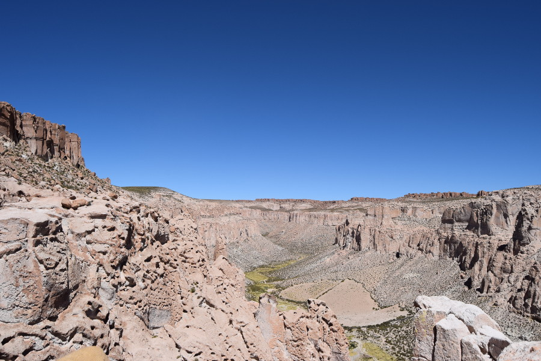

##Salt Flat Chiguana

This was a small salt flat not far from our second hostel. It wasn’t as white as the Salar de Uyuni but it was a good place to practice some of our persepctive photos. It was here we realised that ‘drone guy’ was in the other jeep as it only took a few minutes before the peaceful countryside was being ruined by an inssessent buzzing again. There was a railway line crossing through the salt flats which used to transport minerals to Chile from Bolivia's mines. The surroundings were beautiful with big volcanoes such as one called Ollague which we later learned is still active.

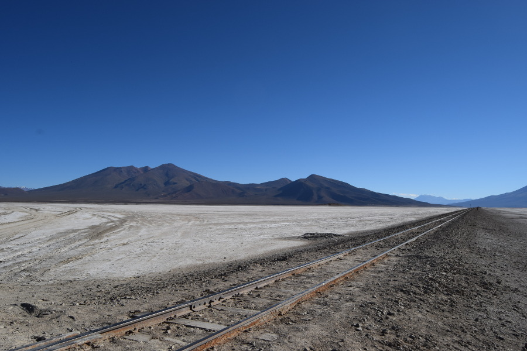

##Salt Hostel

Our second night was spent in a salt hostel. The bricks, tables and benches were made from salt and there was salt all over the floor; which was super impractical! We were able to have a hot shower here and had chicken and chips for dinner! Whilst Dan was showering, I went for a wander around the village along the dusty roads and found the remains of the jaw of a llama with its teeth intact just lying in the road. I watched the sun go down behind the hill and the moon come out before heading back for Mate. After dinner Hugo brought us a bottle of wine to share and told us we needed to be ready by 05:10 in the morning to catch the sunrise at the saltflats. Again we were in bed by 20:30.

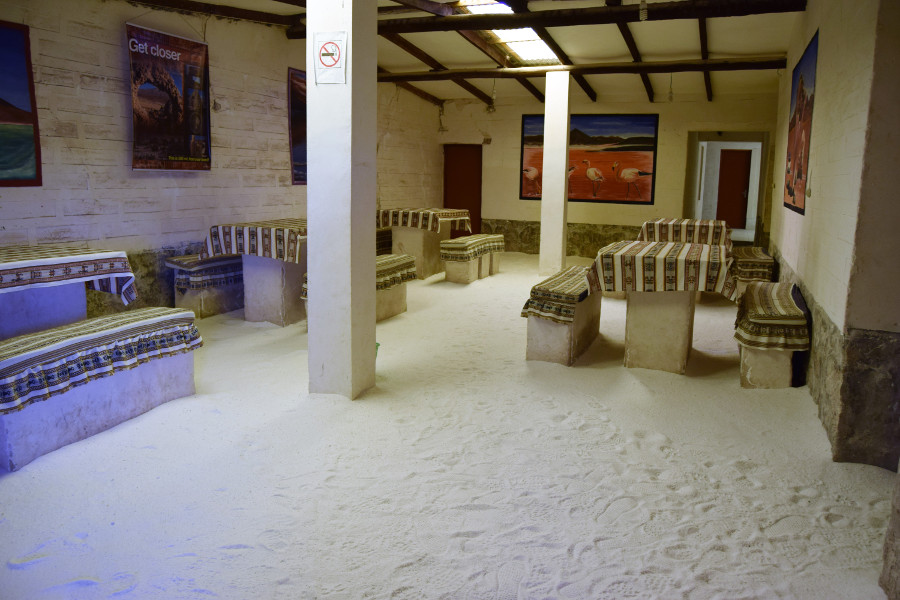

##Day 3
##Salar de Uyuni

We were up at 04:30 and ready to get the to highest and largest salt flats in the world. It took around an hour from the salt hostel, on the way Hugo explained that 50% of the worlds lithium comes from the Bolivian salt flats, which is used to make batteries. Hugo drove to the wet part which had a good mirror reflection once the sun came up! Later he and the other driver were trying to work out he best route through it, as it looked pretty deep. Some of the other jeeps had driven into it and we could see people standing on top of the jeeps to watch the sunrise. We were quite pleased that Hugo had remained on the dry ground as we would have had to have stood in the wet salt flat bare foot in knee deep water. Watching the sun come up was incredible and we got loads of great photos!

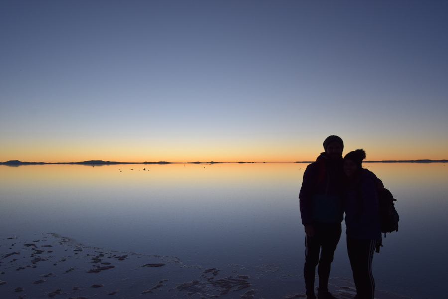

We then drove to Incahuasi, meaning house of the inca's, which is an island of cacti in the middle of the salt flats. It used to be at the top of a volcano. Hugo told us that the salt on the flats is 26m deep and that they formed from prehistoric lakes. We had a wander round the giant cacti before having breakfast. These were huge and Hugo had told us that some of them were around 900 years old.

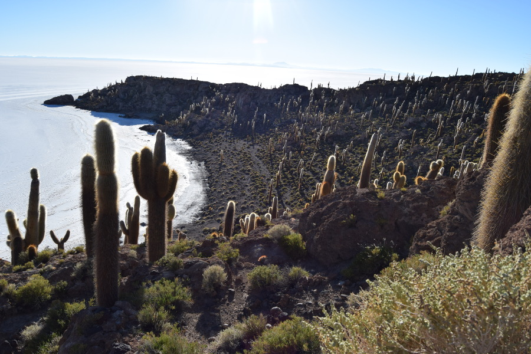

Hugo then drove us to the dry part of the salt flats where there is no horizon line for ‘photo loco’. He was really good and took group photos for us using props - including with a dinosaur, pringles tub and coke cup. He then let us have some time taking our own pictures. One of the guys from the other jeep decided to strip off completely for his photo on the salt flats which was hilarious as the drone was out again trying to get a peep.

##Train cemetery

There were a few more stops before we reached Uyuni. We stopped at the banderas, an island of flags; we managed to find the Union Jack! There was also a 'Dakar Bolivia' monument and a Salar and Llama Museum which we opted out of. The last stop was a Train Cemetery. Basically a load of rusty trains that we were able to climb in and over. It was founded in 1889 and built by the British; Uyuni used to be a bustling railway city connecting Bolivia's mines to the rest of the Pacific. However, the mines dried up and the trains stopped running; rather than sell the trains for scrap they left them to rot. We had some time to climb over them and take photo's which was probably a little dangerous but it made for a great photo.

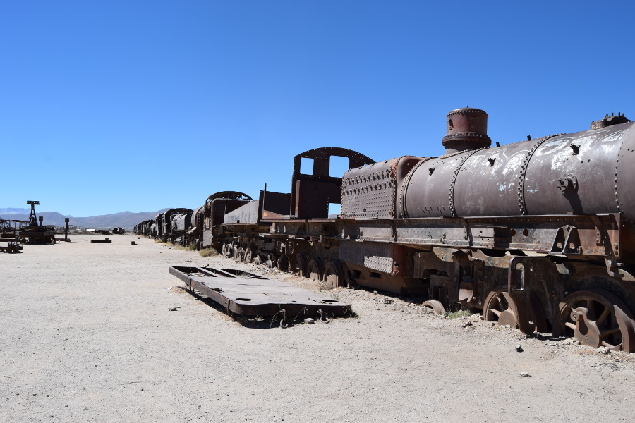

After Bolivia’s version of Chorillana for lunch we emptied the jeep and said goodbye to Hugo. We were due to get a night bus to La Paz at 20:00 however just as we got to Uyuni, Dan was violently sick so we decided to stay the night. We had little choice looking for a last minute deal for a private room and bathroom but went with [Hostel Castillo de Liliana](https://www.tripadvisor.com/Hotel_Review-g317033-d8309662-Reviews-Hostal_Castillo_de_Lilianna-Uyuni_Potosi_Department.html). The decor in the hostel was like it had come from the 1970’s and the room was really dingy. The kitchen was filthy and it was freezing cold. We couldn’t wait to leave and compared to the rest of Bolivia, Uyuni was really pricey! After a night and day nursing Dan back to good health we hit the road and caught our overnight bus to La Paz a day later than planned.

##Our verdict on the Salar de Uyuni

The reviews of the tours for Salar de Uyuni are very mixed and there are hundreds of companies to choose from. Each one has good and bad jeeps and good and bad drivers so really it’s pot luck. We got really lucky with White World Travel and our driver, Hugo. We ended up having the most amazing three days driving through the Bolivian countryside which was definitely the highlight of our trip so far!

